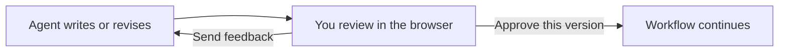

Read the work, mark what needs changing, and send it back. A surface lets
you give an agent feedback through a web page: edit a title, comment on a
passage, choose an audience, or compare alternatives. The page collects
those actions and composes the prompt for the agent.

A [callback gate](/reviewing/callback-gates) records the request and its
answer. The surface is the page you interact with. You choose what it shows
and what feedback it collects.

## Motivation

Some steps no agent should decide alone, and a prompt in a terminal is a
poor place to read a diff or fill six fields. A surface is a small web page
the run opens for that one pause. The `@obversa/surface` package serves your
page files and the JSON routes they call on a private port on your own
machine, opens the page, waits for the person, and hands back whatever they
gave you. Then it's gone. There's no server to deploy and nobody needs an
account.

## Properties

- **Disposable by design.** A surface opens for one pause in one run and
  closes when that pause is over, so there's no long-lived page to manage
  and nothing left running when the run moves on.
- **A pause, not a prompt.** The run stops, the page opens, and it waits.
  What comes back is whatever the page collected: an approval, a dozen
  fields, a whole code review with comments anchored to lines. You decide
  what the page asks and what the answer looks like.
- **It always ends, and it ends once.** The person finishes, cancels, the
  time runs out, or you stop it. Each gives you a result, so a run never
  hangs on a person who walked away. `sessionTimeoutMs` sets how long the
  question may stand. A page that stops sending its heartbeat ends sooner,
  when `leaseTimeoutMs` passes.
- **Private by default.** The page lives on a loopback address with a token
  in its URL, and every API request has to carry it. Nothing on your network
  can reach it, and a page from another origin can't call it.
- **Your page, your API.** Plain HTML and a few JSON routes you write. No
  framework to learn, nothing to install in the browser.
- **Secrets stay out.** Answers pass through secret redaction before they
  reach you. Complete the session with `verbatim: true` when an answer must
  arrive exactly as written, such as a review comment that quotes code.

## Refine together

Put `humanReview` on a loop's `review` field. Sending feedback runs the
writing step again with your changes and notes. Approving the displayed
version completes the loop. The writing step can be one agent or a loop
that includes agent reviewers.



The [human feedback example](https://github.com/jonny981/obversa/blob/main/examples/human-feedback.ts)
lets you edit the title, pick an audience and leave comments on individual
passages. It shows the composed prompt before you send it. Each revision
opens another review:

```ts examples/human-feedback/workflow.ts (excerpt)
    review: humanReview('editor', {
      question: 'What would you change before this is ready?',
      input: (ctx) => JSON.parse(String(ctx.lastOutcome?.data)),
      interaction: { id: 'proposal-review', responseSchema, answer },
    }),
```

`input` supplies the work being reviewed. `answer` opens the page with
`runSurface` and returns its result. The result keeps both the structured
`feedback` and its composed `prompt`. The writer uses `consumeFeedback: true`
to receive them on its next turn.

Human review adds a required `decision`: `changes-requested` or `approved`.
You are approving this version. A model passing its review does not approve
it for you. Neither does reaching the round limit, cancelling or timing out.
Without an answer, the workflow pauses. Resume it to reopen the pending review.

A [judge](/patterns/judge-stops-the-loop) can also ask you for a product
decision through a page like this. Pass `interaction` to `judge()`. After you
answer, the work goes back to the writer with your feedback, your composed
prompt and the findings you answered. The reviewers then check the new
draft, and the judge looks at the result. You are not asked the same
question again before the writer has used your answer. You are asked only
while the round limit leaves the writer a round to use your answer.

Run the example from a source checkout with a signed-in Codex CLI and
`OBVERSA_MODEL` set to the model you want:

```bash
pnpm exec tsx examples/human-feedback.ts
```

Add `--resume` to continue its recorded run. The offline proof scripts the
model replies and sends two rounds of feedback through real HTTP sessions
before approving the third draft:

```bash
pnpm example:human-feedback
```

## Simple approval

For a yes or no with a note, use `approval`. Its question goes out through
the run's callbacks client, and a
router can open a surface to put it in front of a person. This one answers
in place, so it runs offline:

```ts examples/approval.ts (excerpt) {2-3}
const approve = approval('approve', {
  question: 'Ship this change?',
  target: 'implement',
  answer: (request: CallbackRequest) => {
    const approved = JSON.stringify(request.input).includes('header');
    decisions.push(approved ? 'yes' : 'no');
    return approved
      ? { approved: true }
      : { approved: false, note: 'the ticket asked for a header row' };
  },
});
```

The writer leaves the header row out once. The person says no, with a note,
and `implement` runs again with that note as the finding. The second
attempt has the header, and the person says yes:

```text Example record
{
  "status": "pass",
  "implementRuns": 2,
  "decisions": [
    "no",
    "yes"
  ]
}
```

## Use cases

- **Code review.** A diff, inline comments and a decision. `@obversa/surface-diff`
  ships this one: `obversa-review --range main..HEAD` opens your git diff in
  a browser and hands back the decision with every comment anchored to a
  file and a line.
- **Approval before something irreversible.** Merging, migrating, spending.
  [A person decides](/patterns/approval) shows one in a team.
- **A choice between agent outputs.** Two drafts, two plans, two patches. The
  page returns the one a person picked.
- **A form nobody wants to script.** Credentials a machine must not hold, a
  judgement call with six fields.

Each one runs the same session. Only the page changes.

## Write your own page

The session asks two things of any page you write:

- **Ship scripts and styles as files.** The page's content policy allows no
  inline script or style.
- **Make the acknowledgement call before the page closes.** That call is how
  the browser confirms it received the decision. A page that answers and
  closes without it keeps the run waiting until the acknowledgement timeout
  runs out.

## Limits

- **The page opens on the machine that started the run.** On macOS it opens
  in your default browser. On Linux and Windows it prints the address for
  you to open. Inside cmux it opens as a split beside your terminal.
- **You can't hand a colleague the link.** The page exists only on that
  machine. When the decision belongs to someone else, get it to them
  another way.

## Next steps

| Goal | Page |
| --- | --- |
| Watch a run's progress in a browser | [Watch a run in the browser](/driving/monitor) |
| Open the question beside the run that asked it | [Obversa in cmux](/hosts/cmux) |
| Review a diff with inline comments in a host pane | [Review a diff in a host pane](/hosts/review) |
