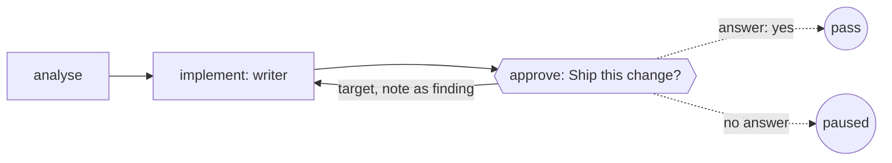

Ask a person when the next decision needs their judgement. Use it before
publishing a report, applying a migration or sending a payment.

The run records the question and waits for an answer. A yes lets it
continue. A no can return the work with the person's notes. When the
decision can be made by models, [ask a panel](/patterns/review-panel).

## Shape



## The step

`approval` asks one question through the run's callbacks client, and
`target` names the step a no goes to:

```ts examples/approval.ts (excerpt) {2-3}
const approve = approval('approve', {
  question: 'Ship this change?',
  target: 'implement',
  answer: (request: CallbackRequest) => {
    const approved = JSON.stringify(request.input).includes('header');
    decisions.push(approved ? 'yes' : 'no');
    return approved
      ? { approved: true }
      : { approved: false, note: 'the ticket asked for a header row' };
  },
});
```

The question is about what came before: by default the request's input is
the outcomes of the steps this one depends on, so a changed attempt upstream
is a new question, and the same question about the same thing is the same
request. Give `input` to say otherwise, or bind the approval to the exact
files it approved with [proof acceptance](/reviewing/proof-acceptance).
Two steps that ask the same question about the same thing share the
request and its answer. Each step's `job:end` in the run's record names the
request under `asked`, so the record shows every step that asked.

A no needs a home and a budget. With `target`, the refusal goes to that
step as a revision request with the note as its one finding. The approval
step must list that target in `acceptsKickbackTo`, and the graph's
`maxKickbacks` must allow it, or the run fails with the note instead. Without a target, a refusal fails the step with the note as its
summary:

```ts examples/approval.ts (excerpt) {6,8}
export const shipIt = pipeline(
  'ship-it',
  [
    { name: 'analyse', job: analyse },
    { name: 'implement', job: implement },
    { name: 'approve', job: approve, acceptsKickbackTo: ['implement'] },
  ],
  { maxKickbacks: 1 },
);
```

Nobody answering is a pause, not a failure. Without `answer`, the step posts
the request and returns `paused` with the request as its data. A router
claims the request and submits `{ approved, note? }`. Run the job again
with the same client and the step finds the answer in the client's history.
`run` takes that client as `callbacks`: the in-memory one that lives for
the run, the default, or the [stored client](/reviewing/callback-gates)
over a directory, which lets a paused run find its answer after a restart.
Use one approval label per workflow; two steps with the same label ask the
same question and supersede each other. A question that is neither pending
nor answered fails the step plainly instead of waiting for nothing.

## What the run did

The writer here is a function that leaves the header row out once, and the
person answers from the file itself, so it runs offline. Run it with
`npx tsx approval.ts`:

```json Output
{
  "status": "pass",
  "implementRuns": 2,
  "decisions": [
    "no",
    "yes"
  ]
}
```

The person said no to the first attempt and yes to the second. `implement`
ran twice: the refusal went there as a revision request with the note as
its finding, the writer ran again with the note in hand, and the question
was asked again about the new attempt. In a real team the answer arrives
through the callbacks client, from a [surface](/concepts/surfaces) in a
browser or a host. On the [run page](/driving/monitor), a person answers
this question with Yes or No. A person can also answer a judge's
[product decision](/patterns/judge-stops-the-loop) there, with a written
decision. To post the question to your team's channel, add the
[webhook notifier](/packages/notify-webhook): its paused message carries the
question.

<Accordion title="Full file">

```ts examples/approval.ts
/**
 * A person decides.
 *
 * The last step of a delivery is a question to a person: ship this change?
 * `approval` asks it through the run's callbacks client. A yes passes the
 * step. A no goes back to the step that owns the fix with the person's note
 * as the finding, and the work comes round again. With nobody answering, the
 * run pauses with the question pending and carries on, when it runs again
 * with the same client, from the answer. This runs offline, with no model and
 * no network: the writer is a small function that leaves the header row out
 * once, and the person answers from this file.
 */
import { approval, fnJob, pipeline, run, type CallbackRequest } from '@obversa/runtime';

const analyse = fnJob('analyse', () => 'the ticket asks for a report export with a header row');

/** The writer. In a real team this is an agent; here it forgets the header once. */
let implementRuns = 0;
const implement = fnJob('implement', () => {
  implementRuns += 1;
  return implementRuns === 1 ? 'report.csv, rows only' : 'report.csv, header and rows';
});

/**
 * The person. The question is about what came before (the outcome of
 * `implement`), so a second attempt is a new question. In a real team the
 * answer arrives through the callbacks client; here it is decided in place.
 */
const decisions: string[] = [];
const approve = approval('approve', {
  question: 'Ship this change?',
  target: 'implement',
  answer: (request: CallbackRequest) => {
    const approved = JSON.stringify(request.input).includes('header');
    decisions.push(approved ? 'yes' : 'no');
    return approved
      ? { approved: true }
      : { approved: false, note: 'the ticket asked for a header row' };
  },
});

export const shipIt = pipeline(
  'ship-it',
  [
    { name: 'analyse', job: analyse },
    { name: 'implement', job: implement },
    { name: 'approve', job: approve, acceptsKickbackTo: ['implement'] },
  ],
  { maxKickbacks: 1 },
);

const result = await run(shipIt);
console.log(JSON.stringify({
  status: result.outcome.status,
  implementRuns,
  decisions,
}, null, 2));

/**
 * Part of the documentation proof: it must fail when the behaviour it shows
 * stops happening. A refusal that quietly stopped returning the work would
 * still print a passing run, and `implement` running once is the tell.
 */
const faults: string[] = [];
if (result.outcome.status !== 'pass') faults.push(`the run ended ${result.outcome.status}`);
if (implementRuns !== 2) faults.push(`implement ran ${implementRuns} time(s), so the refusal did not run implement again exactly once`);
if (decisions.join(',') !== 'no,yes') faults.push(`the person decided [${decisions.join(', ')}], not a no and then a yes`);
if (faults.length) {
  for (const fault of faults) console.error(fault);
  process.exitCode = 1;
}
```

</Accordion>

## Next steps

- [Feature delivery](/workflows/feature-team): a person approves the exact
  bytes as the last of seven steps, before the change lands.
- [Callback gates](/reviewing/callback-gates): the client, the routers and
  the stored history the step is built on.
- [Runtime](/packages/runtime): `approval`, `pipeline` and `maxKickbacks`.
