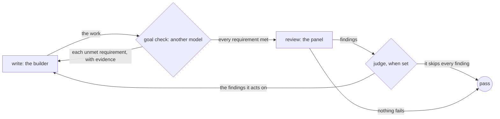

Have a second model confirm that the work meets every requirement in the
brief, before anyone reviews it. A review asks what is wrong with what is there. It does not ask
whether everything the brief asked for is there at all. So work that skips
a requirement can pass a review that finds nothing wrong with it.

A goal check asks that question first. A seat reads the brief and the work,
lists the requirements, and marks each one met or unmet, with evidence.
Choose a seat from another model family than the builder's, so that the
check is a second opinion.

## Shape



## On a workflow() stage

Set `goal` on a stage that a panel reviews. It takes a seat, the same as
`synthesise`:

```ts examples/goal-check.ts (excerpt)
    stage('write', {
      agent: 'write',
      writes: 'welcome.md',
      desc: 'Write the welcome page.',
      goal: checker,
      reviewedBy: 'review',
      refine: 3,
    }),
```

Each round runs these steps in order.

1. **Build.** The builder writes the work.
2. **Goal check.** The goal seat reads the brief, the stage's `desc` and
   `gate`, and the files the stage writes. It may read the work but not
   change it. It lists the requirements, or uses the list when the brief
   gives one. It marks each one `met` or `unmet`. For a met requirement,
   the evidence is a file and line, or a test. For an unmet one, the
   evidence says what is missing.
3. **Reviews.** The panel reads the work.
4. **Synthesis.** When `synthesise` is set, the panel merges its reviews.
5. **Judge.** When `refine` names a judge, it decides the findings.

When any requirement is unmet, the round stops after the goal check. The
reviewers do not run. The builder gets each unmet requirement, with its
evidence, as the next round's feedback. A judge is not asked about it,
because a requirement in the brief is never skipped as polish.

The goal check runs every round, not only the first. A fix for a reviewer
can break a requirement that was met before. It runs in a round where the
builder left out a file the stage writes, too. The reviewers run only when
every requirement is met and every file the stage writes is there.

A round that stops at the goal check counts toward the round limit like
any other round. With `refine: 3`, the builder gets three rounds in all,
whichever check sends each one back.

The goal seat replies with one JSON object:

```json Reply
{"requirements":[{"requirement":"Lists the opening hours","verdict":"unmet","evidence":"welcome.md has no opening hours"}]}
```

A reply that is not a readable list of requirements is asked for once
more. A second one pauses the run, the same as a reviewer that sends no
decision. The reviewers do not run.

## The record

Each round adds one `goal:check` event to the record. It holds the round
number and every requirement, with its verdict and evidence. A person reads
it to see that the brief was met.

```ts examples/goal-check.ts (excerpt)
/** Each round's goal:check event, one line per requirement. */
const rounds: string[][] = [];
const record = (event: LoopEvent) => {
  if (event.kind === 'goal:check') rounds.push(event.requirements.map((item) => `${item.verdict}: ${item.requirement} (${item.evidence})`));
};
```

## In a dag()

`goalCheck(seat, { target, text })` from `@obversa/runtime` is the same
check as one node. Put it between the build node and the review node. It
reads `text` and the work. It passes when every requirement is met.
Otherwise it sends the unmet ones, with their evidence, back to `target`
as a revision.

```ts examples/goal-check.ts (excerpt)
const graph = dag({
  name: 'welcome-page-dag',
  maxKickbacks: 1,
  nodes: {
    build: {
      job: fnJob('build', (ctx) => {
        builds += 1;
        const hours = builds > 1 ? '\nOpen 9:00 to 17:00, Monday to Friday.' : '';
        writeFileSync(join(ctx.workspace.dir, 'welcome.md'), `# Welcome\nThis page is for new staff.${hours}\n`);
        return `wrote draft ${builds}`;
      }),
    },
    goal: { needs: 'build', job: goalCheck(checker, { target: 'build', text: brief }) },
    review: { needs: 'goal', job: fnJob('review', () => 'reads well') },
  },
});
```

The send-back takes the same route as any other node's, so `maxKickbacks`
limits it. A judge on `maxKickbacks` for the target does not decide it.
The judge still decides what the review node sends back.

## What the run did

`pnpm example:goal-check` runs the file offline. Each seat is a scripted
stand-in. The writer leaves the opening hours out of its first draft. Round
one stops at the goal check, and the reviewer does not run. In round two,
both requirements are met, and the reviewer passes the page. The dag()
builds twice for the same reason.

```json Output
{
  "workflow": {
    "status": "pass",
    "drafts": 2,
    "reviews": 1,
    "rounds": [
      [
        "met: Says who it is for (welcome.md:2 says it is for new staff)",
        "unmet: Lists the opening hours (welcome.md has no opening hours)"
      ],
      [
        "met: Says who it is for (welcome.md:2 says it is for new staff)",
        "met: Lists the opening hours (welcome.md:3 lists them)"
      ]
    ]
  },
  "dag": {
    "status": "pass",
    "builds": 2
  }
}
```

## Next steps

- [Ask a panel](/patterns/review-panel): the reviews that run once every
  requirement is met.
- [Know when to stop](/patterns/judge-stops-the-loop): the judge that
  decides the reviewers' findings.
- [Runtime](/packages/runtime): `goal` and every other stage key.
