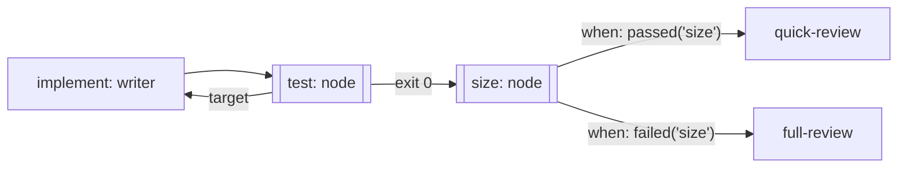

Let a command's exit code decide what happens next, with no model in
between. Use it for the steps that already have a right answer: a test
suite, a build, a lint, a check against a deployed system. Where the
judgement needs a reader, use [a writer and a reviewer](/patterns/writer-and-reviewer).
A command stage is a code eval: it costs no tokens, and its result can do
two things a model's report can't be trusted to do alone. It can carry the
evidence to the step that owns the fix, and it can choose which path the run
takes.

## Shape



## The two commands

The tests run as a command with a `target`. When the command exits
non-zero, the step returns a revision request aimed at `implement`, with the
captured output as the finding:

```ts examples/command-kickback.ts (excerpt) {11}
const test = commandJob(
  'test',
  [
    process.execPath,
    '--input-type=module',
    '-e',
    `import { add } from ${JSON.stringify(source)};
     if (add(2, 2) !== 4) { console.error('add(2, 2) returned ' + add(2, 2)); process.exit(1); }`,
  ],
  { target: 'implement' },
);
```

Pass a command as an array when an argument has spaces or quotes of its
own. Each entry is one argument. The string form splits on spaces and
refuses a quote. The graph then puts a second command, `size`, between the
test and two reviews, and each review carries a `when`:

```ts examples/command-kickback.ts (excerpt) {3,17,24,31}
export const commandKickback = dag({
  name: 'command-kickback',
  maxKickbacks: 1,
  nodes: {
    implement: {
      desc: 'Write the change.',
      gate: 'The source file exists.',
      job: implement,
    },
    test: {
      needs: 'implement',
      desc: 'Run the tests; a red run goes back to implement with the output.',
      gate: 'The test command exits 0.',
      job: test,
    },
    size: {
      needs: 'test',
      optional: true,
      desc: 'Decide the review path from the size of the change.',
      gate: 'The size command has exited, either way.',
      job: size,
    },
    'quick-review': {
      needs: 'size',
      when: passed('size'),
      desc: 'One reviewer returns a verdict on a small change.',
      gate: 'The quick review has returned a verdict.',
      job: review('quick-review', 'small change, one reader'),
    },
    'full-review': {
      needs: 'size',
      when: failed('size'),
      desc: 'A panel returns a verdict on a large change.',
      gate: 'The panel review has returned a verdict.',
      job: review('full-review', 'large change, a panel'),
    },
  },
});
```

`passed('size')` runs one review when the command exited 0, `failed('size')`
the other when it didn't. Both read the named dependency's outcome through
`ctx.needs`; a name the node doesn't need is a configuration error, not a
quiet false. The deciding node is `optional: true`, so its red result blocks
nothing and the branches decide. Without that, a red result would block
every step that needs it and the `failed` branch could never run; the dag
refuses that shape and says why. The step whose condition isn't met is
skipped and recorded as skipped. Leave `when` off any branch that must run,
because a skip doesn't fail the run. `failed` means the command ran and
failed; a dependency that never got to decide meets neither condition.

`maxKickbacks` limits how many times the writer runs again. A number is one
count for the whole graph; a map gives each target its own. When a count is
spent, the run fails with the last output as its reason instead of looping.

## What the run did

The writer here is a function that gets `add` wrong once, so the red test
has something to carry. Run it with `npx tsx command-kickback.ts`:

```json Output
{
  "status": "pass",
  "implementRuns": 2,
  "reviewed": [
    "quick-review"
  ]
}
```

`implement` ran twice: the first attempt subtracted, the test exited 1, and
its output went to `implement`, which ran again with it in hand. The
change was small, so `size` exited 0 and only `quick-review` ran. No agent
read the test output to decide any of that. The exit code did.

<Accordion title="Full file">

```ts examples/command-kickback.ts
/**
 * A test suite as a node, and a command that chooses the path.
 *
 * No agent runs or watches the tests. `test` runs a command; when it fails,
 * its captured output goes straight back to `implement` as the finding, and
 * `implement` runs again with it in hand. `size` is a command too, and the two
 * reviews that depend on it each run only on their path.
 * It runs offline, with no model and no network: `implement` is a small
 * function that gets the code wrong once, so the kickback has something to do.
 */
import { mkdtempSync, rmSync, writeFileSync } from 'node:fs';
import { tmpdir } from 'node:os';
import { join } from 'node:path';

import { commandJob, dag, failed, fnJob, passed, run } from '@obversa/runtime';

const workspace = mkdtempSync(join(tmpdir(), 'command-kickback-'));
const source = join(workspace, 'add.mjs');

/** The writer. In a real team this is an agent; here it gets the sign wrong once. */
let implementRuns = 0;
const implement = fnJob('implement', (ctx) => {
  implementRuns += 1;
  writeFileSync(
    source,
    implementRuns === 1
      ? 'export const add = (a, b) => a - b;\n'
      : 'export const add = (a, b) => a + b;\n',
  );
  return ctx.lastReview
    ? `second attempt, after the tests said: ${ctx.lastReview.summary}`
    : 'first attempt';
});

/** The tests, as a command. A red run goes back to `implement` with the output. */
const test = commandJob(
  'test',
  [
    process.execPath,
    '--input-type=module',
    '-e',
    `import { add } from ${JSON.stringify(source)};
     if (add(2, 2) !== 4) { console.error('add(2, 2) returned ' + add(2, 2)); process.exit(1); }`,
  ],
  { target: 'implement' },
);

/** The decision, as a command: exit 0 for a small change, exit 1 for a large one. */
const size = commandJob('size', [
  process.execPath,
  '-e',
  `process.exit(require('node:fs').readFileSync(${JSON.stringify(source)}).length > 200 ? 1 : 0)`,
]);

const reviewed: string[] = [];
const review = (name: string, summary: string) =>
  fnJob(name, () => {
    reviewed.push(name);
    return summary;
  });

export const commandKickback = dag({
  name: 'command-kickback',
  maxKickbacks: 1,
  nodes: {
    implement: {
      desc: 'Write the change.',
      gate: 'The source file exists.',
      job: implement,
    },
    test: {
      needs: 'implement',
      desc: 'Run the tests; a red run goes back to implement with the output.',
      gate: 'The test command exits 0.',
      job: test,
    },
    size: {
      needs: 'test',
      optional: true,
      desc: 'Decide the review path from the size of the change.',
      gate: 'The size command has exited, either way.',
      job: size,
    },
    'quick-review': {
      needs: 'size',
      when: passed('size'),
      desc: 'One reviewer returns a verdict on a small change.',
      gate: 'The quick review has returned a verdict.',
      job: review('quick-review', 'small change, one reader'),
    },
    'full-review': {
      needs: 'size',
      when: failed('size'),
      desc: 'A panel returns a verdict on a large change.',
      gate: 'The panel review has returned a verdict.',
      job: review('full-review', 'large change, a panel'),
    },
  },
});

const result = await run(commandKickback);
rmSync(workspace, { recursive: true, force: true });
console.log(JSON.stringify({
  status: result.outcome.status,
  implementRuns,
  reviewed,
}, null, 2));

/**
 * Part of the documentation proof: it must fail when the behaviour it shows
 * stops happening. A test node that quietly stopped returning the work would
 * still print a passing run, and `implement` running once is the tell; a
 * decision that stopped choosing would run both reviews or neither.
 */
const faults: string[] = [];
if (result.outcome.status !== 'pass') faults.push(`the run ended ${result.outcome.status}`);
if (implementRuns !== 2) faults.push(`implement ran ${implementRuns} time(s), so the red test did not run implement again exactly once`);
if (reviewed.join(',') !== 'quick-review') faults.push(`the reviews that ran were [${reviewed.join(', ')}], not the one the size command chose`);
if (faults.length) {
  for (const fault of faults) console.error(fault);
  process.exitCode = 1;
}
```

</Accordion>

## Next steps

- [Feature delivery](/workflows/feature-team): a test command as one stage
  of a nine-stage team, aimed at the implementer.
- [Feedback loops](/concepts/feedback-loops): the limit, and the other
  shapes a check can take.
- [Runtime](/packages/runtime): `commandJob`, `passed`, `failed` and `dag`.
