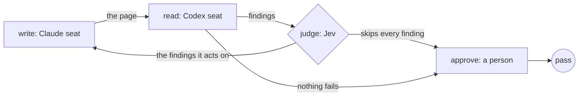

Give a small decision model the job of deciding whether another revision
would improve the work. Use it for a page, a plan or a shortlist when you
can't know how many rounds it will need.

The reviewer says what needs fixing. The judge reads each note and the
history of revisions, then decides for each note whether to act on it or
skip it. When it acts on at least one note, the workflow carries those notes
to the writer and runs the next round. When it skips them all, the work
stands.
With no cap, a run ends when the judge stops it or the review passes. You
can add a cap as a backstop. Put a person's decision where the process
needs one; this example asks before publication.
If a fixed number of rounds is enough,
[get a second opinion](/patterns/writer-and-reviewer)
and set the writer's revision limit.

## Shape



## The stopping rule

The judge's seat is `jev()` from
[`@obversa/engine-jev-api`](/packages/engine-jev-api), one line like any
other seat. Offline, `recordedJudge` from `@obversa/runtime/testing` stands
in for it and replays the answers in `judge.json`:

```ts examples/judge-stops-the-loop.ts (excerpt)
const judgeSeat = process.env.JUDGE === 'jev' ? jev() : recordedJudge('judge.json');
```

The judge sits on the `write` stage. The reader reviews the page, and
`refine` names the judge:

```ts examples/judge-stops-the-loop.ts (excerpt)
    stage('write', {
      agent: 'write',
      writes: file,
      reviewedBy: 'read',
      refine: judge(judgeSeat),
      desc: 'Rewrite the page so a person reads it once and knows what to do. On a later round, change only the sentences the findings name.',
      gate: 'The reader finds nothing that fails, or the judge says the page holds for this use case.',
    }),
```

The brief tells the reader to tag each finding `block`, `should-fix` or
`nice-to-have`. A block is a false claim or a sentence a person would not
understand.

When a judge is set, it decides every finding on its own, a block included:
`act` or `skip`, with a one-line reason. A taste note does not cost a round,
and a real finding is not waved through because the rest of the list was
trivial.

- **The judge acts on at least one finding.** The page goes back. The writer
  gets only the findings the judge acts on, each with the judge's reason.
- **The judge skips every finding.** The page stands as a pass, with the
  judge's reason.
- **The reader's next round.** The reader is told which findings the judge
  skipped and why, so it does not raise them again.

With no cap, the rounds end when the judge stops them or the reader finds
nothing that fails. A reader that tags every finding block does not decide
alone how long the run goes on, because the judge still weighs each block.
A block is sent back without a judge only when there is no judge: a plain
number on `refine` or `maxKickbacks`.

The approval is a plain function. It reads the page, puts its sha256 in the
question and sends a person's no back to the writer.

With several reviewers, set `synthesise` on the stage as well. The panel
then merges the findings that name the same problem, lets each reviewer
vote once on the findings it did not raise, and drops a finding when the
reviewers who reject it outnumber those who raised or backed it, unless it
is a block. The judge decides each finding on that one
list, with who raised it and how the others voted.
[Ask a panel](/patterns/review-panel) shows it.

## A cap as a backstop

To bound the rounds as well, pass a cap: `judge(judgeSeat, { cap: 3 })`.
On a `workflow()` stage, a cap of 3 gives the writer at most three rounds
with the reader, its first draft included. On a `dag()`'s `maxKickbacks`, a
cap of 3 allows three returns to the target.

When the last review the cap allows does not pass, the judge is asked once
more and told that this is the last round. Its answer decides the outcome:

- **`holds` or `over_polishing`.** The work stands as a pass with the
  judge's reason. The findings still open are on the outcome as
  `openFindings`, and in the judge's entry in the record.
- **`product_decision`.** A person is asked, and their answer is recorded.
  No build round follows to apply it, so the run fails, and the reason
  quotes their answer.
- **`continue`, `not_converging` or no clear answer.** The run fails, and
  the reason names the cap.

When the judge decides each finding, skipping every finding lets the work
stand, and acting on any finding fails the run. A block in the last round
goes to the judge too, with the same rules.

## The questions

The judge sees the use case from the brief, the draft, the latest findings,
the findings it skipped in earlier rounds with its reasons, and every earlier
round it was asked about, with that round's counts and the size of its
change.

For each finding in the round, the judge gets one `choice` question, keyed
`finding-1`, `finding-2` and so on in the order of the round's findings. It
chooses `act` or `skip`. A block keeps its severity in what the judge sees,
and its question sets a higher bar: skip it only when the case it names is
outside how the work is really used, or the same class of finding keeps
returning after it was answered. Otherwise the judge acts on it. When an
answer carries no reason of its own, the
reason is the text of the chosen option. The judge
answers these in the same call as the questions about the whole round. The
default set of those is `stopQuestions()` from
[`@obversa/runtime`](/packages/runtime). It asks four questions:

- **`holds`.** For this use case, does the draft hold as it stands?
- **`worth_doing`.** For this use case, are the latest findings worth
  acting on?
- **`worth_another_round`.** Given the whole history, is another round
  worth it?
- **`stop_reason`.** Are we at the point of diminishing returns? The judge
  chooses `holds`, `over_polishing`, `not_converging`, `continue` or
  `product_decision`.

The answers about each finding decide the route. When any finding is
`act`, another round runs. When every finding is `skip`, the
work stands as a pass. This holds whatever the round answers say, so a
chosen `not_converging` neither drops a finding the judge acts on nor fails
a round whose findings it skips. The one exception is `product_decision`:
the judge asks a person as described below. A finding the judge does not
answer follows the round answer: it goes back when that answer is
`continue`, and it is skipped when that answer is `holds` or
`over_polishing`.

A `dag()` takes the same `judge()` value on `maxKickbacks`. The target that
the work goes back to gets only the findings the judge acts on, and a stop
means the same thing at both levels.

Pass your own set as `judge(seat, { questions })` when this wording
does not fit your use case. With your own set, the judge is not asked about
each finding, and the whole round goes back or stands on one answer. When
the judge chooses `holds` or `over_polishing`, the work stands as a pass
carrying the judge's reason. Every other chosen stop leaves the review's
failure in place. A custom question set that wants a reason of its own to
let the work stand names that choice `holds` or `over_polishing`. Add
`perFinding: true` to ask about each finding with your own set as well. The
judge engine takes `{ state, questions }` as its prompt and returns one
answer per question; the [Jev API engine](/packages/engine-jev-api) page has
the shape.

The built-in `stopQuestions()` also offers `product_decision`: the work
needs a person's judgement before review can continue. Pass an `interaction`
binding to `judge()` to open your review surface. Its request includes the
work and the review history. After the person answers, the work goes back
to the writer. The writer gets the person's structured feedback, their
composed prompt and the findings they answered. With a cap, that round
counts against it like any other round. The review then runs on the new
draft, and only after that does the judge decide again. After the last
review a cap allows, a person is still asked and their answer is recorded,
but no round follows to apply it, so the run fails. Without an interaction handler,
answer through the run's stored callbacks client, or on the
[run page](/driving/monitor) with a written decision. This gets an answer while
the work is being revised. A later human review can still require you to
approve the finished work.

## What the run did

Run offline, with the judge's answers replayed from `judge.json` beside the
brief and the person's answer recorded in `approve.json`, the example
printed:

```json Output
{
  "status": "pass",
  "stop": "the judge skipped every finding",
  "approved": true
}
```

Three rounds. The first reader pass found two blocks. The judge acted on
both, so the page went back. The second found a `should-fix` (the page never
says where to run the command) and a `nice-to-have`. The judge acted on the
first and skipped the second, so the writer got only the first. The third
pass found one `nice-to-have`, and the judge skipped it, so the page stood.

The record holds each round's findings and the judge's answers. Each answer
also says whether the page went back or stopped, which answer decided that,
and for a stop, whether the step passed or failed. It lists each finding's
id with the judge's decision and reason, for example:

```json
[
  { "id": "finding-1", "decision": "act", "reason": "A reader of this kind of work would stumble on, misread or distrust what this finding names, so the builder should fix it." },
  { "id": "finding-2", "decision": "skip", "reason": "It is taste, an edge case, or polish past the bar the use case sets, so fixing it would not change what a reader gets." }
]
```
With `JUDGE=jev`, and `TYPESAFE_ENDPOINT` and `TYPESAFE_API_KEY` in the
environment, the same file asks Jev instead of replaying.

## Next steps

- [Feedback loops](/concepts/feedback-loops): the check, the target and the
  stopping rule, and the other shapes a loop takes.
- [Jev API engine](/packages/engine-jev-api): the judge's question types
  and how it reports its identity.
- [A person decides](/patterns/approval): the approval step this loop ends
  on, bound to the exact bytes.
