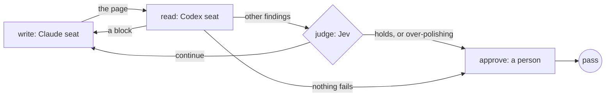

Give a small decision model the job of deciding whether another revision
would improve the work. Use it for a page, a plan or a shortlist when you
can't know how many rounds it will need.

The reviewer says what needs fixing. The judge reads those notes and the
history of revisions, then decides whether another round is worth doing.
When another revision is needed, the workflow carries the feedback to the
writer and runs the next round.
You set a cap so the work can't go round forever. Put a person's decision
where the process needs one; this example asks before publication.
If a fixed number of rounds is enough,
[get a second opinion](/patterns/writer-and-reviewer)
and set the writer's revision limit.

## Shape



## The stopping rule

The judge sits on the `write` stage. The reader reviews the page, and
`refine` names the judge and its cap:

```ts examples/judge-stops-the-loop.ts (excerpt)
    stage('write', {
      agent: 'write',
      writes: file,
      reviewedBy: 'read',
      refine: judge(jev, { cap: 3 }),
      desc: 'Rewrite the page so a person reads it once and knows what to do. On a later round, change only the sentences the findings name.',
      gate: 'The reader finds nothing that fails, or the judge says the page holds for this use case.',
    }),
```

The brief tells the reader to tag each finding `block`, `should-fix` or
`nice-to-have`. A block is a false claim or a sentence a person would not
understand. A block always goes back to the writer, and the judge is not
asked. For any other finding, the judge's chosen reason decides whether the
page goes back or stands. The cap is the last word: with a cap of 3 the
writer gets at most three more rounds after its first draft, whatever
the judge says.

The approval is a plain function. It reads the page, puts its sha256 in the
question and sends a person's no back to the writer.

## The questions

The judge sees the use case from the brief, the draft, the latest findings
and every earlier round it was asked about, with that round's counts and the
size of its change. A round that went back for a block is not in that list. The
default question set is `stopQuestions()` from
[`@obversa/runtime`](/packages/runtime). It asks four questions:

- **`holds`.** For this use case, does the draft hold as it stands?
- **`worth_doing`.** For this use case, are the latest findings worth
  acting on?
- **`worth_another_round`.** Given the whole history, is another round
  worth it?
- **`stop_reason`.** Are we at the point of diminishing returns? The judge
  chooses `holds`, `over_polishing`, `not_converging`, `continue` or
  `product_decision`.

Pass your own set as `judge(seat, { cap, questions })` when this wording
does not fit your use case. A `dag()` takes the same `judge()` value on
`maxKickbacks`. A stop means the same thing at both levels. When the judge
chooses `holds` or `over_polishing`, the work is good enough as it stands,
and it stands as a pass carrying the judge's reason. When it chooses
`product_decision`, it asks a person as described below. Every other chosen
stop, including `not_converging`, leaves the review's failure in place. A
custom question set that wants a reason of its own to let the work stand
names that choice `holds` or `over_polishing`. The judge engine takes
`{ state, questions }` as its prompt and returns one answer per question;
the [Jev API engine](/packages/engine-jev-api) page has the shape.

The built-in `stopQuestions()` also offers `product_decision`: the work
needs a person's judgement before review can continue. Pass an `interaction`
binding to `judge()` to open your review surface. Its request includes the
work and the review history. The person's structured feedback and composed
prompt return to the judge, which decides again. The writer does not run
just to deliver that answer. Without an interaction handler, answer through
the run's stored callbacks client. This gets an answer while the work is
being revised. A later human review can still require you to approve the
finished work.

## What the run did

Run offline, with the judge's answers replayed from `judge.json` beside the
brief and the person's answer recorded in `approve.json`, the example
printed:

```json Output
{
  "status": "pass",
  "stop": "the judge chose holds",
  "approved": true
}
```

Two rounds: the first reader pass found two blocks, so the page went back
without asking the judge. The second found one `nice-to-have`, and the
judge chose `holds`. The record holds each round's findings and the judge's
answers. With `JUDGE=jev` and a TypeSafe key in the environment, the same
file asks Jev instead of replaying.

## Next steps

- [Feedback loops](/concepts/feedback-loops): the check, the target and the
  stopping rule, and the other shapes a loop takes.
- [Jev API engine](/packages/engine-jev-api): the judge's question types
  and how it reports its identity.
- [A person decides](/patterns/approval): the approval step this loop ends
  on, bound to the exact bytes.
