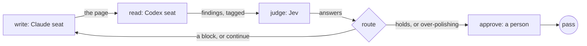

Let a judge decide when a review loop stops, instead of a count. Use it
when the work is refined over rounds and the right number of rounds is not
known in advance: a page, a plan, a shortlist. When a fixed number of
rounds is enough, `retry` on the stage is the plain way, and
[a writer and a reviewer](/patterns/writer-and-reviewer) shows it.

The judge is a small decision model, not the reviewer. It answers typed
questions about what the reviewer found and how the rounds have gone, one
cheap call per round, and the question it answers is whether the work has
reached the point of diminishing returns. A count stays as the safety cap,
so the loop always ends.

## Shape



## The stopping rule

The reader tags each finding `[block]`, `[should]` or `[nit]`. The route
reads the judge's answers and decides:

```ts examples/judge-stops-the-loop.ts (excerpt) {13-19,20-21,25}
const route = fnJob('route', (ctx): Outcome => {
  const raw = String(ctx.needs?.judge?.data ?? '');
  let answers: Record<string, JudgeAnswer> = {};
  try { answers = JSON.parse(raw) as typeof answers; } catch { /* an unreadable answer routes as "run again" */ }
  const worth = answers.worth_another_round?.noul ?? answers.worth_another_round?.probability;
  const doing = answers.worth_doing?.noul ?? answers.worth_doing?.probability;
  const holds = answers.holds?.noul ?? answers.holds?.probability;
  const reason = answers.stop_reason?.choice ?? 'unknown';
  const round = ctx.graph?.attempt ?? 1;
  const latest = history[history.length - 1];
  const tally = latest ? `${latest.counts.block} block, ${latest.counts.should} should, ${latest.counts.nit} nit` : 'no findings recorded';
  const blocks = latest?.counts.block ?? 0;
  if (blocks > 0 && round < maxRounds) {
    return revisionRequest({
      target: 'write',
      reason: `round ${round}: ${blocks} block finding${blocks === 1 ? '' : 's'} always go back; ${tally}`,
      findings: [{ evidence: latest?.findings ?? '', severity: 'block' }],
    });
  }
  const chosenStop = reason !== 'unknown' && reason !== 'continue';
  if (chosenStop) return { status: 'pass', summary: `round ${round}: the judge stopped it, reason ${reason} (holds ${String(holds)}, worth doing ${String(doing)}, another round ${String(worth)}); ${tally}`, data: answers };
  if (typeof holds === 'number' && holds >= 0.5) return { status: 'pass', summary: `round ${round}: the judge says the draft holds (${holds.toFixed(2)}); ${tally}`, data: answers };
  if (typeof doing === 'number' && doing < 0.5) return { status: 'pass', summary: `round ${round}: the judge says the findings are not worth doing for this use case (${doing.toFixed(2)}); ${tally}`, data: answers };
  if (typeof worth === 'number' && worth < 0.5) return { status: 'pass', summary: `round ${round}: the judge says another round is not worth it (${worth.toFixed(2)}); ${tally}`, data: answers };
  if (round >= maxRounds) return { status: 'pass', summary: `round ${round}: the safety cap of ${maxRounds} rounds; the judge still wanted another (${String(worth)}); ${tally}`, data: answers };
  return revisionRequest({
    target: 'write',
    reason: `round ${round}: the judge says another round is worth it (${String(worth)}); ${tally}`,
    findings: [{ evidence: latest?.findings ?? '', severity: 'block' }],
  });
});
```

A block is a false claim or a sentence the reader would not understand, and
it always goes back, whatever the judge says. Otherwise the judge's chosen
reason decides. The cap in `maxKickbacks` is the last word: a run cannot
loop past it.

## The questions

The judge sees the use case from the brief, the draft, the latest findings
and every round so far with its counts and the size of each change. The
default question set asks whether the draft holds, whether the findings are
worth acting on for this use case, whether another round is worth it, and
why to stop:

```ts examples/judge-stops-the-loop.ts (excerpt)
    stop_reason: {
      type: 'choice',
      instructions: 'Are we at the point of diminishing returns? If so, which kind; if not, continue.',
      criteria: {
        holds: `${what} holds for this use case.`,
        over_polishing: 'The remaining findings are taste, nits or edge cases past the bar.',
        not_converging: 'The same class of finding keeps returning, so another round will not fix it.',
        continue: 'Another round is worth it.',
      },
    },
```

`stopQuestions()` is exported from the example so another loop can reuse
the set, and a loop with a different question passes its own in the same
shape. The judge engine takes `{ state, questions }` as its prompt and
returns one answer per question; the
[Jev API engine](/packages/engine-jev-api) page has the shape.

## What the run did

Run offline, with the judge's answers replayed from `judge.json` beside the
brief and the person's answer recorded in `approve.json`, the example
printed:

```json Output
{
  "status": "pass",
  "rounds": 2,
  "stop": "round 2: the judge stopped it, reason holds (holds 0.9, worth doing 0.2, another round 0.1); 0 block, 0 should, 0 nit",
  "approved": true
}
```

Two rounds: the first reader pass found two blocks, so the page went back
with them; the second found nothing, and the judge chose `holds`. The
record holds each round's findings and each of the judge's answers. With
`JUDGE=jev` and a TypeSafe key in the environment, the same file asks Jev
instead of replaying.

## Next steps

- [Feedback loops](/concepts/feedback-loops): the check, the target and the
  stopping rule, and the other shapes a loop takes.
- [Jev API engine](/packages/engine-jev-api): the judge's question types
  and how it reports its identity.
- [A person decides](/patterns/approval): the approval step this loop ends
  on, bound to the exact bytes.
