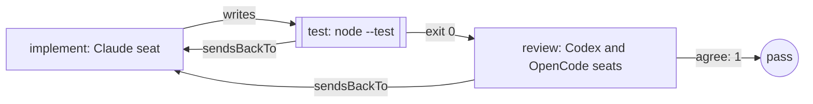

Ask several reviewers at once and decide how many have to say yes. Use it
when one opinion isn't enough: a change that touches money, a migration, a
public API. When one reviewer will do, use
[a writer and a reviewer](/patterns/writer-and-reviewer). Each reviewer is
an LLM-as-judge over the change, and the panel with its threshold is what
some people call an eval loop: the judges decide whether the writer runs
again.

## Shape



## The team

One implementer and a panel of two reviewers from two other model families.
`agree` is how many must accept:

```ts examples/teams/threshold-panel.ts (excerpt) {5-11,29-30}
  return workflow('threshold-panel', {
    brief: briefFromFile('briefs/double.md'),
    options: { timeout: '10m' },

    roles: {
      implement: engines.claude('claude-sonnet-4-5'),
      review: [
        engines.codex('gpt-5.6-luna'),
        engines.opencode('opencode/big-pickle'),
      ],
    },

    stages: [
      stage('implement', {
        agent: 'implement',
        writes: ['src/double.mjs', 'test/double.test.mjs'],
        desc: 'Write the function and its test from the brief.',
        gate: 'The files named in the brief exist in the workspace.',
        retry: 1,
      }),
      stage('test', {
        run: ['node', '--test', 'test/double.test.mjs'],
        desc: 'Run the test command against the written files.',
        gate: 'The test command exits 0.',
        sendsBackTo: 'implement',
      }),
      stage('review', {
        panel: 'review',
        agree: 1,
        desc: 'Have both reviewers read the change and count the acceptances.',
        gate: 'At least one reviewer has accepted.',
        sendsBackTo: 'implement',
      }),
    ],
  });
```

The reviewers run at the same time, one job each, once the test passes.
`agree` is a whole number from one to the number of reviewers, and the
default is all of them. Set it to the number of reviewers when one dissent
must be enough to fail the step; below that, the change can pass despite a
dissent, and the dissent is still on the record. A panel below the
threshold carries its findings to `implement`, which runs again with them,
as many times as that stage's `retry` allows.

`workflow()` refuses the team before any model runs if a reviewer shares a
model family with the seat it reviews, or two reviewers share one: two
reviewers from one family would be one opinion counted twice. The third seat
runs through the OpenCode command line tool, whose adapter needs an absolute
command path; `resolveCommandExecutable('opencode')` finds it on your `PATH`
when the file runs.

## What the run did

Run the file from the directory the work belongs in, with the Claude Code,
Codex and OpenCode command line tools signed in. One real run printed:

```json Output
{
  "status": "pass",
  "summary": "dag \"threshold-panel\": all 3 node(s) green",
  "data": {
    "implement": {
      "status": "pass",
      "summary": "Created src/double.mjs with the double() function and test/double.test.mjs with Node tests"
    },
    "test": {
      "status": "pass",
      "summary": "`node` exited 0"
    },
    "review": {
      "status": "pass",
      "summary": "Review panel: 1/2 reviewer(s) cleared.\nEngine errors:\n- review-2: reviewer review-2 returned no decision",
      "data": {
        "findings": [],
        "escalatedFindings": [],
        "errors": [
          {
            "kind": "engine-error",
            "name": "review-2",
            "reason": "reviewer review-2 returned no decision",
            "error": {
              "name": "LoopError",
              "code": "ENGINE",
              "message": "reviewer review-2 returned no decision",
              "phase": "review",
              "retryable": true
            }
          }
        ],
        "results": [
          {
            "kind": "verdict",
            "name": "review-1",
            "met": true,
            "reason": "src/double.mjs exports the required pure double(value) function, and test/double.test.mjs covers positive, zero, negative, and fractional numeric inputs. node --test test/double.test.mjs passes."
          },
          {
            "kind": "engine-error",
            "name": "review-2",
            "reason": "reviewer review-2 returned no decision",
            "error": {
              "name": "LoopError",
              "code": "ENGINE",
              "message": "reviewer review-2 returned no decision",
              "phase": "review",
              "retryable": true
            }
          }
        ],
        "passed": 1,
        "required": 1,
        "severityCounts": {}
      }
    }
  }
}
```

The Codex reviewer accepted. The OpenCode seat returned no decision: a
reviewer's decision is its reply, the panel reads the first JSON object in
it, and a reply with none is asked for once more, then counted as an engine
error, not a rejection. Nothing went to the implementer on its account.
With `agree: 1` the change passed on the one acceptance. Set `agree` to two
and the same run would have paused at the panel instead, because an error
isn't an acceptance.

The implementer wrote `src/double.mjs`:

```js src/double.mjs
export function double(value) {
  return value * 2;
}
```

and `test/double.test.mjs`:

```js test/double.test.mjs
import { strictEqual } from 'node:assert';
import { test } from 'node:test';
import { double } from '../src/double.mjs';

test('double returns twice the input value', () => {
  strictEqual(double(2), 4);
  strictEqual(double(0), 0);
  strictEqual(double(-3), -6);
  strictEqual(double(1.5), 3);
});
```

<Accordion title="Full file">

```ts examples/teams/threshold-panel.ts
import { claude } from '@obversa/engine-claude-cli';
import { codex } from '@obversa/engine-codex-cli';
import { resolveCommandExecutable } from '@obversa/core/command';
import { opencode } from '@obversa/engine-opencode-cli';
import { run } from '@obversa/runtime';
import { briefFromFile, stage, workflow, type TeamSeat } from '@obversa/runtime';

interface ThresholdPanelEngines {
  readonly claude: (model: string) => TeamSeat;
  readonly codex: (model: string) => TeamSeat;
  readonly opencode: (model: string) => TeamSeat;
}

const realEngines: ThresholdPanelEngines = {
  claude,
  codex,
  opencode: (model) => opencode(model, {
    executable: resolveCommandExecutable('opencode'),
  }),
};

function createThresholdPanel(engines: ThresholdPanelEngines = realEngines) {
  return workflow('threshold-panel', {
    brief: briefFromFile('briefs/double.md'),
    options: { timeout: '10m' },

    roles: {
      implement: engines.claude('claude-sonnet-4-5'),
      review: [
        engines.codex('gpt-5.6-luna'),
        engines.opencode('opencode/big-pickle'),
      ],
    },

    stages: [
      stage('implement', {
        agent: 'implement',
        writes: ['src/double.mjs', 'test/double.test.mjs'],
        desc: 'Write the function and its test from the brief.',
        gate: 'The files named in the brief exist in the workspace.',
        retry: 1,
      }),
      stage('test', {
        run: ['node', '--test', 'test/double.test.mjs'],
        desc: 'Run the test command against the written files.',
        gate: 'The test command exits 0.',
        sendsBackTo: 'implement',
      }),
      stage('review', {
        panel: 'review',
        agree: 1,
        desc: 'Have both reviewers read the change and count the acceptances.',
        gate: 'At least one reviewer has accepted.',
        sendsBackTo: 'implement',
      }),
    ],
  });
}

const result = await run(createThresholdPanel());
console.log(JSON.stringify(result.outcome, null, 2));
```

</Accordion>

## Next steps

- [Feature delivery](/workflows/feature-team): a panel as one stage of a
  nine-stage team.
- [Review loop](/reviewing/review-loop): the same idea as a graph form, with
  a quorum and `requireDiversity` you set yourself.
- [Runtime](/packages/runtime): `workflow`, `stage`, `panel` and `agree`.
