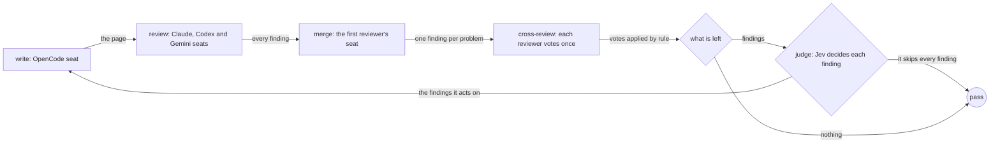
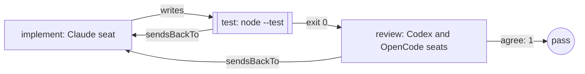

Ask several models from different families to review the same work. Their
reviews become one list before anyone acts on it, and a judge decides each
finding on that list: act on it or skip it. Use it for a page, a plan or a
change where one review isn't enough.

Three things go wrong when several reviews are simply added together. Two
reviewers raise the same problem, and the writer gets it twice. One
reviewer raises a point the others would reject, and it goes back anyway.
A reviewer who passes the work has its notes thrown away. With `synthesise`
set, the panel fixes all three before the writer or the judge reads a
single finding. For a review by a single model,
[get a second opinion](/patterns/writer-and-reviewer).

## Shape


```mermaid
flowchart LR
  write["write: OpenCode seat"] -->|the page| review["review: Claude, Codex and Gemini seats"]
  review -->|every finding| merge["merge: the first reviewer's seat"]
  merge -->|one finding per problem| cross["cross-review: each reviewer votes once"]
  cross -->|votes applied by rule| left{"what is left"}
  left -->|findings| judge{"judge: Jev decides each finding"}
  judge -->|the findings it acts on| write
  judge -->|it skips every finding| done((pass))
  left -->|nothing| done
```

## The team

One writer and three reviewers, each from a different model family:

```ts examples/teams/review-battery.ts (excerpt)
const writer = openCode('opencode/big-pickle');
const reviewers = [
  claude('claude-sonnet-4-5'),
  codex('gpt-5.6-luna'),
  openCode('google/gemini-2.5-pro'),
];
```

The writer's stage names the panel in `reviewedBy`, turns on `synthesise`,
and puts a judge on `refine`:

```ts examples/teams/review-battery.ts (excerpt)
    stage('write', {
      agent: 'write',
      writes: file,
      reviewedBy: 'review',
      synthesise: true,
      refine: judge(judgeSeat),
      desc: 'Rewrite the page so a person reads it once and knows what to set. On a later round, change only the sentences the findings name.',
      gate: 'Every reviewer passes, or the judge skips every finding that is left.',
    }),
```

## The steps

Each round runs these steps in order. When the stage sets `goal`, a goal
check runs before them, every round. When it finds a requirement of the
brief unmet, the round goes back to the writer, and none of these steps
run. The judge never decides an unmet requirement.
[Check the brief was met](/patterns/check-the-brief) shows it.

1. **Review.** The three reviewers read the page at the same time. Each one
   passes it or asks for a revision, and tags each finding `block`,
   `should-fix` or `nice-to-have`. A reviewer that passes can still list
   findings; the panel keeps them. A finding from a reviewer that passed,
   with no tag, counts as `nice-to-have`.
2. **Merge.** One seat reads every finding and groups the ones that name
   the same problem, even when the reviewers word it differently. Each
   group becomes one finding. It takes the strongest severity in the group,
   credits every reviewer who raised it in `raisedBy`, and keeps the
   evidence and the fix the merging seat picked as clearest.
   `synthesise: true` uses the first reviewer's seat for this step. Name a
   seat instead, `synthesise: claude('claude-sonnet-4-5')`, to use another.
3. **Cross-review.** Each reviewer sees the merged findings it did not
   raise. It answers each one `agree`, `disagree` or `better fix`, with a
   one-line reason, and for `better fix` the fix it would make. This is one
   round: each reviewer replies once. Each reviewer gets the brief and the
   files under review again, because it answers in a fresh turn. A reviewer
   whose seat declares tools can read the work to check a claim.
4. **Votes.** Plain code applies the votes. It counts only the reviewers
   who voted on that finding.
   - Most disagree: the finding is dropped, but only when the reviewers
     who disagree also outnumber the ones who raised it, agreed or offered
     a better fix. Their reasons stay in the record. Otherwise the finding
     stays, marked `disputed`, for the judge. So when two of three reviewers
     raise the same problem, one `disagree` from the third cannot drop it.
   - Exactly half disagree: the finding stays, marked `disputed`, for the
     judge.
   - Most prefer a better fix: the finding carries the first fix offered,
     in place of its own.
   - Otherwise the finding stays as it is.

   Votes never drop a `block`. When most voters disagree with one, it stays,
   marked `disputed`. Votes also never drop a finding shown to a reviewer
   whose seat failed or sent no readable reply in this step. It stays,
   marked `disputed`.
5. **Judge.** When a judge is set, it decides every finding that is left,
   a `block` included. It reads each one with who raised it and how the
   others voted. It decides each one, `act` or
   `skip`, with a one-line reason. The writer gets only the findings the
   judge acts on, each with the judge's reason. The next round's reviewers
   are told which findings it skipped and why. When the judge acts on any
   finding, another round runs. When it skips every finding, the page
   stands as a pass. With no cap on the judge, the rounds end when it skips
   every finding or every reviewer passes. A `block` goes straight back to
   the writer without a judge only when there is no judge.
   [Know when to stop](/patterns/judge-stops-the-loop) has the judge's
   questions.

The panel passes or fails on how many reviewers passed the work, with one
exception. When the votes drop every finding a failing panel had, nothing
is left to send back, so the panel passes. A panel of one reviewer has nothing to merge or vote on, so
`synthesise` leaves it as it is.

`synthesise` takes the same value on a `panel:` stage and on
`reviewPanel()`. On `reviewPanel()`, every reviewer names its `seat`, which
answers the cross-review round, and `context` gives the voters the brief and
the files.

## What the run did

The proof runs the file offline. A stand-in plays the Claude, Codex and
OpenCode command line tools, and the judge replays the answers recorded in
`judge.json`. The file printed:

```json Output
{
  "status": "pass",
  "rounds": [
    [
      {
        "result": "kept",
        "raisedBy": [
          "write-1",
          "write-2"
        ],
        "severity": "should-fix",
        "evidence": "\"The client uses exponential backoff between attempts.\" The reader has not met \"exponential backoff\".",
        "votes": [
          "write-3 agree: The term is unexplained."
        ]
      },
      {
        "result": "kept",
        "raisedBy": [
          "write-2"
        ],
        "severity": "should-fix",
        "evidence": "The page never says what happens when every retry fails.",
        "votes": [
          "write-1 agree: The reader needs to know.",
          "write-3 agree: A reader will ask."
        ]
      },
      {
        "result": "dropped",
        "raisedBy": [
          "write-3"
        ],
        "severity": "should-fix",
        "evidence": "Add a table of every client setting.",
        "votes": [
          "write-1 disagree: The page covers one setting; a table is past what this reader needs.",
          "write-2 disagree: Other settings belong on their own pages."
        ]
      },
      {
        "result": "disputed",
        "raisedBy": [
          "write-3"
        ],
        "severity": "nice-to-have",
        "evidence": "\"Set max_retries to the number of extra attempts you want.\" could be shorter.",
        "votes": [
          "write-1 agree: Shorter reads better.",
          "write-2 disagree: It is already one short line."
        ]
      }
    ]
  ],
  "judge": [
    {
      "route": "again",
      "reason": "the judge acts on 2 of 3 findings",
      "findings": [
        "act: \"The client uses exponential backoff between attempts.\" The reader has not met \"exponential backoff\". (A reader who has not met the term cannot tell what the client does.)",
        "act: The page never says what happens when every retry fails. (A reader needs to know what the call does after the last retry.)",
        "skip: \"Set max_retries to the number of extra attempts you want.\" could be shorter. (The sentence is clear as it is; a shorter one is taste.)"
      ]
    }
  ]
}
```

The reviewers are named after the stage: `write-1` is the Claude seat,
`write-2` the Codex seat and `write-3` the Gemini seat. In round one,
`write-1` and `write-2` both said the page uses "backoff" without saying
what it means. The merge made that one finding, crediting both. It kept
the evidence from `write-1` and the fix from `write-2`. `write-3` asked for
a table of every client setting. The other two voted against it, so it was
dropped and never reached the writer. `write-3` also raised a small
wording point. `write-1` agreed and `write-2` disagreed, so it stayed,
marked disputed.

The judge then decided the three findings left. It acted on the merged
"backoff" finding and on the missing last retry, and skipped the disputed
wording point as taste. The writer got only those two findings, each with
the judge's reason. In round two, every reviewer passed the page, so there
was nothing to merge, vote on or judge, and the run passed.

Each panel's outcome carries `synthesis`, one `PanelSynthesisEntry` per
finding. Its `result` is `kept`, `better fix`, `disputed` or `dropped`. Its
`finding` carries `raisedBy`, and `votes`, a list of `FindingVote` answers,
one per voter. The record also holds a `review:synthesis` event for each
round with findings, with the same entries. The event says when the merger
or a voter failed or sent no readable reply: `mergeFailed` means the
findings went on unmerged, and `noVotesFrom` names the reviewers whose votes
are missing. The judge's decision on each finding is in the
`refine:judge` event, under `findings`. Run the same file from the directory the work
belongs in, with the three command line tools signed in, to use the real
seats; add `JUDGE=jev` to ask Jev.

<Accordion title="Full file">

```ts examples/teams/review-battery.ts
import { claude } from '@obversa/engine-claude-cli';
import { codex } from '@obversa/engine-codex-cli';
import { resolveCommandExecutable } from '@obversa/core/command';
import { jev } from '@obversa/engine-jev-api';
import { opencode } from '@obversa/engine-opencode-cli';
import {
  briefFromFile,
  formatEvent,
  judge,
  run,
  stage,
  workflow,
  type LoopEvent,
} from '@obversa/runtime';
import { recordedJudge } from '@obversa/runtime/testing';

/**
 * A review battery. One seat writes a page. Three reviewers from three
 * other model families read it at the same time. Their reviews become one:
 * the first reviewer's seat merges the findings that name the same problem,
 * then each reviewer votes once on the findings it did not raise, and a
 * finding is dropped when the reviewers who reject it outnumber those who
 * raised or backed it, unless it is a block. A judge then
 * decides each finding that is left: act on it or skip it. The writer gets
 * only the findings the judge acts on. When the judge skips every finding,
 * the page stands. With no cap, the judge or the reviewers end the rounds.
 */

// ── The seats ───────────────────────────────────────────────────────────────

// OpenCode's adapter needs an absolute command path.
const openCode = (model: string) => opencode(model, { executable: resolveCommandExecutable('opencode') });

const writer = openCode('opencode/big-pickle');
const reviewers = [
  claude('claude-sonnet-4-5'),
  codex('gpt-5.6-luna'),
  openCode('google/gemini-2.5-pro'),
];

// Offline, the judge replays the answers recorded in judge.json, one answer
// object for each round it is asked, repeating the last, so the example runs
// with no key. Each object answers the round's questions and, under
// finding-1, finding-2 and so on, each finding. `JUDGE=jev` asks Jev instead.
const judgeSeat = process.env.JUDGE === 'jev' ? jev() : recordedJudge('judge.json');

// ── The team ────────────────────────────────────────────────────────────────

const brief = briefFromFile('briefs/retries.md');
const file = brief.files?.[0];
if (file === undefined) throw new Error('briefs/retries.md names no file in its front matter');

const team = workflow('review-battery', {
  brief,
  roles: { write: writer, review: reviewers },
  stages: [
    stage('write', {
      agent: 'write',
      writes: file,
      reviewedBy: 'review',
      synthesise: true,
      refine: judge(judgeSeat),
      desc: 'Rewrite the page so a person reads it once and knows what to set. On a later round, change only the sentences the findings name.',
      gate: 'Every reviewer passes, or the judge skips every finding that is left.',
    }),
  ],
});

const events: LoopEvent[] = [];
const result = await run(team, {
  recordTo: 'records/review-battery.jsonl',
  runId: 'review-battery',
  onEvent: (event) => {
    events.push(event);
    const line = formatEvent(event);
    if (line) console.log(line);
  },
});

// What each review round did with its findings, and what the judge decided
// on each finding the round kept. Here the judge reads the kept findings in
// the order the synthesis lists them.
const rounds = events.flatMap((event) => event.kind === 'review:synthesis' ? [event.entries] : []);
const decisions: { route: string; reason: string; findings: string[] }[] = [];
let kept: string[] = [];
for (const event of events) {
  if (event.kind === 'review:synthesis') {
    kept = event.entries.filter((entry) => entry.result !== 'dropped').map((entry) => entry.finding.evidence);
  }
  if (event.kind === 'refine:judge') {
    decisions.push({
      route: event.route,
      reason: event.reason,
      findings: (event.findings ?? []).map((finding, at) => `${finding.decision}: ${kept[at]} (${finding.reason})`),
    });
  }
}
console.log(JSON.stringify({
  status: result.outcome.status,
  rounds: rounds.map((entries) => entries.map(({ result: outcome, finding }) => ({
    result: outcome,
    raisedBy: finding.raisedBy,
    severity: finding.severity,
    evidence: finding.evidence,
    ...(finding.votes ? { votes: finding.votes.map((vote) => `${vote.reviewer} ${vote.vote}: ${vote.reason}`) } : {}),
  }))),
  judge: decisions,
}, null, 2));
```

</Accordion>

## A simpler panel: count the acceptances

When you only need to know how many reviewers accept, leave `synthesise`
off. The panel counts the acceptances and sends every finding from the
reviewers that rejected the work back to the writer.

### Shape


```mermaid
flowchart LR
  implement["implement: Claude seat"] -->|writes| test[["test: node --test"]]
  test -->|exit 0| review["review: Codex and OpenCode seats"]
  test -->|sendsBackTo| implement
  review -->|sendsBackTo| implement
  review -->|agree: 1| done((pass))
```

### The team

One implementer and a panel of two reviewers from two other model families.
`agree` is how many must accept:

```ts examples/teams/threshold-panel.ts (excerpt) {5-11,29-30}
  return workflow('threshold-panel', {
    brief: briefFromFile('briefs/double.md'),
    options: { timeout: '10m' },

    roles: {
      implement: engines.claude('claude-sonnet-4-5'),
      review: [
        engines.codex('gpt-5.6-luna'),
        engines.opencode('opencode/big-pickle'),
      ],
    },

    stages: [
      stage('implement', {
        agent: 'implement',
        writes: ['src/double.mjs', 'test/double.test.mjs'],
        desc: 'Write the function and its test from the brief.',
        gate: 'The files named in the brief exist in the workspace.',
        refine: 1,
      }),
      stage('test', {
        run: ['node', '--test', 'test/double.test.mjs'],
        desc: 'Run the test command against the written files.',
        gate: 'The test command exits 0.',
        sendsBackTo: 'implement',
      }),
      stage('review', {
        panel: 'review',
        agree: 1,
        desc: 'Have both reviewers read the change and count the acceptances.',
        gate: 'At least one reviewer has accepted.',
        sendsBackTo: 'implement',
      }),
    ],
  });
```

The reviewers run at the same time, one job each, once the test passes.
`agree` is a whole number from one to the number of reviewers, and the
default is all of them. Set it to the number of reviewers when one dissent
must be enough to fail the step; below that, the change can pass despite a
dissent, and the dissent is still on the record. A panel below the
threshold carries its findings to `implement`, which runs again with them,
as many times as that stage's `refine` allows.

`workflow()` refuses the team before any model runs if a reviewer shares a
model family with the seat it reviews, or two reviewers share one: two
reviewers from one family would be one opinion counted twice. The third seat
runs through the OpenCode command line tool, whose adapter needs an absolute
command path; `resolveCommandExecutable('opencode')` finds it on your `PATH`
when the file runs.

### What the run did

Run the file from the directory the work belongs in, with the Claude Code,
Codex and OpenCode command line tools signed in. One real run printed:

```json Output
{
  "status": "pass",
  "summary": "dag \"threshold-panel\": all 3 node(s) green",
  "data": {
    "implement": {
      "status": "pass",
      "summary": "Created src/double.mjs with the double() function and test/double.test.mjs with Node tests"
    },
    "test": {
      "status": "pass",
      "summary": "`node` exited 0"
    },
    "review": {
      "status": "pass",
      "summary": "Review panel: 1/2 reviewer(s) cleared.\nEngine errors:\n- review-2: reviewer review-2 returned no decision",
      "data": {
        "findings": [],
        "escalatedFindings": [],
        "errors": [
          {
            "kind": "engine-error",
            "name": "review-2",
            "reason": "reviewer review-2 returned no decision",
            "error": {
              "name": "LoopError",
              "code": "ENGINE",
              "message": "reviewer review-2 returned no decision",
              "phase": "review",
              "retryable": true
            }
          }
        ],
        "results": [
          {
            "kind": "verdict",
            "name": "review-1",
            "met": true,
            "reason": "src/double.mjs exports the required pure double(value) function, and test/double.test.mjs covers positive, zero, negative, and fractional numeric inputs. node --test test/double.test.mjs passes."
          },
          {
            "kind": "engine-error",
            "name": "review-2",
            "reason": "reviewer review-2 returned no decision",
            "error": {
              "name": "LoopError",
              "code": "ENGINE",
              "message": "reviewer review-2 returned no decision",
              "phase": "review",
              "retryable": true
            }
          }
        ],
        "passed": 1,
        "required": 1,
        "severityCounts": {}
      }
    }
  }
}
```

The Codex reviewer accepted. The OpenCode seat returned no decision: a
reviewer's decision is its reply, the panel reads the first JSON object in
it, and a reply with none is asked for once more, then counted as an engine
error, not a rejection. Nothing went to the implementer on its account.
With `agree: 1` the change passed on the one acceptance. Set `agree` to two
and the same run would have paused at the panel instead, because an error
isn't an acceptance.

The implementer wrote `src/double.mjs`:

```js src/double.mjs
export function double(value) {
  return value * 2;
}
```

and `test/double.test.mjs`:

```js test/double.test.mjs
import { strictEqual } from 'node:assert';
import { test } from 'node:test';
import { double } from '../src/double.mjs';

test('double returns twice the input value', () => {
  strictEqual(double(2), 4);
  strictEqual(double(0), 0);
  strictEqual(double(-3), -6);
  strictEqual(double(1.5), 3);
});
```

<Accordion title="Full file">

```ts examples/teams/threshold-panel.ts
import { claude } from '@obversa/engine-claude-cli';
import { codex } from '@obversa/engine-codex-cli';
import { resolveCommandExecutable } from '@obversa/core/command';
import { opencode } from '@obversa/engine-opencode-cli';
import { run } from '@obversa/runtime';
import { briefFromFile, stage, workflow, type TeamSeat } from '@obversa/runtime';

interface ThresholdPanelEngines {
  readonly claude: (model: string) => TeamSeat;
  readonly codex: (model: string) => TeamSeat;
  readonly opencode: (model: string) => TeamSeat;
}

const realEngines: ThresholdPanelEngines = {
  claude,
  codex,
  opencode: (model) => opencode(model, {
    executable: resolveCommandExecutable('opencode'),
  }),
};

function createThresholdPanel(engines: ThresholdPanelEngines = realEngines) {
  return workflow('threshold-panel', {
    brief: briefFromFile('briefs/double.md'),
    options: { timeout: '10m' },

    roles: {
      implement: engines.claude('claude-sonnet-4-5'),
      review: [
        engines.codex('gpt-5.6-luna'),
        engines.opencode('opencode/big-pickle'),
      ],
    },

    stages: [
      stage('implement', {
        agent: 'implement',
        writes: ['src/double.mjs', 'test/double.test.mjs'],
        desc: 'Write the function and its test from the brief.',
        gate: 'The files named in the brief exist in the workspace.',
        refine: 1,
      }),
      stage('test', {
        run: ['node', '--test', 'test/double.test.mjs'],
        desc: 'Run the test command against the written files.',
        gate: 'The test command exits 0.',
        sendsBackTo: 'implement',
      }),
      stage('review', {
        panel: 'review',
        agree: 1,
        desc: 'Have both reviewers read the change and count the acceptances.',
        gate: 'At least one reviewer has accepted.',
        sendsBackTo: 'implement',
      }),
    ],
  });
}

const result = await run(createThresholdPanel());
console.log(JSON.stringify(result.outcome, null, 2));
```

</Accordion>

## Next steps

- [Feature delivery](/workflows/feature-team): a panel as one stage of a
  nine-stage team.
- [Review loop](/reviewing/review-loop): the same idea as a graph form, with
  a quorum and `requireDiversity` you set yourself.
- [Runtime](/packages/runtime): `workflow`, `stage`, `panel` and `agree`.
