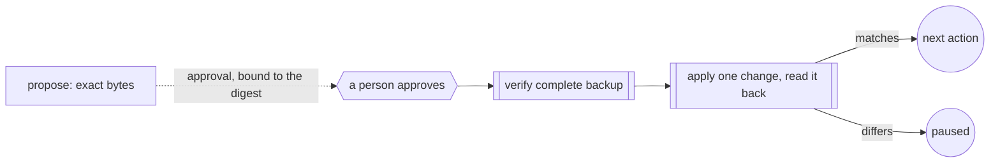

Approve the exact bytes a change will write, and let nothing else through.
Use it when a step edits files whose contents are facts you can't lose: a
migration of records, a merge of protected sources into a destination. When
a person's yes is enough on its own, use [a person decides](/patterns/approval);
this pattern binds that yes to the proposed output, so a changed byte makes
the old approval void.

## Shape



## The run

The proposal covers the destination content, the expected revisions, the
mappings and the source hashes. Approval binds those exact bytes and the
proof packet through the stored callback APIs. The host posts and answers
the callback only while the executor is stopped:

```ts examples/safe-change.ts (excerpt) {7-9}
  const input = await seedSafeChangeFixture(directory);
  const original = {
    sources: await Promise.all(input.sourceIds.map(async (id) => ({ id, bytes: await readRecordBytes(sourcePath(directory, id)) }))),
    targets: await Promise.all(input.destinations.map(async ({ id }) => ({ id, bytes: await readRecordBytes(targetPath(directory, id)) }))),
  };
  const run = await openSafeChangeRun({ directory, runId: 'safe-change-example', input });
  const signal = new AbortController().signal;
  assert.equal((await run.executor.run(signal)).kind, 'pause');
  // This runnable fixture uses scripted approval, not a model or human review.
  await run.approve();
  const result = await run.executor.resume(run.approvalPosition, signal);
  assert.equal(result.kind, 'complete');
  if (result.kind !== 'complete') throw new Error('Safe change did not complete');
```

The run pauses at the approval. `approve()` supplies a scripted answer
here; a real host collects its decision through the stored callback
client. Before each write, the file adapter checks the stored approval, the
live source hashes, the target's version and active status, and the
verified backup. Models can propose or review data; the deterministic
adapter applies it.

The backup keeps the original source and target bytes, with every record
field needed to restore them, and artifact hashes protect it. Each write
saves the target's content, revision and action witness together through
one file replacement, and appends intent and result events to the target's
own stream. A readback that succeeds with different bytes records a
mismatch and pauses the graph before the next write; changing the file back
and calling resume doesn't clear it. After a crash leaves a write's outcome
unknown, resume checks the saved intent, the exact target bytes and the
witness. A matching completed write returns its evidence without another
application. Resume alone never authorises a repeated write.

## What the run did

Four synthetic source kinds, document, current record, discussion comment
and historical entry, are merged into two destinations. The example writes
only to a temporary directory and removes it when done, and calls no model.
Run it with `npx tsx safe-change.ts`, with `safe-change-recipe.ts` and
`safe-change-file-adapter.ts` beside it:

```json Output
{
  "status": "complete",
  "sourceKinds": [
    "document",
    "current-record",
    "discussion-comment",
    "historical-entry"
  ],
  "sourceCount": 4,
  "actionCount": 2,
  "protectedFacts": 4,
  "lostProtectedFacts": 0,
  "targetResultCount": 2,
  "backupVerified": true,
  "scriptedProposalAndReview": true
}
```

Every protected fact reached its destination, none was lost, both targets
carry a result, and the backup matched the original bytes. The mapping must
preserve each complete source record in an active destination; a change
that drops metadata or alters a protected body is refused. The adapter
assumes one writer owns the record directory. An external service needs
its own conditional-write and action-status contract.

<Accordion title="Full file">

```ts examples/safe-change.ts
import assert from 'node:assert/strict';
import { mkdtemp, rm } from 'node:fs/promises';
import { tmpdir } from 'node:os';
import { join } from 'node:path';
import type { ArtifactReference, JsonObject } from '@obversa/runtime';
import { openSafeChangeRun } from './safe-change-recipe.js';
import { readRecordBytes, readSource, readTarget, seedSafeChangeFixture, sourcePath, targetPath, targetStream } from './safe-change-file-adapter.js';

const directory = await mkdtemp(join(tmpdir(), 'obversa-safe-change-'));
let report;
try {
  const input = await seedSafeChangeFixture(directory);
  const original = {
    sources: await Promise.all(input.sourceIds.map(async (id) => ({ id, bytes: await readRecordBytes(sourcePath(directory, id)) }))),
    targets: await Promise.all(input.destinations.map(async ({ id }) => ({ id, bytes: await readRecordBytes(targetPath(directory, id)) }))),
  };
  const run = await openSafeChangeRun({ directory, runId: 'safe-change-example', input });
  const signal = new AbortController().signal;
  assert.equal((await run.executor.run(signal)).kind, 'pause');
  // This runnable fixture uses scripted approval, not a model or human review.
  await run.approve();
  const result = await run.executor.resume(run.approvalPosition, signal);
  assert.equal(result.kind, 'complete');
  if (result.kind !== 'complete') throw new Error('Safe change did not complete');
  const results: JsonObject[] = [];
  for (const target of input.destinations) {
    for await (const event of run.storage.eventStore.read(targetStream(target.id))) {
      if (event.type === 'safe-change:result') results.push(event.payload as JsonObject);
    }
  }
  const backup = JSON.parse(new TextDecoder().decode(await run.storage.artifactStore.read(
    { namespace: run.storage.record.namespace, runId: 'safe-change-example' }, results[0]!.backup as ArtifactReference,
  )));
  assert.deepEqual(backup, original);
  const targets = await Promise.all(input.destinations.map((target) => readTarget(directory, target.id)));
  const retention = ((result.output as JsonObject).nodes as JsonObject).retention as JsonObject;
  report = {
    status: result.kind,
    sourceKinds: await Promise.all(input.sourceIds.map(async (id) => (await readSource(directory, id)).kind)),
    sourceCount: input.sourceIds.length,
    actionCount: new Set(targets.map((target) => target.lastAction!.actionId)).size,
    protectedFacts: retention.protectedFacts,
    lostProtectedFacts: retention.lostProtectedFacts,
    targetResultCount: results.length,
    backupVerified: true,
    scriptedProposalAndReview: retention.scriptedProposalAndReview,
  };
} finally { await rm(directory, { recursive: true, force: true }); }
export const safeChangeReport = report;
console.log(JSON.stringify(safeChangeReport, null, 2));
```

</Accordion>

The other two files, `examples/safe-change-recipe.ts` (the stored graph)
and `examples/safe-change-file-adapter.ts` (reading and changing records),
sit beside it and import only public runtime exports.

## Next steps

- [Proof-bound acceptance and approval](/reviewing/proof-acceptance): how an
  approval is bound to the bytes, proof and workspace state it judged.
- [Safe node attempts](/recording/node-attempts): the attempt record each
  stage here keeps, and how a crash mid-write is reconciled.
- [Runtime](/packages/runtime): the executor, the stored callback client
  and the artifact store the recipe uses.
