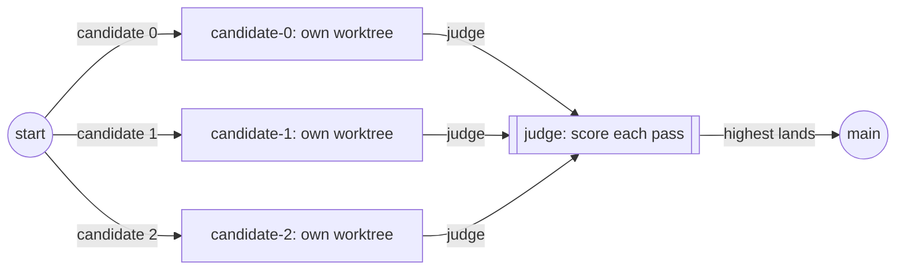

Run the same task more than once and keep the attempt that scores highest.
Use it when a task has several defensible answers and you'd rather compare
than iterate: an implementation with a few plausible designs, a draft with
a few angles. When one attempt and a reviewer will do, use
[a writer and a reviewer](/patterns/writer-and-reviewer). A tournament is an
eval that picks a winner: the judge is a function over the files each
candidate left, not a model's opinion.

## Shape



## The tournament

`tournament` takes the number of candidates, a function from the candidate
index to a job, and a judge. Each candidate runs in its own worktree on its
own branch:

```ts examples/tournament.ts (excerpt) {4-5,11}
  const result = await run(
    tournament({
      name: 'retry-implementation',
      n: ANGLES.length,
      candidate: (i) => fnJob(`candidate-${i}`, async (ctx) => {
        await writeFile(join(ctx.workspace.dir, 'src/retry.ts'), TASK[1] + ANGLES[i]!);
        await writeFile(join(ctx.workspace.dir, 'candidate.test.ts'), CANDIDATE_TEST);
        await runNodeTest(ctx);
        return { status: 'pass' as const, data: { candidate: i } };
      }),
      judge: score,
    }),
    { cwd: repo },
  );
```

Every candidate writes `src/retry.ts` and a test, then runs the test with
Node. A failed test fails the candidate. The judge reads each passing
candidate's source and scores it:

```ts examples/tournament.ts (excerpt)
const score = async (outcome: Outcome, ctx: JobContext): Promise<number> => {
  if (outcome.status !== 'pass') return 0;
  const source = await readFile(join(ctx.workspace.dir, 'src/retry.ts'), 'utf8');
  let points = 1;
  if (/MAX_ATTEMPTS\s*=\s*\d+/.test(source)) points += 1;
  if (/signal\?\.aborted/.test(source)) points += 1;
  return points;
};
```

One point for passing, one for a named attempts cap, one for stopping when
the caller aborts. The source on disk is the evidence, not the candidate's
outcome data. A candidate that throws is never scored, so it can't win
whatever its source looks like. The highest score lands on `main`; a tie
goes to the first candidate, so give the judge enough resolution to
separate the attempts you care about. Every candidate's worktree and branch
is removed when the tournament ends. `concurrency` sets how many candidates
run at once, all of them by default.

## What the run did

The candidates here are functions, so the file runs offline and always
gives the same answer. Put an engine in the candidate job and the shape is
a tournament of models. Run it with `npx tsx tournament.ts`:

```json Output
{
  "candidates": 3,
  "status": "pass",
  "winnerLanded": true,
  "candidateBranches": [],
  "temporaryDirectoryRemoved": true
}
```

The third candidate wins. It's the only one with both the attempts cap and
the abort check, so it scores three. Its source is what `src/retry.ts`
holds on `main` afterwards. The branch list is empty because the losers left
nothing behind.

<Accordion title="Full file">

```ts examples/tournament.ts
import assert from 'node:assert/strict';
import { execFile } from 'node:child_process';
import { existsSync } from 'node:fs';
import { mkdir, mkdtemp, readFile, realpath, rm, writeFile } from 'node:fs/promises';
import { tmpdir } from 'node:os';
import { join } from 'node:path';
import { promisify } from 'node:util';

import { fnJob, run, tournament, type JobContext, type Outcome } from '@obversa/runtime';

const git = promisify(execFile);

const TASK = [
  'src/retry.ts',
  [
    'export async function retry(fn, options = {}) {',
    '  const attempts = options.attempts ?? 3;',
    '  const delayMs = options.delayMs ?? 10;',
    '  let lastError;',
    '  for (let used = 0; used < attempts; used += 1) {',
    '    try {',
    '      return await fn();',
    '    } catch (error) {',
    '      lastError = error;',
    '      if (used + 1 < attempts) {',
    '        await new Promise((resolve) => setTimeout(resolve, delayMs));',
    '      }',
    '    }',
    '  }',
    '  throw lastError;',
    '}',
    '',
  ].join('\n'),
];

const ANGLES = [
  '',
  [
    'export async function abortableRetry(fn, options = {}, signal) {',
    '  const attempts = options.attempts ?? 3;',
    '  let lastError;',
    '  for (let used = 0; used < attempts; used += 1) {',
    '    if (signal?.aborted) throw lastError ?? new Error("aborted");',
    '    try { return await fn(); } catch (error) {',
    '      lastError = error;',
    '      if (used + 1 < attempts) await new Promise((resolve) => setTimeout(resolve, options.delayMs ?? 10));',
    '    }',
    '  }',
    '  throw lastError;',
    '}',
    '',
  ].join('\n'),
  [
    'export const MAX_ATTEMPTS = 3;',
    '',
    'export async function abortableRetry(fn, options = {}, signal) {',
    '  const attempts = options.attempts ?? MAX_ATTEMPTS;',
    '  let lastError;',
    '  for (let used = 0; used < attempts; used += 1) {',
    '    if (signal?.aborted) throw lastError ?? new Error("aborted");',
    '    try { return await fn(); } catch (error) {',
    '      lastError = error;',
    '      if (used + 1 < attempts) await new Promise((resolve) => setTimeout(resolve, options.delayMs ?? 10));',
    '    }',
    '  }',
    '  throw lastError;',
    '}',
    '',
  ].join('\n'),
];

const CANDIDATE_TEST = [
  'import { describe, it } from "node:test";',
  'import assert from "node:assert/strict";',
  'import { retry } from "./src/retry.ts";',
  '',
  'describe("candidate retry", () => {',
  '  it("retries a failing call until it succeeds", async () => {',
  '    let calls = 0;',
  '    const value = await retry(async () => {',
  '      calls += 1;',
  '      if (calls < 3) throw new Error("flaky");',
  '      return "up";',
  '    });',
  '    assert.equal(value, "up");',
  '    assert.equal(calls, 3);',
  '  });',
  '});',
  '',
].join('\n');

async function runNodeTest(ctx: JobContext): Promise<void> {
  await promisify(execFile)(
    process.execPath,
    ['--experimental-strip-types', '--test', 'candidate.test.ts'],
    { cwd: ctx.workspace.dir },
  );
}

const score = async (outcome: Outcome, ctx: JobContext): Promise<number> => {
  if (outcome.status !== 'pass') return 0;
  const source = await readFile(join(ctx.workspace.dir, 'src/retry.ts'), 'utf8');
  let points = 1;
  if (/MAX_ATTEMPTS\s*=\s*\d+/.test(source)) points += 1;
  if (/signal\?\.aborted/.test(source)) points += 1;
  return points;
};

const temporary = await realpath(await mkdtemp(join(tmpdir(), 'obversa-tournament-example-')));
let report;
try {
  const repo = join(temporary, 'repo');
  await mkdir(join(repo, 'src'), { recursive: true });
  await writeFile(join(repo, 'src/retry.ts'), '// written by the winning candidate\n');
  await git('git', ['init', '-q', '-b', 'main'], { cwd: repo });
  await git('git', ['config', 'user.name', 'Example'], { cwd: repo });
  await git('git', ['config', 'user.email', 'example@example.com'], { cwd: repo });
  await git('git', ['config', 'commit.gpgsign', 'false'], { cwd: repo });
  await git('git', ['add', 'src/retry.ts'], { cwd: repo });
  await git('git', [
    'commit', '-qm', 'chore: seed the task file',
  ], { cwd: repo });

  const result = await run(
    tournament({
      name: 'retry-implementation',
      n: ANGLES.length,
      candidate: (i) => fnJob(`candidate-${i}`, async (ctx) => {
        await writeFile(join(ctx.workspace.dir, 'src/retry.ts'), TASK[1] + ANGLES[i]!);
        await writeFile(join(ctx.workspace.dir, 'candidate.test.ts'), CANDIDATE_TEST);
        await runNodeTest(ctx);
        return { status: 'pass' as const, data: { candidate: i } };
      }),
      judge: score,
    }),
    { cwd: repo },
  );
  assert.equal(result.outcome.status, 'pass', JSON.stringify(result.outcome));

  const source = await readFile(join(repo, 'src/retry.ts'), 'utf8');
  assert.match(source, /MAX_ATTEMPTS|aborted/);
  const branches = (await git('git', ['branch', '--list'], { cwd: repo })).stdout
    .split('\n').map((line) => line.trim()).filter(Boolean);
  const candidateBranches = branches.filter((line) => line.startsWith('lines/retry-implementation-cand-'));
  assert.deepEqual(candidateBranches, [], 'the losers left nothing behind');

  report = {
    candidates: ANGLES.length,
    status: result.outcome.status,
    winnerLanded: /MAX_ATTEMPTS\s*=\s*\d+/.test(source) && /signal\?\.aborted/.test(source),
    candidateBranches,
  };
} finally {
  await rm(temporary, { recursive: true, force: true });
}
console.log(JSON.stringify({ ...report, temporaryDirectoryRemoved: !existsSync(temporary) }, null, 2));
```

</Accordion>

## Next steps

- [Workspace](/concepts/workspace): the worktree each candidate gets, and
  how the winner lands back.
- [Evals](/reviewing/evals): what counts as an eval here, and where a judge
  that picks a winner sits among them.
- [Runtime](/packages/runtime): `tournament` and its options.
