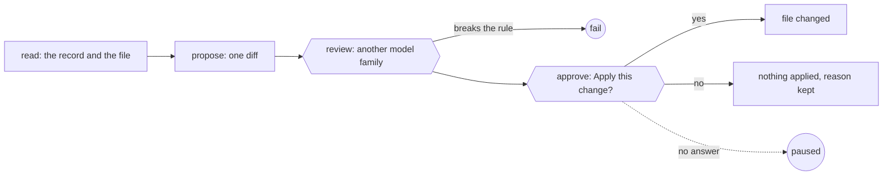

After a run, `improveWorkflow` from `@obversa/builtin-workflows` reads the
run's record and proposes one change to the workflow file that ran. A seat
from another model family checks the change. Then a person says yes or no,
and nothing changes without a yes. Each run proposes one change, so the
next run's record shows what that change did.

## Shape



## What it reads

Run the workflow with `recordTo` and `source`. The record keeps every event
of the run, and its `run:start` event keeps the path and SHA-256 of the
workflow file:

```ts examples/improve-a-workflow.ts (excerpt)
  const notes = await run(releaseNotes(), { recordTo: record, source: workflow });
```

Give `improveWorkflow` that record, the same workflow file, a seat that
proposes and a seat that reviews:

```ts examples/improve-a-workflow.ts (excerpt)
  const improve = improveWorkflow({
    record,
    workflow,
    proposer: {
      engine: proposer,
      identity: { adapter: 'mock', provider: 'local', modelFamily: 'proposer', model: 'proposer-offline', tools: [] },
    },
    reviewer: {
      engine: reviewer,
      identity: { adapter: 'mock', provider: 'local', modelFamily: 'reviewer', model: 'reviewer-offline', tools: [] },
    },
  });
```

The first step checks the file before any model runs. When the file's
SHA-256 differs from the one in the record, the run fails, and the message
names both hashes. A record with no `source`, or a record that names
another file, fails the same way. The two seats must report different
model families, or `improveWorkflow` throws before the run starts.

The proposing seat reads the workflow file and the whole record, with each
event after its line number. The record holds what a change needs as
evidence:

- **Each attempt** of a step, with its tokens, its cost and how long it
  took.
- **Each check**, with its command and its exit code.
- **Each round**, with the files and lines it changed and the findings it
  answered.
- **Each judge decision**, with its reason, and the goal check's verdicts.

## What it may change

The proposal is one unified diff to the workflow file, with a short reason
that cites lines of the record: which events, which rounds, what they
cost. The proposing seat looks for these:

- **A step that fails its first round on the same kind of finding.** The
  change is to its prompt or its brief.
- **A reviewer whose findings the judge always skips.** The change is to
  its instructions.
- **A cap or an effort that costs more than it returns.**
- **A check that runs late** and sends work back after an expensive step.
  The change runs it earlier.

The run checks the proposal before the review. The diff must change the
workflow file and no other, and it must apply to the file as it is. Each
cited line must exist in the record. A proposal that fails these checks
fails the run.

## What it may not change

The change must not remove or weaken a review, a check, a goal check, a
judge, an approval or a guard. The reviewing seat reads the diff, the
reason, each cited line of the record and the whole record. It checks the
change against that rule and checks that the record supports the reason.
When it sends the proposal back, the run fails and nobody is asked.

## How approval works

The run asks one question through its callbacks client: "Apply this change
to" the file. The question carries the diff, the reason and the evidence,
each cited line with the event it points at. Until a person answers, the
run pauses. Run it again with the same client and the same record, with
`resume`, and it carries on from the answer:

```ts examples/improve-a-workflow.ts (excerpt)
  const callbacks = createCallbackClient();
  const improveRecord = join(dir, 'improve.jsonl');
  const asked = await run(improve, { callbacks, recordTo: improveRecord });
  const unchanged = await readFile(workflow, 'utf8');
  const [question] = callbacks.listPending();
  if (question) await directRouter(callbacks, question, 'person', () => ({ approved: true }));
  const done = await run(improve, { callbacks, recordTo: improveRecord, resume: true });
```

On a yes, the run checks that the file still has the SHA-256 in the record,
applies the diff and writes the file. On a no, the run does not write the
file. Either way, the last step's outcome keeps the decision, the record
path, the diff, the reason, and the file's SHA-256 before and after. The
hash after a no is the one the file has when the answer comes. A no also
keeps the person's note. The run ends `pass` in both cases. When the file
changed while the question waited, a yes applies nothing and the run fails.

The question is an ordinary [approval](/patterns/approval). With
`onCallback: 'wait'`, the run waits for the answer instead of pausing, and a
person can answer on [the run's page](/driving/monitor). The answer can
also come from a [surface](/concepts/surfaces) or a host, and the
[stored client](/reviewing/callback-gates) keeps the question across a
restart.

## What the run did

The release notes workflow in `examples/improve-a-workflow/release-notes.ts`
runs first. Its check sends the first draft back, because the writer's
brief never asks for upgrade steps. Both seats and the person answer from
the example file, so it runs offline. Run it with
`npx tsx improve-a-workflow.ts`:

```json Output
{
  "workflowRun": "pass",
  "question": "Apply this change to release-notes.ts?",
  "reason": "The check sent the first draft back because it had no upgrade steps, so the writer ran twice. The brief never asks for them.",
  "evidence": [
    "line 12: the check sends the first draft back: the notes have no upgrade steps"
  ],
  "beforeTheAnswer": "paused",
  "afterTheYes": "pass",
  "brief": "const brief = 'Write the release notes for version 2.0, one line per change, then the upgrade steps.';"
}
```

The proposal cites line 12 of the record, the event where the check sent
the draft back. The run paused at the question and passed after the yes.
After the yes, the brief in the workflow file asks for the upgrade steps, so the next
run's record can show whether the check still sends the draft back.

<Accordion title="Full file">

```ts examples/improve-a-workflow.ts
/**
 * A workflow proposes one change to itself from the record of its own run.
 *
 * The release notes workflow runs once, and its check sends the first draft
 * back: the writer's brief never asks for upgrade steps. `improveWorkflow`
 * reads that run's record. A proposing seat suggests one change to the
 * workflow file, a seat from another model family checks it, and a person
 * says yes before the file changes. This runs offline: both seats and the
 * person answer from this file. It works on a copy of the workflow file, so
 * the example leaves its own files as they were.
 */
import { createHash } from 'node:crypto';
import { copyFile, mkdtemp, readFile, rm } from 'node:fs/promises';
import { tmpdir } from 'node:os';
import { join } from 'node:path';
import { fileURLToPath } from 'node:url';

import { improveWorkflow } from '@obversa/builtin-workflows';
import { createCallbackClient, directRouter, run, type AgentRequest } from '@obversa/runtime';
import { MockEngine } from '@obversa/runtime/testing';

import { releaseNotes } from './improve-a-workflow/release-notes.js';

const dir = await mkdtemp(join(tmpdir(), 'obversa-improve-'));
try {
  const workflow = join(dir, 'release-notes.ts');
  await copyFile(fileURLToPath(new URL('./improve-a-workflow/release-notes.ts', import.meta.url)), workflow);
  const record = join(dir, 'release-notes.jsonl');

  // 1. Run the workflow. The record keeps every event, and the path and
  //    SHA-256 of the file the run came from.
  const notes = await run(releaseNotes(), { recordTo: record, source: workflow });

  // 2. The proposing seat. Its recorded reply cites the send-back by its line
  //    in the record, and changes one line of the writer's brief.
  let cited = 0;
  const proposer = new MockEngine((request: AgentRequest) => {
    cited = Number(/^(\d+): .*"kind":"dag:kickback"/m.exec(request.prompt)?.[1]);
    return JSON.stringify({
      diff: [
        '--- a/release-notes.ts',
        '+++ b/release-notes.ts',
        '@@ -9,1 +9,1 @@',
        "-const brief = 'Write the release notes for version 2.0, one line per change.';",
        "+const brief = 'Write the release notes for version 2.0, one line per change, then the upgrade steps.';",
        '',
      ].join('\n'),
      reason: 'The check sent the first draft back because it had no upgrade steps, so the writer ran twice. The brief never asks for them.',
      evidence: [{ line: cited, note: 'the check sends the first draft back: the notes have no upgrade steps' }],
    });
  });

  // 3. The reviewing seat, from another model family. Its recorded reply
  //    passes the change: it adds to the brief and keeps the check.
  const reviewer = new MockEngine(() => JSON.stringify({
    status: 'pass',
    summary: 'The change adds to the brief and keeps the check, and the cited line shows the send-back.',
  }));

  const improve = improveWorkflow({
    record,
    workflow,
    proposer: {
      engine: proposer,
      identity: { adapter: 'mock', provider: 'local', modelFamily: 'proposer', model: 'proposer-offline', tools: [] },
    },
    reviewer: {
      engine: reviewer,
      identity: { adapter: 'mock', provider: 'local', modelFamily: 'reviewer', model: 'reviewer-offline', tools: [] },
    },
  });

  // 4. The run asks a person, and pauses until they answer. Their recorded
  //    answer is yes; the run carries on from its record and applies the diff.
  const callbacks = createCallbackClient();
  const improveRecord = join(dir, 'improve.jsonl');
  const asked = await run(improve, { callbacks, recordTo: improveRecord });
  const unchanged = await readFile(workflow, 'utf8');
  const [question] = callbacks.listPending();
  if (question) await directRouter(callbacks, question, 'person', () => ({ approved: true }));
  const done = await run(improve, { callbacks, recordTo: improveRecord, resume: true });

  const proposal = question?.input as { reason?: string; evidence?: { line: number; note: string }[] } | undefined;
  const improved = await readFile(workflow, 'utf8');
  console.log(JSON.stringify({
    workflowRun: notes.outcome.status,
    question: question?.decisionText.replace(`${dir}/`, ''),
    reason: proposal?.reason,
    evidence: proposal?.evidence?.map(({ line, note }) => `line ${line}: ${note}`),
    beforeTheAnswer: asked.outcome.status,
    afterTheYes: done.outcome.status,
    brief: improved.split('\n').find((line) => line.startsWith('const brief')),
  }, null, 2));

  /**
   * Part of the documentation proof: it must fail when the behaviour it shows
   * stops happening. A change applied before the yes, a proposal that cites
   * no send-back, or a decision recorded without its hashes is the tell.
   */
  const sha256 = (text: string) => createHash('sha256').update(text).digest('hex');
  const decision = (await readFile(improveRecord, 'utf8')).trim().split('\n')
    .map((line) => JSON.parse(line) as { kind: string; node?: string; phase?: string; outcome?: { data?: Record<string, unknown> } })
    .filter((event) => event.kind === 'dag:node' && event.node === 'approve' && event.phase === 'done')
    .at(-1)?.outcome?.data;
  const faults: string[] = [];
  if (notes.outcome.status !== 'pass') faults.push(`the release notes run ended ${notes.outcome.status}`);
  if (asked.outcome.status !== 'paused') faults.push(`the first improve run ended ${asked.outcome.status}, not paused at the question`);
  if (unchanged !== improved.replace(', then the upgrade steps', '')) faults.push('the workflow file changed before the person answered');
  if (!cited || !proposal?.evidence?.some(({ line }) => line === cited)) faults.push('the proposal does not cite the send-back in the record');
  if (done.outcome.status !== 'pass') faults.push(`the run after the yes ended ${done.outcome.status}`);
  if (!improved.includes('then the upgrade steps')) faults.push('the yes did not apply the diff');
  if (decision?.decision !== 'applied' || decision.sha256Before !== sha256(unchanged) || decision.sha256After !== sha256(improved)) {
    faults.push(`the record does not show the applied change with the hashes before and after: ${JSON.stringify(decision)}`);
  }
  if (faults.length) {
    for (const fault of faults) console.error(fault);
    process.exitCode = 1;
  }
} finally {
  await rm(dir, { recursive: true, force: true });
}
```

</Accordion>

## Automatic mode

An automatic mode is not built. In that mode, evals would score each
change, and a change that scores better would apply without a person.
Every change needs a person's yes.

## Next steps

- [Ask a person](/patterns/approval): the approval step the question uses.
- [Read a record](/recording/read-a-record): the record a proposal cites.
- [Built-in Workflows](/packages/builtin-workflows): `improveWorkflow` and
  its configuration.
