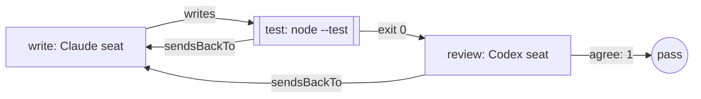

Give one model a brief and a model from a different family the job of
checking it. Use it when one reviewer is enough and the test command does
most of the judging. When one opinion isn't enough, use
[a review panel with a threshold](/patterns/review-panel). Anthropic calls
this shape evaluator-optimizer: one model produces, another evaluates, and
the producer runs again with the evaluation in hand.

## Shape



## The team

Two roles and three stages. The writer is a Claude seat, the reviewer a
Codex seat, and the test between them is a command:

```ts examples/teams/writer-reviewer-pair.ts (excerpt) {5-8,22,29}
  return workflow('writer-reviewer-pair', {
    brief: briefFromFile('briefs/add.md'),
    options: { timeout: '10m' },

    roles: {
      write: engines.claude('claude-sonnet-4-5'),
      review: [engines.codex('gpt-5.6-luna')],
    },

    stages: [
      stage('write', {
        agent: 'write',
        writes: ['src/add.mjs', 'test/add.test.mjs'],
        desc: 'Write the function and its test from the brief.',
        gate: 'The files named in the brief exist in the workspace.',
        retry: 1,
      }),
      stage('test', {
        run: ['node', '--test', 'test/add.test.mjs'],
        desc: 'Run the test command against the written files.',
        gate: 'The test command exits 0.',
        sendsBackTo: 'write',
      }),
      stage('review', {
        panel: 'review',
        agree: 1,
        desc: 'Read the code, the test and its result.',
        gate: 'The change meets the brief.',
        sendsBackTo: 'write',
      }),
    ],
  });
```

The writer produces the files the brief names. `writes` is checked after
the stage: a missing or empty file fails it by name, and so does a change to
another declared file. Node runs the test, and a red run carries its output
to `write`, which runs again with it. The reviewer reads the code, the test
and its result only after the test passes, and a rejection goes the same
way. `retry: 1` on the writer bounds how many times the pair goes round.
The two seats must come from different model families; `workflow()`
refuses the team before any model runs when they share one, so a model
never approves its own work.

<Warning>
Run the file in a directory you're happy for a model to change. The Claude
seat runs with permission prompts off, so it can run any command the process
can.
</Warning>

## What the run did

The brief is `briefs/add.md` beside the file: its body is the task, and its
front matter names the files the writer must produce. Run the file from the
directory the work belongs in, with the Claude Code and Codex command line
tools signed in. One real run printed:

```json Output
{
  "status": "pass",
  "summary": "dag \"writer-reviewer-pair\": all 3 node(s) green",
  "data": {
    "write": {
      "status": "pass",
      "summary": "Created src/add.mjs with a pure add function and test/add.test.mjs with Node.js test coverage"
    },
    "test": {
      "status": "pass",
      "summary": "`node` exited 0"
    },
    "review": {
      "status": "pass",
      "summary": "Review panel: 1/1 reviewer(s) cleared.",
      "data": {
        "findings": [],
        "escalatedFindings": [],
        "errors": [],
        "results": [
          {
            "kind": "verdict",
            "name": "review-1",
            "met": true,
            "reason": "The named add(a, b) function returns a + b without side effects, and the required Node test passes."
          }
        ],
        "passed": 1,
        "required": 1,
        "severityCounts": {}
      }
    }
  }
}
```

All three stages passed first time. The writer left `src/add.mjs`:

```js src/add.mjs
export function add(a, b) {
  return a + b;
}
```

and `test/add.test.mjs`:

```js test/add.test.mjs
import assert from 'node:assert/strict';
import { test } from 'node:test';
import { add } from '../src/add.mjs';

test('add(2, 3) returns 5', () => {
  assert.strictEqual(add(2, 3), 5);
});

test('add(0, 0) returns 0', () => {
  assert.strictEqual(add(0, 0), 0);
});

test('add(-1, 1) returns 0', () => {
  assert.strictEqual(add(-1, 1), 0);
});

test('add handles negative numbers', () => {
  assert.strictEqual(add(-5, -3), -8);
});
```

Each seat comes from its plugin. `claude('claude-sonnet-4-5')` and
`codex('gpt-5.6-luna')` carry the identity the plugin records, and the
record and the family check read it. The Codex seat runs sandboxed to the
workspace with approvals off. Each helper takes an options object to choose
otherwise.

<Accordion title="Full file">

```ts examples/teams/writer-reviewer-pair.ts
import { claude } from '@obversa/engine-claude-cli';
import { codex } from '@obversa/engine-codex-cli';
import { run } from '@obversa/runtime';
import { briefFromFile, stage, workflow, type TeamSeat } from '@obversa/runtime';

interface WriterReviewerEngines {
  readonly claude: (model: string) => TeamSeat;
  readonly codex: (model: string) => TeamSeat;
}

const realEngines: WriterReviewerEngines = { claude, codex };

function createWriterReviewerPair(engines: WriterReviewerEngines = realEngines) {
  return workflow('writer-reviewer-pair', {
    brief: briefFromFile('briefs/add.md'),
    options: { timeout: '10m' },

    roles: {
      write: engines.claude('claude-sonnet-4-5'),
      review: [engines.codex('gpt-5.6-luna')],
    },

    stages: [
      stage('write', {
        agent: 'write',
        writes: ['src/add.mjs', 'test/add.test.mjs'],
        desc: 'Write the function and its test from the brief.',
        gate: 'The files named in the brief exist in the workspace.',
        retry: 1,
      }),
      stage('test', {
        run: ['node', '--test', 'test/add.test.mjs'],
        desc: 'Run the test command against the written files.',
        gate: 'The test command exits 0.',
        sendsBackTo: 'write',
      }),
      stage('review', {
        panel: 'review',
        agree: 1,
        desc: 'Read the code, the test and its result.',
        gate: 'The change meets the brief.',
        sendsBackTo: 'write',
      }),
    ],
  });
}

const result = await run(createWriterReviewerPair());
console.log(JSON.stringify(result.outcome, null, 2));
```

</Accordion>

## Next steps

- [Feature delivery](/workflows/feature-team): the same writer, test and
  reviewer inside a nine-stage team, from brief to a person's decision.
- [Runtime](/packages/runtime): `workflow`, `stage`, `briefFromFile` and
  the keys of a stage.
- [Feedback loops](/concepts/feedback-loops): the shapes a review can take
  and the limit that stops the loop.
