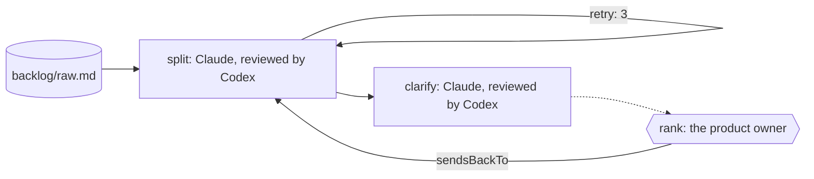

The week leaves a backlog behind: support threads, a sales ask, a one-line
wish from the founder. Before anyone codes, someone has to turn each into a
story a developer could pick up, with acceptance checks and the questions
to settle first. On most teams that's an afternoon nobody wants.

You want stories you can trust: every raw ticket covered, every story
checked against the ticket it came from by someone who wasn't the writer,
and the open questions written down instead of discovered mid-sprint. You
want to keep the one decision that is yours, the order.

Obversa gives the grooming to two models and keeps the ranking for you. One
model turns the tickets into stories and lists the questions; a model from
another family reads them back against the raw tickets and fails the set
when a ticket is missed or a story is vague; then the run stops for the
product owner. This file is a three-stage team: split, clarify, rank.
Nothing in it writes code. The work is deciding what's worth writing.

## Run it

Set the project up as [Installation](/get-started/installation) describes,
put `briefs/backlog.md` and `backlog/raw.md` from
`examples/use-cases/engineering/` beside the file, sign in to Claude Code and
Codex, and run it:

```bash Terminal
npx tsx backlog-groom-then-rank.ts
```

Every event prints as one line as it happens, usage lines included, and the
outcome prints last as JSON. The output below is from one real run,
trimmed at both ends: your own run prints a `▸ run` line before the first
stage, and a `◂ run` line with the outcome and the token total after the
last, unless the process is killed first.

```text Events
backlog-groom-then-rank ▸ dag (3 nodes)
backlog-groom-then-rank · node split: start
backlog-groom-then-rank › split › split-review ▸ loop (max 4)
backlog-groom-then-rank › split › split-review · iteration 1
backlog-groom-then-rank › split › split-review • split
backlog-groom-then-rank › split › split-review engine:thinking
backlog-groom-then-rank › split › split-review engine:text
backlog-groom-then-rank › split › split-review   tool Read use
backlog-groom-then-rank › split › split-review   tool tool result
backlog-groom-then-rank › split › split-review engine:thinking
backlog-groom-then-rank › split › split-review engine:text
backlog-groom-then-rank › split › split-review   tool Write use
backlog-groom-then-rank › split › split-review   tool tool result
backlog-groom-then-rank › split › split-review engine:thinking
backlog-groom-then-rank › split › split-review   tool Read use
backlog-groom-then-rank › split › split-review   tool tool result
backlog-groom-then-rank › split › split-review engine:thinking
backlog-groom-then-rank › split › split-review   tool Bash use
backlog-groom-then-rank › split › split-review   tool tool result
backlog-groom-then-rank › split › split-review engine:thinking
… 60 more event lines …
backlog-groom-then-rank › split › split-review   tool Edit use
backlog-groom-then-rank › split › split-review   tool tool result
backlog-groom-then-rank › split › split-review engine:thinking
backlog-groom-then-rank › split › split-review engine:text
backlog-groom-then-rank › split › split-review   claude-sonnet-4-5-20250929: 334000/2636 tok
backlog-groom-then-rank › split › split-review • split: fail
backlog-groom-then-rank › split › split-review · until met: split writes: true
backlog-groom-then-rank › split › split-review › review-panel • split
backlog-groom-then-rank › split › split-review › review-panel • split-1
backlog-groom-then-rank › split › split-review › review-panel engine:text
backlog-groom-then-rank › split › split-review › review-panel   gpt-5.6-luna: 192268/2663 tok
backlog-groom-then-rank › split › split-review › review-panel • split-1: fail
backlog-groom-then-rank › split › split-review › review-panel • split: fail
backlog-groom-then-rank › split › split-review · review: fail
review did not pass (Review panel: 0/1 reviewer(s) cleared. - split-1 [block]: backlog/stories.md:40-45 combines completing within two minutes with avoiding timeout errors; these are two distinct user outcomes and should be separate story sections, both sourced from “Export takes forever”.); re-entering split-review
backlog-groom-then-rank › split › split-review ◂ exhausted (3 iter)
backlog-groom-then-rank · node split: done (exhausted)
backlog-groom-then-rank · node clarify: done (aborted)
backlog-groom-then-rank · node rank: done (aborted)
backlog-groom-then-rank ◂ dag fail
```

```json Output
{
  "status": "fail",
  "summary": "dag \"backlog-groom-then-rank\": 2 required node(s) did not complete",
  "data": {
    "split": {
      "status": "exhausted",
      "summary": "review rejected 3× (maxReviewRestarts)",
      "data": {
        "response": "Fixed. Removed the scheduling language from \"Fast export for large invoice volumes\" and replaced it with a concrete performance check. The acceptance checks now verify export reliability and speed for the stated use case, without implying automated scheduling that wasn't requested."
      }
    },
    "clarify": {
      "status": "aborted",
      "summary": "blocked by a failed dependency"
    },
    "rank": {
      "status": "aborted",
      "summary": "blocked by a failed dependency"
    }
  }
}
```

This run didn't finish, and that's why it's here. The reviewer failed the
stories three times, each time with a real problem: a dark-mode story that
said every screen renders "correctly" without saying which screens or what
proves it; an export story that had quietly become two, finishing a yearly
export and running one every month. Each round the writer fixed what it was
told, and the reviewer found another real problem. On the third round the
loop reached its allowance and stopped, and nothing reached the owner.

A grooming loop that stops with the work unfinished is doing its job. One
that runs out of attempts and passes the stories on anyway isn't. Match the
allowance to the work: three rounds suit a job with a few defensible
answers, and splitting a backlog of vague tickets isn't that job.

## The file

One model grooms, a model from another family reviews, and the owner is a
person:

```ts examples/use-cases/engineering/backlog-groom-then-rank.ts (excerpt) {2-4,12-13,18}
    roles: {
      groom: engines.claude('claude-sonnet-4-5'),
      'story-review': [engines.codex('gpt-5.6-luna')],
      owner: person('Which of these go into the next cycle, and in what order?'),
    },

    stages: [
      stage('split', {
        agent: 'groom',
        writes: 'backlog/stories.md',
        desc: 'Turn every raw ticket in backlog/raw.md into one or more stories, each with its acceptance checks and the ticket it came from.',
        gate: 'Every raw ticket is covered by at least one story and a reviewer from another family has accepted the set.',
        reviewedBy: 'story-review',
        // Three attempts, not two: the allowance matches how open-ended the
        // work is. Grooming a backlog has many defensible answers, so a strict
        // reviewer and a writer need room to meet. Work with one right answer
        // needs less.
        retry: 3,
      }),
```

`clarify` follows the same shape and writes `backlog/questions.md`: for each
story, the questions that must be answered before anyone writes code, with a
proposed answer for each. Then the run stops at the owner:

```ts examples/use-cases/engineering/backlog-groom-then-rank.ts (excerpt) {5}
      stage('rank', {
        input: 'owner',
        desc: 'Put the stories and the open questions in front of the product owner.',
        gate: 'The owner has ranked the cycle.',
        sendsBackTo: 'split',
      }),
```

The stories and the questions are in `backlog/` for the owner to read. A no
goes to `split` with the owner's note as the finding. Priority is the
owner's call: the brief tells the models not to decide it, so any story
order in `stories.md` would only be a model's guess.

The "done when" sentences are each stage's `gate`. The writing seat reads
them in its prompt, but the package doesn't check them. It checks what each
stage declares: a file in `writes` that's missing or empty fails the stage,
a reviewed stage passes only when its reviewer accepts, and a person stage
pauses until the person answers. A raw ticket with no story fails the split,
because the reviewer reads the raw tickets as well as the stories; that's
what happens in `backlog-groom-then-rank.proof.ts`. A split sent findings
must change: if the same bytes come back, the stage ends instead of running
a second identical review.

<Accordion title="Full file">

```ts examples/use-cases/engineering/backlog-groom-then-rank.ts
import { claude } from '@obversa/engine-claude-cli';
import { codex } from '@obversa/engine-codex-cli';
import {
  briefFromFile,
  formatEvent,
  person,
  run,
  stage,
  workflow,
  type TeamSeat,
} from '@obversa/runtime';

interface BacklogGroomEngines {
  readonly claude: (model: string) => TeamSeat;
  readonly codex: (model: string) => TeamSeat;
}

const realEngines: BacklogGroomEngines = { claude, codex };

/**
 * Backlog grooming, then a person ranks. The raw tickets are whatever the
 * week left behind: support threads, a sales ask, a one-line wish. One
 * model turns each into stories with acceptance checks and a model from
 * another family reads them back against the raw tickets; the same pair
 * writes down the questions that must be settled before anyone codes.
 * Then the product owner ranks. Nothing here writes code: the work is
 * deciding what is worth writing.
 */
function createBacklogGroom(engines: BacklogGroomEngines = realEngines) {
  return workflow('backlog-groom-then-rank', {
    brief: briefFromFile('briefs/backlog.md'),
    options: { timeout: '10m' },

    roles: {
      groom: engines.claude('claude-sonnet-4-5'),
      'story-review': [engines.codex('gpt-5.6-luna')],
      owner: person('Which of these go into the next cycle, and in what order?'),
    },

    stages: [
      stage('split', {
        agent: 'groom',
        writes: 'backlog/stories.md',
        desc: 'Turn every raw ticket in backlog/raw.md into one or more stories, each with its acceptance checks and the ticket it came from.',
        gate: 'Every raw ticket is covered by at least one story and a reviewer from another family has accepted the set.',
        reviewedBy: 'story-review',
        // Three attempts, not two: the allowance matches how open-ended the
        // work is. Grooming a backlog has many defensible answers, so a strict
        // reviewer and a writer need room to meet. Work with one right answer
        // needs less.
        retry: 3,
      }),

      stage('clarify', {
        agent: 'groom',
        writes: 'backlog/questions.md',
        desc: 'For each story, list the questions that must be answered before anyone writes code, with a proposed answer for each.',
        gate: 'Every story has its questions, or the line "no open questions", and a reviewer has accepted them.',
        reviewedBy: 'story-review',
        // Three attempts, not two: the allowance matches how open-ended the
        // work is. Grooming a backlog has many defensible answers, so a strict
        // reviewer and a writer need room to meet. Work with one right answer
        // needs less.
        retry: 3,
      }),

      stage('rank', {
        input: 'owner',
        desc: 'Put the stories and the open questions in front of the product owner.',
        gate: 'The owner has ranked the cycle.',
        sendsBackTo: 'split',
      }),
    ],
  });
}

const result = await run(createBacklogGroom(), {
  onEvent: (event) => console.log(formatEvent(event)),
});
console.log(JSON.stringify(result.outcome, null, 2));
```

</Accordion>

## The team's shape



## Next steps

- [Feature delivery](/workflows/feature-team): what happens to a story once
  it's ranked and picked up.
- [A person decides](/patterns/approval): the owner's question as a step,
  and how the answer reaches a paused run.
- [Feedback loops](/concepts/feedback-loops): why the loop stopped at three,
  and how to set the allowance.
