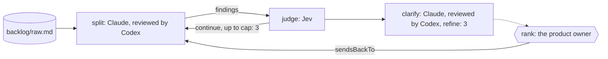

The week leaves a backlog behind: support threads, a sales ask, a one-line
wish from the founder. Before anyone codes, someone has to turn each into a
story a developer could pick up, with acceptance checks and the questions
to settle first. On most teams that's an afternoon nobody wants.

You want stories you can trust: every raw ticket covered, every story
checked against the ticket it came from by someone who wasn't the writer,
and the open questions written down instead of discovered mid-sprint. You
want to keep the one decision that is yours, the order.

Obversa gives the grooming to two models and keeps the ranking for you. One
model turns the tickets into stories and lists the questions; a model from
another family reads them back against the raw tickets and fails the set
when a ticket is missed or a story is vague; a judge, Jev, says when
another round on the stories is worth it, up to a cap of three; then the
run stops for the product owner. This file is a three-stage team: split,
clarify, rank. Nothing in it writes code. The work is deciding what's worth
writing.

## Run it

Set the project up as [Installation](/get-started/installation) describes,
put `briefs/backlog.md`, `backlog/raw.md` and `judge.json` from
`examples/use-cases/engineering/` beside the file, sign in to Claude Code and
Codex, and run it. Without `JUDGE=jev` the judge replays the answers in
`judge.json`; with it, and a TypeSafe endpoint and key in the environment,
the judge is Jev:

```bash Terminal
npx tsx backlog-groom-then-rank.ts
```

Every event prints as one line as it happens, usage lines included, and the
outcome prints last as JSON. The output below is the proof's offline run,
with scripted seats standing in for the models and a recorded judge, so the
words are the script's and the shape is the run's:

```text Output, from the offline proof
▸ run
backlog-groom-then-rank workflow:start
backlog-groom-then-rank ▸ dag (3 nodes)
backlog-groom-then-rank · node split: start
backlog-groom-then-rank › split › split-review ▸ loop (max 4)
backlog-groom-then-rank › split › split-review · iteration 1
backlog-groom-then-rank › split › split-review • split

backlog-groom-then-rank › split › split-review   stand-in: 3/1 tok
backlog-groom-then-rank › split › split-review • split: pass  three stories from four tickets
backlog-groom-then-rank › split › split-review · until met: split writes: true
backlog-groom-then-rank › split › split-review › review-panel • split
backlog-groom-then-rank › split › split-review › review-panel • split-1

backlog-groom-then-rank › split › split-review › review-panel   gpt-5.6-luna: 42/7 tok
backlog-groom-then-rank › split › split-review › review-panel • split-1: fail  one raw ticket has no story
backlog-groom-then-rank › split › split-review › review-panel • split: fail  Review panel: 0/1 reviewer(s) cleared. - split-1 [should-fix]: the "Dark mode pls" ticket is not covered by any story
backlog-groom-then-rank › split › split-review › refine-judge • refine:judge

backlog-groom-then-rank › split › split-review › refine-judge   jev-latest: 10/5 tok
backlog-groom-then-rank › split › split-review › refine-judge • refine:judge: pass  {"holds":{"type":"noul","noul":0.2},"worth_doing":{"type":"noul","noul":0.8},"worth_another_round":{"type":"noul","noul":0.8},"stop_reason":{"type":"choice","choice":"continue","confidence":0.6}}
backlog-groom-then-rank › split › split-review ◆ the judge says another round is worth it (0.80)
backlog-groom-then-rank › split › split-review · review: fail
review did not pass (Review panel: 0/1 reviewer(s) cleared. - split-1 [should-fix]: the "Dark mode pls" ticket is not covered by any story (the judge says another round is worth it (0.80))); re-entering split-review
backlog-groom-then-rank › split › split-review · iteration 2
backlog-groom-then-rank › split › split-review • split

backlog-groom-then-rank › split › split-review   stand-in: 3/1 tok
backlog-groom-then-rank › split › split-review • split: pass  four stories, one per ticket; the dark mode wish is now a story with checks
backlog-groom-then-rank › split › split-review · until met: split writes: true
backlog-groom-then-rank › split › split-review › review-panel • split
backlog-groom-then-rank › split › split-review › review-panel • split-1

backlog-groom-then-rank › split › split-review › review-panel   gpt-5.6-luna: 42/7 tok
backlog-groom-then-rank › split › split-review › review-panel • split-1: fail  one taste note
backlog-groom-then-rank › split › split-review › review-panel • split: fail  Review panel: 0/1 reviewer(s) cleared. - split-1 [should-fix]: the PDF story could name the file size limit in its checks; nice to have
backlog-groom-then-rank › split › split-review › refine-judge • refine:judge

backlog-groom-then-rank › split › split-review › refine-judge   jev-latest: 10/5 tok
backlog-groom-then-rank › split › split-review › refine-judge • refine:judge: pass  {"holds":{"type":"noul","noul":0.9},"worth_doing":{"type":"noul","noul":0.2},"worth_another_round":{"type":"noul","noul":0.1},"stop_reason":{"type":"choice","choice":"holds","confidence":0.8}}
backlog-groom-then-rank › split › split-review ◆ the judge chose holds
backlog-groom-then-rank › split › split-review · review: pass
backlog-groom-then-rank › split › split-review ◂ pass (2 iter)
backlog-groom-then-rank · node split: done (pass)
backlog-groom-then-rank · node clarify: start
backlog-groom-then-rank › clarify › clarify-review ▸ loop (max 4)
backlog-groom-then-rank › clarify › clarify-review · iteration 1
backlog-groom-then-rank › clarify › clarify-review • clarify

backlog-groom-then-rank › clarify › clarify-review   stand-in: 3/1 tok
backlog-groom-then-rank › clarify › clarify-review • clarify: pass  questions written with proposed answers
backlog-groom-then-rank › clarify › clarify-review · until met: clarify writes: true
backlog-groom-then-rank › clarify › clarify-review › review-panel • clarify
backlog-groom-then-rank › clarify › clarify-review › review-panel • clarify-1

backlog-groom-then-rank › clarify › clarify-review › review-panel   gpt-5.6-luna: 42/7 tok
backlog-groom-then-rank › clarify › clarify-review › review-panel • clarify-1: pass  every story has its questions or says it has none
backlog-groom-then-rank › clarify › clarify-review › review-panel • clarify: pass  Review panel: 1/1 reviewer(s) cleared.
backlog-groom-then-rank › clarify › clarify-review · review: pass
backlog-groom-then-rank › clarify › clarify-review ◂ pass (1 iter)
backlog-groom-then-rank · node clarify: done (pass)
backlog-groom-then-rank · node rank: start
backlog-groom-then-rank › rank • rank
backlog-groom-then-rank › rank • rank: paused  waiting for a person: Which of these go into the next cycle, and in what order?
backlog-groom-then-rank · node rank: done (paused)
backlog-groom-then-rank ◂ dag paused
◂ run paused (155/34 tok, 90 tok from cache)
{
  "status": "paused",
  "summary": "waiting for a person: Which of these go into the next cycle, and in what order?",
  "data": {
    "split": {
      "status": "pass",
      "summary": "the judge chose holds"
    },
    "clarify": {
      "status": "pass",
      "summary": "Review panel: 1/1 reviewer(s) cleared."
    },
    "rank": {
      "status": "paused",
      "summary": "waiting for a person: Which of these go into the next cycle, and in what order?",
      "data": {
        "requestId": "rank#1#c5abb5a7d022cf7b259b1320bb4a68333fe82f444eda923ef07ae80b55480eae",
        "gateId": "rank",
        "gateVersion": 1,
        "digest": "c5abb5a7d022cf7b259b1320bb4a68333fe82f444eda923ef07ae80b55480eae",
        "decisionText": "Which of these go into the next cycle, and in what order?",
        "responseSchema": {
          "type": "object",
          "properties": {
            "approved": {
              "type": "boolean"
            },
            "note": {
              "type": "string"
            }
          },
          "required": [
            "approved"
          ]
        },
        "input": {
          "clarify": "Review panel: 1/1 reviewer(s) cleared."
        },
        "presentation": {}
      }
    }
  }
}
```

Two rounds of stories, two answers from the judge, one set of questions.
The first set of stories left the founder's one-line wish uncovered; the
reviewer named the ticket, and the judge said another round was worth it.
The second set covered every ticket and drew one taste note, and the judge
said the stories hold. The questions passed their review first time, and
the run stopped for the owner.

A grooming loop that stops with the work unfinished is doing its job. One
that runs out of rounds and passes the stories on anyway isn't. Splitting a
backlog of vague tickets has many defensible answers, so no count says how
many rounds it needs. Here the judge says, round by round, and the cap of
three is the backstop.

## The file

One model grooms, a model from another family reviews, and the owner is a
person:

```ts examples/use-cases/engineering/backlog-groom-then-rank.ts (excerpt) {2-4,13-18}
    roles: {
      groom: engines.claude('claude-sonnet-4-5'),
      'story-review': [engines.codex('gpt-5.6-luna')],
      owner: person('Which of these go into the next cycle, and in what order?'),
    },

    stages: [
      stage('split', {
        agent: 'groom',
        writes: 'backlog/stories.md',
        desc: 'Turn every raw ticket in backlog/raw.md into one or more stories, each with its acceptance checks and the ticket it came from.',
        gate: 'Every raw ticket is covered by at least one story and a reviewer from another family has accepted the set.',
        reviewedBy: 'story-review',
        // The judge. After a round the reviewer did not pass, Jev reads the
        // findings and the rounds so far and says whether another round is
        // worth it; a finding tagged block goes back without asking. The
        // cap is the backstop: three rounds at most, whatever the judge says.
        refine: judge(jev, { cap: 3 }),
      }),
```

`clarify` follows the same shape and writes `backlog/questions.md`: for each
story, the questions that must be answered before anyone writes code, with a
proposed answer for each. Then the run stops at the owner:

```ts examples/use-cases/engineering/backlog-groom-then-rank.ts (excerpt) {5}
      stage('rank', {
        input: 'owner',
        desc: 'Put the stories and the open questions in front of the product owner.',
        gate: 'The owner has ranked the cycle.',
        sendsBackTo: 'split',
      }),
```

The stories and the questions are in `backlog/` for the owner to read. A no
goes to `split` with the owner's note as the finding. Priority is the
owner's call: the brief tells the models not to decide it, so any story
order in `stories.md` would only be a model's guess.

The "done when" sentences are each stage's `gate`. The writing seat reads
them in its prompt, but the package doesn't check them. It checks what each
stage declares: a file in `writes` that's missing or empty fails the stage,
a reviewed stage passes only when its reviewer accepts, and a person stage
pauses until the person answers. A raw ticket with no story fails the split,
because the reviewer reads the raw tickets as well as the stories; that's
what happens in `backlog-groom-then-rank.proof.ts`. A split sent findings
must change: if the same bytes come back, the stage ends instead of running
a second identical review.

<Accordion title="Full file">

```ts examples/use-cases/engineering/backlog-groom-then-rank.ts
import { readFile } from 'node:fs/promises';

import { claude } from '@obversa/engine-claude-cli';
import { codex } from '@obversa/engine-codex-cli';
import { JevApiEngine } from '@obversa/engine-jev-api';
import {
  briefFromFile,
  finalResultPart,
  formatEvent,
  judge,
  person,
  run,
  stage,
  workflow,
  type Engine,
  type JudgeAnswer,
  type TeamSeat,
} from '@obversa/runtime';
import { MockEngine } from '@obversa/runtime/testing';

interface BacklogGroomEngines {
  readonly claude: (model: string) => TeamSeat;
  readonly codex: (model: string) => TeamSeat;
}

const realEngines: BacklogGroomEngines = { claude, codex };

/**
 * The judge that decides whether the stories go round again: Jev over the
 * TypeSafe API when JUDGE=jev, otherwise the answers recorded in judge.json
 * beside the brief, one set per round, so the file runs offline. Jev answers
 * with a structured part and a stage wants text, so the seat wraps the
 * answers as JSON.
 */
async function judgeSeat(): Promise<TeamSeat> {
  const identity = { adapter: 'jev-api', provider: 'typesafe', modelFamily: 'jev', model: 'jev-latest', tools: [] };
  if (process.env.JUDGE === 'jev') {
    const endpoint = process.env.TYPESAFE_ENDPOINT;
    const apiKey = process.env.TYPESAFE_API_KEY;
    if (!endpoint || !apiKey) throw new Error('JUDGE=jev needs TYPESAFE_ENDPOINT and TYPESAFE_API_KEY');
    const api = new JevApiEngine({ endpoint, apiKey });
    const engine = {
      name: 'jev-api',
      async run(request, onEvent, signal) {
        const result = await api.run(request, onEvent, signal);
        const part = finalResultPart(result);
        return part.kind === 'structured' ? { ...result, parts: [{ kind: 'assistant', text: JSON.stringify(part.value), final: true }] } : result;
      },
    } as Engine;
    return { engine, identity };
  }
  const answers = JSON.parse(await readFile('judge.json', 'utf8')) as Record<string, JudgeAnswer>[];
  let round = 0;
  return { engine: new MockEngine(() => JSON.stringify(answers[Math.min(round++, answers.length - 1)])), identity: { ...identity, adapter: 'recorded' } };
}

/**
 * Backlog grooming, then a person ranks. The raw tickets are whatever the
 * week left behind: support threads, a sales ask, a one-line wish. One
 * model turns each into stories with acceptance checks and a model from
 * another family reads them back against the raw tickets; the same pair
 * writes down the questions that must be settled before anyone codes.
 * Then the product owner ranks. Nothing here writes code: the work is
 * deciding what is worth writing.
 */
function createBacklogGroom(jev: TeamSeat, engines: BacklogGroomEngines = realEngines) {
  return workflow('backlog-groom-then-rank', {
    brief: briefFromFile('briefs/backlog.md'),
    options: { timeout: '10m' },

    roles: {
      groom: engines.claude('claude-sonnet-4-5'),
      'story-review': [engines.codex('gpt-5.6-luna')],
      owner: person('Which of these go into the next cycle, and in what order?'),
    },

    stages: [
      stage('split', {
        agent: 'groom',
        writes: 'backlog/stories.md',
        desc: 'Turn every raw ticket in backlog/raw.md into one or more stories, each with its acceptance checks and the ticket it came from.',
        gate: 'Every raw ticket is covered by at least one story and a reviewer from another family has accepted the set.',
        reviewedBy: 'story-review',
        // The judge. After a round the reviewer did not pass, Jev reads the
        // findings and the rounds so far and says whether another round is
        // worth it; a finding tagged block goes back without asking. The
        // cap is the backstop: three rounds at most, whatever the judge says.
        refine: judge(jev, { cap: 3 }),
      }),

      stage('clarify', {
        agent: 'groom',
        writes: 'backlog/questions.md',
        desc: 'For each story, list the questions that must be answered before anyone writes code, with a proposed answer for each.',
        gate: 'Every story has its questions, or the line "no open questions", and a reviewer has accepted them.',
        reviewedBy: 'story-review',
        // Three attempts, not two: the allowance matches how open-ended the
        // work is. Grooming a backlog has many defensible answers, so a strict
        // reviewer and a writer need room to meet. Work with one right answer
        // needs less.
        refine: 3,
      }),

      stage('rank', {
        input: 'owner',
        desc: 'Put the stories and the open questions in front of the product owner.',
        gate: 'The owner has ranked the cycle.',
        sendsBackTo: 'split',
      }),
    ],
  });
}

const result = await run(createBacklogGroom(await judgeSeat()), {
  onEvent: (event) => console.log(formatEvent(event)),
  recordTo: 'records/backlog-groom-then-rank.jsonl',
});
console.log(JSON.stringify(result.outcome, null, 2));
```

</Accordion>

## The team's shape


```mermaid
flowchart LR
  raw[("backlog/raw.md")] --> split["split: Claude, reviewed by Codex"]
  split -->|findings| judge["judge: Jev"]
  judge -->|"continue, up to cap: 3"| split
  judge --> clarify["clarify: Claude, reviewed by Codex, refine: 3"]
  clarify -.-> rank{{"rank: the product owner"}}
  rank -->|sendsBackTo| split
```

## When the loop stops

After each round the reviewer did not accept the stories, the judge reads
the use case from the brief, the reviewer's findings and every round so far,
and answers whether the stories hold, whether the findings are worth acting
on, and whether another round is worth it. The loop goes round again on
continue and stops when the judge chooses a reason to stop: the stories
hold, the rest is polish, or the same findings keep coming back. A finding
tagged block goes back without asking, and the cap of three stands whatever
the judge says. The questions stage keeps a plain count of three, so the
file shows both shapes. The judge's recorded answers for the offline run
are in `judge.json`, one set per round.
[A judge stops the loop](/patterns/judge-stops-the-loop) has the questions
and the rule.

## Next steps

- [Feature delivery](/workflows/feature-team): what happens to a story once
  it's ranked and picked up.
- [A judge stops the loop](/patterns/judge-stops-the-loop): the judge's
  questions, and the same loop as plain graph nodes.
- [A person decides](/patterns/approval): the owner's question as a step,
  and how the answer reaches a paused run.
