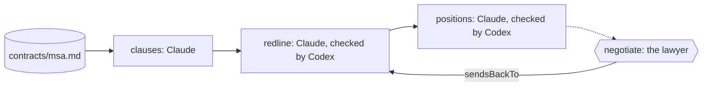

A supplier sends a master services agreement. Your side has a playbook:
what you accept, what you push back on and with what wording, and what you
never sign. Someone has to read every clause against it, write the
redlines, and decide what to hold and what to concede, before the lawyer's
hour.

You want every clause covered, not the ones a tired reader noticed. You
want redlines in the wording the playbook allows, no further, and a
negotiating note that says what a walk-away is. You want the lawyer to
decide what is sent, and nothing sent without them.

Obversa makes the playbook the brief and the lawyer a step. One model maps
every clause to the rule it meets or breaks, writes the redlines in the
playbook's wording, and writes the negotiating note. A model from another
family checks each redline against the playbook and fails the set when a
clause is missing or a redline goes further than its rule. Then the run
stops for the lawyer. This file is a four-stage team: clauses, redline,
positions, negotiate.

## Run it

Set the project up as [Installation](/get-started/installation) describes,
put `briefs/playbook.md` and `contracts/msa.md` from
`examples/use-cases/business/` beside the file, sign in to Claude Code and
Codex, and run it:

```bash Terminal
npx tsx contract-playbook.ts
```

Every event prints as one line as it happens, and the outcome prints last
as JSON. The output below is from one real run, trimmed at both ends. The
first seat on that machine also had a local search tool that this file
doesn't configure; those calls are cut, and your own run won't make them.

```text Events
contract-playbook ▸ dag (4 nodes)
contract-playbook · node clauses: start
contract-playbook › clauses • clauses
contract-playbook › clauses engine:thinking
contract-playbook › clauses engine:text
… 4 more event lines …
contract-playbook › clauses engine:thinking
contract-playbook › clauses engine:text
contract-playbook › clauses   tool Read use
contract-playbook › clauses   tool tool result
contract-playbook › clauses engine:thinking
contract-playbook › clauses engine:text
contract-playbook › clauses   tool Write use
contract-playbook › clauses   tool tool result
contract-playbook › clauses engine:thinking
contract-playbook › clauses   tool Bash use
… 128 more event lines …
contract-playbook › positions › positions-review   tool tool result
contract-playbook › positions › positions-review engine:thinking
contract-playbook › positions › positions-review engine:text
contract-playbook › positions › positions-review   claude-sonnet-4-5-20250929: 1544326/6105 tok
contract-playbook › positions › positions-review • positions: fail
contract-playbook › positions › positions-review · until met: positions writes: true
contract-playbook › positions › positions-review › review-panel • positions
contract-playbook › positions › positions-review › review-panel • positions-1
contract-playbook › positions › positions-review › review-panel engine:text
contract-playbook › positions › positions-review › review-panel   gpt-5.6-luna: 90370/1942 tok
contract-playbook › positions › positions-review › review-panel • positions-1: pass
contract-playbook › positions › positions-review › review-panel • positions: pass
contract-playbook › positions › positions-review · review: pass
contract-playbook › positions › positions-review ◂ pass (2 iter)
contract-playbook · node positions: done (pass)
contract-playbook · node negotiate: start
contract-playbook › negotiate • negotiate
contract-playbook › negotiate • negotiate: paused
contract-playbook · node negotiate: done (paused)
contract-playbook ◂ dag paused
```

```json Output
{
  "status": "paused",
  "summary": "waiting for a person: Send these redlines to the other side?",
  "data": {
    "clauses": {
      "status": "pass",
      "summary": "All 7 contract clauses reviewed against playbook. 1 accepted (governing law), 4 require pushback (term auto-renewal, payment terms and price increases, liability cap too low, data processing without proper controls), 2 are never-sign blockers (uncapped indemnity, exclusivity requirement)."
    },
    "redline": {
      "status": "pass",
      "summary": "Review panel: 1/1 reviewer(s) cleared."
    },
    "positions": {
      "status": "pass",
      "summary": "Review panel: 1/1 reviewer(s) cleared.",
      "data": {
        "response": "Done. Fixed all six issues in review/positions.md:\n\n**Changes made:**\n\n1. **Clause 1 (Term)** - line 30: Changed from allowing 45 days notice concession to requiring both renewal by written agreement AND 60 days notice with no concession.\n\n2. **Clause 2 (Payment)** - lines 35-39: Changed from allowing 21 days concession to requiring 30 days minimum with no concession.\n\n3. **Clause 2 (Price)** - lines 43-48: Changed from allowing 7% cap and 60 days notice to requiring 5% or CPI (whichever is lower) and 90 days notice with no concession.\n\n4. **Clause 3 (Liability)** - lines 52-57: Changed from allowing nine or six months concession to requiring twelve months with no concession.\n\n5. **Clause 5 (Data)** - lines 61-66: Changed from allowing 60 days deletion to requiring 30 days deletion with no concession.\n\n6. **Negotiation Strategy** - lines 70-76: Rewrote to state all six redlines are required as written with no middle ground, removing the previous strategy that suggested accepting concessions.\n\nAll positions now match playbook requirements exactly."
      }
    },
    "negotiate": {
      "status": "paused",
      "summary": "waiting for a person: Send these redlines to the other side?",
      "data": {
        "requestId": "negotiate#1#8cf706409cc45450f55cea668f1ab7a7c224e4efb2740004a63b091e92c22264",
        "gateId": "negotiate",
        "gateVersion": 1,
        "digest": "8cf706409cc45450f55cea668f1ab7a7c224e4efb2740004a63b091e92c22264",
        "decisionText": "Send these redlines to the other side?",
        "responseSchema": {
          "type": "object",
          "properties": {
            "approved": {
              "type": "boolean"
            },
            "note": {
              "type": "string"
            }
          },
          "required": [
            "approved"
          ]
        },
        "input": {
          "positions": "Review panel: 1/1 reviewer(s) cleared."
        },
        "presentation": {}
      }
    }
  }
}
```

The run stopped at `negotiate` with the redlines and the positions in
`review/`, waiting for the lawyer. A no goes to `redline` with the lawyer's
note as the finding.

## The file

Write every rule you want applied in `briefs/playbook.md`. Everything a seat
knows about what's acceptable comes from that file, and only the rules
written there are applied. `files: ["contracts/msa.md"]` in the brief's
front matter names the contract as a workspace file: every seat knows it
exists, and the `review` seat may not write it.

```ts examples/use-cases/business/contract-playbook.ts (excerpt) {2-4}
    roles: {
      review: engines.claude('claude-sonnet-4-5'),
      'playbook-check': [engines.codex('gpt-5.6-luna')],
      lawyer: person('Send these redlines to the other side?'),
    },
```

The clause list has no reviewer, so only its own seat judges whether every
clause is on it. The redlines and the negotiating note are each checked by
the Codex seat, with three attempts to meet:

```ts examples/use-cases/business/contract-playbook.ts (excerpt) {6-7,15,20,24,27}
      stage('redline', {
        agent: 'review',
        writes: 'review/redlines.md',
        desc: 'For each clause that breaks a rule, write the replacement wording the playbook allows, with the rule it comes from.',
        gate: 'Every breaking clause has a redline, no redline goes further than its rule, and a checker from another family has accepted the set.',
        reviewedBy: 'playbook-check',
        retry: 3,
      }),

      stage('positions', {
        agent: 'review',
        writes: 'review/positions.md',
        desc: 'Write the negotiating note: what to hold, what to concede and to what, and what is a walk-away.',
        gate: 'Every redline has a position, and a reviewer from another family has accepted them.',
        reviewedBy: 'playbook-check',
        // Three attempts: the allowance matches how open-ended the work is.
        // Deciding what to hold, what to concede and what is a walk-away is
        // the most judgement-heavy step here, and it had none while listing
        // clauses had three.
        retry: 3,
      }),

      stage('negotiate', {
        input: 'lawyer',
        desc: 'Put the redlines and the positions in front of the lawyer.',
        gate: 'The lawyer has decided.',
        sendsBackTo: 'redline',
      }),
```

The "done when" sentences are each stage's `gate`. The package doesn't
check them itself; it checks what each stage declares. A file in `writes`
that's missing or empty fails the stage, a reviewed stage passes only when
its reviewer accepts, and a person stage pauses until the person answers.

<Accordion title="Full file">

```ts examples/use-cases/business/contract-playbook.ts
import { claude } from '@obversa/engine-claude-cli';
import { codex } from '@obversa/engine-codex-cli';
import {
  briefFromFile,
  formatEvent,
  person,
  run,
  stage,
  workflow,
  type TeamSeat,
} from '@obversa/runtime';

interface ContractPlaybookEngines {
  readonly claude: (model: string) => TeamSeat;
  readonly codex: (model: string) => TeamSeat;
}

const realEngines: ContractPlaybookEngines = { claude, codex };

/**
 * Contract review against a playbook. The brief is the playbook: what we
 * accept, what we push back on, what we never sign. One model maps every
 * clause of the contract to the rule it meets or breaks, writes the
 * redlines, and is read by a model from another family that checks each
 * redline against the playbook and returns the work when one is missing
 * or goes further than the playbook allows. A lawyer decides what is sent.
 */
function createContractPlaybook(engines: ContractPlaybookEngines = realEngines) {
  return workflow('contract-playbook', {
    brief: briefFromFile('briefs/playbook.md'),
    options: { timeout: '15m' },

    roles: {
      review: engines.claude('claude-sonnet-4-5'),
      'playbook-check': [engines.codex('gpt-5.6-luna')],
      lawyer: person('Send these redlines to the other side?'),
    },

    stages: [
      stage('clauses', {
        agent: 'review',
        writes: 'review/clauses.md',
        desc: 'Read contracts/msa.md and list every clause with the playbook rule it meets or breaks, one line each.',
        gate: 'Every numbered clause of the contract is on the list.',
      }),

      stage('redline', {
        agent: 'review',
        writes: 'review/redlines.md',
        desc: 'For each clause that breaks a rule, write the replacement wording the playbook allows, with the rule it comes from.',
        gate: 'Every breaking clause has a redline, no redline goes further than its rule, and a checker from another family has accepted the set.',
        reviewedBy: 'playbook-check',
        retry: 3,
      }),

      stage('positions', {
        agent: 'review',
        writes: 'review/positions.md',
        desc: 'Write the negotiating note: what to hold, what to concede and to what, and what is a walk-away.',
        gate: 'Every redline has a position, and a reviewer from another family has accepted them.',
        reviewedBy: 'playbook-check',
        // Three attempts: the allowance matches how open-ended the work is.
        // Deciding what to hold, what to concede and what is a walk-away is
        // the most judgement-heavy step here, and it had none while listing
        // clauses had three.
        retry: 3,
      }),

      stage('negotiate', {
        input: 'lawyer',
        desc: 'Put the redlines and the positions in front of the lawyer.',
        gate: 'The lawyer has decided.',
        sendsBackTo: 'redline',
      }),
    ],
  });
}

const result = await run(createContractPlaybook(), {
  onEvent: (event) => console.log(formatEvent(event)),
});
console.log(JSON.stringify(result.outcome, null, 2));
```

</Accordion>

## The team's shape



## Next steps

- [A person decides](/patterns/approval): the lawyer's question as a step,
  and how the answer reaches a paused run.
- [A writer and a reviewer](/patterns/writer-and-reviewer): the writer and
  checker pair on its own.
- [Workflows](/concepts/workflows): the brief as the order, and what
  travels with it.
