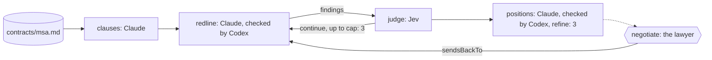

A supplier sends a master services agreement. Your side has a playbook:
what you accept, what you push back on and with what wording, and what you
never sign. Someone has to read every clause against it, write the
redlines, and decide what to hold and what to concede, before the lawyer's
hour.

You want every clause covered, not the ones a tired reader noticed. You
want redlines in the wording the playbook allows, no further, and a
negotiating note that says what a walk-away is. You want the lawyer to
decide what is sent, and nothing sent without them.

Obversa makes the playbook the brief and the lawyer a step. One model maps
every clause to the rule it meets or breaks, writes the redlines in the
playbook's wording, and writes the negotiating note. A model from another
family checks each redline against the playbook and fails the set when a
clause is missing or a redline goes further than its rule. A judge, Jev,
says when another round on the redlines is worth it, up to a cap of three.
Then the run stops for the lawyer. This file is a four-stage team: clauses,
redline, positions, negotiate.

## Run it

Set the project up as [Installation](/get-started/installation) describes,
put `briefs/playbook.md`, `contracts/msa.md` and `judge.json` from
`examples/use-cases/business/` beside the file, sign in to Claude Code and
Codex, and run it. Without `JUDGE=jev` the judge replays the answers in
`judge.json`; with it, and a TypeSafe endpoint and key in the environment,
the judge is Jev:

```bash Terminal
npx tsx contract-playbook.ts
```

Every event prints as one line as it happens, and the outcome prints last
as JSON. The output below is the proof's offline run, with scripted seats
standing in for the models and a recorded judge, so the words are the
script's and the shape is the run's:

```text Output, from the offline proof
▸ run
contract-playbook workflow:start
contract-playbook ▸ dag (4 nodes)
contract-playbook · node clauses: start
contract-playbook › clauses • clauses

contract-playbook › clauses   stand-in: 3/1 tok
contract-playbook › clauses • clauses: pass  seven clauses mapped: one accept, four push back, two never
contract-playbook · node clauses: done (pass)
contract-playbook · node redline: start
contract-playbook › redline › redline-review ▸ loop (max 4)
contract-playbook › redline › redline-review · iteration 1
contract-playbook › redline › redline-review • redline

contract-playbook › redline › redline-review   stand-in: 3/1 tok
contract-playbook › redline › redline-review • redline: pass  four redlines written from the playbook wording
contract-playbook › redline › redline-review · until met: redline writes: true
contract-playbook › redline › redline-review › review-panel • redline
contract-playbook › redline › redline-review › review-panel • redline-1

contract-playbook › redline › redline-review › review-panel   gpt-5.6-luna: 42/7 tok
contract-playbook › redline › redline-review › review-panel • redline-1: fail  two never-sign clauses have no redline
contract-playbook › redline › redline-review › review-panel • redline: fail  Review panel: 0/1 reviewer(s) cleared. - redline-1 [block]: clause 4 (uncapped indemnity) is marked never in clauses.md and absent from redlines.md - redline-1 [block]: clause 6 (exclusivity) is marked never and absent
contract-playbook › redline › redline-review · review: fail
review did not pass (Review panel: 0/1 reviewer(s) cleared. - redline-1 [block]: clause 4 (uncapped indemnity) is marked never in clauses.md and absent from redlines.md - redline-1 [block]: clause 6 (exclusivity) is marked never and absent); re-entering redline-review
contract-playbook › redline › redline-review · iteration 2
contract-playbook › redline › redline-review • redline

contract-playbook › redline › redline-review   stand-in: 3/1 tok
contract-playbook › redline › redline-review • redline: pass  six redlines: the two never-sign clauses are struck with a fallback offered on the indemnity
contract-playbook › redline › redline-review · until met: redline writes: true
contract-playbook › redline › redline-review › review-panel • redline
contract-playbook › redline › redline-review › review-panel • redline-1

contract-playbook › redline › redline-review › review-panel   gpt-5.6-luna: 42/7 tok
contract-playbook › redline › redline-review › review-panel • redline-1: fail  one redline could be tighter
contract-playbook › redline › redline-review › review-panel • redline: fail  Review panel: 0/1 reviewer(s) cleared. - redline-1 [should-fix]: clause 3: the fallback sentence on the liability redline could go; the twelve-month term already meets the rule
contract-playbook › redline › redline-review › refine-judge • refine:judge

contract-playbook › redline › redline-review › refine-judge   jev-latest: 10/5 tok
contract-playbook › redline › redline-review › refine-judge • refine:judge: pass  {"holds":{"type":"noul","noul":0.9},"worth_doing":{"type":"noul","noul":0.2},"worth_another_round":{"type":"noul","noul":0.1},"stop_reason":{"type":"choice","choice":"holds","confidence":0.8}}
contract-playbook › redline › redline-review ◆ the judge chose holds
contract-playbook › redline › redline-review · review: pass
contract-playbook › redline › redline-review ◂ pass (2 iter)
contract-playbook · node redline: done (pass)
contract-playbook · node positions: start
contract-playbook › positions › positions-review ▸ loop (max 4)
contract-playbook › positions › positions-review · iteration 1
contract-playbook › positions › positions-review • positions

contract-playbook › positions › positions-review   stand-in: 3/1 tok
contract-playbook › positions › positions-review • positions: pass  positions written: two walk-aways, two concessions
contract-playbook › positions › positions-review · until met: positions writes: true
contract-playbook › positions › positions-review › review-panel • positions
contract-playbook › positions › positions-review › review-panel • positions-1

contract-playbook › positions › positions-review › review-panel   gpt-5.6-luna: 42/7 tok
contract-playbook › positions › positions-review › review-panel • positions-1: pass  every redline has a position, and the two walk-aways match the never-sign rules
contract-playbook › positions › positions-review › review-panel • positions: pass  Review panel: 1/1 reviewer(s) cleared.
contract-playbook › positions › positions-review · review: pass
contract-playbook › positions › positions-review ◂ pass (1 iter)
contract-playbook · node positions: done (pass)
contract-playbook · node negotiate: start
contract-playbook › negotiate • negotiate
contract-playbook › negotiate • negotiate: paused  waiting for a person: Send these redlines to the other side?
contract-playbook · node negotiate: done (paused)
contract-playbook ◂ dag paused
◂ run paused (148/30 tok, 90 tok from cache)
{
  "status": "paused",
  "summary": "waiting for a person: Send these redlines to the other side?",
  "data": {
    "clauses": {
      "status": "pass",
      "summary": "seven clauses mapped: one accept, four push back, two never"
    },
    "redline": {
      "status": "pass",
      "summary": "the judge chose holds"
    },
    "positions": {
      "status": "pass",
      "summary": "Review panel: 1/1 reviewer(s) cleared."
    },
    "negotiate": {
      "status": "paused",
      "summary": "waiting for a person: Send these redlines to the other side?",
      "data": {
        "requestId": "negotiate#1#8cf706409cc45450f55cea668f1ab7a7c224e4efb2740004a63b091e92c22264",
        "gateId": "negotiate",
        "gateVersion": 1,
        "digest": "8cf706409cc45450f55cea668f1ab7a7c224e4efb2740004a63b091e92c22264",
        "decisionText": "Send these redlines to the other side?",
        "responseSchema": {
          "type": "object",
          "properties": {
            "approved": {
              "type": "boolean"
            },
            "note": {
              "type": "string"
            }
          },
          "required": [
            "approved"
          ]
        },
        "input": {
          "positions": "Review panel: 1/1 reviewer(s) cleared."
        },
        "presentation": {}
      }
    }
  }
}
```

Seven clauses mapped, two rounds of redlines, one answer from the judge.
The first set of redlines left out the two clauses the playbook never
signs; the checker tagged that a block, and the set went back without the
judge being asked, because a block always does. The second set covered
every clause and drew one taste note, and the judge said the redlines hold.
The negotiating note passed its check first time. The run stopped at
`negotiate` with the redlines and the positions in `review/`, waiting for
the lawyer. A no goes to `redline` with the lawyer's note as the finding.

## The file

Write every rule you want applied in `briefs/playbook.md`. Everything a seat
knows about what's acceptable comes from that file, and only the rules
written there are applied. `files: ["contracts/msa.md"]` in the brief's
front matter names the contract as a workspace file: every seat knows it
exists, and the `review` seat may not write it.

```ts examples/use-cases/business/contract-playbook.ts (excerpt) {2-4}
    roles: {
      review: engines.claude('claude-sonnet-4-5'),
      'playbook-check': [engines.codex('gpt-5.6-luna')],
      lawyer: person('Send these redlines to the other side?'),
    },
```

The clause list has no reviewer, so only its own seat judges whether every
clause is on it. The redlines and the negotiating note are each checked by
the Codex seat. On the redlines, `refine: judge(jev, { cap: 3 })` asks the
judge whether another round is worth it each time the checker fails the
set, with the cap as the backstop; the negotiating note keeps a plain count
of three, so the two shapes sit side by side:

```ts examples/use-cases/business/contract-playbook.ts (excerpt) {6,11,19,24,31}
      stage('redline', {
        agent: 'review',
        writes: 'review/redlines.md',
        desc: 'For each clause that breaks a rule, write the replacement wording the playbook allows, with the rule it comes from.',
        gate: 'Every breaking clause has a redline, no redline goes further than its rule, and a checker from another family has accepted the set.',
        reviewedBy: 'playbook-check',
        // The judge. After a round the checker did not pass, Jev reads the
        // findings and the rounds so far and says whether another round is
        // worth it; a finding tagged block goes back without asking. The
        // cap is the backstop: three rounds at most, whatever the judge says.
        refine: judge(jev, { cap: 3 }),
      }),

      stage('positions', {
        agent: 'review',
        writes: 'review/positions.md',
        desc: 'Write the negotiating note: what to hold, what to concede and to what, and what is a walk-away.',
        gate: 'Every redline has a position, and a reviewer from another family has accepted them.',
        reviewedBy: 'playbook-check',
        // Three attempts: the allowance matches how open-ended the work is.
        // Deciding what to hold, what to concede and what is a walk-away is
        // the most judgement-heavy step here, and it had none while listing
        // clauses had three.
        refine: 3,
      }),

      stage('negotiate', {
        input: 'lawyer',
        desc: 'Put the redlines and the positions in front of the lawyer.',
        gate: 'The lawyer has decided.',
        sendsBackTo: 'redline',
      }),
```

The "done when" sentences are each stage's `gate`. The package doesn't
check them itself; it checks what each stage declares. A file in `writes`
that's missing or empty fails the stage, a reviewed stage passes only when
its reviewer accepts, and a person stage pauses until the person answers.

<Accordion title="Full file">

```ts examples/use-cases/business/contract-playbook.ts
import { readFile } from 'node:fs/promises';

import { claude } from '@obversa/engine-claude-cli';
import { codex } from '@obversa/engine-codex-cli';
import { JevApiEngine } from '@obversa/engine-jev-api';
import {
  briefFromFile,
  finalResultPart,
  formatEvent,
  judge,
  person,
  run,
  stage,
  workflow,
  type Engine,
  type JudgeAnswer,
  type TeamSeat,
} from '@obversa/runtime';
import { MockEngine } from '@obversa/runtime/testing';

interface ContractPlaybookEngines {
  readonly claude: (model: string) => TeamSeat;
  readonly codex: (model: string) => TeamSeat;
}

const realEngines: ContractPlaybookEngines = { claude, codex };

/**
 * The judge that decides whether the redlines go round again: Jev over the
 * TypeSafe API when JUDGE=jev, otherwise the answers recorded in judge.json
 * beside the brief, one set per round, so the file runs offline. Jev answers
 * with a structured part and a stage wants text, so the seat wraps the
 * answers as JSON.
 */
async function judgeSeat(): Promise<TeamSeat> {
  const identity = { adapter: 'jev-api', provider: 'typesafe', modelFamily: 'jev', model: 'jev-latest', tools: [] };
  if (process.env.JUDGE === 'jev') {
    const endpoint = process.env.TYPESAFE_ENDPOINT;
    const apiKey = process.env.TYPESAFE_API_KEY;
    if (!endpoint || !apiKey) throw new Error('JUDGE=jev needs TYPESAFE_ENDPOINT and TYPESAFE_API_KEY');
    const api = new JevApiEngine({ endpoint, apiKey });
    const engine = {
      name: 'jev-api',
      async run(request, onEvent, signal) {
        const result = await api.run(request, onEvent, signal);
        const part = finalResultPart(result);
        return part.kind === 'structured' ? { ...result, parts: [{ kind: 'assistant', text: JSON.stringify(part.value), final: true }] } : result;
      },
    } as Engine;
    return { engine, identity };
  }
  const answers = JSON.parse(await readFile('judge.json', 'utf8')) as Record<string, JudgeAnswer>[];
  let round = 0;
  return { engine: new MockEngine(() => JSON.stringify(answers[Math.min(round++, answers.length - 1)])), identity: { ...identity, adapter: 'recorded' } };
}

/**
 * Contract review against a playbook. The brief is the playbook: what we
 * accept, what we push back on, what we never sign. One model maps every
 * clause of the contract to the rule it meets or breaks, writes the
 * redlines, and is read by a model from another family that checks each
 * redline against the playbook and returns the work when one is missing
 * or goes further than the playbook allows. A lawyer decides what is sent.
 */
function createContractPlaybook(jev: TeamSeat, engines: ContractPlaybookEngines = realEngines) {
  return workflow('contract-playbook', {
    brief: briefFromFile('briefs/playbook.md'),
    options: { timeout: '15m' },

    roles: {
      review: engines.claude('claude-sonnet-4-5'),
      'playbook-check': [engines.codex('gpt-5.6-luna')],
      lawyer: person('Send these redlines to the other side?'),
    },

    stages: [
      stage('clauses', {
        agent: 'review',
        writes: 'review/clauses.md',
        desc: 'Read contracts/msa.md and list every clause with the playbook rule it meets or breaks, one line each.',
        gate: 'Every numbered clause of the contract is on the list.',
      }),

      stage('redline', {
        agent: 'review',
        writes: 'review/redlines.md',
        desc: 'For each clause that breaks a rule, write the replacement wording the playbook allows, with the rule it comes from.',
        gate: 'Every breaking clause has a redline, no redline goes further than its rule, and a checker from another family has accepted the set.',
        reviewedBy: 'playbook-check',
        // The judge. After a round the checker did not pass, Jev reads the
        // findings and the rounds so far and says whether another round is
        // worth it; a finding tagged block goes back without asking. The
        // cap is the backstop: three rounds at most, whatever the judge says.
        refine: judge(jev, { cap: 3 }),
      }),

      stage('positions', {
        agent: 'review',
        writes: 'review/positions.md',
        desc: 'Write the negotiating note: what to hold, what to concede and to what, and what is a walk-away.',
        gate: 'Every redline has a position, and a reviewer from another family has accepted them.',
        reviewedBy: 'playbook-check',
        // Three attempts: the allowance matches how open-ended the work is.
        // Deciding what to hold, what to concede and what is a walk-away is
        // the most judgement-heavy step here, and it had none while listing
        // clauses had three.
        refine: 3,
      }),

      stage('negotiate', {
        input: 'lawyer',
        desc: 'Put the redlines and the positions in front of the lawyer.',
        gate: 'The lawyer has decided.',
        sendsBackTo: 'redline',
      }),
    ],
  });
}

const result = await run(createContractPlaybook(await judgeSeat()), {
  onEvent: (event) => console.log(formatEvent(event)),
  recordTo: 'records/contract-playbook.jsonl',
});
console.log(JSON.stringify(result.outcome, null, 2));
```

</Accordion>

## The team's shape


```mermaid
flowchart LR
  msa[("contracts/msa.md")] --> clauses["clauses: Claude"]
  clauses --> redline["redline: Claude, checked by Codex"]
  redline -->|findings| judge["judge: Jev"]
  judge -->|"continue, up to cap: 3"| redline
  judge --> positions["positions: Claude, checked by Codex, refine: 3"]
  positions -.-> negotiate{{"negotiate: the lawyer"}}
  negotiate -->|sendsBackTo| redline
```

## When the loop stops

Two rules end the redline rounds, and the run shows both. A finding the
checker tags block, here a never-sign clause with no redline, goes back to
the writer on its own; the judge is not asked, because a block is never a
matter of judgement. When the checker fails the set with lesser findings,
the judge reads the use case from the brief, the findings and every round
so far, and says whether another round is worth it. The loop goes round
again on continue and stops when the judge chooses a reason to stop. The
cap of three stands whatever the judge says. The judge's recorded answer
for the offline run is in `judge.json`.
[A judge stops the loop](/patterns/judge-stops-the-loop) has the questions
and the rule.

## Next steps

- [A person decides](/patterns/approval): the lawyer's question as a step,
  and how the answer reaches a paused run.
- [A judge stops the loop](/patterns/judge-stops-the-loop): the judge's
  questions, and the same loop as plain graph nodes.
- [A writer and a reviewer](/patterns/writer-and-reviewer): the writer and
  checker pair on its own.
