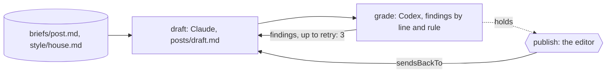

A post has to go out on the company page this week. It has a brief, a
house style with six rules, and one editor who says what is published.
Most first drafts break a rule or two: a superlative slips in, a number
appears that nobody gave. Catching those is a grader's job, and it is
tedious for the editor to do by hand every time.

You want the draft written and then read against the rules by someone who
didn't write it, with each finding naming the line and the rule. You want
the writer to go again with those findings, and you want a limit, so a
draft that never holds stops the run rather than looping. And you want the
editor's decision to be the only thing that publishes.

Obversa makes the grader a stage and the limit a number. A Claude seat
writes the draft. A Codex seat, a different model family, reads it against
the style guide and returns findings; the draft goes back to the writer,
who runs again, up to three times. When a draft holds, the run stops for
the editor's yes. This file is two stages, a draft with its grader and the
editor's decision, and every draft and every finding is on the record.

## Run it

Set the project up as [Installation](/get-started/installation) describes.
Copy the file with `briefs/` and `style/` beside it, sign in to Claude Code
and Codex, and run it from that directory:

```bash Terminal
npx tsx writer-grader-cap.ts
```

The output below is the proof's offline run, with scripted seats standing
in for the models, so the words are the script's and the shape is the run's.

```text Output, from the offline proof
▸ run
writer-grader-cap workflow:start
writer-grader-cap ▸ dag (2 nodes)
writer-grader-cap · node draft: start
writer-grader-cap › draft › draft-review ▸ loop (max 4)
writer-grader-cap › draft › draft-review · iteration 1
writer-grader-cap › draft › draft-review • draft
writer-grader-cap › draft › draft-review engine:text
writer-grader-cap › draft › draft-review   stand-in: 3/1 tok
writer-grader-cap › draft › draft-review • draft: pass
writer-grader-cap › draft › draft-review · until met: draft writes: true
writer-grader-cap › draft › draft-review › review-panel • draft
writer-grader-cap › draft › draft-review › review-panel • draft-1
writer-grader-cap › draft › draft-review › review-panel engine:text
writer-grader-cap › draft › draft-review › review-panel   gpt-5.6-luna: 42/7 tok
writer-grader-cap › draft › draft-review › review-panel • draft-1: fail
writer-grader-cap › draft › draft-review › review-panel • draft: fail
writer-grader-cap › draft › draft-review · review: fail
review did not pass (Review panel: 0/1 reviewer(s) cleared. - draft-1 [block]: line 1: "the best in the business" breaks rule 3, no superlatives); re-entering draft-review
writer-grader-cap › draft › draft-review · iteration 2
writer-grader-cap › draft › draft-review • draft
writer-grader-cap › draft › draft-review engine:text
writer-grader-cap › draft › draft-review   stand-in: 3/1 tok
writer-grader-cap › draft › draft-review • draft: pass
writer-grader-cap › draft › draft-review · until met: draft writes: true
writer-grader-cap › draft › draft-review › review-panel • draft
writer-grader-cap › draft › draft-review › review-panel • draft-1
writer-grader-cap › draft › draft-review › review-panel engine:text
writer-grader-cap › draft › draft-review › review-panel   gpt-5.6-luna: 42/7 tok
writer-grader-cap › draft › draft-review › review-panel • draft-1: fail
writer-grader-cap › draft › draft-review › review-panel • draft: fail
writer-grader-cap › draft › draft-review · review: fail
review did not pass (Review panel: 0/1 reviewer(s) cleared. - draft-1 [block]: line 3: "40 percent" breaks rule 4; the brief gives no number); re-entering draft-review
writer-grader-cap › draft › draft-review · iteration 3
writer-grader-cap › draft › draft-review • draft
writer-grader-cap › draft › draft-review engine:text
writer-grader-cap › draft › draft-review   stand-in: 3/1 tok
writer-grader-cap › draft › draft-review • draft: pass
writer-grader-cap › draft › draft-review · until met: draft writes: true
writer-grader-cap › draft › draft-review › review-panel • draft
writer-grader-cap › draft › draft-review › review-panel • draft-1
writer-grader-cap › draft › draft-review › review-panel engine:text
writer-grader-cap › draft › draft-review › review-panel   gpt-5.6-luna: 42/7 tok
writer-grader-cap › draft › draft-review › review-panel • draft-1: pass
writer-grader-cap › draft › draft-review › review-panel • draft: pass
writer-grader-cap › draft › draft-review · review: pass
writer-grader-cap › draft › draft-review ◂ pass (3 iter)
writer-grader-cap · node draft: done (pass)
writer-grader-cap · node publish: start
writer-grader-cap › publish • publish
writer-grader-cap › publish • publish: paused
writer-grader-cap · node publish: done (paused)
writer-grader-cap ◂ dag paused
◂ run paused (135/24 tok, 90 tok from cache)
{
  "status": "paused",
  "summary": "waiting for a person: Publish this post?",
  "data": {
    "draft": {
      "status": "pass",
      "summary": "Review panel: 1/1 reviewer(s) cleared."
    },
    "publish": {
      "status": "paused",
      "summary": "waiting for a person: Publish this post?",
      "data": {
        "requestId": "publish#1#a4bb457d99ba0bf3eef78f58571176ec8007dc105adc11756d472342f431ccff",
        "gateId": "publish",
        "gateVersion": 1,
        "digest": "a4bb457d99ba0bf3eef78f58571176ec8007dc105adc11756d472342f431ccff",
        "decisionText": "Publish this post?",
        "responseSchema": {
          "type": "object",
          "properties": {
            "approved": {
              "type": "boolean"
            },
            "note": {
              "type": "string"
            }
          },
          "required": [
            "approved"
          ]
        },
        "input": {
          "draft": "Review panel: 1/1 reviewer(s) cleared."
        },
        "presentation": {}
      }
    }
  }
}
```

Three drafts, two rounds of findings, one editor's question. The first
draft called the review "the best in the business", and the grader named
the line and the rule against superlatives. The second draft explained the
loop and added a number the brief never gave, and the grader named that.
The third held against every rule, and the run stopped for the editor.
Nothing was published.

## The file

The brief names the post, the style guide, the grader's job and the
editor's:

```text briefs/post.md
---
files: ["style/house.md"]
---

# One post for the company page

Write `posts/draft.md`: a post for the company page about why the team
reviews every change with a second model before a person reads it. Under
200 words. Follow `style/house.md`.

The grader reads the draft against the style guide and the brief, and
returns findings, each naming the line and the rule it breaks. The writer
runs again with the findings, up to the limit the file sets. A grader that
passes a draft is saying it holds against every rule, not that it likes it.

The editor decides whether the post is published. Nothing is published by
anyone else.
```

The style guide is what the grader reads against, one rule per line:

```text style/house.md
# House style

1. One idea per sentence. No sentence over 25 words.
2. Say what the reader gets before how it works.
3. No superlatives: never "best", "fastest", "revolutionary", "seamless".
4. No numbers that aren't in the brief.
5. Name the tools people know: Claude Code, Codex. Never "AI agents".
6. End with one plain sentence the reader can act on.
```

The whole team is one `workflow()`: two roles from different model
families, an editor, and two stages:

```ts examples/use-cases/editorial/writer-grader-cap.ts (excerpt) {5-8,15-16,21,24-28}
  return workflow('writer-grader-cap', {
    brief: briefFromFile('briefs/post.md'),
    options: { timeout: '10m' },

    roles: {
      write: engines.claude('claude-sonnet-4-5'),
      grade: [engines.codex('gpt-5.6-luna')],
      editor: person('Publish this post?'),
    },

    stages: [
      stage('draft', {
        agent: 'write',
        writes: 'posts/draft.md',
        desc: 'Write the post from the brief, in the house style.',
        gate: 'The draft holds against every rule in style/house.md, as read by a grader from another model family.',
        reviewedBy: 'grade',
        // The limit. A draft that has not passed after three tries ends
        // the run with the grader's last findings, and the editor is not
        // asked. Raise it for a longer piece; lower it for a caption.
        retry: 3,
      }),

      stage('publish', {
        input: 'editor',
        desc: 'Put the graded draft in front of the editor.',
        gate: 'The editor has said publish.',
        sendsBackTo: 'draft',
      }),
    ],
  });
```

`reviewedBy: 'grade'` puts the Codex seat on every draft, and a rejection
runs the `draft` stage again with the findings in hand. `retry: 3` is the
limit: a draft that has not passed after three tries ends the run with the
grader's last findings, and the editor is never asked. `workflow()` refuses
the team before any model runs if the writer and the grader share a family.
The `publish` stage is the editor's question; a no goes to `draft` with the
editor's note as the finding.

<Accordion title="Full file">

```ts examples/use-cases/editorial/writer-grader-cap.ts
import { execFileSync } from 'node:child_process';
import { existsSync } from 'node:fs';

import { claude } from '@obversa/engine-claude-cli';
import { codex } from '@obversa/engine-codex-cli';
import {
  briefFromFile,
  formatEvent,
  person,
  run,
  stage,
  workflow,
  type TeamSeat,
} from '@obversa/runtime';

interface EditorialEngines {
  readonly claude: (model: string) => TeamSeat;
  readonly codex: (model: string) => TeamSeat;
}

const realEngines: EditorialEngines = { claude, codex };

/**
 * A writer, a strict grader from another model family, a limit, and an
 * editor. The writer drafts the post. The grader reads it against the house
 * style and returns findings that name the line and the rule; the writer
 * runs again with them. The limit says how many times. When the grader
 * passes the draft, the run stops for the editor, who decides whether it
 * is published. A draft the grader never passes ends the run with the last
 * findings, and nothing is published.
 */
function createEditorial(engines: EditorialEngines = realEngines) {
  return workflow('writer-grader-cap', {
    brief: briefFromFile('briefs/post.md'),
    options: { timeout: '10m' },

    roles: {
      write: engines.claude('claude-sonnet-4-5'),
      grade: [engines.codex('gpt-5.6-luna')],
      editor: person('Publish this post?'),
    },

    stages: [
      stage('draft', {
        agent: 'write',
        writes: 'posts/draft.md',
        desc: 'Write the post from the brief, in the house style.',
        gate: 'The draft holds against every rule in style/house.md, as read by a grader from another model family.',
        reviewedBy: 'grade',
        // The limit. A draft that has not passed after three tries ends
        // the run with the grader's last findings, and the editor is not
        // asked. Raise it for a longer piece; lower it for a caption.
        retry: 3,
      }),

      stage('publish', {
        input: 'editor',
        desc: 'Put the graded draft in front of the editor.',
        gate: 'The editor has said publish.',
        sendsBackTo: 'draft',
      }),
    ],
  });
}

// The review loop watches what changed in the worktree between drafts, so
// the folder is a Git repository. A folder that isn't one yet becomes one.
if (!existsSync('.git')) {
  const git = (...args: string[]) => execFileSync('git', ['-c', 'user.name=editorial', '-c', 'user.email=editorial@example.invalid', ...args], { stdio: 'ignore' });
  git('init', '-q');
  git('add', '-A');
  git('commit', '-q', '-m', 'the brief and the house style');
}

const result = await run(createEditorial(), {
  onEvent: (event) => console.log(formatEvent(event)),
});
console.log(JSON.stringify(result.outcome, null, 2));
```

</Accordion>

## The team's shape



## What the run did

The proof runs the file against scripted seats and checks the loop the
page describes: three writer turns, three grader reads, the superlative and
the invented number gone from the draft on disk, and the run stopped at
the editor. Obversa recorded the run as one event log, so it shows each
draft, each set of findings, and the grader's pass in order, with the
grader's reasons on the record for the editor to read.

The limit is what makes the loop safe to leave running. Without it a
writer and a strict grader can go round for as long as the budget lasts.
With it, the third refusal is the run's end and the editor sees the last
findings instead of a post. Choose the number for the piece: three suits a
short post; a long feature may need more.

## Next steps

- [A writer and a reviewer](/patterns/writer-and-reviewer): the same pair
  on code, with a real run.
- [Feedback loops](/concepts/feedback-loops): the findings, the limit and
  the other shapes a review can take.
- [A person decides](/patterns/approval): the editor's question, and how
  an answer reaches a paused run.
