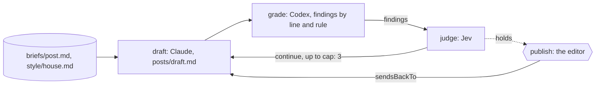

A post has to go out on the company page this week. It has a brief, a
house style with six rules, and one editor who says what is published.
Most first drafts break a rule or two: a superlative slips in, a number
appears that nobody gave. Catching those is a grader's job, and it is
tedious for the editor to do by hand every time.

You want the draft written and then read against the rules by someone who
didn't write it, with each finding naming the line and the rule. You want
the writer to go again with those findings, but not for ever: someone has
to say when the draft is good enough for a company page and another round
has stopped being worth it. And you want the editor's decision to be the
only thing that publishes.

Obversa makes the grader a stage and the stopping rule a judge. A Claude
seat writes the draft. A Codex seat, a different model family, reads it
against the style guide and returns findings; the writer runs again with
them. After each round, Jev, a small decision model, reads the findings and
the rounds so far and says whether another round is worth it, with a cap
of three as the backstop. When the draft holds, the run stops for the
editor's yes. This file is two stages, a draft with its grader and the
editor's decision, and every draft, every finding and every answer from the
judge is on the record.

## Run it

Set the project up as [Installation](/get-started/installation) describes.
Copy the file with `briefs/`, `style/` and `judge.json` beside it, sign in
to Claude Code and Codex, and run it from that directory. Without
`JUDGE=jev` the judge replays the answers in `judge.json`; with it, and a
TypeSafe endpoint and key in the environment, the judge is Jev:

```bash Terminal
npx tsx writer-grader-cap.ts
```

The output below is the proof's offline run, with scripted seats standing
in for the models, so the words are the script's and the shape is the run's.

```text Output, from the offline proof
▸ run
writer-grader-cap workflow:start
writer-grader-cap ▸ dag (2 nodes)
writer-grader-cap · node draft: start
writer-grader-cap › draft › draft-review ▸ loop (max 4)
writer-grader-cap › draft › draft-review · iteration 1
writer-grader-cap › draft › draft-review • draft

writer-grader-cap › draft › draft-review   stand-in: 3/1 tok
writer-grader-cap › draft › draft-review • draft: pass  draft written
writer-grader-cap › draft › draft-review · until met: draft writes: true
writer-grader-cap › draft › draft-review › review-panel • draft
writer-grader-cap › draft › draft-review › review-panel • draft-1

writer-grader-cap › draft › draft-review › review-panel   gpt-5.6-luna: 42/7 tok
writer-grader-cap › draft › draft-review › review-panel • draft-1: fail  one rule broken
writer-grader-cap › draft › draft-review › review-panel • draft: fail  Review panel: 0/1 reviewer(s) cleared. - draft-1 [should-fix]: line 1: "the best in the business" breaks rule 3, no superlatives
writer-grader-cap › draft › draft-review › refine-judge • refine:judge

writer-grader-cap › draft › draft-review › refine-judge   jev-latest: 10/5 tok
writer-grader-cap › draft › draft-review › refine-judge • refine:judge: pass  {"holds":{"type":"noul","noul":0.2},"worth_doing":{"type":"noul","noul":0.8},"worth_another_round":{"type":"noul","noul":0.72},"stop_reason":{"type":"choice","choice":"continue","confidence":0.6}}
writer-grader-cap › draft › draft-review ◆ the judge says another round is worth it (0.72)
writer-grader-cap › draft › draft-review · review: fail
review did not pass (Review panel: 0/1 reviewer(s) cleared. - draft-1 [should-fix]: line 1: "the best in the business" breaks rule 3, no superlatives (the judge says another round is worth it (0.72))); re-entering draft-review
writer-grader-cap › draft › draft-review · iteration 2
writer-grader-cap › draft › draft-review • draft

writer-grader-cap › draft › draft-review   stand-in: 3/1 tok
writer-grader-cap › draft › draft-review • draft: pass  superlative removed, the loop explained
writer-grader-cap › draft › draft-review · until met: draft writes: true
writer-grader-cap › draft › draft-review › review-panel • draft
writer-grader-cap › draft › draft-review › review-panel • draft-1

writer-grader-cap › draft › draft-review › review-panel   gpt-5.6-luna: 42/7 tok
writer-grader-cap › draft › draft-review › review-panel • draft-1: fail  one rule broken
writer-grader-cap › draft › draft-review › review-panel • draft: fail  Review panel: 0/1 reviewer(s) cleared. - draft-1 [should-fix]: line 3: "40 percent" breaks rule 4; the brief gives no number
writer-grader-cap › draft › draft-review › refine-judge • refine:judge

writer-grader-cap › draft › draft-review › refine-judge   jev-latest: 10/5 tok
writer-grader-cap › draft › draft-review › refine-judge • refine:judge: pass  {"holds":{"type":"noul","noul":0.2},"worth_doing":{"type":"noul","noul":0.8},"worth_another_round":{"type":"noul","noul":0.61},"stop_reason":{"type":"choice","choice":"continue","confidence":0.6}}
writer-grader-cap › draft › draft-review ◆ the judge says another round is worth it (0.61)
writer-grader-cap › draft › draft-review · review: fail
review did not pass (Review panel: 0/1 reviewer(s) cleared. - draft-1 [should-fix]: line 3: "40 percent" breaks rule 4; the brief gives no number (the judge says another round is worth it (0.61))); re-entering draft-review
writer-grader-cap › draft › draft-review · iteration 3
writer-grader-cap › draft › draft-review • draft

writer-grader-cap › draft › draft-review   stand-in: 3/1 tok
writer-grader-cap › draft › draft-review • draft: pass  the number is gone; the closing line stands
writer-grader-cap › draft › draft-review · until met: draft writes: true
writer-grader-cap › draft › draft-review › review-panel • draft
writer-grader-cap › draft › draft-review › review-panel • draft-1

writer-grader-cap › draft › draft-review › review-panel   gpt-5.6-luna: 42/7 tok
writer-grader-cap › draft › draft-review › review-panel • draft-1: fail  one taste note
writer-grader-cap › draft › draft-review › review-panel • draft: fail  Review panel: 0/1 reviewer(s) cleared. - draft-1 [should-fix]: line 5: the closing line could name Codex; taste, not a rule
writer-grader-cap › draft › draft-review › refine-judge • refine:judge

writer-grader-cap › draft › draft-review › refine-judge   jev-latest: 10/5 tok
writer-grader-cap › draft › draft-review › refine-judge • refine:judge: pass  {"holds":{"type":"noul","noul":0.9},"worth_doing":{"type":"noul","noul":0.2},"worth_another_round":{"type":"noul","noul":0.1},"stop_reason":{"type":"choice","choice":"holds","confidence":0.8}}
writer-grader-cap › draft › draft-review ◆ the judge chose holds
writer-grader-cap › draft › draft-review · review: pass
writer-grader-cap › draft › draft-review ◂ pass (3 iter)
writer-grader-cap · node draft: done (pass)
writer-grader-cap · node publish: start
writer-grader-cap › publish • publish
writer-grader-cap › publish • publish: paused  waiting for a person: Publish this post?
writer-grader-cap · node publish: done (paused)
writer-grader-cap ◂ dag paused
◂ run paused (165/39 tok, 90 tok from cache)
{
  "status": "paused",
  "summary": "waiting for a person: Publish this post?",
  "data": {
    "draft": {
      "status": "pass",
      "summary": "the judge chose holds"
    },
    "publish": {
      "status": "paused",
      "summary": "waiting for a person: Publish this post?",
      "data": {
        "requestId": "publish#1#3502fe7387e3dee50829192d7c05d262c68969c3be63cb0b78114745666fd3e1",
        "gateId": "publish",
        "gateVersion": 1,
        "digest": "3502fe7387e3dee50829192d7c05d262c68969c3be63cb0b78114745666fd3e1",
        "decisionText": "Publish this post?",
        "responseSchema": {
          "type": "object",
          "properties": {
            "approved": {
              "type": "boolean"
            },
            "note": {
              "type": "string"
            }
          },
          "required": [
            "approved"
          ]
        },
        "input": {
          "draft": "the judge chose holds"
        },
        "presentation": {}
      }
    }
  }
}
```

Three drafts, three rounds of findings, three answers from the judge. The
first draft called the review "the best in the business", and the grader
named the line and the rule against superlatives; the judge said another
round was worth it. The second draft explained the loop and added a number
the brief never gave, and the grader named that; the judge said the same
again. The third draft drew one taste note, and the judge said the draft
holds, so the run stopped for the editor. Nothing was published.

## The file

The brief names the post, the style guide, the grader's job and the
editor's:

```text briefs/post.md
---
files: ["style/house.md"]
---

# One post for the company page

Use case: a post on the company page, read once by a visitor who has never heard of the team. It has to be right, not perfect.

Write `posts/draft.md`: a post for the company page about why the team
reviews every change with a second model before a person reads it. Under
200 words. Follow `style/house.md`.

The grader reads the draft against the style guide and the brief, and
returns findings, each naming the line and the rule it breaks. The writer
runs again with the findings until a judge says the draft holds, up to the
cap the file sets. A grader that passes a draft is saying it holds against
every rule, not that it likes it.

The editor decides whether the post is published. Nothing is published by
anyone else.
```

The style guide is what the grader reads against, one rule per line:

```text style/house.md
# House style

1. One idea per sentence. No sentence over 25 words.
2. Say what the reader gets before how it works.
3. No superlatives: never "best", "fastest", "revolutionary", "seamless".
4. No numbers that aren't in the brief.
5. Name the tools people know: Claude Code, Codex. Never "AI agents".
6. End with one plain sentence the reader can act on.
```

The judge's answers for the offline run, one set per round. A live run
asks Jev the same questions instead:

```json judge.json
[
  {
    "holds": { "type": "noul", "noul": 0.2 },
    "worth_doing": { "type": "noul", "noul": 0.8 },
    "worth_another_round": { "type": "noul", "noul": 0.72 },
    "stop_reason": { "type": "choice", "choice": "continue", "confidence": 0.6 }
  },
  {
    "holds": { "type": "noul", "noul": 0.2 },
    "worth_doing": { "type": "noul", "noul": 0.8 },
    "worth_another_round": { "type": "noul", "noul": 0.61 },
    "stop_reason": { "type": "choice", "choice": "continue", "confidence": 0.6 }
  },
  {
    "holds": { "type": "noul", "noul": 0.9 },
    "worth_doing": { "type": "noul", "noul": 0.2 },
    "worth_another_round": { "type": "noul", "noul": 0.1 },
    "stop_reason": { "type": "choice", "choice": "holds", "confidence": 0.8 }
  }
]
```

The whole team is one `workflow()`: two roles from different model
families, an editor, a judge on the draft stage, and two stages:

```ts examples/use-cases/editorial/writer-grader-cap.ts (excerpt) {6-8,17-22,26,29}
  return workflow('writer-grader-cap', {
    brief: briefFromFile('briefs/post.md'),
    options: { timeout: '10m' },

    roles: {
      write: engines.claude('claude-sonnet-4-5'),
      grade: [engines.codex('gpt-5.6-luna')],
      editor: person('Publish this post?'),
    },

    stages: [
      stage('draft', {
        agent: 'write',
        writes: 'posts/draft.md',
        desc: 'Write the post from the brief, in the house style.',
        gate: 'The draft holds against every rule in style/house.md, as read by a grader from another model family.',
        reviewedBy: 'grade',
        // The judge. After a round the grader did not pass, Jev reads the
        // findings and the rounds so far and says whether another round is
        // worth it; a finding tagged block goes back without asking. The
        // cap is the backstop: three rounds at most, whatever the judge says.
        refine: judge(judgeSeat, { cap: 3 }),
      }),

      stage('publish', {
        input: 'editor',
        desc: 'Put the graded draft in front of the editor.',
        gate: 'The editor has said publish.',
        sendsBackTo: 'draft',
      }),
    ],
  });
```

`reviewedBy: 'grade'` puts the Codex seat on every draft. When the grader
does not pass a draft, `refine: judge(judgeSeat, { cap: 3 })` asks the judge
before the writer runs again, and the cap ends the loop after three rounds
whatever the judge says: the run stops with the grader's last findings, and
the editor is never asked. `workflow()` refuses the team before any model
runs if the writer and the grader share a family. The `publish` stage is
the editor's question; a no goes to `draft` with the editor's note as the
finding.

<Accordion title="Full file">

```ts examples/use-cases/editorial/writer-grader-cap.ts
import { execFileSync } from 'node:child_process';
import { existsSync } from 'node:fs';

import { claude } from '@obversa/engine-claude-cli';
import { codex } from '@obversa/engine-codex-cli';
import { jev } from '@obversa/engine-jev-api';
import {
  briefFromFile,
  formatEvent,
  judge,
  person,
  run,
  stage,
  workflow,
  type TeamSeat,
} from '@obversa/runtime';
import { recordedJudge } from '@obversa/runtime/testing';

interface EditorialEngines {
  readonly claude: (model: string) => TeamSeat;
  readonly codex: (model: string) => TeamSeat;
}

const realEngines: EditorialEngines = { claude, codex };

/**
 * The judge that decides whether the draft goes round again: Jev over the
 * TypeSafe API when JUDGE=jev, otherwise the answers recorded in judge.json
 * beside the brief, one set per round, so the file runs offline.
 */
const judgeSeat = process.env.JUDGE === 'jev' ? jev() : recordedJudge('judge.json');

/**
 * A writer, a strict grader from another model family, a judge, and an
 * editor. The writer drafts the post. The grader reads it against the house
 * style and returns findings that name the line and the rule; the writer
 * runs again with them. The judge decides when another round is worth it,
 * with the cap as the backstop. When the grader passes the draft, the run
 * stops for the editor, who decides whether it is published. A draft the
 * grader never passes ends the run with the last findings, and nothing is
 * published.
 */
function createEditorial(judgeSeat: TeamSeat, engines: EditorialEngines = realEngines) {
  return workflow('writer-grader-cap', {
    brief: briefFromFile('briefs/post.md'),
    options: { timeout: '10m' },

    roles: {
      write: engines.claude('claude-sonnet-4-5'),
      grade: [engines.codex('gpt-5.6-luna')],
      editor: person('Publish this post?'),
    },

    stages: [
      stage('draft', {
        agent: 'write',
        writes: 'posts/draft.md',
        desc: 'Write the post from the brief, in the house style.',
        gate: 'The draft holds against every rule in style/house.md, as read by a grader from another model family.',
        reviewedBy: 'grade',
        // The judge. After a round the grader did not pass, Jev reads the
        // findings and the rounds so far and says whether another round is
        // worth it; a finding tagged block goes back without asking. The
        // cap is the backstop: three rounds at most, whatever the judge says.
        refine: judge(judgeSeat, { cap: 3 }),
      }),

      stage('publish', {
        input: 'editor',
        desc: 'Put the graded draft in front of the editor.',
        gate: 'The editor has said publish.',
        sendsBackTo: 'draft',
      }),
    ],
  });
}

// The review loop watches what changed in the worktree between drafts, so
// the folder is a Git repository. A folder that isn't one yet becomes one.
if (!existsSync('.git')) {
  const git = (...args: string[]) => execFileSync('git', ['-c', 'user.name=editorial', '-c', 'user.email=editorial@example.invalid', ...args], { stdio: 'ignore' });
  git('init', '-q');
  git('add', '-A');
  git('commit', '-q', '-m', 'the brief and the house style');
}

const result = await run(createEditorial(judgeSeat), {
  onEvent: (event) => console.log(formatEvent(event)),
  recordTo: 'records/writer-grader-cap.jsonl',
});
console.log(JSON.stringify(result.outcome, null, 2));
```

</Accordion>

## The team's shape


```mermaid
flowchart LR
  brief[("briefs/post.md, style/house.md")] --> draft["draft: Claude, posts/draft.md"]
  draft --> grade["grade: Codex, findings by line and rule"]
  grade -->|findings| judge["judge: Jev"]
  judge -->|"continue, up to cap: 3"| draft
  judge -.->|holds| publish{{"publish: the editor"}}
  publish -->|sendsBackTo| draft
```

## What the run did

The proof runs the file against scripted seats and a recorded judge, and
checks the loop the page describes: three writer turns, three grader reads,
the judge answering continue, continue, holds, the superlative and the
invented number gone from the draft on disk, and the run stopped at the
editor. Obversa recorded the run as one event log, so it shows each draft,
each set of findings and each answer from the judge in order, with the
reasons on the record for the editor to read.

## When the loop stops

A count says how many rounds a draft may take. A judge says whether the
next one is worth taking. After each round the grader did not pass, Jev
reads the use case from the brief, the grader's findings and every round so
far, and answers whether the draft holds, whether the findings are worth
acting on, and whether another round is worth it. The loop goes round again
on continue, and stops when the judge chooses a reason to stop: the draft
holds, the rest is polish, or the same findings keep coming back. Two things
the judge never decides. A finding tagged block goes back on its own, and the
cap of three stands whatever the judge says, so the loop always ends.
[A judge stops the loop](/patterns/judge-stops-the-loop) has the questions
and the rule.

## Next steps

- [A writer and a reviewer](/patterns/writer-and-reviewer): the same pair
  on code, with a real run.
- [A judge stops the loop](/patterns/judge-stops-the-loop): the judge's
  questions, and the same loop as plain graph nodes.
- [A person decides](/patterns/approval): the editor's question, and how
  an answer reaches a paused run.
