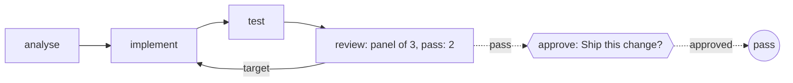

A panel says no, the writer runs again, and the second attempt passes, with
no model and no account. Before you sign anything in, you want to see that
mechanism move.

You want it in a minute, on any machine, with no account and no token
spent, and you want to be sure the shape you're looking at is the shape a
real team would have.

Obversa lets the same file run either way. Every job here is a small
function, so the shape is the only thing on show, and swapping a function
for an engine doesn't change the file's shape. This file is a five-stage
team: analyse, implement, test, a review panel of three that passes on two,
and a person who decides at the end.

## Run it

Set the project up as [Installation](/get-started/installation) describes
and run the file. It needs no model and no network:

```bash Terminal
npx tsx feature-team.ts
```

```text Output
{
  "status": "pass",
  "implementRuns": 2
}
```

`implement` ran twice. Two of the three reviewers failed the first attempt,
so the panel's findings went to `implement`, the step that owns the fix, and
it ran again. The run didn't start over. The second attempt passed, and the
person at the end said yes.

## The file

The writer is a function that leaves the header row out once, so the panel
has something to fail:

```ts examples/feature-team.ts (excerpt) {3-4}
let implementRuns = 0;
const implement = fnJob('implement', () => {
  implementRuns += 1;
  return implementRuns === 1 ? 'report.csv, rows only' : 'report.csv, header and rows';
});
```

Two of the three reviewers fail the first attempt, because the panel passes
on two of three: one dissenting voice is not enough to fail the step, and
an example where only one fails would show a panel that passes and prove
nothing:

```ts examples/feature-team.ts (excerpt) {8-9}
const review = reviewPanel({
  label: 'review',
  reviewers: [
    { name: 'correctness', job: checks.correctness },
    { name: 'safety', job: checks.safety },
    { name: 'scope', job: checks.scope },
  ],
  pass: 2, // two of three agree and the step passes
  target: 'implement', // a failing panel returns the work here
});
```

The five stages run in order as a pipeline, and `maxKickbacks` caps how
many times a failing panel may run the implementer again:

```ts examples/feature-team.ts (excerpt) {10}
export const featureDelivery = pipeline(
  'feature-delivery',
  [
    { name: 'analyse', job: analyse },
    { name: 'implement', job: implement },
    { name: 'test', job: testStage },
    { name: 'review', job: review },
    { name: 'approve', job: approve },
  ],
  { maxKickbacks: 2 },
);
```

The file ends by checking its own claim: it exits 1 unless `implement` ran
exactly twice and the run passed, so a panel that quietly stopped failing
the first attempt would fail the build, not print a passing run.

<Accordion title="Full file">

```ts examples/feature-team.ts
/**
 * A feature team.
 *
 * Five named stages, a review panel of three that passes on two, a writer
 * that runs again when the panel fails, and a person who decides at the
 * end. It runs offline, with no model and no network: every
 * job here is a small function, so the shape of the team is the only thing
 * on show.
 */
import { approval, fnJob, pipeline, reviewPanel, run, type Outcome } from '@obversa/runtime';

/** The work itself. In a real team each of these calls an engine. */
const analyse = fnJob('analyse', () => 'the ticket asks for a report export with a header row');

/** Fails its first attempt so the panel has something to return. */
let implementRuns = 0;
const implement = fnJob('implement', () => {
  implementRuns += 1;
  return implementRuns === 1 ? 'report.csv, rows only' : 'report.csv, header and rows';
});

const testStage = fnJob('test', () => 'the export parses');

/** The person at the end. In a real team the answer arrives through the callbacks client. */
const approve = approval('approve', {
  question: 'Ship this change?',
  answer: () => ({ approved: true }),
});

/**
 * The three reviewers. Two of them fail the first attempt, because the panel
 * passes on two of three: one dissenting voice is not enough to send work
 * back, and an example where only one fails would show a panel that passes
 * and prove nothing about the kickback.
 */
const missingHeader = () => implementRuns === 1;
const checks = {
  correctness: fnJob('correctness', (): Outcome | string =>
    missingHeader()
      ? { status: 'fail', summary: 'the export is missing its header row' }
      : 'header and rows present'),
  safety: fnJob('safety', () => 'no destructive path'),
  scope: fnJob('scope', (): Outcome | string =>
    missingHeader()
      ? { status: 'fail', summary: 'the ticket asked for a header row' }
      : 'inside the ticket'),
};

const review = reviewPanel({
  label: 'review',
  reviewers: [
    { name: 'correctness', job: checks.correctness },
    { name: 'safety', job: checks.safety },
    { name: 'scope', job: checks.scope },
  ],
  pass: 2, // two of three agree and the step passes
  target: 'implement', // a failing panel returns the work here
});

export const featureDelivery = pipeline(
  'feature-delivery',
  [
    { name: 'analyse', job: analyse },
    { name: 'implement', job: implement },
    { name: 'test', job: testStage },
    { name: 'review', job: review },
    { name: 'approve', job: approve },
  ],
  { maxKickbacks: 2 },
);

const result = await run(featureDelivery);
console.log(JSON.stringify({
  status: result.outcome.status,
  implementRuns,
}, null, 2));

/**
 * The example is part of the documentation proof, so it has to fail the build
 * when the behaviour it shows stops happening. Printing alone would not: a
 * panel that quietly stopped returning the work would still print a passing
 * run, and `implement` running once is the tell.
 */
const faults: string[] = [];
if (result.outcome.status !== 'pass') {
  faults.push(`the run ended ${result.outcome.status}, so the second attempt never satisfied the panel`);
}
if (implementRuns !== 2) {
  faults.push(`implement ran ${implementRuns} time(s), so the panel did not run implement again exactly once`);
}
if (faults.length) {
  for (const fault of faults) console.error(fault);
  process.exitCode = 1;
}
```

</Accordion>

## The team's shape



## Next steps

- [Feature delivery](/workflows/feature-team): the same shape with real
  Claude and Codex seats, nine stages and a person on the record.
- [A review panel with a threshold](/patterns/review-panel): the panel on
  its own, with real reviewers from two model families.
- [Feedback loops](/concepts/feedback-loops): the target, the limit and the
  other shapes a check can take.
