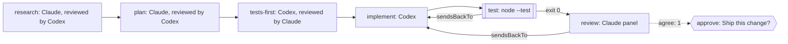

A ticket lands: add a function, with tests, to a small library. On a good
team nobody opens the editor first. Someone reads the code the change
touches, writes down what's needed, and a colleague checks the note. The
tests come before the code. The code is held to the tests and a review.
Then a lead is asked whether it ships.

You want the same shape from your coding agents, without standing over
each step, and without a model marking its own homework. You want to read
at the end what was decided and why.

Obversa makes that one file. Each stage names who does it, what it writes,
who reads it and where a red result goes. Inference sits at the leaves, and
everything between the leaves is a check the run can hold to. This file is
a nine-stage team: a Claude seat researches and plans with a Codex reviewer
on each note, a Codex seat writes the tests and then the code with a Claude
reviewer on each, a test command and a panel hold the implementation to
green, a person is asked to ship, and the last stage writes the evidence.

## Run it

Set the project up as [Installation](/get-started/installation) describes,
put `briefs/triple.md` beside the file, sign in to Claude Code and Codex,
and run it from the directory the work belongs in:

```bash Terminal
npx tsx feature-delivery.ts
```

```json Output
{
  "status": "paused",
  "summary": "waiting for a person: Ship this change?",
  "data": {
    "research-context": {
      "status": "pass",
      "summary": "Review panel: 1/1 reviewer(s) cleared."
    },
    "research-requirements": {
      "status": "pass",
      "summary": "Review panel: 1/1 reviewer(s) cleared."
    },
    "plan": {
      "status": "pass",
      "summary": "Review panel: 1/1 reviewer(s) cleared."
    },
    "tests-first": {
      "status": "pass",
      "summary": "Review panel: 1/1 reviewer(s) cleared."
    },
    "implement": {
      "status": "pass",
      "summary": "Implemented pure named export `triple(value)` in `src/triple.mjs`."
    },
    "test": {
      "status": "pass",
      "summary": "`node` exited 0"
    },
    "review": {
      "status": "pass",
      "summary": "Review panel: 1/1 reviewer(s) cleared.",
      "data": {
        "findings": [],
        "escalatedFindings": [],
        "errors": [],
        "results": [
          {
            "kind": "verdict",
            "name": "review-1",
            "met": true,
            "reason": "Complete implementation meets all requirements. The triple function is pure, handles all numeric types correctly, and has comprehensive test coverage using Node.js built-in test utilities. All 12 requirements (REQ-1 through REQ-12) are satisfied."
          }
        ],
        "passed": 1,
        "required": 1,
        "severityCounts": {}
      }
    },
    "approve": {
      "status": "paused",
      "summary": "waiting for a person: Ship this change?",
      "data": {
        "requestId": "approve#1#14c929c64692d531f625b23edfed5c9fef79d0016e5b15634d828f1ad1d2d70a",
        "gateId": "approve",
        "gateVersion": 1,
        "digest": "14c929c64692d531f625b23edfed5c9fef79d0016e5b15634d828f1ad1d2d70a",
        "decisionText": "Ship this change?",
        "responseSchema": {
          "type": "object",
          "properties": {
            "approved": {
              "type": "boolean"
            },
            "note": {
              "type": "string"
            }
          },
          "required": [
            "approved"
          ]
        },
        "input": {
          "review": "Review panel: 1/1 reviewer(s) cleared."
        },
        "presentation": {}
      }
    },
    "close": {
      "status": "aborted",
      "summary": "blocked by a failed dependency"
    }
  }
}
```

Everything before `approve` ran on real engines and passed. The run stopped
at `approve` with the question on the record, because a person answers it,
not the file, and `close` waits behind it. Use a stored callbacks client to
carry the answer into the next run; [A person decides](/patterns/approval)
shows how.

<Warning>
Run the file in a directory you're happy for a model to change. The Claude
seat runs with permission prompts off, so it can write anywhere the process
can.
</Warning>

## The file

The roles are named once. Two Claude seats and two Codex seats, crossed so
that every reviewer reads a writer from the other family, and a person for
the last word:

```ts examples/teams/feature-delivery.ts (excerpt) {5-11}
  return workflow('feature-delivery', {
    brief: briefFromFile('briefs/triple.md'),
    options: { timeout: '10m' },

    roles: {
      analyse: engines.claude('claude-sonnet-4-5'),
      implement: engines.codex('gpt-5.6-luna'),
      'research-review': [engines.codex('gpt-5.6-luna')],
      'code-review': [engines.claude('claude-sonnet-4-5')],
      approve: person('Ship this change?'),
    },
```

Research comes first. Three stages read the workspace, turn the brief into
requirements, one `REQ-n` per line, and write a plan with one check per
requirement. Each note is reviewed by the Codex seat before the next stage
begins, and a writer sent findings runs again with them up to three times:

```ts examples/teams/feature-delivery.ts (excerpt) {6-7}
      stage('research-context', {
        agent: 'analyse',
        writes: 'team-output/research-context.md',
        desc: 'Read the workspace and write down what the change touches.',
        gate: 'The context note is in the workspace and a reviewer has accepted it.',
        reviewedBy: 'research-review',
        retry: 3,
      }),
```

Then the tests, then the code, then the checks. `writes` names the files a
stage may produce, so `tests-first` can't write the implementation; its
tests may be red until `implement` turns them green. A red test run and a
rejected review both go to `implement` with the findings:

```ts examples/teams/feature-delivery.ts (excerpt) {3,19,22,30}
      stage('tests-first', {
        agent: 'implement',
        writes: 'test/triple.test.mjs',
        desc: 'Write the declared test files from the accepted plan before any implementation exists.',
        gate: 'Every declared test file exists and covers the plan.',
        reviewedBy: 'code-review',
        retry: 3,
      }),

      stage('implement', {
        agent: 'implement',
        writes: 'src/triple.mjs',
        desc: 'Write the code to the plan and the tests.',
        gate: 'The source file exists.',
        retry: 3,
      }),

      stage('test', {
        run: ['node', '--test', 'test/triple.test.mjs'],
        desc: 'Run the tests; a red run goes back to implement with the output.',
        gate: 'The test command exits 0.',
        sendsBackTo: 'implement',
      }),

      stage('review', {
        panel: 'code-review',
        agree: 1,
        desc: 'Read the change and the test result against the plan.',
        gate: 'At least one reviewer has accepted the change.',
        sendsBackTo: 'implement',
      }),

      stage('approve', {
        input: 'approve',
        desc: 'Put the verified change in front of a person.',
        gate: 'A person has said yes.',
      }),
```

Where a stage declares `writes`, the package checks those files after the
job. Where it runs a command, the exit code decides. Where a panel reviews
it, the reviewers' decision decides. A model's report of its own work never
passes a stage by itself. `workflow()` refuses the team before any model
runs if a panel shares a family with the stage it reviews. A reviewer's
decision is its reply; a reply with no decision is asked for once more,
then the run pauses with an engine error, not a rejection. A writer sent
findings must change its note: if the same bytes come back, the stage ends
with a plain summary instead of a second identical review.

<Accordion title="The brief">

```text briefs/triple.md
---
files: ["src/triple.mjs"]
---

Deliver a pure triple(value) function in src/triple.mjs with a Node test in test/triple.test.mjs.
```

</Accordion>

<Accordion title="Full file">

```ts examples/teams/feature-delivery.ts
import { claude } from '@obversa/engine-claude-cli';
import { codex } from '@obversa/engine-codex-cli';
import { run } from '@obversa/runtime';
import { briefFromFile, person, stage, workflow, type TeamSeat } from '@obversa/runtime';

interface FeatureDeliveryEngines {
  readonly claude: (model: string) => TeamSeat;
  readonly codex: (model: string) => TeamSeat;
}

const realEngines: FeatureDeliveryEngines = { claude, codex };

/**
 * A feature, delivered the way a team delivers one. The roles are named once;
 * every stage is a small block of nouns: who does it, what it writes, who
 * reads it, where a red result goes back to. Inference happens only where a
 * role is named; every other stage is a command or a person.
 */
function createFeatureDelivery(engines: FeatureDeliveryEngines = realEngines) {
  return workflow('feature-delivery', {
    brief: briefFromFile('briefs/triple.md'),
    options: { timeout: '10m' },

    roles: {
      analyse: engines.claude('claude-sonnet-4-5'),
      implement: engines.codex('gpt-5.6-luna'),
      'research-review': [engines.codex('gpt-5.6-luna')],
      'code-review': [engines.claude('claude-sonnet-4-5')],
      approve: person('Ship this change?'),
    },

    stages: [
      stage('research-context', {
        agent: 'analyse',
        writes: 'team-output/research-context.md',
        desc: 'Read the workspace and write down what the change touches.',
        gate: 'The context note is in the workspace and a reviewer has accepted it.',
        reviewedBy: 'research-review',
        retry: 3,
      }),

      stage('research-requirements', {
        agent: 'analyse',
        writes: 'team-output/research-requirements.md',
        desc: 'Turn the brief and the context note into requirements, one REQ-n per line.',
        gate: 'The requirements note is in the workspace and a reviewer has accepted it.',
        reviewedBy: 'research-review',
        retry: 3,
      }),

      stage('plan', {
        agent: 'analyse',
        writes: 'team-output/plan.md',
        desc: 'Write an executable plan from the requirements, one check per REQ-n.',
        gate: 'Every requirement has a check in the plan.',
        reviewedBy: 'research-review',
        retry: 3,
      }),

      stage('tests-first', {
        agent: 'implement',
        writes: 'test/triple.test.mjs',
        desc: 'Write the declared test files from the accepted plan before any implementation exists.',
        gate: 'Every declared test file exists and covers the plan.',
        reviewedBy: 'code-review',
        retry: 3,
      }),

      stage('implement', {
        agent: 'implement',
        writes: 'src/triple.mjs',
        desc: 'Write the code to the plan and the tests.',
        gate: 'The source file exists.',
        retry: 3,
      }),

      stage('test', {
        run: ['node', '--test', 'test/triple.test.mjs'],
        desc: 'Run the tests; a red run goes back to implement with the output.',
        gate: 'The test command exits 0.',
        sendsBackTo: 'implement',
      }),

      stage('review', {
        panel: 'code-review',
        agree: 1,
        desc: 'Read the change and the test result against the plan.',
        gate: 'At least one reviewer has accepted the change.',
        sendsBackTo: 'implement',
      }),

      stage('approve', {
        input: 'approve',
        desc: 'Put the verified change in front of a person.',
        gate: 'A person has said yes.',
      }),

      stage('close', {
        agent: 'analyse',
        writes: ['team-output/evidence.md', 'team-output/learning.md'],
        desc: 'Write the evidence of the run and what was learned, from the record alone.',
        gate: 'Both notes are in the workspace.',
      }),
    ],
  });
}

const result = await run(createFeatureDelivery());
console.log(JSON.stringify(result.outcome, null, 2));
```

</Accordion>

## The team's shape



## What the run did

The notes the team left in `team-output/`, in the order they were written.
The context note is in the same directory, and the last stage writes the
evidence and the learning after the person's answer.

<Accordion title="The notes the team wrote">

```text team-output/research-requirements.md
# Requirements: Triple Function Implementation

## Functional Requirements

**REQ-1** The function shall accept a numeric value as input and return that value multiplied by 3.

**REQ-2** The function shall be pure: given the same input, it shall always return the same output with no side effects.

**REQ-3** The function shall be exported as a named export `triple` from `src/triple.mjs`.

**REQ-4** The function shall handle zero, negative numbers, and decimal values correctly.

## Test Requirements

**REQ-5** A test suite shall exist at `test/triple.test.mjs` using Node.js built-in test utilities.

**REQ-6** Tests shall verify basic multiplication behavior (e.g., `triple(2)` returns `6`).

**REQ-7** Tests shall cover edge cases: zero input, negative numbers, and decimal values.

## Implementation Constraints

**REQ-8** The implementation shall have no external runtime dependencies.

**REQ-9** The function shall perform no I/O operations, mutations, or state modifications.

**REQ-10** The implementation shall use ES module syntax (`.mjs` extension).

## Directory Structure

**REQ-11** Source code shall be placed in the `src/` directory.

**REQ-12** Test code shall be placed in the `test/` directory.
```

```text team-output/plan.md
# Implementation Plan: Triple Function

## Overview
Implement a pure `triple(value)` function that multiplies a number by 3, with comprehensive test coverage using Node.js built-in test utilities.

## Implementation Steps

### Step 1: Create Source File
**Action:** Write `src/triple.mjs` with a pure function that multiplies input by 3.

**Checks:**
- **REQ-3:** Verify `triple` is exported as a named export from `src/triple.mjs`
- **REQ-1:** Verify function accepts numeric value and returns `value * 3`
- **REQ-2:** Verify function is pure (same input → same output, no side effects)
- **REQ-4:** Verify implementation handles zero, negative numbers, and decimals correctly
- **REQ-8:** Verify no external runtime dependencies are imported
- **REQ-9:** Verify function performs no I/O operations, mutations, or state modifications
- **REQ-10:** Verify ES module syntax is used (`.mjs` extension, `export` keyword)
- **REQ-11:** Verify file is placed in `src/` directory

### Step 2: Create Test File
**Action:** Write `test/triple.test.mjs` using Node.js built-in test utilities.

**Checks:**
- **REQ-5:** Verify test suite exists at `test/triple.test.mjs` using `node:test` and `node:assert`
- **REQ-6:** Verify tests include basic multiplication cases (e.g., `triple(2) === 6`)
- **REQ-7:** Verify tests cover edge cases: zero input, negative numbers, decimal values
- **REQ-10:** Verify ES module syntax is used (`.mjs` extension, `import` keyword)
- **REQ-12:** Verify file is placed in `test/` directory

### Step 3: Verification
**Action:** Run the test suite to confirm all requirements are met.

**Checks:**
- All tests pass when running `node test/triple.test.mjs`
- Function behavior matches specification for all input types
- No runtime errors or warnings

## Success Criteria
✓ `src/triple.mjs` exports a pure `triple` function
✓ Function correctly multiplies input by 3 for all numeric types
✓ `test/triple.test.mjs` uses Node.js built-in test utilities
✓ Test suite covers basic cases and edge cases
✓ All tests pass
✓ No external dependencies
✓ ES module syntax used throughout
✓ Correct directory structure (`src/` and `test/`)
```

</Accordion>

The files the models wrote. The tests came first, from the plan, and the
second version of the code is the one the review accepted:

```js test/triple.test.mjs
import assert from 'node:assert/strict';
import { test } from 'node:test';

import { triple } from '../src/triple.mjs';

test('triple multiplies a positive number by three', () => {
  assert.equal(triple(2), 6);
});

test('triple returns zero for zero', () => {
  assert.equal(triple(0), 0);
});

test('triple multiplies a negative number by three', () => {
  assert.equal(triple(-4), -12);
});

test('triple multiplies a decimal number by three', () => {
  assert.equal(triple(1.5), 4.5);
});

test('triple returns the same result for repeated calls with the same input', () => {
  const input = 7;

  assert.equal(triple(input), 21);
  assert.equal(triple(input), 21);
  assert.equal(input, 7);
});
```

```js src/triple.mjs
export function triple(value) {
  return value * 3;
}
```

## Next steps

- [Feature team, offline](/workflows/feature-team-offline): the same shape
  in five stages with no model, to read before you spend a token.
- [Shipping through GitHub](/workflows/forge-helper): what happens to the
  change after the person says yes.
- [Feedback loops](/concepts/feedback-loops): why a red test or a rejected
  review runs the implementer again, and what stops it.
