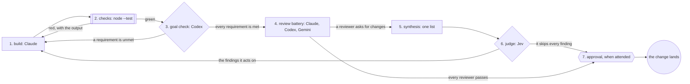

Hand a ticket to a team of coding agents and get back a change that passes
the tests. A model from another family checks it against every requirement
in the ticket. Three reviewers from
three model families read it, and their notes arrive as one list. A judge
decides which notes are worth another round, so a matter of taste does not
cost one. A person approves the exact bytes before the change lands. Run it
unattended, and the change lands without asking.

Each ticket runs in its own Git worktree. The change lands on your current
branch only when the whole run passes. The same team can work through a
backlog, one ticket after another.

## The seven steps


```mermaid
flowchart LR
  build["1. build: Claude"] --> checks[["2. checks: node --test"]]
  checks -->|"red, with the output"| build
  checks -->|green| goal{"3. goal check: Codex"}
  goal -->|"a requirement is unmet"| build
  goal -->|"every requirement is met"| battery["4. review battery: Claude, Codex, Gemini"]
  battery -->|"a reviewer asks for changes"| synthesis["5. synthesis: one list"]
  synthesis --> judge{"6. judge: Jev"}
  judge -->|"the findings it acts on"| build
  judge -->|"it skips every finding"| approve{{"7. approval, when attended"}}
  battery -->|"every reviewer passes"| approve
  approve --> lands((the change lands))
```

## Run it

Set the project up as [Installation](/get-started/installation) describes.
Sign in to Claude Code and Codex, and install OpenCode. Run the file from a
Git repository. Put the ticket in `briefs/ticket.md`. List the files it
changes and its test files in its front matter, and commit the tests. Put
`judge.json` beside the file for the offline judge. `JEV=live` asks Jev instead,
with `TYPESAFE_ENDPOINT` and `TYPESAFE_API_KEY` in the environment.

```bash Terminal
npx tsx feature-delivery.ts
```

When the run reaches the approval, it prints a page to answer on and waits.
Keep the process running until the person answers: only the running
process can take the answer. With `approve.json` beside the file, the
answer comes from it instead. To leave the approval out, run it unattended:

```bash Terminal
npx tsx feature-delivery.ts --unattended
```

<Accordion title="A ticket">

```text briefs/ticket.md
---
files: ["src/triple.mjs", "test/triple.test.mjs"]
---

Add triple(value) to src/triple.mjs.

- triple returns three times its input.
- triple throws a TypeError when its input is not a number.

The test is test/triple.test.mjs.
```

</Accordion>

<Warning>
Run the file in a repository you're happy for a model to change. The
Claude seat runs with permission prompts off, so it can write anywhere the
process can.
</Warning>

## The seats

One seat builds. A seat from another model family checks the goal. The
three reviewers come from three model families:

```ts examples/teams/feature-delivery.ts (excerpt)
const builder = claude('claude-sonnet-4-5');
const goalSeat = codex('gpt-5.6-luna');
const reviewers: Record<string, TeamSeat> = {
  claude: claude('claude-sonnet-4-5'),
  codex: codex('gpt-5.6-luna'),
  gemini: openCode('google/gemini-2.5-pro'),
};
```

## 1. Build and 2. Checks

The builder reads the ticket and changes the files it names. Then the
ticket's own tests run. A red test goes back to the builder with the
command's output, and no model reads it first:

```ts examples/teams/feature-delivery.ts (excerpt)
/** Build, then run the ticket's tests. A red test goes back to the builder with its output, up to three tries each time this step runs. */
const build = (ticket: string, files: readonly string[], tests: readonly string[]): Job => loop({
  name: 'build',
  body: agentJob({
    label: 'build', engine: builder.engine, model: builder.identity.model,
    tools: [...builder.identity.tools], allowedTools: [...builder.identity.tools], workspaceMode: 'write',
    consumeFeedback: true,
    prompt: `${ticket}\n\nMake the change in ${files.join(', ')}. Do not change ${tests.join(', ')}.`,
  }),
  review: commandJob('test', ['node', '--test', ...tests]),
  max: 3,
});
```

When the tests are still red after three tries, the run fails and nothing
lands.

## 3. Goal check

Green tests do not prove the ticket was met. A test can miss a
requirement. The goal seat reads the ticket and the work, and marks each
requirement met or unmet, with evidence:

```ts examples/teams/feature-delivery.ts (excerpt)
        goal: { needs: 'build', job: goalCheck(goalSeat, { target: 'build', text: ticket.brief }) },
```

An unmet requirement goes back to the builder with its evidence. The
reviewers do not run that round, and the judge is not asked.
[Check the brief was met](/patterns/check-the-brief) has the details.

## 4. Review battery

Each reviewer reads the change against the ticket and changes nothing. It
replies with a verdict and its findings, each tagged `block`, `should-fix`
or `nice-to-have`:

```ts examples/teams/feature-delivery.ts (excerpt)
/** One reviewer. It reads the change and writes nothing. */
const reviewer = (name: string, seat: TeamSeat, ticket: string, files: readonly string[]) => ({
  name,
  seat,
  job: agentJob({
    label: `review-${name}`, engine: seat.engine, model: seat.identity.model,
    tools: [...seat.identity.tools], allowedTools: [...seat.identity.tools], workspaceMode: 'read', leaf: true,
    prompt: `${ticket}\n\nReview ${files.join(', ')} against this ticket. Change nothing. Reply as one JSON object: {"status":"pass"|"revise","summary":"...","findings":[{"severity":"block"|"should-fix"|"nice-to-have","evidence":"...","recommendation":"..."}]}`,
    outcome: (text) => outcomeFromAgentText(text),
  }),
});
```

## 5. Synthesis

The three reviewers run at the same time. `synthesise: true` makes their
reviews one list. The first reviewer's seat merges the findings that name
the same problem. Then each reviewer votes once on the findings it did not
raise:

```ts examples/teams/feature-delivery.ts (excerpt)
/** The review battery: all three at the same time, their reviews merged into one list. */
const review = (ticket: string, files: readonly string[]): Job => reviewPanel({
  label: 'review',
  target: 'build',
  synthesise: true,
  context: ticket,
  reviewers: Object.entries(reviewers).map(([name, seat]) => reviewer(name, seat, ticket, files)),
});
```

A finding is dropped when the reviewers who reject it outnumber those who
raised or backed it, unless it is a block. A finding the vote splits on
stays, marked disputed. [Ask a panel](/patterns/review-panel) shows the
vote in full.

## 6. Judge

When a reviewer asks for changes, Jev decides each finding on the list,
a block included: act on it or skip it. The builder gets only the findings
Jev acts on. With no cap, the rounds end when Jev stops them or every
reviewer passes. Offline, `judge.json` replays Jev's answers:

```ts examples/teams/feature-delivery.ts (excerpt)
      // Jev decides each finding the review sends back, a block included,
      // with no cap. An unmet requirement goes back without it.
      maxKickbacks: { build: judge(judgeSeat) },
```

To bound the rounds as well, pass a cap: `judge(judgeSeat, { cap: 3 })`.
[Know when to stop](/patterns/judge-stops-the-loop) shows the questions
Jev answers.

## 7. Approval

Attended, a person approves the exact bytes. Everything the run changes in
its worktree lands, so the question names every file the run added,
changed or deleted, whether the ticket names it or not. `start` is the
commit the worktree began at, so a file the builder committed itself is
named too. Each file shows the first 12 characters of its sha256, and the
request carries each full sha256. A yes is a yes to those bytes: after the
yes the files are read again, and if any changed while the question waited,
the run fails and nothing lands. A no fails the run, and the change does not
land:

```ts examples/teams/feature-delivery.ts (excerpt)
/** Git's answer in the worktree, one entry per path. */
const git = (dir: string, ...args: string[]) => execFileSync('git', args, { cwd: dir, encoding: 'utf8' }).split(/[\0\n]/).filter(Boolean);

/** Every file the run added, changed or deleted since `start`, with the sha256 of its bytes. */
const changes = async (dir: string, start: string) => {
  const changed = [
    ...git(dir, 'diff', '--name-only', '--no-renames', '-z', start),
    ...git(dir, 'ls-files', '--others', '--exclude-standard', '-z'),
  ].sort();
  const sha256: Record<string, string> = {};
  for (const file of changed) {
    sha256[file] = existsSync(join(dir, file)) ? createHash('sha256').update(await readFile(join(dir, file))).digest('hex') : 'deleted';
  }
  return sha256;
};

/**
 * A person approves the exact bytes of every file the run added, changed or
 * deleted since `start`, the commit the worktree began at: all of it lands,
 * the ticket's files or not. A no fails the run, and the change does not land.
 */
const approve = (start: string): Job => async (ctx) => {
  const dir = ctx.workspace.dir;
  const sha256 = await changes(dir, start);
  // With approve.json beside the file, the answer comes from it. Without it,
  // the run waits and prints the address of a page to answer on.
  const recorded = existsSync('approve.json') ? JSON.parse(await readFile('approve.json', 'utf8')) : undefined;
  const outcome = await approval('approve', {
    question: `Ship these bytes? ${Object.entries(sha256).map(([file, hash]) => `${file} (${hash === 'deleted' ? 'deleted' : `sha256 ${hash.slice(0, 12)}`})`).join(', ')}`,
    input: { sha256 },
    ...(recorded ? { answer: () => recorded } : {}),
  })(ctx);
  // A file edited while the question waited is not what the person approved,
  // so the run fails and nothing lands.
  if (outcome.status === 'pass' && !isDeepStrictEqual(await changes(dir, start), sha256)) {
    return { status: 'fail', summary: 'the files changed after the approval was asked for; nothing lands' };
  }
  return outcome;
};
```

One flag switches between the two ways to run. `--unattended` leaves the
approval step out of the team, and the change lands without asking:

```ts examples/teams/feature-delivery.ts (excerpt)
// Attended, a person approves the change before it lands. `--unattended`
// leaves the approval out.
const attended = !process.argv.includes('--unattended');
```

```ts examples/teams/feature-delivery.ts (excerpt)
        ...(attended ? { approve: { needs: 'review', job: approve(start!) } } : {}),
```

## Work from a backlog

The runtime keeps no ticket type. Your application chooses where its work
lives. The backlog example points the same team at a folder of markdown
tickets, `backlog/`. It takes the next ticket and delivers it in its own
worktree. It keeps a record of each run in `records/`, moves the ticket to
`backlog/done/`, and takes the next one. It stops at the first ticket that
does not pass, and leaves that ticket in the backlog.

To take the work from Linear or GitHub issues instead, change two
functions. Make `next` ask your tracker for the next ready issue, and make
`finish` close it. Nothing else changes:

```ts examples/teams/feature-team-backlog.ts (excerpt)
async function next(): Promise<{ id: string; ticket: BriefSource } | undefined> {
  const [id] = (await readdir(backlog)).filter((name) => name.endsWith('.md')).sort();
  return id === undefined ? undefined : { id, ticket: briefFromFile(join(backlog, id)) };
}

async function finish(id: string): Promise<void> {
  await mkdir(done, { recursive: true });
  await rename(join(backlog, id), join(done, id));
}
```

The loop delivers one ticket at a time with `deliver` from the team's
file:

```ts examples/teams/feature-team-backlog.ts (excerpt)
const delivered: { ticket: string; status: string; summary?: string }[] = [];
for (let item = await next(); item !== undefined; item = await next()) {
  const result = await deliver(item.ticket, `records/${item.id.replace(/\.md$/, '')}.jsonl`);
  delivered.push({ ticket: item.id, status: result.outcome.status, summary: result.outcome.summary });
  if (result.outcome.status !== 'pass') break;
  await finish(item.id);
}
```

```bash Terminal
npx tsx feature-team-backlog.ts --unattended
```

## Copy the files

The team is `examples/teams/feature-delivery.ts`. The backlog is
`examples/teams/feature-team-backlog.ts`, and it imports the team's file.

<Accordion title="examples/teams/feature-delivery.ts">

```ts examples/teams/feature-delivery.ts
import { execFileSync } from 'node:child_process';
import { createHash } from 'node:crypto';
import { existsSync, realpathSync } from 'node:fs';
import { readFile } from 'node:fs/promises';
import { join } from 'node:path';
import { fileURLToPath } from 'node:url';
import { isDeepStrictEqual } from 'node:util';

import { resolveCommandExecutable } from '@obversa/core/command';
import { claude } from '@obversa/engine-claude-cli';
import { codex } from '@obversa/engine-codex-cli';
import { jev } from '@obversa/engine-jev-api';
import { opencode } from '@obversa/engine-opencode-cli';
import {
  agentJob,
  approval,
  briefFromFile,
  commandJob,
  dag,
  formatEvent,
  goalCheck,
  isolated,
  judge,
  loop,
  reviewPanel,
  run,
  type BriefSource,
  type Job,
  type TeamSeat,
} from '@obversa/runtime';
import { recordedJudge } from '@obversa/runtime/testing';
import { outcomeFromAgentText } from '@obversa/runtime/workflow-support';

/**
 * A ticket, delivered the way a team delivers a change. One seat builds it.
 * The ticket's tests run, and a red test goes back to the builder with its output.
 * A seat from another model family checks that every requirement in the
 * ticket was met. Three reviewers from three model families review the
 * change at the same time, and their reviews become one list. A judge
 * decides each finding, and the builder gets only the findings it acts on.
 * Attended, a person approves the exact bytes before the change lands;
 * with `--unattended`, it lands without asking. Each ticket runs in its own
 * worktree, and the change lands on the current branch when the run passes.
 */

// ── The seats ───────────────────────────────────────────────────────────────

// OpenCode's adapter needs an absolute command path.
const openCode = (model: string) => opencode(model, { executable: resolveCommandExecutable('opencode') });

const builder = claude('claude-sonnet-4-5');
const goalSeat = codex('gpt-5.6-luna');
const reviewers: Record<string, TeamSeat> = {
  claude: claude('claude-sonnet-4-5'),
  codex: codex('gpt-5.6-luna'),
  gemini: openCode('google/gemini-2.5-pro'),
};

// Offline, recorded answers stand in for Jev so the example runs with no
// key: judge.json holds one answer object per call, and the last one
// repeats. `JEV=live` asks Jev instead.
const judgeSeat = process.env.JEV === 'live' ? jev() : recordedJudge('judge.json');

// Attended, a person approves the change before it lands. `--unattended`
// leaves the approval out.
const attended = !process.argv.includes('--unattended');

// ── The steps ───────────────────────────────────────────────────────────────

/** Build, then run the ticket's tests. A red test goes back to the builder with its output, up to three tries each time this step runs. */
const build = (ticket: string, files: readonly string[], tests: readonly string[]): Job => loop({
  name: 'build',
  body: agentJob({
    label: 'build', engine: builder.engine, model: builder.identity.model,
    tools: [...builder.identity.tools], allowedTools: [...builder.identity.tools], workspaceMode: 'write',
    consumeFeedback: true,
    prompt: `${ticket}\n\nMake the change in ${files.join(', ')}. Do not change ${tests.join(', ')}.`,
  }),
  review: commandJob('test', ['node', '--test', ...tests]),
  max: 3,
});

/** One reviewer. It reads the change and writes nothing. */
const reviewer = (name: string, seat: TeamSeat, ticket: string, files: readonly string[]) => ({
  name,
  seat,
  job: agentJob({
    label: `review-${name}`, engine: seat.engine, model: seat.identity.model,
    tools: [...seat.identity.tools], allowedTools: [...seat.identity.tools], workspaceMode: 'read', leaf: true,
    prompt: `${ticket}\n\nReview ${files.join(', ')} against this ticket. Change nothing. Reply as one JSON object: {"status":"pass"|"revise","summary":"...","findings":[{"severity":"block"|"should-fix"|"nice-to-have","evidence":"...","recommendation":"..."}]}`,
    outcome: (text) => outcomeFromAgentText(text),
  }),
});

/** The review battery: all three at the same time, their reviews merged into one list. */
const review = (ticket: string, files: readonly string[]): Job => reviewPanel({
  label: 'review',
  target: 'build',
  synthesise: true,
  context: ticket,
  reviewers: Object.entries(reviewers).map(([name, seat]) => reviewer(name, seat, ticket, files)),
});

/** Git's answer in the worktree, one entry per path. */
const git = (dir: string, ...args: string[]) => execFileSync('git', args, { cwd: dir, encoding: 'utf8' }).split(/[\0\n]/).filter(Boolean);

/** Every file the run added, changed or deleted since `start`, with the sha256 of its bytes. */
const changes = async (dir: string, start: string) => {
  const changed = [
    ...git(dir, 'diff', '--name-only', '--no-renames', '-z', start),
    ...git(dir, 'ls-files', '--others', '--exclude-standard', '-z'),
  ].sort();
  const sha256: Record<string, string> = {};
  for (const file of changed) {
    sha256[file] = existsSync(join(dir, file)) ? createHash('sha256').update(await readFile(join(dir, file))).digest('hex') : 'deleted';
  }
  return sha256;
};

/**
 * A person approves the exact bytes of every file the run added, changed or
 * deleted since `start`, the commit the worktree began at: all of it lands,
 * the ticket's files or not. A no fails the run, and the change does not land.
 */
const approve = (start: string): Job => async (ctx) => {
  const dir = ctx.workspace.dir;
  const sha256 = await changes(dir, start);
  // With approve.json beside the file, the answer comes from it. Without it,
  // the run waits and prints the address of a page to answer on.
  const recorded = existsSync('approve.json') ? JSON.parse(await readFile('approve.json', 'utf8')) : undefined;
  const outcome = await approval('approve', {
    question: `Ship these bytes? ${Object.entries(sha256).map(([file, hash]) => `${file} (${hash === 'deleted' ? 'deleted' : `sha256 ${hash.slice(0, 12)}`})`).join(', ')}`,
    input: { sha256 },
    ...(recorded ? { answer: () => recorded } : {}),
  })(ctx);
  // A file edited while the question waited is not what the person approved,
  // so the run fails and nothing lands.
  if (outcome.status === 'pass' && !isDeepStrictEqual(await changes(dir, start), sha256)) {
    return { status: 'fail', summary: 'the files changed after the approval was asked for; nothing lands' };
  }
  return outcome;
};

// ── The team ────────────────────────────────────────────────────────────────

/** The team for one ticket, in its own worktree. */
export function featureTeam(ticket: BriefSource): Job {
  // The ticket's front matter names the files to change and the tests that
  // check them. Only the ticket's own tests run.
  const tests = (ticket.files ?? []).filter((file) => /\.test\.[cm]?[jt]s$/.test(file));
  const files = (ticket.files ?? []).filter((file) => !tests.includes(file));
  if (!files.length || !tests.length) throw new TypeError('a ticket names the files it changes and its tests in its front matter');
  return isolated((ctx) => {
    const [start] = git(ctx.workspace.dir, 'rev-parse', 'HEAD');
    return dag({
      name: 'feature-delivery',
      nodes: {
        build: { job: build(ticket.brief, files, tests) },
        goal: { needs: 'build', job: goalCheck(goalSeat, { target: 'build', text: ticket.brief }) },
        review: { needs: 'goal', job: review(ticket.brief, files) },
        ...(attended ? { approve: { needs: 'review', job: approve(start!) } } : {}),
      },
      // Jev decides each finding the review sends back, a block included,
      // with no cap. An unmet requirement goes back without it.
      maxKickbacks: { build: judge(judgeSeat) },
    })(ctx);
  }, { label: 'feature' });
}

/** Deliver one ticket, printing each event, and keep the record. */
export async function deliver(ticket: BriefSource, recordTo: string) {
  const result = await run(featureTeam(ticket), {
    recordTo,
    onCallback: 'wait',
    // Only an attended run asks, so only it opens the page to answer on.
    monitor: attended,
    onEvent: (event) => console.log(event.kind === 'monitor' ? `Answer the approval on ${event.url}` : formatEvent(event)),
  });
  await result.monitor?.close();
  return result;
}

// Started directly, this file delivers briefs/ticket.md. The backlog
// example imports `deliver` instead.
if (process.argv[1] && realpathSync(process.argv[1]) === realpathSync(fileURLToPath(import.meta.url))) {
  const result = await deliver(briefFromFile('briefs/ticket.md'), 'records/feature-delivery.jsonl');
  console.log(JSON.stringify({ status: result.outcome.status, summary: result.outcome.summary }, null, 2));
}
```

</Accordion>

<Accordion title="examples/teams/feature-team-backlog.ts">

```ts examples/teams/feature-team-backlog.ts
import { mkdir, readdir, rename } from 'node:fs/promises';
import { join } from 'node:path';

import { briefFromFile, type BriefSource } from '@obversa/runtime';

import { deliver } from './feature-delivery.js';

/**
 * The feature team, pointed at a backlog: a folder of markdown tickets.
 * It takes the next ticket, delivers it in its own worktree, records the
 * result and moves on. It stops at the first ticket that does not pass, and
 * leaves that ticket in the backlog. Pass `--unattended` to land each
 * change without asking.
 */

const backlog = 'backlog';
const done = join(backlog, 'done');

// The work lives in a folder here. To take it from Linear or GitHub issues
// instead, change these two functions and nothing else. `next` asks the
// tracker for the next ready issue (for example `gh issue list --label
// ready --limit 1 --json number,body`, or a Linear API query) and returns
// its text as the brief and the files it names. `finish` closes the issue
// or moves it to done.
async function next(): Promise<{ id: string; ticket: BriefSource } | undefined> {
  const [id] = (await readdir(backlog)).filter((name) => name.endsWith('.md')).sort();
  return id === undefined ? undefined : { id, ticket: briefFromFile(join(backlog, id)) };
}

async function finish(id: string): Promise<void> {
  await mkdir(done, { recursive: true });
  await rename(join(backlog, id), join(done, id));
}

const delivered: { ticket: string; status: string; summary?: string }[] = [];
for (let item = await next(); item !== undefined; item = await next()) {
  const result = await deliver(item.ticket, `records/${item.id.replace(/\.md$/, '')}.jsonl`);
  delivered.push({ ticket: item.id, status: result.outcome.status, summary: result.outcome.summary });
  if (result.outcome.status !== 'pass') break;
  await finish(item.id);
}
console.log(JSON.stringify({ delivered }, null, 2));
```

</Accordion>

## Next steps

- [Shipping through GitHub](/workflows/forge-helper): what happens to the
  change after it lands.
- [Know when to stop](/patterns/judge-stops-the-loop): the questions the
  judge answers between a review and the next round.
- [Check the brief was met](/patterns/check-the-brief): the goal check on
  its own.
