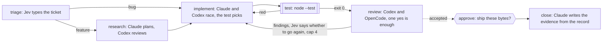

A ticket lands: add a function, with a test, to a small library. On a good
team nobody opens the editor first. Someone decides what kind of ticket it
is and how much care it needs. For a feature, someone writes down what's
needed and a colleague checks the note. Two people might try the change,
and the tests decide whose version stands. A reviewer reads it, and if the
notes are small, someone senior says when the polishing can stop. Then a
lead is asked whether it ships, and the ticket is closed with a note that
says what happened.

You want the same shape from your coding agents, without standing over
each step, and without a model marking its own homework. You want the
expensive seats to see only the work that needs them, and you want to read
at the end what was decided and why.

Obversa makes that one file. A small decision model types the ticket as a
bug or a feature before any expensive seat reads it. For a feature, a
Claude seat writes the requirements and the plan and a Codex seat reviews
them. Two seats, Claude and Codex, each implement in their own worktree,
and the test command picks the winner; a red test sends the loser's fix
back. A panel of two seats reviews the change, at least one from a family
that did not write it, and a judge says when another round has stopped
being worth it. A person approves
the exact bytes by their sha. The closing note is written from the record
alone.

## Run it

Set the project up as [Installation](/get-started/installation) describes.
Put `briefs/ticket.md` beside the file, with `test/triple.test.mjs` in
place and `jev.json` for the offline judge and triage, sign in to Claude
Code and Codex and install OpenCode, and run it from a Git repository you
are happy for the seats to change. `JEV=live` asks Jev for the triage and
the judge instead of replaying `jev.json`; it needs `TYPESAFE_ENDPOINT` and
`TYPESAFE_API_KEY` in the environment:

```bash Terminal
npx tsx feature-delivery.ts
```

The output below is the proof's offline run. The seats are scripted and the
judge is recorded, so the words are the script's and the shape is the
run's:

```text Output, from the offline proof
▸ run
feature-delivery ▸ dag (7 nodes)
feature-delivery · node triage: start
feature-delivery › triage • triage
feature-delivery › triage • triage: pass  {"kind":{"choice":"feature"},"risk":{"score":0.4}}
feature-delivery · node triage: done (pass)
feature-delivery › research · when met: triage chose a feature: true
feature-delivery · node research: start
feature-delivery › research › research workflow:start
feature-delivery › research › research ▸ dag (1 nodes)
feature-delivery › research › research · node plan: start
feature-delivery › research › research › plan › plan-review ▸ loop (max 3)
feature-delivery › research › research › plan › plan-review · iteration 1
feature-delivery › research › research › plan › plan-review • plan

feature-delivery › research › research › plan › plan-review   stand-in: 3/1 tok
feature-delivery › research › research › plan › plan-review • plan: fail  The engine response was not a valid team decision JSON object.
feature-delivery › research › research › plan › plan-review · until met: plan writes: true
feature-delivery › research › research › plan › plan-review › review-panel • plan
feature-delivery › research › research › plan › plan-review › review-panel • plan-1

feature-delivery › research › research › plan › plan-review › review-panel   gpt-5.6-luna: 42/7 tok
feature-delivery › research › research › plan › plan-review › review-panel • plan-1: fail  missing a check
feature-delivery › research › research › plan › plan-review › review-panel • plan: fail  Review panel: 0/1 reviewer(s) cleared. - plan-1 [should-fix]: no check named
feature-delivery › research › research › plan › plan-review · review: fail
review did not pass (Review panel: 0/1 reviewer(s) cleared. - plan-1 [should-fix]: no check named); re-entering plan-review
feature-delivery › research › research › plan › plan-review · iteration 2
feature-delivery › research › research › plan › plan-review • plan

feature-delivery › research › research › plan › plan-review   stand-in: 3/1 tok
feature-delivery › research › research › plan › plan-review • plan: fail  The engine response was not a valid team decision JSON object.
feature-delivery › research › research › plan › plan-review · until met: plan writes: true
feature-delivery › research › research › plan › plan-review › review-panel • plan
feature-delivery › research › research › plan › plan-review › review-panel • plan-1

feature-delivery › research › research › plan › plan-review › review-panel   gpt-5.6-luna: 42/7 tok
feature-delivery › research › research › plan › plan-review › review-panel • plan-1: pass  plan covers it
feature-delivery › research › research › plan › plan-review › review-panel • plan: pass  Review panel: 1/1 reviewer(s) cleared.
feature-delivery › research › research › plan › plan-review · review: pass
feature-delivery › research › research › plan › plan-review ◂ pass (2 iter)
feature-delivery › research › research · node plan: done (pass)
feature-delivery › research › research ◂ dag pass
feature-delivery · node research: done (pass)
feature-delivery · node implement: start
feature-delivery › implement › implement • implement
feature-delivery › implement › implement › #0 • candidate-0
feature-delivery › implement › implement › #0 • candidate-0

feature-delivery › implement › implement › #0   stand-in: 3/1 tok
feature-delivery › implement › implement › #0 • candidate-0: pass  the candidate produced nothing
feature-delivery › implement › implement › #0 • candidate-0: fail  candidate-0 did not produce a non-empty file: src/triple.mjs
implement candidate 0: score -1
feature-delivery › implement › implement › #1 • candidate-1
feature-delivery › implement › implement › #1 • candidate-1

feature-delivery › implement › implement › #1   gpt-5.6-luna: 42/7 tok
feature-delivery › implement › implement › #1 • candidate-1: pass  implemented the plan
feature-delivery › implement › implement › #1 • candidate-1-test
feature-delivery › implement › implement › #1 · candidate-1-test met: `node` exited 0
feature-delivery › implement › implement › #1 • candidate-1-test: pass  `node` exited 0
feature-delivery › implement › implement › #1 • candidate-1: pass  `node` exited 0
implement candidate 1: score 1
feature-delivery › implement › implement • implement: pass  tournament "implement": landed candidate 1 (score 1) of 2
feature-delivery · node implement: done (pass)
feature-delivery · node test: start
feature-delivery › test • test
feature-delivery › test · test met: `node` exited 0
feature-delivery › test • test: pass  `node` exited 0
feature-delivery · node test: done (pass)
feature-delivery · node review: start
feature-delivery › review • review
feature-delivery › review • review

feature-delivery › review   gpt-5.6-luna: 42/7 tok
feature-delivery › review • review: fail  variable name is unclear
feature-delivery › review • review

feature-delivery › review   opencode/big-pickle: 6/7 tok
feature-delivery › review • review: fail  name is unclear
feature-delivery › review • review: fail  Review panel: 0/2 reviewer(s) cleared. - codex [should-fix]: name the parameter - opencode [should-fix]: triple could be clearer
feature-delivery · node review: done (fail)
feature-delivery · node approve: done (aborted)
feature-delivery · node close: done (aborted)
feature-delivery › refine-judge • refine:judge
feature-delivery › refine-judge • refine:judge: pass  {"stop_reason":{"choice":"continue"}}
feature-delivery ◆ the judge says another round is worth it
feature-delivery ↩ kickback accepted review -> implement [1/4]: Review panel: 0/2 reviewer(s) cleared. (the judge says another round is worth it)
feature-delivery · node implement: start
feature-delivery › implement › implement • implement
feature-delivery › implement › implement › #0 • candidate-0
feature-delivery › implement › implement › #0 • candidate-0

feature-delivery › implement › implement › #0   stand-in: 3/1 tok
feature-delivery › implement › implement › #0 • candidate-0: pass  the candidate produced nothing
feature-delivery › implement › implement › #0 • candidate-0: fail  candidate-0 did not produce a non-empty file: src/triple.mjs
implement candidate 0: score -1
feature-delivery › implement › implement › #1 • candidate-1
feature-delivery › implement › implement › #1 • candidate-1

feature-delivery › implement › implement › #1   gpt-5.6-luna: 42/7 tok
feature-delivery › implement › implement › #1 • candidate-1: pass  {"status":"revise","summary":"variable name is unclear","findings":[{"severity":"should-fix","evidence":"name the parameter"}]}
feature-delivery › implement › implement › #1 • candidate-1-test
feature-delivery › implement › implement › #1 · candidate-1-test met: `node` exited 0
feature-delivery › implement › implement › #1 • candidate-1-test: pass  `node` exited 0
feature-delivery › implement › implement › #1 • candidate-1: pass  `node` exited 0
implement candidate 1: score 1
feature-delivery › implement › implement • implement: pass  tournament "implement": landed candidate 1 (score 1) of 2
feature-delivery · node implement: done (pass)
feature-delivery · node test: start
feature-delivery › test • test
feature-delivery › test · test met: `node` exited 0
feature-delivery › test • test: pass  `node` exited 0
feature-delivery · node test: done (pass)
feature-delivery · node review: start
feature-delivery › review • review
feature-delivery › review • review

feature-delivery › review   gpt-5.6-luna: 42/7 tok
feature-delivery › review • review: pass  the rename covers it
feature-delivery › review • review

feature-delivery › review   opencode/big-pickle: 6/7 tok
feature-delivery › review • review: fail  name is unclear
feature-delivery › review • review: pass  Review panel: 1/2 reviewer(s) cleared. - opencode [should-fix]: triple could be clearer
feature-delivery · node review: done (pass)
feature-delivery · node approve: start
feature-delivery › approve • approve
feature-delivery › approve • approve: pass  approved: Ship src/triple.mjs as it now stands (sha256 1f6e7373cafe)? A no with a note sends it back to implement.
feature-delivery · node approve: done (pass)
feature-delivery · node close: start
feature-delivery › close • close

feature-delivery › close   stand-in: 3/1 tok
feature-delivery › close • close: pass  the candidate produced nothing
feature-delivery · node close: done (pass)
feature-delivery ◂ dag pass
◂ run pass (279/61 tok, 186 tok from cache)
{
  "status": "pass",
  "summary": "dag \"feature-delivery\": all 7 node(s) green",
  "recordPath": "records/feature-delivery.jsonl"
}
```

Triage called the ticket a feature, so the plan was written and reviewed:
one round of findings, then the panel accepted it. The tournament ran two
candidates; one wrote nothing and failed its own check, the other passed
the test and landed. The review panel returned the first cut over a naming
finding, the judge said another round was worth it, and the second cut
cleared. The person's yes named the sha of the file as it stood, and the
closing note was written from the record.

<Warning>
Run the file in a directory you're happy for a model to change. The Claude
seat runs with permission prompts off, so it can write anywhere the process
can.
</Warning>

## The file

Three seats from three model families, so whichever candidate wins, at
least one reviewer is from another family:

```ts examples/teams/feature-delivery.ts (excerpt)
const writer = claude('claude-sonnet-4-5');
const implementer = codex('gpt-5.6-luna');
const secondReviewer = opencode('opencode/big-pickle', { executable: resolveCommandExecutable('opencode') });
```

The fourth seat is Jev, a small decision model that answers typed
questions. Under `JEV=live` it is the real engine, wrapped so a step gets
text back; otherwise `jev.json` beside the file replays one recorded answer
per call, one list for triage and one for the judge.

Triage is a typed question over the ticket, answered before any expensive
seat runs. Its answer routes the rest:

```ts examples/teams/feature-delivery.ts (excerpt) {2-3,10}
/** A cheap typed decision: bug or feature, and how risky. The expensive seats never see it. */
const triage: Job = agentJob({
  label: 'triage', engine: jev.engine, model: jev.identity.model, workspaceMode: 'none', tools: [], leaf: true,
  prompt: JSON.stringify({
    state: { ticket: brief },
    questions: {
      kind: { type: 'choice', instructions: 'Is this ticket a bug fix or a feature?', criteria: { bug: 'Fixes broken behaviour.', feature: 'Adds behaviour that did not exist.' } },
      risk: { type: 'score', instructions: 'How risky is this change?', criteria: ['blast radius', 'reversibility'] },
    },
  }),
  outcome: (text) => ({ status: 'pass', summary: text.slice(0, 120), data: JSON.parse(text) }),
});
```

For a feature, the plan is a `workflow()` nested in the graph: a Claude seat
writes the requirements and the plan, a Codex seat reviews them, and the
writer goes again up to twice:

```ts examples/teams/feature-delivery.ts (excerpt) {3,5}
/** A feature only: requirements and a plan, one Claude writer, one Codex panel, refined up to twice. */
const research = workflow('research', {
  brief,
  roles: { analyse: writer, review: [implementer] },
  stages: [{
    name: 'plan', config: {
      agent: 'analyse', writes: 'team-output/plan.md', reviewedBy: 'review', refine: 2,
      desc: 'Write requirements and a plan from the ticket, one check per requirement.',
      gate: 'The plan is in the workspace and the panel has accepted it.',
    },
  }],
});
```

The implementation is a tournament. Each candidate runs in its own
worktree, writes `src/triple.mjs` from the plan and runs the test; the
candidate that passes wins and its work lands:

```ts examples/teams/feature-delivery.ts (excerpt) {2,17,19-23}
/** Two candidates, two worktrees, one command deciding: the tournament helper the runtime ships. */
const candidate = (seat: TeamSeat, i: number) => fnJob(`candidate-${i}`, async (ctx) => {
  const plan = existsSync(join(ctx.workspace.dir, 'team-output/plan.md'))
    ? await readFile(join(ctx.workspace.dir, 'team-output/plan.md'), 'utf8')
    : brief;
  // A retried round forks from HEAD, which already carries a prior round's
  // landed file. Remove it first so a candidate that writes nothing fails
  // this attempt instead of silently passing on an old implementation.
  await rm(join(ctx.workspace.dir, 'src/triple.mjs'), { force: true });
  const write = agentJob({
    label: `candidate-${i}`, engine: seat.engine, model: seat.identity.model,
    tools: ['Write'], allowedTools: ['Write'], workspaceMode: 'write', leaf: true,
    prompt: `${plan}\n\nWrite src/triple.mjs only.`,
  });
  const written = await requireNonEmptyFiles(`candidate-${i}`, write, ctx.workspace.dir, ['src/triple.mjs'])(ctx);
  if (written.status !== 'pass') return written;
  return commandJob(`candidate-${i}-test`, ['node', '--test', 'test/triple.test.mjs'])(ctx);
});
const implement = tournament({
  name: 'implement', n: 2, concurrency: 1,
  candidate: (i) => candidate(i === 0 ? writer : implementer, i),
  judge: (outcome) => (outcome.status === 'pass' ? 1 : 0),
});
```

The review is a panel of the Codex seat and the OpenCode seat, and one
acceptance is enough. A rejection names `implement` as the step that owns
the fix, with each finding tagged block or should-fix:

```ts examples/teams/feature-delivery.ts (excerpt) {4,8-9,13-14}
/** Codex and OpenCode, agreeing once is enough; a block always goes back, otherwise Jev decides. */
const reviewer = (seat: TeamSeat): Job => agentJob({
  label: 'review', engine: seat.engine, model: seat.identity.model, tools: [seat.identity.adapter === 'opencode-cli' ? 'read' : 'Read'], workspaceMode: 'read', leaf: true,
  prompt: 'Read src/triple.mjs against the plan. Reply as one JSON object: {"status":"pass"|"revise","summary":"...","findings":[{"severity":"block"|"should-fix","evidence":"..."}]}.',
  outcome: (text) => {
    const decision = JSON.parse(text.slice(text.indexOf('{'))) as { status: string; summary: string; findings?: { severity: 'block' | 'should-fix'; evidence: string }[] };
    return decision.status === 'pass'
      ? { status: 'pass', summary: decision.summary }
      : revisionRequest({ target: 'implement', reason: decision.summary, findings: decision.findings });
  },
});
const review = reviewPanel({
  label: 'review', target: 'implement', pass: 1, concurrency: 1,
  reviewers: [{ name: 'codex', job: reviewer(implementer) }, { name: 'opencode', job: reviewer(secondReviewer) }],
});
```

The approval reads the file as it stands, puts its sha in the question, and
sends a no back to `implement` with the person's note. In the offline run
the answer comes from `approve.json`; without that file the run pauses until
a person answers:

```ts examples/teams/feature-delivery.ts (excerpt) {2-4,6}
const approve: Job = async (ctx) => {
  const bytes = await readFile(join(ctx.workspace.dir, 'src/triple.mjs'));
  const sha256 = createHash('sha256').update(bytes).digest('hex');
  const recorded = existsSync('approve.json') ? JSON.parse(await readFile('approve.json', 'utf8')) : undefined;
  return approval('approve', {
    question: `Ship src/triple.mjs as it now stands (sha256 ${sha256.slice(0, 12)})? A no with a note sends it back to implement.`,
    input: { file: 'src/triple.mjs', sha256 }, target: 'implement',
    ...(recorded ? { answer: () => recorded } : {}),
  })(ctx);
};
```

The graph puts the seven steps in order. Research runs only when triage
chose a feature. Research and review run in their own worktrees, so a
rejected review is discarded rather than merged and the next round of the
tournament forks from an untouched branch. A red test or a rejected review
goes back to `implement`, and Jev, capped at four rounds, says whether the
next round is worth it; a finding tagged block goes back without asking:

```ts examples/teams/feature-delivery.ts (excerpt) {7-9,12,19}
const team = dag({
  name: 'feature-delivery',
  nodes: {
    triage,
    // Isolated so its commit lands on HEAD: the tournament's own worktrees
    // fork from HEAD, and need the plan committed there to read it.
    research: { needs: 'triage', optional: true, isolate: true, when: predicate((ctx) => (ctx.needs?.triage?.data as { kind?: { choice?: string } })?.kind?.choice === 'feature', 'triage chose a feature'), job: research },
    implement: { needs: ['triage', 'research'], job: implement },
    test: { needs: 'implement', job: commandJob('test', ['node', '--test', 'test/triple.test.mjs'], { target: 'implement' }) },
    // Isolated for the same reason as research: on a reject the worktree is
    // discarded rather than merged, so a second kickback into `implement`
    // forks its own tournament round from an untouched HEAD.
    review: { needs: 'test', isolate: true, job: review },
    approve: { needs: 'review', job: approve },
    close: { needs: 'approve', job: close },
  },
  // A block finding always goes back on its own; otherwise Jev, capped at 4
  // rounds, says when another pass on `implement` stops being worth it.
  maxKickbacks: { implement: judge(jev, { cap: 4 }) },
});
```

Every step says what it does and where a rejection sends the work:

| Step | Done when |
| --- | --- |
| `triage` | Jev has typed the ticket as a bug or a feature. |
| `research` | Runs for a feature only; the panel has accepted the plan. |
| `implement` | The tournament has a passing candidate to land. |
| `test` | The test command exits 0 against the landed candidate. |
| `review` | Codex or OpenCode has accepted the change. |
| `approve` | A person has said yes to the sha that landed. |
| `close` | The evidence note is in the workspace, from the record alone. |

<Accordion title="The brief">

The ticket the proof writes to `briefs/ticket.md`:

```text briefs/ticket.md
Deliver a pure triple(value) function in src/triple.mjs. A Node test for it is at test/triple.test.mjs. This is a feature: no existing triple function exists yet.
```

</Accordion>

<Accordion title="Full file">

```ts examples/teams/feature-delivery.ts
import { createHash } from 'node:crypto';
import { existsSync } from 'node:fs';
import { readFile, rm } from 'node:fs/promises';
import { join } from 'node:path';

import { resolveCommandExecutable } from '@obversa/core/command';
import { claude } from '@obversa/engine-claude-cli';
import { codex } from '@obversa/engine-codex-cli';
import { JevApiEngine } from '@obversa/engine-jev-api';
import { opencode } from '@obversa/engine-opencode-cli';
import {
  agentJob,
  approval,
  briefFromFile,
  commandJob,
  dag,
  finalResultPart,
  fnJob,
  formatEvent,
  judge,
  predicate,
  reviewPanel,
  revisionRequest,
  run,
  tournament,
  workflow,
  type Engine,
  type Job,
  type TeamSeat,
} from '@obversa/runtime';
import { requireNoFiles, requireNonEmptyFiles } from '@obversa/runtime/workflow-support';

/**
 * A ticket, delivered the way a team delivers one: a cheap typed decision
 * routes it before an expensive seat sees it; the requirements and the plan
 * are cross-model reviewed; two seats implement in their own worktrees and a
 * command picks the winner; a red test sends the loser's fix back; a panel
 * reviews the change with a judge standing between its verdict and another
 * round; a person approves the exact bytes; the last note comes from the
 * record alone. Composed as a `dag()` of the runtime's own pieces;
 * `research` is the one part small enough to stay a nested `workflow()`.
 */
const writer = claude('claude-sonnet-4-5');
const implementer = codex('gpt-5.6-luna');
const secondReviewer = opencode('opencode/big-pickle', { executable: resolveCommandExecutable('opencode') });

/** Jev, wrapped so `agentJob` gets text back: its answer is a structured part. */
function jevSeat(): TeamSeat {
  const endpoint = process.env.TYPESAFE_ENDPOINT;
  const apiKey = process.env.TYPESAFE_API_KEY;
  if (!endpoint || !apiKey) throw new Error('JEV=live needs TYPESAFE_ENDPOINT and TYPESAFE_API_KEY');
  const api = new JevApiEngine({ endpoint, apiKey });
  const engine: Engine = {
    name: 'jev-api',
    async run(request, onEvent, signal) {
      const result = await api.run(request, onEvent, signal);
      const part = finalResultPart(result);
      if (part.kind !== 'structured') return result;
      return { ...result, parts: [{ kind: 'assistant', text: JSON.stringify(part.value), final: true }] };
    },
  };
  return { engine, identity: { adapter: 'jev-api', provider: 'jev', modelFamily: 'jev', model: 'jev', tools: [] } };
}
/**
 * Offline, a recorded answer replaces Jev so the example runs with no key:
 * `jev.json` is `{ triage: [...], judge: [...] }`, one ordered list per
 * purpose (the judge's own prompt, built by `askJudge`, is the only one
 * carrying a `cap`), each read round-robin and repeating its last entry.
 */
async function recordedJev(): Promise<TeamSeat> {
  const scripts = JSON.parse(await readFile('jev.json', 'utf8')) as Record<string, unknown[]>;
  const seen: Record<string, number> = {};
  const engine: Engine = {
    name: 'jev-recorded',
    async run(request) {
      const purpose = request.prompt.includes('"cap"') ? 'judge' : 'triage';
      const list = scripts[purpose] ?? [];
      const i = seen[purpose] ?? 0;
      seen[purpose] = i + 1;
      const text = JSON.stringify(list[Math.min(i, list.length - 1)]);
      const selection = { adapter: 'jev-recorded', adapterVersion: null, provider: 'jev', modelFamily: 'jev', model: 'jev', executable: null, capabilities: [] };
      return { parts: [{ kind: 'assistant', text, final: true }], usage: { kind: 'unknown' }, requested: selection, effective: selection };
    },
  };
  return { engine, identity: { adapter: 'jev-recorded', provider: 'jev', modelFamily: 'jev', model: 'jev', tools: [] } };
}
const jev = process.env.JEV === 'live' ? jevSeat() : await recordedJev();

const { brief } = briefFromFile('briefs/ticket.md');

/** A cheap typed decision: bug or feature, and how risky. The expensive seats never see it. */
const triage: Job = agentJob({
  label: 'triage', engine: jev.engine, model: jev.identity.model, workspaceMode: 'none', tools: [], leaf: true,
  prompt: JSON.stringify({
    state: { ticket: brief },
    questions: {
      kind: { type: 'choice', instructions: 'Is this ticket a bug fix or a feature?', criteria: { bug: 'Fixes broken behaviour.', feature: 'Adds behaviour that did not exist.' } },
      risk: { type: 'score', instructions: 'How risky is this change?', criteria: ['blast radius', 'reversibility'] },
    },
  }),
  outcome: (text) => ({ status: 'pass', summary: text.slice(0, 120), data: JSON.parse(text) }),
});

/** A feature only: requirements and a plan, one Claude writer, one Codex panel, refined up to twice. */
const research = workflow('research', {
  brief,
  roles: { analyse: writer, review: [implementer] },
  stages: [{
    name: 'plan', config: {
      agent: 'analyse', writes: 'team-output/plan.md', reviewedBy: 'review', refine: 2,
      desc: 'Write requirements and a plan from the ticket, one check per requirement.',
      gate: 'The plan is in the workspace and the panel has accepted it.',
    },
  }],
});

/** Two candidates, two worktrees, one command deciding: the tournament helper the runtime ships. */
const candidate = (seat: TeamSeat, i: number) => fnJob(`candidate-${i}`, async (ctx) => {
  const plan = existsSync(join(ctx.workspace.dir, 'team-output/plan.md'))
    ? await readFile(join(ctx.workspace.dir, 'team-output/plan.md'), 'utf8')
    : brief;
  // A retried round forks from HEAD, which already carries a prior round's
  // landed file. Remove it first so a candidate that writes nothing fails
  // this attempt instead of silently passing on an old implementation.
  await rm(join(ctx.workspace.dir, 'src/triple.mjs'), { force: true });
  const write = agentJob({
    label: `candidate-${i}`, engine: seat.engine, model: seat.identity.model,
    tools: ['Write'], allowedTools: ['Write'], workspaceMode: 'write', leaf: true,
    prompt: `${plan}\n\nWrite src/triple.mjs only.`,
  });
  const written = await requireNonEmptyFiles(`candidate-${i}`, write, ctx.workspace.dir, ['src/triple.mjs'])(ctx);
  if (written.status !== 'pass') return written;
  return commandJob(`candidate-${i}-test`, ['node', '--test', 'test/triple.test.mjs'])(ctx);
});
const implement = tournament({
  name: 'implement', n: 2, concurrency: 1,
  candidate: (i) => candidate(i === 0 ? writer : implementer, i),
  judge: (outcome) => (outcome.status === 'pass' ? 1 : 0),
});

/** Codex and OpenCode, agreeing once is enough; a block always goes back, otherwise Jev decides. */
const reviewer = (seat: TeamSeat): Job => agentJob({
  label: 'review', engine: seat.engine, model: seat.identity.model, tools: [seat.identity.adapter === 'opencode-cli' ? 'read' : 'Read'], workspaceMode: 'read', leaf: true,
  prompt: 'Read src/triple.mjs against the plan. Reply as one JSON object: {"status":"pass"|"revise","summary":"...","findings":[{"severity":"block"|"should-fix","evidence":"..."}]}.',
  outcome: (text) => {
    const decision = JSON.parse(text.slice(text.indexOf('{'))) as { status: string; summary: string; findings?: { severity: 'block' | 'should-fix'; evidence: string }[] };
    return decision.status === 'pass'
      ? { status: 'pass', summary: decision.summary }
      : revisionRequest({ target: 'implement', reason: decision.summary, findings: decision.findings });
  },
});
const review = reviewPanel({
  label: 'review', target: 'implement', pass: 1, concurrency: 1,
  reviewers: [{ name: 'codex', job: reviewer(implementer) }, { name: 'opencode', job: reviewer(secondReviewer) }],
});

const approve: Job = async (ctx) => {
  const bytes = await readFile(join(ctx.workspace.dir, 'src/triple.mjs'));
  const sha256 = createHash('sha256').update(bytes).digest('hex');
  const recorded = existsSync('approve.json') ? JSON.parse(await readFile('approve.json', 'utf8')) : undefined;
  return approval('approve', {
    question: `Ship src/triple.mjs as it now stands (sha256 ${sha256.slice(0, 12)})? A no with a note sends it back to implement.`,
    input: { file: 'src/triple.mjs', sha256 }, target: 'implement',
    ...(recorded ? { answer: () => recorded } : {}),
  })(ctx);
};

const recordPath = 'records/feature-delivery.jsonl';
const close: Job = async (ctx) => {
  const record = existsSync(recordPath) ? await readFile(recordPath, 'utf8') : '';
  const write = agentJob({
    label: 'close', engine: writer.engine, model: writer.identity.model,
    tools: ['Write'], allowedTools: ['Write'], workspaceMode: 'write', leaf: true,
    prompt: `Write team-output/evidence.md: one paragraph of evidence for this run, using only this record, inventing nothing it does not show:\n\n${record}`,
  });
  return requireNoFiles('close', requireNonEmptyFiles('close', write, ctx.workspace.dir, ['team-output/evidence.md']), ctx.workspace.dir, ['src/triple.mjs', 'team-output/plan.md'], 'body')(ctx);
};

const team = dag({
  name: 'feature-delivery',
  nodes: {
    triage,
    // Isolated so its commit lands on HEAD: the tournament's own worktrees
    // fork from HEAD, and need the plan committed there to read it.
    research: { needs: 'triage', optional: true, isolate: true, when: predicate((ctx) => (ctx.needs?.triage?.data as { kind?: { choice?: string } })?.kind?.choice === 'feature', 'triage chose a feature'), job: research },
    implement: { needs: ['triage', 'research'], job: implement },
    test: { needs: 'implement', job: commandJob('test', ['node', '--test', 'test/triple.test.mjs'], { target: 'implement' }) },
    // Isolated for the same reason as research: on a reject the worktree is
    // discarded rather than merged, so a second kickback into `implement`
    // forks its own tournament round from an untouched HEAD.
    review: { needs: 'test', isolate: true, job: review },
    approve: { needs: 'review', job: approve },
    close: { needs: 'approve', job: close },
  },
  // A block finding always goes back on its own; otherwise Jev, capped at 4
  // rounds, says when another pass on `implement` stops being worth it.
  maxKickbacks: { implement: judge(jev, { cap: 4 }) },
});

const resume = process.argv.includes('--resume');
const result = await run(team, { recordTo: recordPath, resume, onEvent: (event) => console.log(formatEvent(event)) });
console.log(JSON.stringify({ status: result.outcome.status, summary: result.outcome.summary, recordPath }, null, 2));
```

</Accordion>

## The team's shape


```mermaid
flowchart LR
  triage["triage: Jev types the ticket"] -->|feature| research["research: Claude plans, Codex reviews"]
  triage -->|bug| implement
  research --> implement["implement: Claude and Codex race, the test picks"]
  implement --> test[["test: node --test"]]
  test -->|exit 0| review["review: Codex and OpenCode, one yes is enough"]
  test -->|red| implement
  review -->|"findings, Jev says whether to go again, cap 4"| implement
  review -.->|accepted| approve{{"approve: ship these bytes?"}}
  approve --> close["close: Claude writes the evidence from the record"]
```

## What the run did

This is the proof's scripted run, so the plan, the code and the notes are
the script's; the shape of the run is the file's.

The plan went round once: the Codex reviewer asked for a check on the
requirement, and the second draft named one:

```text team-output/plan.md
REQ-1: triple multiplies by 3. Check: source exists.
```

Two candidates ran. The Claude candidate wrote nothing and failed its own
check for a non-empty file; the Codex candidate passed the test and landed.
The panel returned the first cut over the parameter's name, the judge
answered continue, and the renamed second cut cleared the review. The
approval named the sha of the file as it stood:

```js src/triple.mjs
export const triple = (value) => value * 3; // named clearly
```

```js test/triple.test.mjs
import assert from 'node:assert/strict';
import test from 'node:test';
import { triple } from '../src/triple.mjs';
test('triple returns three times the input', () => assert.equal(triple(3), 9));
```

The closing seat read the record and wrote the evidence, touching neither
the code nor the plan:

```text team-output/evidence.md
Triage read the ticket and called it a feature. Research iterated once before the panel cleared the plan. The tournament ran two candidates in their own worktrees; Codex's passed the test and landed, Claude's produced nothing. The review panel rejected the first cut on a naming finding, a judge said another round was worth it, and Codex's rename cleared the second review. The exact bytes were approved by sha.
```

## Next steps

- [Feature team, offline](/workflows/feature-team-offline): the same job in
  five stages with no model, to read before you spend a token.
- [Shipping through GitHub](/workflows/forge-helper): what happens to the
  change after the person says yes.
- [A judge stops the loop](/patterns/judge-stops-the-loop): the questions
  the judge answers between a review and the next round.
