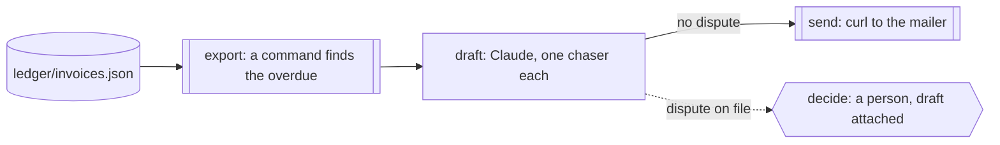

Month end, and the ledger shows what it always shows: a few invoices paid,
a few not yet due, and a handful overdue. Someone has to write to each late
customer, politely and accurately, and someone has to look properly at the
one where the customer says the delivery was short. The first job is
tedious; the second is judgement.

You want the overdue list decided by the ledger's arithmetic, not by a
model reading a spreadsheet. You want the chasers drafted from the ledger's
own numbers, with nothing offered that only you can offer: no waiver, no
plan, no threat. And you want any invoice a customer disputes to reach you
with the draft beside it, untouched by anyone else.

Obversa puts the arithmetic in a command and the judgement in a person's
step. A command reads the ledger and writes the overdue list; its exit code
is the result. Each overdue invoice then gets its own run: a Claude seat
drafts the chaser from the brief, and either the mailer sends it or, where
a dispute is on file, the run stops on a question for a person. This file
is a two-step ledger read followed by one two-step run per overdue invoice,
and the record shows every draft, every send and every decision.

## Run it

Set the project up as [Installation](/get-started/installation) describes.
Copy the file with `briefs/`, `ledger/` and `tools/` beside it, sign in to
Claude Code, and run it from that directory. Set `CHASE_MAIL_URL` to your
mailer's endpoint, or leave the fictional default:

```bash Terminal
npx tsx invoice-chase.ts
```

The output below is the proof's offline run, with scripted seats standing
in for the models, so the words are the script's and the shape is the run's.

```text Output, from the offline proof
▸ run
read-ledger ▸ dag (2 nodes)
read-ledger · node export: start
read-ledger › export • export
read-ledger › export · export met: `/Users/jonny/.nvm/versions/node/v22.13.0/bin/node` exited 0
read-ledger › export • export: pass
read-ledger · node export: done (pass)
read-ledger · node select: start
read-ledger › select • select
read-ledger › select • select: pass
read-ledger · node select: done (pass)
read-ledger ◂ dag pass
◂ run pass (0/0 tok)
▸ run
chase-inv-2002 ▸ dag (2 nodes)
chase-inv-2002 · node draft: start
chase-inv-2002 › draft • draft
chase-inv-2002 › draft engine:text
chase-inv-2002 › draft   stand-in: 3/1 tok
chase-inv-2002 › draft • draft: pass
chase-inv-2002 · node draft: done (pass)
chase-inv-2002 · node send: start
chase-inv-2002 › send • send
chase-inv-2002 › send · send met: `curl` exited 0
chase-inv-2002 › send • send: pass
chase-inv-2002 · node send: done (pass)
chase-inv-2002 ◂ dag pass
◂ run pass (3/1 tok)
▸ run
chase-inv-2003 ▸ dag (2 nodes)
chase-inv-2003 · node draft: start
chase-inv-2003 › draft • draft
chase-inv-2003 › draft engine:text
chase-inv-2003 › draft   stand-in: 3/1 tok
chase-inv-2003 › draft • draft: pass
chase-inv-2003 · node draft: done (pass)
chase-inv-2003 · node decide: start
chase-inv-2003 › decide • decide
chase-inv-2003 › decide • decide: paused
chase-inv-2003 · node decide: done (paused)
chase-inv-2003 ◂ dag paused
◂ run paused (3/1 tok)
▸ run
chase-inv-2004 ▸ dag (2 nodes)
chase-inv-2004 · node draft: start
chase-inv-2004 › draft • draft
chase-inv-2004 › draft engine:text
chase-inv-2004 › draft   stand-in: 3/1 tok
chase-inv-2004 › draft • draft: pass
chase-inv-2004 · node draft: done (pass)
chase-inv-2004 · node send: start
chase-inv-2004 › send • send
chase-inv-2004 › send · send met: `curl` exited 0
chase-inv-2004 › send • send: pass
chase-inv-2004 · node send: done (pass)
chase-inv-2004 ◂ dag pass
◂ run pass (3/1 tok)
{
  "status": "pass",
  "overdue": [
    "inv-2002",
    "inv-2003",
    "inv-2004"
  ],
  "chased": [
    "inv-2002",
    "inv-2004"
  ],
  "forAPerson": [
    "inv-2003"
  ],
  "invoices": [
    {
      "invoice": "inv-2002",
      "daysOverdue": 12,
      "disputed": false,
      "outcome": "pass",
      "sent": true
    },
    {
      "invoice": "inv-2003",
      "daysOverdue": 40,
      "disputed": true,
      "outcome": "paused",
      "sent": false
    },
    {
      "invoice": "inv-2004",
      "daysOverdue": 3,
      "disputed": false,
      "outcome": "pass",
      "sent": true
    }
  ]
}
```

Five invoices in the ledger, three overdue. Two chasers went to the mailer.
The third invoice carries a dispute about the delivered quantity, so its
run stopped on a question for a person, with the draft in `chase/` and the
dispute in the question. `history/` says which were chased and which wait,
and each run has its own record under `records/`.

## The file

The brief says what a chaser is and what it never offers:

```text briefs/chase.md
---
files: []
---

# Chase an overdue invoice

One short email per overdue invoice, written to `chase/<invoice id>.md`,
plain text, under 120 words, to the contact named on the invoice.

- Say which invoice, the amount, and how many days it is overdue, as the
  ledger states them. Do not round or restate the amount.
- Ask for payment or for the date it will be paid.
- Offer one way to reach us if something is wrong with the invoice.
- Never offer a discount, a waiver, a payment plan or a threat. Those are
  a person's to offer.

A disputed invoice is never chased by you. It goes to a person with your
draft beside it, and they decide.
```

The ledger is read by a command. The little script stands in for the export
a real ledger would give, and its exit code is the step's result:

```ts examples/use-cases/finance/invoice-chase.ts (excerpt) {3-4,12-13}
const ledger = await run(
  pipeline('read-ledger', [
    { name: 'export', job: commandJob('export', [process.execPath, 'tools/overdue.mjs']) },
    {
      name: 'select',
      job: fnJob('select', async (): Promise<Outcome> => {
        const overdue = JSON.parse(await readFile('chase/overdue.json', 'utf8')) as OverdueInvoice[];
        return { status: 'pass', summary: `${overdue.length} overdue`, data: overdue };
      }),
    },
  ]),
  { recordTo: 'records/read-ledger.jsonl', runId: 'read-ledger', onEvent },
);
if (ledger.outcome.status !== 'pass') throw new Error(`the ledger could not be read: ${ledger.outcome.summary}`);
const overdue = ((ledger.outcome.data as Record<string, Outcome | undefined>).select?.data ?? []) as OverdueInvoice[];
```

Each overdue invoice is one `dag()` run: the draft, then a send when
nothing is disputed, or a person's question when something is:

```ts examples/use-cases/finance/invoice-chase.ts (excerpt) {13-16,23-25,30-31}
function chase(invoice: OverdueInvoice) {
  const draftPath = `chase/${invoice.id}.md`;
  const draft = agentJob({
    label: 'draft',
    engine: 'drafter',
    prompt: [
      `Draft the chaser for ${invoice.id} to ${invoice.customer} (${invoice.contact}):`,
      `${invoice.currency} ${invoice.amount}, due ${invoice.due}, ${invoice.daysOverdue} days overdue.`,
      invoice.dispute ? `The customer has raised a dispute: ${invoice.dispute}` : 'No dispute is on file.',
      `Follow briefs/chase.md and write ${draftPath}.`,
    ].join('\n'),
  });
  return dag({
    name: `chase-${invoice.id}`,
    nodes: {
      draft,
      ...(invoice.dispute
        ? {
          decide: {
            needs: 'draft',
            job: approval('decide', {
              question: `${invoice.id} is disputed (${invoice.dispute}) Waive, chase anyway, or call them? The draft is in ${draftPath}.`,
              input: { invoice: invoice.id, dispute: invoice.dispute, draft: draftPath },
            }),
          },
        }
        : {
          send: {
            needs: 'draft',
            job: commandJob('send', ['curl', '-sS', '-X', 'POST', mailerUrl, '--data-binary', `@${draftPath}`]),
          },
        }),
    },
  });
}
```

The dispute goes into the question's input along with the draft's path, so
the person reads both before deciding. With nobody answering, the run stays
stopped there; a later answer reopens exactly that invoice's run through
the callbacks client. The send is a command, so the mailer's refusal would
fail the step on the record rather than pass silently.

<Accordion title="Full file">

```ts examples/use-cases/finance/invoice-chase.ts
import { appendFile, mkdir, readFile } from 'node:fs/promises';

import { claude } from '@obversa/engine-claude-cli';
import {
  agentJob,
  approval,
  commandJob,
  dag,
  fnJob,
  formatEvent,
  pipeline,
  run,
  type Outcome,
} from '@obversa/runtime';

/**
 * Chasing overdue invoices, with a person on every dispute. A command
 * reads the ledger and writes the overdue list, so what counts as overdue
 * is the ledger's arithmetic and not a model's. Then each overdue invoice
 * gets its own run: a Claude seat drafts the chaser from the brief, and
 * either the mailer sends it or, when the customer has raised a dispute,
 * the run stops on a question for a person with the draft beside it. The
 * record shows every draft, every send and every decision.
 */

interface OverdueInvoice {
  readonly id: string;
  readonly customer: string;
  readonly contact: string;
  readonly amount: string;
  readonly currency: string;
  readonly due: string;
  readonly daysOverdue: number;
  readonly dispute?: string;
}

const mailerUrl = process.env.CHASE_MAIL_URL ?? 'https://mail.example/api/send';
const drafter = claude('claude-sonnet-4-5');
const onEvent = (event: Parameters<typeof formatEvent>[0]) => console.log(formatEvent(event));

// Run one: the ledger, read by a command. Its exit code is the result, and
// the list it writes is what the rest of the file works from.
const ledger = await run(
  pipeline('read-ledger', [
    { name: 'export', job: commandJob('export', [process.execPath, 'tools/overdue.mjs']) },
    {
      name: 'select',
      job: fnJob('select', async (): Promise<Outcome> => {
        const overdue = JSON.parse(await readFile('chase/overdue.json', 'utf8')) as OverdueInvoice[];
        return { status: 'pass', summary: `${overdue.length} overdue`, data: overdue };
      }),
    },
  ]),
  { recordTo: 'records/read-ledger.jsonl', runId: 'read-ledger', onEvent },
);
if (ledger.outcome.status !== 'pass') throw new Error(`the ledger could not be read: ${ledger.outcome.summary}`);
const overdue = ((ledger.outcome.data as Record<string, Outcome | undefined>).select?.data ?? []) as OverdueInvoice[];

/** One overdue invoice: a draft, then a send or a person. */
function chase(invoice: OverdueInvoice) {
  const draftPath = `chase/${invoice.id}.md`;
  const draft = agentJob({
    label: 'draft',
    engine: 'drafter',
    prompt: [
      `Draft the chaser for ${invoice.id} to ${invoice.customer} (${invoice.contact}):`,
      `${invoice.currency} ${invoice.amount}, due ${invoice.due}, ${invoice.daysOverdue} days overdue.`,
      invoice.dispute ? `The customer has raised a dispute: ${invoice.dispute}` : 'No dispute is on file.',
      `Follow briefs/chase.md and write ${draftPath}.`,
    ].join('\n'),
  });
  return dag({
    name: `chase-${invoice.id}`,
    nodes: {
      draft,
      ...(invoice.dispute
        ? {
          decide: {
            needs: 'draft',
            job: approval('decide', {
              question: `${invoice.id} is disputed (${invoice.dispute}) Waive, chase anyway, or call them? The draft is in ${draftPath}.`,
              input: { invoice: invoice.id, dispute: invoice.dispute, draft: draftPath },
            }),
          },
        }
        : {
          send: {
            needs: 'draft',
            job: commandJob('send', ['curl', '-sS', '-X', 'POST', mailerUrl, '--data-binary', `@${draftPath}`]),
          },
        }),
    },
  });
}

interface Report {
  readonly invoice: string;
  readonly daysOverdue: number;
  readonly disputed: boolean;
  readonly outcome: string;
  readonly sent: boolean;
}

const reports: Report[] = [];
await mkdir('history', { recursive: true });
for (const invoice of overdue) {
  const result = await run(chase(invoice), {
    engines: { drafter: drafter.engine },
    recordTo: `records/${invoice.id}.jsonl`,
    runId: `chase-${invoice.id}`,
    onEvent,
  });
  const nodes = (result.outcome.data ?? {}) as Record<string, Outcome | undefined>;
  const report: Report = {
    invoice: invoice.id,
    daysOverdue: invoice.daysOverdue,
    disputed: invoice.dispute !== undefined,
    outcome: result.outcome.status,
    sent: nodes.send?.status === 'pass',
  };
  reports.push(report);
  await appendFile(
    report.sent ? 'history/chased.jsonl' : 'history/for-a-person.jsonl',
    `${JSON.stringify({ invoice: invoice.id, runId: `chase-${invoice.id}`, dispute: invoice.dispute ?? null })}\n`,
  );
}

console.log(JSON.stringify({
  status: 'pass',
  overdue: overdue.map((invoice) => invoice.id),
  chased: reports.filter((report) => report.sent).map((report) => report.invoice),
  forAPerson: reports.filter((report) => !report.sent).map((report) => report.invoice),
  invoices: reports,
}, null, 2));
```

</Accordion>

## The team's shape



## What the run did

The proof runs the file against a scripted seat and a stand-in for `curl`,
and checks what the page describes: three overdue invoices found by the
command, three drafts, two sends and none for the disputed invoice, and
that run stopped on its question with the dispute in it. Obversa recorded
the ledger read as one event log and each invoice's run as another, so the
record for the disputed invoice shows the draft and then the question, and
nothing after it.

The amounts and days in each chaser come from the ledger through the
prompt, and the brief forbids rounding them; the proof's drafts carry them
as written. Nothing here moves money. A payment, a waiver or a plan is the
person's to offer, and the run gives them the draft and the dispute to
offer it from.

## Next steps

- [A command decides the path](/patterns/command-kickback): a command's
  exit code as a step's result.
- [A person decides](/patterns/approval): the dispute step, and how an
  answer reaches a paused run.
- [Contract review](/workflows/contract-playbook): a model's drafts and a
  person's decision in another business field.
