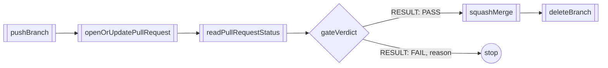

The change has passed its reviews. Now it has to reach the code host, and
that is where hand-run processes go wrong: a second pull request for the
same branch, a merge on green checks from an earlier commit, a work branch
left behind.

You want the last mile to be as strict as the reviews were. One pull
request per branch. A merge only when the checks you named ran and passed
on the exact revision you're merging. The reasoning that produced the
change carried into the merge message, so it ships with the code.

Obversa keeps that step as plain code a process calls after its review gate
passes. This file is that step for GitHub, or any host with the same five
operations: it pushes the work branch, opens or updates one pull request,
proves the change can merge, squashes the work into the base branch, and
deletes the work branch. A mock host proves it offline, and a GitHub adapter
prints the `gh` argument list for each operation.

## Run it

The file imports no package and runs offline. Copy it into a project with
`tsx` installed, as [Installation](/get-started/installation) describes:

```bash Terminal
npx tsx forge-helper.ts
```

```json Output
{
  "verdicts": {
    "unmergeable": "RESULT: FAIL because the branch cannot merge",
    "staleChecks": "RESULT: FAIL because the checks are from an earlier revision",
    "missingWorkflow": "RESULT: FAIL because the expected workflow never ran on the head revision",
    "failedCheck": "RESULT: FAIL because the tests check finished as failure"
  },
  "ship": {
    "verdict": "RESULT: PASS",
    "pullRequest": 5,
    "onePullRequest": true,
    "merged": true,
    "branchDeleted": true,
    "mergeMessage": "Add a request timeout so that a hung call cannot block the client.\n\nStop the retry loop when the caller aborts the request.",
    "operations": [
      "read pull request 1",
      "read pull request 2",
      "read pull request 3",
      "read pull request 4",
      "push feature/timeout-retry 8c4f21e (created)",
      "push feature/timeout-retry 8c4f21e (up to date)",
      "pull request 5 (created)",
      "pull request 5 (updated)",
      "read pull request 5",
      "squash merge 5",
      "delete branch feature/timeout-retry"
    ]
  },
  "ghArguments": {
    "pushBranch": [
      "gh",
      "api",
      "repos/example/checkout/git/refs/heads/feature/timeout-retry",
      "-X",
      "PATCH",
      "-f",
      "sha=8c4f21e"
    ],
    "openOrUpdatePullRequest": [
      "gh",
      "pr",
      "create",
      "--repo",
      "example/checkout",
      "--base",
      "main",
      "--head",
      "feature/timeout-retry",
      "--title",
      "Ship the checkout client change",
      "--body-file",
      "-"
    ],
    "readPullRequestStatus": [
      "gh",
      "pr",
      "view",
      "5",
      "--repo",
      "example/checkout",
      "--json",
      "mergeable,headRefOid,statusCheckRollup"
    ],
    "squashMerge": [
      "gh",
      "pr",
      "merge",
      "5",
      "--repo",
      "example/checkout",
      "--squash",
      "--subject",
      "Ship the checkout client change",
      "--body-file",
      "-"
    ],
    "deleteBranch": [
      "gh",
      "api",
      "repos/example/checkout/git/refs/heads/feature/timeout-retry",
      "-X",
      "DELETE"
    ]
  }
}
```

The report has three parts. `verdicts` holds the gate's verdict for each of
four fixture pull requests, and every one fails with its reason on the
line. `ship` holds the shipped change: the pull request number, the proof
that two calls opened one pull request, the merge, the branch deletion, the
synthesis message and the operation log. `ghArguments` holds the argument
list the GitHub adapter would pass to `gh` for each operation. The file
writes no files and makes no network calls, so run it again whenever you
like.

## The file

A host supplies five operations, the same way it supplies memory:

```ts examples/forge-helper.ts (excerpt)
export interface ForgeHost {
  /** Point the branch at the head. A second call with the same head does nothing. */
  pushBranch(input: PushInput): Promise<{ head: string }>;
  /** Open one pull request for the branch, or update the open one. */
  openOrUpdatePullRequest(input: PullRequestInput): Promise<{ number: number; head: string }>;
  /** Read the merge state, the head revision, and the check runs. */
  readPullRequestStatus(input: { repo: string; number: number }): Promise<PullRequestStatus>;
  /** Squash the pull request into the base branch with the given message. */
  squashMerge(input: { repo: string; number: number; message: string }): Promise<{ merged: boolean }>;
  /** Delete the work branch after the merge. */
  deleteBranch(input: { repo: string; branch: string }): Promise<{ deleted: boolean }>;
}
```

The pull request body and the squash message come from the same join of the
commit bodies, so the reasoning that produced the change is the reasoning
that ships it. The gate is a pure function over one status:

```ts examples/forge-helper.ts (excerpt) {2-3,9-10,13-14}
export function gateVerdict(status: PullRequestStatus, expectedWorkflow: string): string {
  const runs = status.checks.filter((check) => check.workflow === expectedWorkflow);
  const onHead = runs.filter((check) => check.revision === status.head);
  if (onHead.length === 0) {
    return runs.length > 0
      ? 'RESULT: FAIL because the checks are from an earlier revision'
      : 'RESULT: FAIL because the expected workflow never ran on the head revision';
  }
  if (!status.mergeable) {
    return 'RESULT: FAIL because the branch cannot merge';
  }
  const failed = onHead.find((check) => check.conclusion !== CHECK_PASS_CONCLUSION);
  if (failed) {
    return `RESULT: FAIL because the ${expectedWorkflow} check finished as ${failed.conclusion}`;
  }
  return 'RESULT: PASS';
}
```

The change ships only when the expected workflow ran and passed on the
exact head revision, and the branch can merge. A check run counts as passed
only when its conclusion is exactly `success`. Green checks on other
workflows don't ship a change, and neither do green checks from an earlier
revision. The demo ships only on the exact string `RESULT: PASS` and stops
on anything else.

The GitHub adapter returns one `gh` argument list per operation, each a pure
function of its input; a new branch uses `createRefArguments`, an open pull
request `listArguments` and `editArguments`. `runGh` is the execution layer,
one function with no logic of its own, that runs `gh` with a list and
returns the output. It needs a `gh` login, and nothing in this file calls
it. To use the step in a process, give your host the five operations; the
mock host in the file shows each one, and the gate stays the same for every
host.

<Accordion title="Full file">

```ts examples/forge-helper.ts
import { execFile } from 'node:child_process';

// A forge is a code host such as GitHub. This file is the shipping step that
// a process calls after its review gate passes. It pushes the work branch,
// opens or updates one pull request, proves that the change can merge, and
// squashes the work into the base branch.

// The port: five operations. A host supplies them in the same way it
// supplies memory. The mock host in this file proves them offline. The
// GitHub adapter prints the argument list for each operation.

export interface CheckRun {
  /** The workflow that ran, such as "tests". */
  readonly workflow: string;
  /** The revision the workflow ran on. */
  readonly revision: string;
  /** The result the forge reported. Only "success" counts as passed. */
  readonly conclusion: string;
}

export interface PullRequestStatus {
  /** False when the base branch and the work branch conflict. */
  readonly mergeable: boolean;
  /** The exact revision the pull request points to. */
  readonly head: string;
  /** The check runs on the pull request. */
  readonly checks: readonly CheckRun[];
}

export interface PushInput {
  readonly repo: string;
  readonly branch: string;
  readonly head: string;
}

export interface PullRequestInput {
  readonly repo: string;
  readonly branch: string;
  readonly base: string;
  readonly title: string;
  readonly body: string;
}

export interface ForgeHost {
  /** Point the branch at the head. A second call with the same head does nothing. */
  pushBranch(input: PushInput): Promise<{ head: string }>;
  /** Open one pull request for the branch, or update the open one. */
  openOrUpdatePullRequest(input: PullRequestInput): Promise<{ number: number; head: string }>;
  /** Read the merge state, the head revision, and the check runs. */
  readPullRequestStatus(input: { repo: string; number: number }): Promise<PullRequestStatus>;
  /** Squash the pull request into the base branch with the given message. */
  squashMerge(input: { repo: string; number: number; message: string }): Promise<{ merged: boolean }>;
  /** Delete the work branch after the merge. */
  deleteBranch(input: { repo: string; branch: string }): Promise<{ deleted: boolean }>;
}

// The gate. It is a pure function over one status. The change ships only
// when the expected workflow ran and passed on the exact head revision, and
// the branch can merge. A check run counts as passed only when its
// conclusion is exactly "success". Every other verdict is a fail with the
// reason written on the line.

const CHECK_PASS_CONCLUSION = 'success';

export function gateVerdict(status: PullRequestStatus, expectedWorkflow: string): string {
  const runs = status.checks.filter((check) => check.workflow === expectedWorkflow);
  const onHead = runs.filter((check) => check.revision === status.head);
  if (onHead.length === 0) {
    return runs.length > 0
      ? 'RESULT: FAIL because the checks are from an earlier revision'
      : 'RESULT: FAIL because the expected workflow never ran on the head revision';
  }
  if (!status.mergeable) {
    return 'RESULT: FAIL because the branch cannot merge';
  }
  const failed = onHead.find((check) => check.conclusion !== CHECK_PASS_CONCLUSION);
  if (failed) {
    return `RESULT: FAIL because the ${expectedWorkflow} check finished as ${failed.conclusion}`;
  }
  return 'RESULT: PASS';
}

// The synthesis. The pull request body and the squash merge message come
// from the same join of the commit bodies, so the reasoning that produced
// the change is the reasoning that ships it.

export function synthesisBody(commitBodies: readonly string[]): string {
  return commitBodies.join('\n\n');
}

// The GitHub adapter. Each operation is one pure function that returns the
// gh argument list. The report prints these lists. A new branch uses the
// create list; an open pull request uses the list and edit lists.

export function pushArguments(input: PushInput): string[] {
  return [
    'api',
    `repos/${input.repo}/git/refs/heads/${input.branch}`,
    '-X',
    'PATCH',
    '-f',
    `sha=${input.head}`,
  ];
}

export function createRefArguments(input: PushInput): string[] {
  return [
    'api',
    `repos/${input.repo}/git/refs`,
    '-f',
    `ref=refs/heads/${input.branch}`,
    '-f',
    `sha=${input.head}`,
  ];
}

export function pullRequestArguments(input: PullRequestInput): string[] {
  return [
    'pr',
    'create',
    '--repo',
    input.repo,
    '--base',
    input.base,
    '--head',
    input.branch,
    '--title',
    input.title,
    '--body-file',
    '-',
  ];
}

export function listArguments(input: { repo: string; branch: string }): string[] {
  return ['pr', 'list', '--repo', input.repo, '--head', input.branch, '--json', 'number'];
}

export function editArguments(input: { repo: string; number: number }): string[] {
  return ['pr', 'edit', String(input.number), '--repo', input.repo, '--body-file', '-'];
}

export function statusArguments(input: { repo: string; number: number }): string[] {
  return [
    'pr',
    'view',
    String(input.number),
    '--repo',
    input.repo,
    '--json',
    'mergeable,headRefOid,statusCheckRollup',
  ];
}

export function mergeArguments(input: { repo: string; number: number; subject: string }): string[] {
  return [
    'pr',
    'merge',
    String(input.number),
    '--repo',
    input.repo,
    '--squash',
    '--subject',
    input.subject,
    '--body-file',
    '-',
  ];
}

export function deleteArguments(input: { repo: string; branch: string }): string[] {
  return ['api', `repos/${input.repo}/git/refs/heads/${input.branch}`, '-X', 'DELETE'];
}

// The execution layer: one function, no logic of its own. It runs gh with an
// argument list and returns the output. It needs a gh login. Nothing in this
// file runs it.

export function runGh(list: readonly string[]): Promise<string> {
  return new Promise((resolve, reject) => {
    execFile('gh', [...list], { maxBuffer: 1024 * 1024 }, (error, stdout) => {
      if (error) reject(error);
      else resolve(stdout);
    });
  });
}

// The mock host. It keeps branches and pull requests in memory and writes an
// operation log. The seed supplies the fixture pull requests and the check
// runs for each live branch.

interface MockPullRequest {
  branch: string;
  base: string;
  head: string;
  title: string;
  body: string;
  mergeable: boolean;
  merged: boolean;
  checks: readonly CheckRun[];
}

export interface MockSeed {
  readonly pullRequests: readonly {
    number: number;
    branch: string;
    base: string;
    head: string;
    mergeable: boolean;
    checks: readonly CheckRun[];
  }[];
  readonly checksByBranch: Readonly<Record<string, readonly CheckRun[]>>;
}

export function mockForgeHost(seed: MockSeed): ForgeHost & { operations(): readonly string[] } {
  const operations: string[] = [];
  const branches = new Map<string, string>();
  const pullRequests = new Map<number, MockPullRequest>();
  let highest = 0;
  for (const fixture of seed.pullRequests) {
    pullRequests.set(fixture.number, {
      branch: fixture.branch,
      base: fixture.base,
      head: fixture.head,
      title: '',
      body: '',
      mergeable: fixture.mergeable,
      merged: false,
      checks: fixture.checks,
    });
    highest = Math.max(highest, fixture.number);
  }

  const short = (revision: string): string => revision.slice(0, 7);

  return {
    async pushBranch(input) {
      const current = branches.get(input.branch);
      if (current === input.head) {
        operations.push(`push ${input.branch} ${short(input.head)} (up to date)`);
        return { head: input.head };
      }
      branches.set(input.branch, input.head);
      operations.push(
        `push ${input.branch} ${short(input.head)} (${current === undefined ? 'created' : 'updated'})`,
      );
      return { head: input.head };
    },

    async openOrUpdatePullRequest(input) {
      const open = [...pullRequests.entries()].find(
        ([, request]) => request.branch === input.branch,
      );
      if (open) {
        const [number, request] = open;
        request.title = input.title;
        request.body = input.body;
        operations.push(`pull request ${number} (updated)`);
        return { number, head: request.head };
      }
      const number = highest + 1;
      highest = number;
      const head = branches.get(input.branch);
      if (head === undefined) {
        throw new Error(`Branch ${input.branch} was not pushed before the pull request`);
      }
      pullRequests.set(number, {
        branch: input.branch,
        base: input.base,
        head,
        title: input.title,
        body: input.body,
        mergeable: true,
        merged: false,
        checks: seed.checksByBranch[input.branch] ?? [],
      });
      operations.push(`pull request ${number} (created)`);
      return { number, head };
    },

    async readPullRequestStatus(input) {
      const request = pullRequests.get(input.number);
      if (!request) throw new Error(`No pull request ${input.number} on ${input.repo}`);
      operations.push(`read pull request ${input.number}`);
      return {
        mergeable: request.mergeable && !request.merged,
        head: request.head,
        checks: request.checks,
      };
    },

    async squashMerge(input) {
      const request = pullRequests.get(input.number);
      if (!request) throw new Error(`No pull request ${input.number} on ${input.repo}`);
      request.merged = true;
      operations.push(`squash merge ${input.number}`);
      return { merged: true };
    },

    async deleteBranch(input) {
      const deleted = branches.delete(input.branch);
      operations.push(`delete branch ${input.branch}`);
      return { deleted };
    },

    operations() {
      return [...operations];
    },
  };
}

// The demo. Four fixture pull requests print the four fail verdicts. Then
// the happy path ships one change live: push twice, open and update one
// pull request, pass the gate on the exact head revision, squash the
// synthesis into the base branch, and delete the work branch.

const REPO = 'example/checkout';
const BASE = 'main';
const BRANCH = 'feature/timeout-retry';
const HEAD = '8c4f21e';
const TITLE = 'Ship the checkout client change';
const EXPECTED_WORKFLOW = 'tests';
const COMMIT_BODIES = [
  'Add a request timeout so that a hung call cannot block the client.',
  'Stop the retry loop when the caller aborts the request.',
];

async function main(): Promise<void> {
  const host = mockForgeHost({
    pullRequests: [
      {
        number: 1,
        branch: 'feature/unmergeable-change',
        base: BASE,
        head: 'a1b2c3d',
        mergeable: false,
        checks: [
          { workflow: EXPECTED_WORKFLOW, revision: 'a1b2c3d', conclusion: 'success' },
          { workflow: 'lint', revision: 'a1b2c3d', conclusion: 'success' },
        ],
      },
      {
        number: 2,
        branch: 'feature/stale-checks',
        base: BASE,
        head: 'b4c5d6e',
        mergeable: true,
        checks: [{ workflow: EXPECTED_WORKFLOW, revision: '0e1f2a3', conclusion: 'success' }],
      },
      {
        number: 3,
        branch: 'feature/missing-workflow',
        base: BASE,
        head: 'c6d7e8f',
        mergeable: true,
        checks: [{ workflow: 'lint', revision: 'c6d7e8f', conclusion: 'success' }],
      },
      {
        number: 4,
        branch: 'feature/failed-check',
        base: BASE,
        head: 'd8e9f0a',
        mergeable: true,
        checks: [{ workflow: EXPECTED_WORKFLOW, revision: 'd8e9f0a', conclusion: 'failure' }],
      },
    ],
    checksByBranch: {
      [BRANCH]: [{ workflow: EXPECTED_WORKFLOW, revision: HEAD, conclusion: 'success' }],
    },
  });

  const verdicts = {
    unmergeable: gateVerdict(
      await host.readPullRequestStatus({ repo: REPO, number: 1 }),
      EXPECTED_WORKFLOW,
    ),
    staleChecks: gateVerdict(
      await host.readPullRequestStatus({ repo: REPO, number: 2 }),
      EXPECTED_WORKFLOW,
    ),
    missingWorkflow: gateVerdict(
      await host.readPullRequestStatus({ repo: REPO, number: 3 }),
      EXPECTED_WORKFLOW,
    ),
    failedCheck: gateVerdict(
      await host.readPullRequestStatus({ repo: REPO, number: 4 }),
      EXPECTED_WORKFLOW,
    ),
  };

  const body = synthesisBody(COMMIT_BODIES);
  await host.pushBranch({ repo: REPO, branch: BRANCH, head: HEAD });
  await host.pushBranch({ repo: REPO, branch: BRANCH, head: HEAD });
  const opened = await host.openOrUpdatePullRequest({
    repo: REPO,
    branch: BRANCH,
    base: BASE,
    title: TITLE,
    body,
  });
  const updated = await host.openOrUpdatePullRequest({
    repo: REPO,
    branch: BRANCH,
    base: BASE,
    title: TITLE,
    body,
  });
  const status = await host.readPullRequestStatus({ repo: REPO, number: opened.number });
  const verdict = gateVerdict(status, EXPECTED_WORKFLOW);
  if (verdict !== 'RESULT: PASS') {
    throw new Error(`The ship gate did not pass: ${verdict}`);
  }
  const merge = await host.squashMerge({ repo: REPO, number: opened.number, message: body });
  const removal = await host.deleteBranch({ repo: REPO, branch: BRANCH });

  console.log(
    JSON.stringify(
      {
        verdicts,
        ship: {
          verdict,
          pullRequest: updated.number,
          onePullRequest: opened.number === updated.number,
          merged: merge.merged,
          branchDeleted: removal.deleted,
          mergeMessage: body,
          operations: host.operations(),
        },
        ghArguments: {
          pushBranch: ['gh', ...pushArguments({ repo: REPO, branch: BRANCH, head: HEAD })],
          openOrUpdatePullRequest: [
            'gh',
            ...pullRequestArguments({ repo: REPO, branch: BRANCH, base: BASE, title: TITLE, body }),
          ],
          readPullRequestStatus: ['gh', ...statusArguments({ repo: REPO, number: opened.number })],
          squashMerge: [
            'gh',
            ...mergeArguments({ repo: REPO, number: opened.number, subject: TITLE }),
          ],
          deleteBranch: ['gh', ...deleteArguments({ repo: REPO, branch: BRANCH })],
        },
      },
      null,
      2,
    ),
  );
}

void main();
```

</Accordion>

## The shape



## Next steps

- [Feature delivery](/workflows/feature-team): the team whose reviewed
  change this step ships.
- [Proof-bound acceptance and approval](/reviewing/proof-acceptance): bind
  the approval before this step to the exact bytes it judged.
- [Memory](/concepts/memory): how a stage's reasoning lands in the commit
  that this step squashes.
