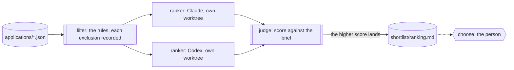

Sixty applications for one support engineer, and a hiring manager with an
afternoon. Some applicants don't meet the stated requirements, and saying
so should take a rule, not a read. The rest deserve a proper ranking
against what the role needs, with a reason for each place. And who gets a
call is the manager's decision, not a model's.

You want the gates to be rules a script checks, so every exclusion has the
rule beside it and nobody is dropped on an impression. You want the
ranking of the rest done against your brief and checked against it, not
taken on trust from one model. And you want to read that ranking and pick
the shortlist yourself.

Obversa puts the rules in a function, the ranking in a tournament, and the
decision in your hands. A script applies the filters and writes the
eligible and the excluded, each with its rule. Two rankers from different
model families rank the eligible applicants against the brief, each in its
own worktree; a judge function scores each ranking against the brief, and
only the better one lands. Then the run stops for your shortlist. This file
is a three-stage pipeline: the gates, the tournament, and the person.

## Run it

Set the project up as [Installation](/get-started/installation) describes.
Copy the file with `briefs/`, `applications/` and `filters.json` beside it
into a folder of its own, sign in to Claude Code and Codex, and run it
there. The folder becomes a Git repository if it isn't one, because each
ranker works on a branch and the winner lands:

```bash Terminal
npx tsx shortlist.ts
```

The output below is the proof's offline run, with scripted seats standing
in for the models, so the words are the script's and the shape is the run's.

```text Output, from the offline proof
▸ run
shortlist ▸ dag (3 nodes)
shortlist · node filter: start
shortlist › filter • filter
shortlist › filter • filter: pass
shortlist · node filter: done (pass)
shortlist · node rank: start
shortlist › rank › ranking • ranking
shortlist › rank › ranking › #0 • ranker-claude
shortlist › rank › ranking › #0 engine:text
shortlist › rank › ranking › #0   stand-in: 3/1 tok
shortlist › rank › ranking › #0 • ranker-claude: pass
ranking candidate 0: score 0
shortlist › rank › ranking › #1 • ranker-codex
shortlist › rank › ranking › #1 engine:text
shortlist › rank › ranking › #1   gpt-5.6-luna: 42/7 tok
shortlist › rank › ranking › #1 • ranker-codex: pass
ranking candidate 1: score 6
shortlist › rank › ranking • ranking: pass
shortlist · node rank: done (pass)
shortlist · node choose: start
shortlist › choose • choose
shortlist › choose • choose: paused
shortlist · node choose: done (paused)
shortlist ◂ dag paused
◂ run paused (45/8 tok, 30 tok from cache)
{
  "status": "paused",
  "filter": {
    "eligible": [
      "a-01",
      "a-04",
      "a-06"
    ],
    "excluded": [
      "a-02",
      "a-03",
      "a-05"
    ]
  },
  "rank": "tournament \"ranking\": landed candidate 1 (score 6) of 2",
  "choose": "paused"
}
```

Six applications, three eligible. The gates excluded one applicant on
years, one on the required skill and one on work region, and wrote each
rule beside the name in `shortlist/excluded.json`. Two rankings were
written; the judge scored one lower for dropping an eligible applicant and
ranking one the gates had excluded, and the complete ranking landed as
`shortlist/ranking.md`. The run stopped on the person's question.

## The file

The gates are three rules, and the function returns the one an application
fails:

```ts examples/use-cases/hiring/shortlist.ts (excerpt) {2-4}
function failedRule(application: Application, filters: Filters): string | null {
  if (application.yearsInSupport < filters.minYearsInSupport) return `fewer than ${filters.minYearsInSupport} years in support`;
  if (!application.skills.includes(filters.requiredSkill)) return `no ${filters.requiredSkill} skill`;
  if (!filters.workRegions.includes(application.workRegion)) return `work region ${application.workRegion} is not one of ${filters.workRegions.join(', ')}`;
  return null;
}
```

The judge is a function too. It scores a ranking against the brief: a point
for each eligible applicant present, two more for all of them, a point for
a reason on every line, and three off for each applicant the gates
excluded:

```ts examples/use-cases/hiring/shortlist.ts (excerpt) {5-8}
function scoreRanking(text: string, eligible: readonly string[], excluded: readonly string[]): number {
  const lines = text.split('\n').map((line) => /^\d+\.\s+(\S+):\s*(.*)$/.exec(line)).filter((match) => match !== null);
  const ranked = lines.map((match) => match![1]!);
  let score = 0;
  for (const id of eligible) if (ranked.includes(id)) score += 1;
  if (eligible.every((id) => ranked.includes(id))) score += 2;
  for (const id of excluded) if (ranked.includes(id)) score -= 3;
  if (lines.every((match) => match![2]!.trim().length > 0)) score += 1;
  return score;
}
```

The tournament runs one ranker per model family, each writing
`shortlist/ranking.md` in its own worktree, and the judge reads that file
and the gates' result from the worktree. Only the highest-scoring ranking
merges onto the main branch. Then the person is asked:

```ts examples/use-cases/hiring/shortlist.ts (excerpt) {3-4,9-10,18-19}
  {
    name: 'rank',
    job: tournament({
      name: 'ranking',
      n: engineNames.length,
      concurrency: 1,
      candidate: (i) => agentJob({
        label: `ranker-${engineNames[i]}`,
        engine: engineNames[i]!,
        prompt: 'Rank the applicants in shortlist/eligible.json as briefs/role.md says, and write shortlist/ranking.md.',
      }),
      judge: async (outcome: Outcome, ctx: JobContext) => {
        if (outcome.status !== 'pass') return -1;
        const read = async (path: string) => readFile(join(ctx.workspace.dir, 'shortlist', path), 'utf8');
        const eligible = (JSON.parse(await read('eligible.json')) as Application[]).map((application) => application.id);
        const excluded = (JSON.parse(await read('excluded.json')) as { id: string }[]).map((entry) => entry.id);
        return scoreRanking(await read('ranking.md'), eligible, excluded);
      },
    }),
  },
  {
    name: 'choose',
    job: approval('choose', {
      question: 'Who is shortlisted? The ranking that held against the brief is in shortlist/ranking.md.',
      input: { ranking: 'shortlist/ranking.md', excluded: 'shortlist/excluded.json' },
    }),
  },
]);
```

The gates' result is committed before the rankers start, so each worktree
holds the same eligible list; a ranker can't see an application the gates
excluded unless it goes looking. The brief tells each ranker to rank the
eligible file and nobody else, and the judge takes points off when one
does.

<Accordion title="The brief">

```text briefs/role.md
---
files: []
---

# Rank the eligible applicants

The role is a support engineer for a small team that runs its own review
loop. The filters have already run; you see only the applicants who passed
them, in `shortlist/eligible.json`, with the notes each one wrote.

Write `shortlist/ranking.md`: every eligible applicant, best fit first, one
line each in the form `1. <id>: <reason>`. The reason names something from
that applicant's own notes, not a guess about them. Rank on evidence of
having run a support queue and of writing that a customer could read.

Rank only the applicants in the file. Add nobody, drop nobody. A person
reads the ranking and decides who is shortlisted; you decide nothing about
anyone.
```

</Accordion>

<Accordion title="Full file">

```ts examples/use-cases/hiring/shortlist.ts
import { execFileSync } from 'node:child_process';
import { existsSync } from 'node:fs';
import { mkdir, readdir, readFile, writeFile } from 'node:fs/promises';
import { join } from 'node:path';

import { claude } from '@obversa/engine-claude-cli';
import { codex } from '@obversa/engine-codex-cli';
import {
  agentJob,
  approval,
  fnJob,
  formatEvent,
  pipeline,
  run,
  tournament,
  type JobContext,
  type Outcome,
} from '@obversa/runtime';

/**
 * A shortlist with verifiable gates first and a person last. A script
 * applies the filters to every application and records who was excluded
 * and by which rule, so the gates are checkable and nobody is excluded by
 * a model's impression. Two rankers from different model families then
 * rank the eligible applicants against the brief, each in its own
 * worktree; a judge function scores each ranking against the brief, and
 * only the better one lands. A person reads that ranking and decides who
 * is shortlisted. The run never contacts an applicant.
 */

interface Application {
  readonly id: string;
  readonly name: string;
  readonly yearsInSupport: number;
  readonly skills: readonly string[];
  readonly workRegion: string;
  readonly notes: string;
}

interface Filters {
  readonly minYearsInSupport: number;
  readonly requiredSkill: string;
  readonly workRegions: readonly string[];
}

/** The gates. Each returns the rule an application fails, or null. */
function failedRule(application: Application, filters: Filters): string | null {
  if (application.yearsInSupport < filters.minYearsInSupport) return `fewer than ${filters.minYearsInSupport} years in support`;
  if (!application.skills.includes(filters.requiredSkill)) return `no ${filters.requiredSkill} skill`;
  if (!filters.workRegions.includes(application.workRegion)) return `work region ${application.workRegion} is not one of ${filters.workRegions.join(', ')}`;
  return null;
}

/** Score a ranking against the brief: every eligible applicant once, each with a reason, nobody else. */
function scoreRanking(text: string, eligible: readonly string[], excluded: readonly string[]): number {
  const lines = text.split('\n').map((line) => /^\d+\.\s+(\S+):\s*(.*)$/.exec(line)).filter((match) => match !== null);
  const ranked = lines.map((match) => match![1]!);
  let score = 0;
  for (const id of eligible) if (ranked.includes(id)) score += 1;
  if (eligible.every((id) => ranked.includes(id))) score += 2;
  for (const id of excluded) if (ranked.includes(id)) score -= 3;
  if (lines.every((match) => match![2]!.trim().length > 0)) score += 1;
  return score;
}

// The tournament forks each ranker's worktree from the last commit and
// lands the winner's ranking on a branch, so the folder is a Git
// repository and the gates' result is committed before the rankers start.
const git = (...args: string[]) => execFileSync('git', ['-c', 'user.name=shortlist', '-c', 'user.email=shortlist@example.invalid', ...args], { stdio: 'ignore' });
if (!existsSync('.git')) {
  git('init', '-q');
  git('add', '-A');
  git('commit', '-q', '-m', 'applications as received');
}

const filters = JSON.parse(await readFile('filters.json', 'utf8')) as Filters;
const applications: Application[] = [];
for (const file of (await readdir('applications')).filter((name) => name.endsWith('.json')).sort()) {
  applications.push(JSON.parse(await readFile(join('applications', file), 'utf8')) as Application);
}
const rankers = { claude: claude('claude-sonnet-4-5'), codex: codex('gpt-5.6-luna') };
const engineNames = ['claude', 'codex'] as const;

const shortlist = pipeline('shortlist', [
  {
    name: 'filter',
    job: fnJob('filter', async (): Promise<Outcome> => {
      const eligible = applications.filter((application) => failedRule(application, filters) === null);
      const excluded = applications
        .filter((application) => failedRule(application, filters) !== null)
        .map((application) => ({ id: application.id, rule: failedRule(application, filters) }));
      await mkdir('shortlist', { recursive: true });
      await writeFile('shortlist/eligible.json', `${JSON.stringify(eligible, null, 2)}\n`);
      await writeFile('shortlist/excluded.json', `${JSON.stringify(excluded, null, 2)}\n`);
      git('add', 'shortlist');
      git('commit', '-q', '-m', 'the gates: who is eligible and who was excluded by which rule');
      return {
        status: 'pass',
        summary: `${eligible.length} eligible, ${excluded.length} excluded by a rule`,
        data: { eligible: eligible.map((application) => application.id), excluded: excluded.map((entry) => entry.id) },
      };
    }),
  },
  {
    name: 'rank',
    job: tournament({
      name: 'ranking',
      n: engineNames.length,
      concurrency: 1,
      candidate: (i) => agentJob({
        label: `ranker-${engineNames[i]}`,
        engine: engineNames[i]!,
        prompt: 'Rank the applicants in shortlist/eligible.json as briefs/role.md says, and write shortlist/ranking.md.',
      }),
      judge: async (outcome: Outcome, ctx: JobContext) => {
        if (outcome.status !== 'pass') return -1;
        const read = async (path: string) => readFile(join(ctx.workspace.dir, 'shortlist', path), 'utf8');
        const eligible = (JSON.parse(await read('eligible.json')) as Application[]).map((application) => application.id);
        const excluded = (JSON.parse(await read('excluded.json')) as { id: string }[]).map((entry) => entry.id);
        return scoreRanking(await read('ranking.md'), eligible, excluded);
      },
    }),
  },
  {
    name: 'choose',
    job: approval('choose', {
      question: 'Who is shortlisted? The ranking that held against the brief is in shortlist/ranking.md.',
      input: { ranking: 'shortlist/ranking.md', excluded: 'shortlist/excluded.json' },
    }),
  },
]);

const result = await run(shortlist, {
  engines: { claude: rankers.claude.engine, codex: rankers.codex.engine },
  recordTo: 'records/shortlist.jsonl',
  runId: 'shortlist',
  onEvent: (event) => console.log(formatEvent(event)),
});

const nodes = (result.outcome.data ?? {}) as Record<string, Outcome | undefined>;
console.log(JSON.stringify({
  status: result.outcome.status,
  filter: nodes.filter?.data ?? null,
  rank: nodes.rank?.summary ?? null,
  choose: nodes.choose?.status ?? null,
}, null, 2));
```

</Accordion>

## The team's shape



## What the run did

The proof runs the file against two scripted seats and checks what the
page describes: three eligible and three excluded with their rules, the
complete ranking on the main branch and not the one with a stray, and the
run stopped on the person's question. Obversa recorded the run as one
event log, so it shows the gates, the two candidate branches, the judge's
score for each, the merge of the winner, and the question, in order.

Nothing here contacts an applicant, and nothing decides who is hired. The
rules are the hiring manager's, written where anyone can read them; the
ranking is checked against the brief before a person sees it; and the
shortlist is the person's.

## Next steps

- [Three candidates, one winner](/patterns/tournament): the tournament on
  its own, with a real run.
- [A person decides](/patterns/approval): the shortlist question, and how
  an answer reaches a paused run.
- [Backlog grooming](/workflows/backlog-groom-then-rank): another person's
  ranking, of stories rather than applicants.
