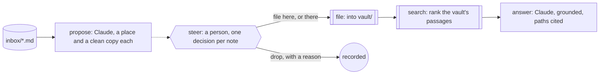

The day leaves a trail of notes: a meeting in shorthand, a pile of links, a
half-formed idea. They sit in an inbox because filing them properly takes
the one thing the day didn't leave, attention. A vault that fills itself
with everything is no better than the inbox; a vault someone curates is
the one that answers questions a month later.

You want the filing proposed for you: where each note belongs, in the
vault's own folders, cleaned up but with every fact kept. You want to
decide each one, file it there, file it somewhere else, or drop it with a
reason, so the vault stays yours. And when you ask it a question, you want
the answer to come from the vault's own pages, with the path of each
passage it used.

Obversa keeps the person between the inbox and the vault. A Claude seat
reads the inbox and the vault's folders and proposes a place and a cleaned
version for each note. Your decision on each is a step, and only what you
kept is written where you said. Then a question is answered by searching
the vault, grounding the seat on the passages that matched, and citing
their paths. This file is one run: propose, steer, file, search, answer.

## Run it

Set the project up as [Installation](/get-started/installation) describes.
Copy the file with `briefs/`, `inbox/`, `vault/`, `steering.json` and
`questions.json` beside it, sign in to Claude Code, and run it from that
directory. `steering.json` carries the person's decisions from the last
pass:

```bash Terminal
npx tsx vault-curator.ts
```

The output below is the proof's offline run, with scripted seats standing
in for the models, so the words are the script's and the shape is the run's.

```text Output, from the offline proof
▸ run
vault-curator ▸ dag (8 nodes)
vault-curator · node propose: start
vault-curator › propose • propose
vault-curator › propose engine:text
vault-curator › propose   stand-in: 3/1 tok
vault-curator › propose • propose: pass
vault-curator · node propose: done (pass)
vault-curator · node parse: start
vault-curator › parse • parse
vault-curator › parse • parse: pass
vault-curator · node parse: done (pass)
vault-curator · node steer-n-01.md: start
vault-curator › steer-n-01.md • steer-n-01.md
vault-curator · node steer-n-02.md: start
vault-curator › steer-n-02.md • steer-n-02.md
vault-curator · node steer-n-03.md: start
vault-curator › steer-n-03.md • steer-n-03.md
vault-curator › steer-n-01.md • steer-n-01.md: pass
vault-curator › steer-n-02.md • steer-n-02.md: fail
vault-curator › steer-n-03.md • steer-n-03.md: pass
vault-curator · node steer-n-01.md: done (pass)
vault-curator · node steer-n-02.md: done (fail)
vault-curator · node steer-n-03.md: done (pass)
vault-curator · node file: start
vault-curator › file • file
vault-curator › file • file: pass
vault-curator · node file: done (pass)
vault-curator · node search: start
vault-curator › search • search
vault-curator › search • search: pass
vault-curator · node search: done (pass)
vault-curator · node answer: start
vault-curator › answer • answer
vault-curator › answer engine:text
vault-curator › answer   stand-in: 3/1 tok
vault-curator › answer • answer: pass
vault-curator · node answer: done (pass)
vault-curator ◂ dag pass
◂ run pass (6/2 tok)
{
  "status": "pass",
  "proposed": [
    [
      "n-01.md",
      "projects/review-loop-decisions.md"
    ],
    [
      "n-02.md",
      "reading/links.md"
    ],
    [
      "n-03.md",
      "people/reading-group.md"
    ]
  ],
  "filed": [
    {
      "note": "n-01.md",
      "path": "projects/review-loop-decisions.md"
    },
    {
      "note": "n-03.md",
      "path": "ideas/reading-group-by-impact.md"
    }
  ],
  "dropped": [
    {
      "note": "n-02.md",
      "reason": "A link dump. Keep it in the browser, not the vault."
    }
  ],
  "searched": [
    "/memories/projects/review-loop-decisions.md",
    "/memories/projects/review-loop.md",
    "/memories/ideas/reading-group-by-impact.md",
    "/memories/people/reading-group.md"
  ],
  "answered": [
    "q-1"
  ]
}
```

Three notes, three proposals, three decisions. The meeting note was filed
as proposed. The link dump was dropped, with the reason on the record. The
idea was proposed for the existing reading-group page and the person moved
it to a page of its own instead, so nothing was overwritten. The search
for the question found the newly filed decision and the older loop page,
and the answer cites both. The run's record is `records/vault-curator.jsonl`.

## The file

The brief gives the seat its two jobs and keeps the vault out of its hands:

```text briefs/vault.md
---
files: []
---

# Curate a notes vault

Two jobs.

**Propose.** For each note in `inbox/`, answer with one JSON array and
nothing else: `[{"note": "<file name>", "path": "<folder>/<slug>.md",
"title": "<title>", "body": "<the note, cleaned>"}]`. The path is where it
belongs in `vault/`, using the folders that exist there when one fits.
Cleaning means fixing the shorthand and keeping every fact; add nothing.

**Answer.** When asked a question, answer only from the vault passages in
the prompt, and cite the path of each passage you use. Say what the vault
doesn't settle.

A person decides what is filed and where. You never write into the vault.
```

Each note gets its own decision step. A decision the person already made
is the step's answer, and a decision may carry a different path; a drop
fails the step, and `optional: true` keeps the run going:

```ts examples/use-cases/knowledge/vault-curator.ts (excerpt) {5-6,8-10}
const steer: Record<string, DagNode> = Object.fromEntries(notes.map((note) => {
  const decision = steering[note];
  const prompt = `File the proposal for ${note} into the vault?`;
  return [`steer-${note}`, {
    needs: 'parse',
    optional: true,
    job: typeof decision === 'object'
      ? approval(`steer-${note}`, { question: prompt, answer: () => decision })
      : approval(`steer-${note}`, { question: prompt }),
  }];
}));
```

`file` writes each kept note where the person said, `search` ranks the
vault's passages for the question and grounds the seat on the files that
matched, and `answer` writes the answer with the paths cited:

```ts examples/use-cases/knowledge/vault-curator.ts (excerpt) {5-6,20-22,29-30}
    file: {
      needs: ['parse', ...Object.keys(steer)],
      job: fnJob('file', async (ctx): Promise<Outcome> => {
        const proposals = ctx.needs?.parse?.data as Proposal[];
        const filed: { note: string; path: string }[] = [];
        for (const proposal of proposals) {
          if (ctx.needs?.[`steer-${proposal.note}`]?.status !== 'pass') continue;
          const decision = steering[proposal.note];
          const path = typeof decision === 'object' && decision.path ? decision.path : proposal.path;
          await mkdir(dirname(join('vault', path)), { recursive: true });
          await writeFile(join('vault', path), `# ${proposal.title}\n\n${proposal.body.trim()}\n`);
          filed.push({ note: proposal.note, path });
        }
        return { status: 'pass', summary: `${filed.length} of ${proposals.length} notes filed`, data: { filed } };
      }),
    },
    search: {
      needs: 'file',
      job: fnJob('search', async (): Promise<Outcome> => {
        const hits = await vault.search(question.text, { limit: 4 });
        const paths = [...new Set(hits.map((hit) => hit.path))];
        const grounded = await ground(vault.memory, { sources: paths.map((path) => ({ path })) });
        if (!grounded.ok) throw new Error(grounded.error.message);
        return { status: 'pass', summary: `${hits.length} passages in ${paths.length} files`, data: { paths, prompt: grounded.value.prompt } };
      }),
    },
    answer: {
      needs: 'search',
      job: agentJob({
        label: 'answer',
        engine: 'curator',
        prompt: (ctx) => {
          const { prompt } = ctx.needs?.search?.data as { prompt: string };
          return `${prompt}\n\nAnswer as briefs/vault.md says and write answers/${question.id}.md.\n\nQuestion: ${question.text}`;
        },
      }),
    },
```

The vault is a folder of Markdown files, searched by
[Markdown Memory](/packages/memory-markdown) with no index or service.
Search returns passages with a path, a line range and a score; the path,
not the passage, goes to `ground`, which reads the file through a read-only
view of the memory port and marks it as data rather than instructions
before the seat sees it.

<Accordion title="Full file">

```ts examples/use-cases/knowledge/vault-curator.ts
import { mkdir, readdir, readFile, writeFile } from 'node:fs/promises';
import { dirname, join } from 'node:path';

import { claude } from '@obversa/engine-claude-cli';
import { openMarkdownCorpus } from '@obversa/memory-markdown';
import {
  agentJob,
  approval,
  dag,
  fnJob,
  formatEvent,
  run,
  type ApprovalAnswer,
  type DagNode,
  type Outcome,
} from '@obversa/runtime';
import { ground } from '@obversa/runtime/memory';

/**
 * A notes vault kept by a person, with a model doing the filing and the
 * finding. A Claude seat reads the day's inbox and proposes, for each
 * note, where it belongs in the vault and a cleaned version. The person
 * decides each one: file it as proposed, file it somewhere else, or drop
 * it with a reason. Only what the person kept is written into the vault.
 * Then a question is answered by searching the vault, grounding the seat
 * on the passages that matched, and citing their paths.
 */

interface Proposal {
  readonly note: string;
  readonly path: string;
  readonly title: string;
  readonly body: string;
}

interface Question {
  readonly id: string;
  readonly text: string;
}

type Steering = ApprovalAnswer & { readonly path?: string };

const notes = (await readdir('inbox')).filter((name) => name.endsWith('.md')).sort();
const steering = JSON.parse(await readFile('steering.json', 'utf8')) as Record<string, Steering | string>;
const question = (JSON.parse(await readFile('questions.json', 'utf8')) as Question[])[0]!;
const vault = openMarkdownCorpus({ directory: 'vault' });
const seat = claude('claude-sonnet-4-5');

/** The person's decision on each proposal. A drop fails its step without stopping the run. */
const steer: Record<string, DagNode> = Object.fromEntries(notes.map((note) => {
  const decision = steering[note];
  const prompt = `File the proposal for ${note} into the vault?`;
  return [`steer-${note}`, {
    needs: 'parse',
    optional: true,
    job: typeof decision === 'object'
      ? approval(`steer-${note}`, { question: prompt, answer: () => decision })
      : approval(`steer-${note}`, { question: prompt }),
  }];
}));

const curator = dag({
  name: 'vault-curator',
  nodes: {
    propose: agentJob({
      label: 'propose',
      engine: 'curator',
      workspaceMode: 'read',
      tools: ['Read', 'Glob'],
      prompt: `Read the notes in inbox/ (${notes.join(', ')}) and the folders in vault/, and propose as briefs/vault.md says.`,
    }),
    parse: {
      needs: 'propose',
      job: fnJob('parse', (ctx): Outcome => {
        const proposals = JSON.parse(String(ctx.needs?.propose?.data ?? '[]')) as Proposal[];
        return { status: 'pass', summary: `${proposals.length} proposals`, data: proposals };
      }),
    },
    ...steer,
    file: {
      needs: ['parse', ...Object.keys(steer)],
      job: fnJob('file', async (ctx): Promise<Outcome> => {
        const proposals = ctx.needs?.parse?.data as Proposal[];
        const filed: { note: string; path: string }[] = [];
        for (const proposal of proposals) {
          if (ctx.needs?.[`steer-${proposal.note}`]?.status !== 'pass') continue;
          const decision = steering[proposal.note];
          const path = typeof decision === 'object' && decision.path ? decision.path : proposal.path;
          await mkdir(dirname(join('vault', path)), { recursive: true });
          await writeFile(join('vault', path), `# ${proposal.title}\n\n${proposal.body.trim()}\n`);
          filed.push({ note: proposal.note, path });
        }
        return { status: 'pass', summary: `${filed.length} of ${proposals.length} notes filed`, data: { filed } };
      }),
    },
    search: {
      needs: 'file',
      job: fnJob('search', async (): Promise<Outcome> => {
        const hits = await vault.search(question.text, { limit: 4 });
        const paths = [...new Set(hits.map((hit) => hit.path))];
        const grounded = await ground(vault.memory, { sources: paths.map((path) => ({ path })) });
        if (!grounded.ok) throw new Error(grounded.error.message);
        return { status: 'pass', summary: `${hits.length} passages in ${paths.length} files`, data: { paths, prompt: grounded.value.prompt } };
      }),
    },
    answer: {
      needs: 'search',
      job: agentJob({
        label: 'answer',
        engine: 'curator',
        prompt: (ctx) => {
          const { prompt } = ctx.needs?.search?.data as { prompt: string };
          return `${prompt}\n\nAnswer as briefs/vault.md says and write answers/${question.id}.md.\n\nQuestion: ${question.text}`;
        },
      }),
    },
  },
});

const result = await run(curator, {
  engines: { curator: seat.engine },
  recordTo: 'records/vault-curator.jsonl',
  runId: 'vault-curator',
  onEvent: (event) => console.log(formatEvent(event)),
});

const nodes = (result.outcome.data ?? {}) as Record<string, Outcome | undefined>;
console.log(JSON.stringify({
  status: result.outcome.status,
  proposed: (nodes.parse?.data as Proposal[] | undefined)?.map((proposal) => [proposal.note, proposal.path]) ?? [],
  filed: (nodes.file?.data as { filed: unknown[] } | undefined)?.filed ?? [],
  dropped: notes.filter((note) => nodes[`steer-${note}`]?.status === 'fail').map((note) => ({ note, reason: nodes[`steer-${note}`]?.summary ?? null })),
  searched: (nodes.search?.data as { paths: string[] } | undefined)?.paths ?? [],
  answered: nodes.answer?.status === 'pass' ? [question.id] : [],
}, null, 2));
```

</Accordion>

## The team's shape



## What the run did

The proof runs the file against a scripted seat and checks what the page
describes: two notes filed at the paths the person chose, the existing
page untouched, the dropped note nowhere in the vault, the filed decision
among the passages the search found, and an answer that cites it. Obversa
recorded the run as one event log, so it shows the proposals, the three
decisions with their outcomes, the filing, the search, and the answer in
order.

The person's decisions here come from a file, because the run has to
complete offline. In use, a proposal with no decision yet stops its step on
the question and the filing waits for it, as
[A person decides](/patterns/approval) shows. Either way, nothing reaches
the vault that the person didn't put there.

## Next steps

- [Markdown Memory](/packages/memory-markdown): the search, its ranking
  and its read-only view.
- [Memory mechanics](/memory/mechanics): `ground` and what it does to the
  text before a seat reads it.
- [Literature watch](/workflows/research/literature-watch): a person
  curating what enters memory in another field.
