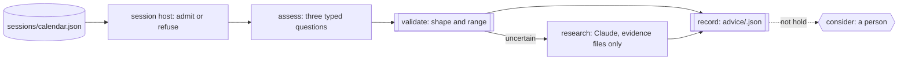

A desk watches one venue through a session. Prices move, volume spikes, and
someone has to read each move against what is on file and say whether it is
worth a second look. Most moves are nothing. A few are unexplained. One or
two might be worth acting on, and those are the ones a person should
decide, not a model.

You want every observation read the same way, with the thin ones sent for a
closer look at the evidence rather than waved through, and with the record
of each read kept for the next session. You want the venue's calendar
respected: nothing read on a closed day, nothing read after an early
close. And you want no order placed by anything but a person.

Obversa gives each observation its own recorded run. A typed assessment
answers three narrow questions, a check refuses a malformed answer before it
can become advice, an uncertain answer sends a research seat to the
evidence files, and an advice record is written either way. Where action
would be considered, the run stops on a question for a person and stays
stopped until they answer. This file is a session host and a four-step run
per observation, on a fictional venue with recorded data, so it runs
offline and claims nothing about any real market.

## Run it

Set the project up as [Installation](/get-started/installation) describes.
Copy the file with `sessions/`, `observations/`, `evidence/`, `briefs/` and
`policy.json` beside it, sign in to Claude Code for the research seat, and
run it from that directory. Without `MARKET_ASSESS_ENGINE=jev`, the
assessment seat replays the assessment recorded with each observation, so
the file runs with no account at all:

```bash Terminal
npx tsx market-session-advice.ts
```

The output below is the proof's offline run, with scripted seats standing
in for the models, so the words are the script's and the shape is the run's.

```text Output, from the offline proof
▸ run
observation-obs-001 ▸ dag (5 nodes)
observation-obs-001 · node assess: start
observation-obs-001 › assess • assess
observation-obs-001 › assess engine:text
observation-obs-001 › assess   mock: 10/5 tok
observation-obs-001 › assess • assess: pass
observation-obs-001 · node assess: done (pass)
observation-obs-001 · node validate: start
observation-obs-001 › validate • validate
observation-obs-001 › validate • validate: pass
observation-obs-001 · node validate: done (pass)
observation-obs-001 › research · when not met: the assessment is uncertain: false
observation-obs-001 · node research: skip (pass)
observation-obs-001 · node record: start
observation-obs-001 › record • record
observation-obs-001 › record • record: pass
observation-obs-001 · node record: done (pass)
observation-obs-001 › consider · when not met: action would be considered: false
observation-obs-001 · node consider: skip (pass)
observation-obs-001 ◂ dag pass
◂ run pass (10/5 tok)
▸ run
observation-obs-002 ▸ dag (5 nodes)
observation-obs-002 · node assess: start
observation-obs-002 › assess • assess
observation-obs-002 › assess engine:text
observation-obs-002 › assess   mock: 10/5 tok
observation-obs-002 › assess • assess: pass
observation-obs-002 · node assess: done (pass)
observation-obs-002 · node validate: start
observation-obs-002 › validate • validate
observation-obs-002 › validate • validate: pass
observation-obs-002 · node validate: done (pass)
observation-obs-002 › research · when met: the assessment is uncertain: true
observation-obs-002 · node research: start
observation-obs-002 › research • research
observation-obs-002 › research engine:thinking
observation-obs-002 › research engine:text
observation-obs-002 › research   tool Read use
observation-obs-002 › research   tool tool result
observation-obs-002 › research   tool Read use
observation-obs-002 › research   tool tool result
observation-obs-002 › research   tool Read use
observation-obs-002 › research   tool tool result
observation-obs-002 › research engine:thinking
observation-obs-002 › research   tool Write use
observation-obs-002 › research   tool tool result
observation-obs-002 › research engine:thinking
observation-obs-002 › research engine:text
observation-obs-002 › research   claude-sonnet-4-5-20250929: 118293/1341 tok
observation-obs-002 › research • research: pass
observation-obs-002 · node research: done (pass)
observation-obs-002 · node record: start
observation-obs-002 › record • record
observation-obs-002 › record • record: pass
observation-obs-002 · node record: done (pass)
observation-obs-002 › consider · when not met: action would be considered: false
observation-obs-002 · node consider: skip (pass)
observation-obs-002 ◂ dag pass
◂ run pass (118303/1346 tok, 77977 tok from cache)
▸ run
observation-obs-003 ▸ dag (5 nodes)
observation-obs-003 · node assess: start
observation-obs-003 › assess • assess
observation-obs-003 › assess engine:text
observation-obs-003 › assess   mock: 10/5 tok
observation-obs-003 › assess • assess: pass
observation-obs-003 · node assess: done (pass)
observation-obs-003 · node validate: start
observation-obs-003 › validate • validate
observation-obs-003 › validate • validate: pass
observation-obs-003 · node validate: done (pass)
observation-obs-003 › research · when not met: the assessment is uncertain: false
observation-obs-003 · node research: skip (pass)
observation-obs-003 · node record: start
observation-obs-003 › record • record
observation-obs-003 › record • record: pass
observation-obs-003 · node record: done (pass)
observation-obs-003 › consider · when met: action would be considered: true
observation-obs-003 · node consider: start
observation-obs-003 › consider • consider
observation-obs-003 › consider • consider: paused
observation-obs-003 · node consider: done (paused)
observation-obs-003 ◂ dag paused
◂ run paused (10/5 tok)
▸ run
observation-obs-004 ▸ dag (5 nodes)
observation-obs-004 · node assess: start
observation-obs-004 › assess • assess
observation-obs-004 › assess engine:text
observation-obs-004 › assess   mock: 10/5 tok
observation-obs-004 › assess • assess: pass
observation-obs-004 · node assess: done (pass)
observation-obs-004 · node validate: start
observation-obs-004 › validate • validate
observation-obs-004 › validate ✗ BODY: confidence is not a number in [0, 1]: high
observation-obs-004 › validate • validate: fail
observation-obs-004 · node validate: done (fail)
observation-obs-004 · node research: done (aborted)
observation-obs-004 · node record: done (aborted)
observation-obs-004 · node consider: done (aborted)
observation-obs-004 ◂ dag fail
◂ run fail (10/5 tok)
▸ run
observation-obs-006 ▸ dag (5 nodes)
observation-obs-006 · node assess: start
observation-obs-006 › assess • assess
observation-obs-006 › assess engine:text
observation-obs-006 › assess   mock: 10/5 tok
observation-obs-006 › assess • assess: pass
observation-obs-006 · node assess: done (pass)
observation-obs-006 · node validate: start
observation-obs-006 › validate • validate
observation-obs-006 › validate • validate: pass
observation-obs-006 · node validate: done (pass)
observation-obs-006 › research · when not met: the assessment is uncertain: false
observation-obs-006 · node research: skip (pass)
observation-obs-006 · node record: start
observation-obs-006 › record • record
observation-obs-006 › record • record: pass
observation-obs-006 · node record: done (pass)
observation-obs-006 › consider · when not met: action would be considered: false
observation-obs-006 · node consider: skip (pass)
observation-obs-006 ◂ dag pass
◂ run pass (10/5 tok)
{
  "status": "pass",
  "venue": "example-venue",
  "sessions": [
    {
      "date": "2030-01-06",
      "kind": "ordinary",
      "refused": [],
      "runs": [
        {
          "id": "obs-001",
          "outcome": "pass",
          "advice": "hold",
          "researched": false,
          "question": null
        },
        {
          "id": "obs-002",
          "outcome": "pass",
          "advice": "hold",
          "researched": true,
          "question": null
        },
        {
          "id": "obs-003",
          "outcome": "paused",
          "advice": "consider-buy",
          "researched": false,
          "question": "Consider acting on EXV-A (obs-003)?"
        },
        {
          "id": "obs-004",
          "outcome": "fail",
          "advice": null,
          "researched": false,
          "question": null
        }
      ]
    },
    {
      "date": "2030-01-07",
      "kind": "closed",
      "refused": [
        {
          "id": "obs-005",
          "reason": "the venue is closed"
        }
      ],
      "runs": []
    },
    {
      "date": "2030-01-08",
      "kind": "shortened",
      "refused": [
        {
          "id": "obs-007",
          "reason": "after the close"
        }
      ],
      "runs": [
        {
          "id": "obs-006",
          "outcome": "pass",
          "advice": "hold",
          "researched": false,
          "question": null
        }
      ]
    }
  ],
  "pendingQuestions": 1
}
```

Three sessions, seven observations. The ordinary session admitted four:
one confident hold that completed, one uncertain read that went to the
research seat and completed as a hold, one consider-buy that stopped on a
question for a person, and one malformed assessment that failed its check
and left no advice. The closed session admitted nothing. The shortened
session admitted the morning observation and refused the one after its
early close. One question is pending in `history/questions.jsonl`, and each
admitted observation has its own record under `records/`.

## The file

The venue is fictional and its calendar is explicit, with an ordinary, a
closed and a shortened session, so the host asserts nothing about any real
exchange's hours:

```json examples/use-cases/markets/sessions/calendar.json
{
  "venue": "example-venue",
  "timeZone": "Etc/UTC",
  "note": "A fictional venue. These sessions illustrate the shape; no real exchange's hours are claimed.",
  "sessions": [
    { "date": "2030-01-06", "open": "09:00", "close": "16:00" },
    { "date": "2030-01-07", "closed": true, "reason": "venue holiday" },
    { "date": "2030-01-08", "open": "09:00", "close": "12:00", "shortened": true }
  ]
}
```

The routing policy is two numbers the example's author chose. They express
this example's policy; they are not a recommendation, and a confident
answer is not assumed correct:

```json examples/use-cases/markets/policy.json
{
  "note": "This example's routing policy. The numbers are illustrative and not a recommendation.",
  "minConfidence": 0.75,
  "minEvidenceProbability": 0.7
}
```

Each observation is one `dag()` run of four steps and a question. `assess`
asks the three questions with no workspace and no tools; `validate` reads
the typed answers and throws on a malformed one, which fails the run before
any advice is written. Then the shape splits on what the assessment said:

```ts examples/use-cases/markets/market-session-advice.ts (excerpt) {3,17,27-29}
      research: {
        needs: 'validate',
        when: predicate((ctx) => assessmentOf(ctx).uncertain, 'the assessment is uncertain'),
        job: agentJob({
          label: 'research',
          engine: 'research',
          prompt: (ctx) => [
            `Observation ${observation.id} of ${observation.symbol} at ${observation.observedAt}:`,
            `price ${observation.change.pricePercent}%, volume ${observation.change.volumeRatio}x the usual.`,
            `The assessment was uncertain and named "${assessmentOf(ctx).researchCategory}" as the evidence to read first.`,
            `Read only these files: ${observation.evidence.join(', ')}.`,
            `Follow briefs/market-session.md and write ${researchNote}.`,
          ].join('\n'),
        }),
      },
      record: {
        needs: ['validate', 'research'],
        job: fnJob('record', async (ctx): Promise<Outcome> => {
          const assessment = assessmentOf(ctx);
          const research = ctx.needs?.research;
          const researched = research?.status === 'pass' && !(research.data as { skipped?: boolean } | undefined)?.skipped;
          const advice = { observation: observation.id, ...assessment, researched, researchNote: researched ? researchNote : null };
          await mkdir('advice', { recursive: true });
          await writeFile(`advice/${observation.id}.json`, `${JSON.stringify(advice, null, 2)}\n`);
          return { status: 'pass', summary: `${assessment.advice}${researched ? ', researched' : ''}`, data: { advice: assessment.advice, researched } };
        }),
      },
      consider: {
        needs: 'record',
        when: predicate((ctx) => (ctx.needs?.record?.data as { advice: Advice }).advice !== 'hold', 'action would be considered'),
        job: approval('consider', {
          question: `Consider acting on ${observation.symbol} (${observation.id})?`,
        }),
      },
```

`research` runs only when the assessment is uncertain under the policy,
reads the evidence files named for the observation and writes a note under
`advice/`. `record` writes the advice file whether or not research ran.
`consider` is a person's question, asked only when the advice is anything
but hold; with nobody answering, the run stops there with the question on
its record. The session host admits each observation against the calendar
and gives it a run of its own:

```ts examples/use-cases/markets/market-session-advice.ts (excerpt) {3-5,10-11,14-18}
  for (const file of files) {
    const observation = await readJson<Observation>(join(directory, file));
    if (session.closed) {
      report.refused.push({ id: observation.id, reason: 'the venue is closed' });
      continue;
    }
    const open = Date.parse(`${session.date}T${session.open}:00Z`);
    const close = Date.parse(`${session.date}T${session.close}:00Z`);
    const at = Date.parse(observation.observedAt);
    if (at < open || at >= close) {
      report.refused.push({ id: observation.id, reason: at < open ? 'before the open' : 'after the close' });
      continue;
    }
    current = observation;
    const result = await run(observationRun(observation, policy), {
      engines: { assess, research: research.engine },
      recordTo: `records/${observation.id}.jsonl`,
      runId: observation.id,
      onEvent: (event) => console.log(formatEvent(event)),
    });
    const nodes = (result.outcome.data ?? {}) as Record<string, Outcome | undefined>;
```

Each run records to `records/<observation>.jsonl` under its own run id, so
a later host can reopen exactly one observation's run when the person's
answer arrives, and nothing done for another observation is touched. The
assessment seat is the [Jev API engine](/packages/engine-jev-api) when
`MARKET_ASSESS_ENGINE=jev` names an endpoint and key, and otherwise a
scripted engine that replays the recorded assessment.

<Accordion title="The brief">

```text briefs/market-session.md
---
files: []
---

# Research a market observation

You are the research seat for one observation of a fictional security on a
fictional venue. The assessment seat was not sure, and named which kind of
evidence most needs a closer read.

Read only the evidence files named in the prompt. Do not look anything up
elsewhere, and do not invent facts that are not in those files.

Write `advice/<observation id>-research.md` with:

1. **What the evidence says** about the move, in three to six lines, each
   line naming the file it came from.
2. **What the evidence does not settle**, in one or two lines.
3. **Your read**: hold, consider buying or consider selling, in one line,
   with the one reason that carries it.

Do not place an order, quote a price target, or estimate a return. A person
reads your note and decides whether anything is worth considering.
```

</Accordion>

<Accordion title="Full file">

```ts examples/use-cases/markets/market-session-advice.ts
import { readdir, readFile, appendFile, mkdir, writeFile } from 'node:fs/promises';
import { join } from 'node:path';

import { claude } from '@obversa/engine-claude-cli';
import { JevApiEngine } from '@obversa/engine-jev-api';
import {
  agentJob,
  approval,
  dag,
  fnJob,
  formatEvent,
  predicate,
  run,
  type Engine,
  type JobContext,
  type Outcome,
} from '@obversa/runtime';
import { MockEngine } from '@obversa/runtime/testing';

/**
 * Scheduled market observations and advice, on recorded data. A session
 * host reads a fictional venue's calendar and the observations recorded for
 * each session. Every admitted observation is one recorded run: a typed
 * assessment, a check of its shape, research over the evidence files when
 * the assessment is uncertain, an advice record, and a question for a
 * person where action would be considered. The host never places an order
 * and never connects to a brokerage. Nothing here is a claim about returns.
 */

interface Session {
  readonly date: string;
  readonly open?: string;
  readonly close?: string;
  readonly closed?: boolean;
  readonly shortened?: boolean;
}

interface Observation {
  readonly id: string;
  readonly session: string;
  readonly symbol: string;
  readonly observedAt: string;
  readonly change: { readonly pricePercent: number; readonly volumeRatio: number };
  readonly evidence: readonly string[];
  readonly recordedAssessment: unknown;
}

interface Policy {
  readonly minConfidence: number;
  readonly minEvidenceProbability: number;
}

type Advice = 'hold' | 'consider-buy' | 'consider-sell';

interface Assessment {
  readonly advice: Advice;
  readonly confidence: number;
  readonly evidenceProbability: number;
  readonly researchCategory: string;
  readonly uncertain: boolean;
}

const ADVICE: readonly Advice[] = ['hold', 'consider-buy', 'consider-sell'];

/** The three questions, in the shape the Jev engine reads from the prompt. */
function assessmentPrompt(observation: Observation): string {
  return JSON.stringify({
    state: { symbol: observation.symbol, observedAt: observation.observedAt, change: observation.change },
    questions: {
      advice: {
        type: 'choice',
        instructions: 'Given this observation alone, what should a person consider?',
        criteria: {
          hold: 'Nothing in the observation calls for action',
          'consider-buy': 'The move looks overdone against the evidence on file',
          'consider-sell': 'The move looks justified and likely to continue',
        },
      },
      evidence: {
        type: 'noul',
        instructions: 'Does the supplied observation carry enough evidence for that advice?',
        criteria: { true: 'The move is explained by evidence on file', false: 'The move is unexplained or the evidence is thin' },
      },
      research: {
        type: 'choice',
        instructions: 'Which supplied evidence most needs a closer read?',
        criteria: { news: 'The news file', filings: 'The filings file', none: 'None' },
      },
    },
  });
}

/** Read the typed answers, or fail the step. A malformed answer never becomes advice. */
function readAssessment(text: string, policy: Policy): Assessment {
  const answers = JSON.parse(text) as Record<string, Record<string, unknown>>;
  const advice = answers.advice?.choice;
  const confidence = answers.advice?.confidence;
  const probability = answers.evidence?.probability;
  const category = answers.research?.choice;
  if (!ADVICE.includes(advice as Advice)) throw new Error(`advice is not one of ${ADVICE.join(', ')}: ${String(advice)}`);
  if (typeof confidence !== 'number' || !Number.isFinite(confidence) || confidence < 0 || confidence > 1) {
    throw new Error(`confidence is not a number in [0, 1]: ${String(confidence)}`);
  }
  if (typeof probability !== 'number' || !Number.isFinite(probability) || probability < 0 || probability > 1) {
    throw new Error(`evidence probability is not a number in [0, 1]: ${String(probability)}`);
  }
  return {
    advice: advice as Advice,
    confidence,
    evidenceProbability: probability,
    researchCategory: typeof category === 'string' ? category : 'none',
    uncertain: confidence < policy.minConfidence || probability < policy.minEvidenceProbability,
  };
}

const assessmentOf = (ctx: JobContext): Assessment => ctx.needs?.validate?.data as Assessment;

/** One observation, one recorded run. */
function observationRun(observation: Observation, policy: Policy) {
  const researchNote = `advice/${observation.id}-research.md`;
  return dag({
    name: `observation-${observation.id}`,
    nodes: {
      assess: agentJob({
        label: 'assess',
        engine: 'assess',
        workspaceMode: 'none',
        tools: [],
        leaf: true,
        prompt: () => assessmentPrompt(observation),
      }),
      validate: {
        needs: 'assess',
        job: fnJob('validate', (ctx): Outcome => {
          const assessment = readAssessment(String(ctx.needs?.assess?.data ?? ''), policy);
          return { status: 'pass', summary: `${assessment.advice} at ${assessment.confidence}`, data: assessment };
        }),
      },
      research: {
        needs: 'validate',
        when: predicate((ctx) => assessmentOf(ctx).uncertain, 'the assessment is uncertain'),
        job: agentJob({
          label: 'research',
          engine: 'research',
          prompt: (ctx) => [
            `Observation ${observation.id} of ${observation.symbol} at ${observation.observedAt}:`,
            `price ${observation.change.pricePercent}%, volume ${observation.change.volumeRatio}x the usual.`,
            `The assessment was uncertain and named "${assessmentOf(ctx).researchCategory}" as the evidence to read first.`,
            `Read only these files: ${observation.evidence.join(', ')}.`,
            `Follow briefs/market-session.md and write ${researchNote}.`,
          ].join('\n'),
        }),
      },
      record: {
        needs: ['validate', 'research'],
        job: fnJob('record', async (ctx): Promise<Outcome> => {
          const assessment = assessmentOf(ctx);
          const research = ctx.needs?.research;
          const researched = research?.status === 'pass' && !(research.data as { skipped?: boolean } | undefined)?.skipped;
          const advice = { observation: observation.id, ...assessment, researched, researchNote: researched ? researchNote : null };
          await mkdir('advice', { recursive: true });
          await writeFile(`advice/${observation.id}.json`, `${JSON.stringify(advice, null, 2)}\n`);
          return { status: 'pass', summary: `${assessment.advice}${researched ? ', researched' : ''}`, data: { advice: assessment.advice, researched } };
        }),
      },
      consider: {
        needs: 'record',
        when: predicate((ctx) => (ctx.needs?.record?.data as { advice: Advice }).advice !== 'hold', 'action would be considered'),
        job: approval('consider', {
          question: `Consider acting on ${observation.symbol} (${observation.id})?`,
        }),
      },
    },
  });
}

async function readJson<T>(path: string): Promise<T> {
  return JSON.parse(await readFile(path, 'utf8')) as T;
}

const calendar = await readJson<{ venue: string; sessions: readonly Session[] }>('sessions/calendar.json');
const policy = await readJson<Policy>('policy.json');

// The assessment seat is Jev when configured, and otherwise replays the
// assessment recorded with each observation, so the file runs offline.
const research = claude('claude-sonnet-4-5');
let assess: Engine;
let current: Observation | undefined;
if (process.env.MARKET_ASSESS_ENGINE === 'jev') {
  const endpoint = process.env.TYPESAFE_ENDPOINT;
  const apiKey = process.env.TYPESAFE_API_KEY;
  if (!endpoint || !apiKey) throw new Error('MARKET_ASSESS_ENGINE=jev needs TYPESAFE_ENDPOINT and TYPESAFE_API_KEY');
  assess = new JevApiEngine({ endpoint, apiKey });
} else {
  assess = new MockEngine(() => JSON.stringify(current?.recordedAssessment ?? null));
}

interface SessionReport {
  readonly date: string;
  readonly kind: 'ordinary' | 'closed' | 'shortened';
  readonly refused: { id: string; reason: string }[];
  readonly runs: { id: string; outcome: string; advice: string | null; researched: boolean; question: string | null }[];
}

const sessions: SessionReport[] = [];
await mkdir('history', { recursive: true });
for (const session of calendar.sessions) {
  const report: SessionReport = {
    date: session.date,
    kind: session.closed ? 'closed' : session.shortened ? 'shortened' : 'ordinary',
    refused: [],
    runs: [],
  };
  sessions.push(report);
  const directory = join('observations', session.date);
  const files = (await readdir(directory).catch(() => [] as string[])).filter((name) => name.endsWith('.json')).sort();
  for (const file of files) {
    const observation = await readJson<Observation>(join(directory, file));
    if (session.closed) {
      report.refused.push({ id: observation.id, reason: 'the venue is closed' });
      continue;
    }
    const open = Date.parse(`${session.date}T${session.open}:00Z`);
    const close = Date.parse(`${session.date}T${session.close}:00Z`);
    const at = Date.parse(observation.observedAt);
    if (at < open || at >= close) {
      report.refused.push({ id: observation.id, reason: at < open ? 'before the open' : 'after the close' });
      continue;
    }
    current = observation;
    const result = await run(observationRun(observation, policy), {
      engines: { assess, research: research.engine },
      recordTo: `records/${observation.id}.jsonl`,
      runId: observation.id,
      onEvent: (event) => console.log(formatEvent(event)),
    });
    const nodes = (result.outcome.data ?? {}) as Record<string, Outcome | undefined>;
    const recorded = nodes.record?.data as { advice: Advice; researched: boolean } | undefined;
    const question = result.outcome.status === 'paused' ? (nodes.consider?.data as { decisionText?: string } | undefined)?.decisionText ?? null : null;
    if (question) {
      await appendFile('history/questions.jsonl', `${JSON.stringify({ observation: observation.id, runId: observation.id, question })}\n`);
    }
    report.runs.push({
      id: observation.id,
      outcome: result.outcome.status,
      advice: recorded?.advice ?? null,
      researched: recorded?.researched ?? false,
      question,
    });
  }
}

console.log(JSON.stringify({
  status: 'pass',
  venue: calendar.venue,
  sessions,
  pendingQuestions: sessions.flatMap((session) => session.runs).filter((entry) => entry.question !== null).length,
}, null, 2));
```

</Accordion>

## The team's shape



## What the run did

The proof runs the file against scripted seats and checks the shape the
page describes: which observations were admitted and refused, which run
completed, which stopped, and which failed. Obversa recorded each
observation's run as its own event log, so the read of `obs-002` shows the
assessment, the research seat's turn and the advice in order, and
`obs-004` shows the check that refused a confidence of `"high"`. The
question for `obs-003` is on that run's record and in
`history/questions.jsonl`; a later answer reopens that run through the
callbacks client, as [A person decides](/patterns/approval) shows, and never
authorises anything on a newer observation.

What the file doesn't do is as much the point. No order is placed, no
brokerage is connected, no return is estimated, and the routing numbers are
the author's, exercised on both sides by the fixture. The live variant
swaps the recorded assessments for Jev and keeps every other step the same.

## Next steps

- [A person decides](/patterns/approval): the question step, and how the
  answer reaches a paused run.
- [Jev API Engine](/packages/engine-jev-api): the typed questions the
  assessment seat asks for real.
- [Evals in an agent workflow](/reviewing/evals): why a confidence clears a
  gate without proving the answer right.
