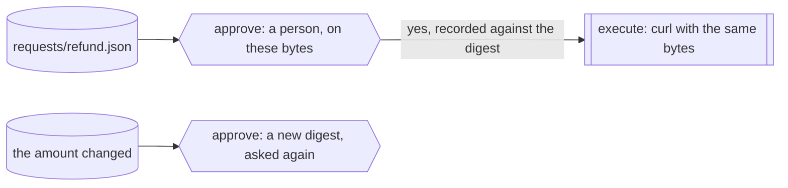

A refund is about to go out. Someone has to say yes to it, and "yes" has
to mean the refund that is sent, not a summary of it. The failure everyone
has seen is the one where a person approves a description, the system
rebuilds the request after the yes, and what goes out is not what was
read: a different amount, a different account, the same approval.

You want the approval bound to the bytes. The person sees the exact
request, their yes is recorded against exactly that, and that is what is
sent. If anything in the request changes, by one field, you want the
question asked again, not answered by the old yes. And you want the
record to show which bytes were approved and which were sent.

Obversa does this with the request as the question's input. The
question's digest covers every byte of the payload, the answer is recorded
against that digest, and the send uses the payload the person read. Ask
again with the same bytes and the step finds the answer. Ask with different
bytes and there is no answer to find, so the run stops on a new question.
This file is one two-step run, approve and execute, made three times over
one callbacks client: asked, approved and sent, asked again.

## Run it

Set the project up as [Installation](/get-started/installation) describes.
Copy the file with `requests/` beside it and run it from that directory.
No model runs, so no sign-in is needed. Set `PAYMENTS_URL` to your payments
endpoint, or leave the fictional default:

```bash Terminal
npx tsx approve-the-exact-payload.ts
```

The output below is the proof's offline run, with a stand-in for `curl`
that records the call instead of making it.

```text Output, from the offline proof
▸ run
refund ▸ dag (2 nodes)
refund · node approve: start
refund › approve • approve
refund › approve • approve: paused
refund · node approve: done (paused)
refund · node execute: done (aborted)
refund ◂ dag paused
◂ run paused (0/0 tok)
▸ run
refund ▸ dag (2 nodes)
refund · node approve: start
refund › approve • approve
refund › approve • approve: pass
refund · node approve: done (pass)
refund · node execute: start
refund › execute • execute
refund › execute · execute met: `curl` exited 0
refund › execute • execute: pass
refund · node execute: done (pass)
refund ◂ dag pass
◂ run pass (0/0 tok)
▸ run
refund ▸ dag (2 nodes)
refund · node approve: start
refund › approve • approve
refund › approve • approve: paused
refund · node approve: done (paused)
refund · node execute: done (aborted)
refund ◂ dag paused
◂ run paused (0/0 tok)
{
  "status": "pass",
  "passes": [
    {
      "pass": "asked",
      "outcome": "paused",
      "askedANewQuestion": true,
      "digest": "d716c2fd54319b40432a56364fcb00211967587bb187e0fd5cd08911c5b0b816",
      "sent": false
    },
    {
      "pass": "approved",
      "outcome": "pass",
      "askedANewQuestion": false,
      "digest": "d716c2fd54319b40432a56364fcb00211967587bb187e0fd5cd08911c5b0b816",
      "sent": true
    },
    {
      "pass": "asked-again",
      "outcome": "paused",
      "askedANewQuestion": true,
      "digest": "cda28c5d2446fa26b9ad1e34a974bfac03dc0ab03971decc10caaac5501e62fe",
      "sent": false
    }
  ],
  "sameBytesReusedTheAnswer": true,
  "changedBytesAskedAgain": true,
  "pendingQuestions": 1
}
```

Three passes, one send. The first pass asked and nobody had answered, so
nothing was sent. The person answered yes to those bytes. The second pass,
with the same payload, found the answer on the record and sent it. The
third pass carried the same request with the amount changed from 48.00 to
480.00; its digest was new, no answer applied, and it stopped on a fresh
question. One question is pending: the changed one.

## The file

The refund is the approval's input, and the send uses the same object:

```ts examples/use-cases/ops/approve-the-exact-payload.ts (excerpt) {5-8,11-15}
function refundRun(payload: Refund) {
  return dag({
    name: 'refund',
    nodes: {
      approve: approval('approve', {
        question: `Issue this refund of ${payload.currency} ${payload.amount} on ${payload.orderId}, exactly as shown?`,
        input: payload,
      }),
      execute: {
        needs: 'approve',
        job: commandJob('execute', [
          'curl', '-sS', '-X', 'POST', paymentsUrl,
          '-H', 'content-type: application/json',
          '--data', JSON.stringify(payload),
        ]),
      },
    },
  });
}
```

Every question a run asks goes through the run's callbacks client, and so
does every answer. One client serves all three passes here, so what one
pass asked and what the person answered is there for the next:

```ts examples/use-cases/ops/approve-the-exact-payload.ts (excerpt) {5-7,13-14}
// Pass one: the question is asked and nobody has answered. Nothing is sent.
const asked = await pass('asked', refund);

// The person's console. In use this is a page that shows the payload and
// takes the yes; here the file plays that part so it runs offline. The
// answer is recorded against the request's digest, which covers the bytes.
const [pending] = await callbacks.listPending();
if (pending === undefined) throw new Error('the question was not asked');
const claim = await callbacks.claim(pending.requestId, 'ops-console');
if (!claim.ok) throw new Error(`the console could not claim the question: ${claim.kind}`);
const submitted = await callbacks.submit(pending.requestId, claim.claimToken, 'ops-console', pending.digest, { approved: true });
if (!submitted.ok) throw new Error(`the answer was refused: ${submitted.kind}`);

// Pass two: the same bytes. The approval finds the answer and the call goes out.
const approved = await pass('approved', refund);

// Pass three: one field differs. A new digest, no answer, the question is asked again.
const askedAgain = await pass('asked-again', changed);
```

The person's console is played by the file, so it runs offline: it lists
the pending question, claims it, and submits `{ approved: true }` against
the request's digest. In use that is a page that shows the payload and
takes the yes, and the client is a stored one, so the answer survives the
process that asked; [Callback gates](/reviewing/callback-gates) has both.
The digest is what makes the third pass ask again: it covers the gate,
the question text, the answer's schema and the input bytes, and nothing
else, so restyling the page never invalidates an answer and changing what
is asked always does.

<Accordion title="Full file">

```ts examples/use-cases/ops/approve-the-exact-payload.ts
import { readFile } from 'node:fs/promises';

import {
  approval,
  commandJob,
  createCallbackClient,
  dag,
  formatEvent,
  run,
  type Outcome,
} from '@obversa/runtime';

/**
 * A person approves the exact bytes of a request, not a story about it.
 * The refund payload is the approval's input, so the question's digest
 * covers every byte of it, and the answer is recorded against that
 * digest. The same payload asked again finds the answer and is sent. A
 * payload that differs by one field has a different digest, finds no
 * answer, and asks again. Nothing is rebuilt after the yes: what was
 * approved is what is sent.
 */

type Refund = {
  readonly kind: 'refund';
  readonly orderId: string;
  readonly customer: string;
  readonly amount: string;
  readonly currency: string;
  readonly reason: string;
};

const paymentsUrl = process.env.PAYMENTS_URL ?? 'https://payments.example/api/refunds';
const onEvent = (event: Parameters<typeof formatEvent>[0]) => console.log(formatEvent(event));

/** The request as a run: a person's yes on these bytes, then the call with these bytes. */
function refundRun(payload: Refund) {
  return dag({
    name: 'refund',
    nodes: {
      approve: approval('approve', {
        question: `Issue this refund of ${payload.currency} ${payload.amount} on ${payload.orderId}, exactly as shown?`,
        input: payload,
      }),
      execute: {
        needs: 'approve',
        job: commandJob('execute', [
          'curl', '-sS', '-X', 'POST', paymentsUrl,
          '-H', 'content-type: application/json',
          '--data', JSON.stringify(payload),
        ]),
      },
    },
  });
}

// One callbacks client across every pass: the questions asked and the
// answers given live there, keyed by the request digest.
const callbacks = createCallbackClient();

/** The digests of every question asked so far, in the order they were asked. */
const questionsAsked = async (): Promise<string[]> => (await callbacks.history())
  .flatMap((event) => (event.kind === 'callback-requested' ? [event.request.digest] : []));

async function pass(name: string, payload: Refund) {
  const before = (await questionsAsked()).length;
  const result = await run(refundRun(payload), { callbacks, recordTo: `records/${name}.jsonl`, runId: name, onEvent });
  const nodes = (result.outcome.data ?? {}) as Record<string, Outcome | undefined>;
  const asked = await questionsAsked();
  return {
    pass: name,
    outcome: result.outcome.status,
    askedANewQuestion: asked.length > before,
    digest: asked.at(-1) ?? null,
    sent: nodes.execute?.status === 'pass',
  };
}

const refund = JSON.parse(await readFile('requests/refund.json', 'utf8')) as Refund;
const changed = JSON.parse(await readFile('requests/refund-changed.json', 'utf8')) as Refund;

// Pass one: the question is asked and nobody has answered. Nothing is sent.
const asked = await pass('asked', refund);

// The person's console. In use this is a page that shows the payload and
// takes the yes; here the file plays that part so it runs offline. The
// answer is recorded against the request's digest, which covers the bytes.
const [pending] = await callbacks.listPending();
if (pending === undefined) throw new Error('the question was not asked');
const claim = await callbacks.claim(pending.requestId, 'ops-console');
if (!claim.ok) throw new Error(`the console could not claim the question: ${claim.kind}`);
const submitted = await callbacks.submit(pending.requestId, claim.claimToken, 'ops-console', pending.digest, { approved: true });
if (!submitted.ok) throw new Error(`the answer was refused: ${submitted.kind}`);

// Pass two: the same bytes. The approval finds the answer and the call goes out.
const approved = await pass('approved', refund);

// Pass three: one field differs. A new digest, no answer, the question is asked again.
const askedAgain = await pass('asked-again', changed);

console.log(JSON.stringify({
  status: 'pass',
  passes: [asked, approved, askedAgain],
  sameBytesReusedTheAnswer: !approved.askedANewQuestion && approved.sent,
  changedBytesAskedAgain: askedAgain.askedANewQuestion && askedAgain.digest !== asked.digest,
  pendingQuestions: (await callbacks.listPending()).length,
}, null, 2));
```

</Accordion>

## The team's shape



## What the run did

The proof runs the file against a stand-in for `curl` and checks what the
page describes: three runs, one call to payments, the body of that call
equal byte for byte to the approved payload and not to the changed one,
and the changed payload left as the one pending question. Obversa recorded
each pass as its own event log, so the first shows the question with its
digest, the second shows the approval found and the send, and the third
shows a different digest and a new question.

The rule the file keeps is small and does all the work: what the person
read is the input, the input is in the digest, and the send uses the input.
There is no step where a summary is approved and a request is built
afterwards. [Proof-bound acceptance and approval](/reviewing/proof-acceptance)
takes the same idea further, binding a decision to a proof, a graph and a
workspace as well as to the bytes.

## Next steps

- [Callback gates](/reviewing/callback-gates): the question, the claim, the
  answer and the stored client.
- [Proof-bound acceptance and approval](/reviewing/proof-acceptance): the
  decision bound to evidence, not only to bytes.
- [A person decides](/patterns/approval): the approval step inside a
  larger team.
