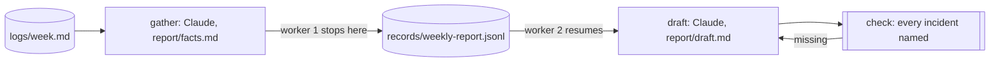

The weekly service report is half done when the machine running it goes
away. Whoever picks it up should not start over, and should not work from
a summary of what the first worker did, because a summary is where facts
go missing and where a second worker quietly redoes the first one's work.
What they need is the exact state: which stage finished, what it wrote,
and what comes next.

You want a stopped run to be picked up by a fresh worker with nothing but
its record, and you want that worker to carry on from where the first one
stopped. Finished stages stay finished. The files the first worker wrote
are the files the second one reads. No stage is paid for twice, and no
handoff note is written by anyone.

Obversa gives every run a record, and a worker started with that record
and `resume: true` reads what finished, takes those stages as done, and
runs the rest. This file is one three-stage team, gather the facts, draft
the report, check the draft, run by two workers in turn: the first is
stopped the moment its first stage finishes, and the second is given the
record and completes the run. The single seat is asked exactly twice.

## Run it

Set the project up as [Installation](/get-started/installation) describes.
Copy the file with `briefs/`, `logs/` and `tools/` beside it, sign in to
Claude Code, and run it from that directory:

```bash Terminal
npx tsx handoff-that-resumes.ts
```

The output below is the proof's offline run, with scripted seats standing
in for the models, so the words are the script's and the shape is the run's.

```text Output, from the offline proof
worker-1 ▸ run
worker-1 weekly-report workflow:start
worker-1 weekly-report ▸ dag (3 nodes)
worker-1 weekly-report · node gather: start
worker-1 weekly-report › gather • gather
worker-1 weekly-report › gather engine:text
worker-1 weekly-report › gather   stand-in: 3/1 tok
worker-1 weekly-report › gather • gather: pass
worker-1 weekly-report · node gather: done (pass)
worker-1 weekly-report · node draft: done (aborted)
worker-1 weekly-report · node check: done (aborted)
worker-1 weekly-report ◂ dag aborted
worker-1 ◂ run aborted (3/1 tok)
worker-2 ▸ run
worker-2 weekly-report workflow:start
worker-2 weekly-report ▸ dag (3 nodes)
worker-2 weekly-report · node gather: start
worker-2 weekly-report · node gather: done (pass)
worker-2 weekly-report · node draft: start
worker-2 weekly-report › draft • draft
worker-2 weekly-report › draft engine:text
worker-2 weekly-report › draft   stand-in: 3/1 tok
worker-2 weekly-report › draft • draft: pass
worker-2 weekly-report · node draft: done (pass)
worker-2 weekly-report · node check: start
worker-2 weekly-report › check • check
worker-2 weekly-report › check · check met: `/Users/jonny/.nvm/versions/node/v22.13.0/bin/node` exited 0
worker-2 weekly-report › check • check: pass
worker-2 weekly-report · node check: done (pass)
worker-2 weekly-report ◂ dag pass
worker-2 ◂ run pass (3/1 tok)
{
  "status": "pass",
  "worker1": {
    "outcome": "aborted",
    "ran": [
      "gather"
    ],
    "fromRecord": []
  },
  "worker2": {
    "outcome": "pass",
    "ran": [
      "draft",
      "check"
    ],
    "fromRecord": [
      "gather"
    ]
  }
}
```

Two workers, three stages, one record. The first worker ran `gather` and
was stopped; its run ended as aborted with the gather stage finished on the
record. The second worker took `gather` from the record without running
it, ran `draft`, ran the check, and completed. The seat wrote the facts
once and the draft once. `records/weekly-report.jsonl` holds both workers'
events in order.

## The file

The team is one `workflow()`: two writing stages and a check whose exit
code fails the draft if an incident is missing:

```ts examples/use-cases/ops/handoff-that-resumes.ts (excerpt) {11-12,18-19,26-29}
  return workflow('weekly-report', {
    brief: briefFromFile('briefs/report.md'),
    options: { timeout: '10m' },

    roles: {
      write: engines.claude('claude-sonnet-4-5'),
    },

    stages: [
      stage('gather', {
        agent: 'write',
        writes: 'report/facts.md',
        desc: 'One line per incident, as the log states it.',
        gate: 'report/facts.md names every incident in logs/week.md.',
      }),
      stage('draft', {
        agent: 'write',
        writes: 'report/draft.md',
        desc: 'The report a customer could read, from the facts alone.',
        gate: 'report/draft.md names every incident id in report/facts.md.',
        retry: 1,
      }),
      stage('check', {
        run: [process.execPath, 'tools/check-report.mjs'],
        desc: 'Fail the draft if an incident from the facts is missing.',
        gate: 'The check exits 0.',
        sendsBackTo: 'draft',
      }),
    ],
  });
```

The two workers are two calls to `run` with the same record. The first is
stopped from its own event stream the moment the gather stage is done, as a
worker that lost its machine would be. The second is started with
`resume: true` and nothing else:

```ts examples/use-cases/ops/handoff-that-resumes.ts (excerpt) {5-7,10,19-21}
const stop = new AbortController();
const worker1: WorkerLog = { ran: [], fromRecord: [] };
const watchWorker1 = watch('worker-1', worker1);
const first = await run(createReport(), {
  recordTo: record,
  signal: stop.signal,
  onEvent: (event) => {
    watchWorker1(event);
    if (event.kind === 'dag:node' && event.node === 'gather' && event.phase === 'done') stop.abort();
  },
});

// Worker two is given the record and nothing else. It reads what finished,
// skips it, and carries on from the draft.
const worker2: WorkerLog = { ran: [], fromRecord: [] };
const second = await run(createReport(), {
  recordTo: record,
  resume: true,
  onEvent: watch('worker-2', worker2),
});
```

A run built with `workflow()` resumes stage by stage: a stage the record
shows finished is returned as recorded, and the run carries on from the
first stage that isn't. To resume, the second worker keeps the workflow's
name, workspace, brief, stage list and seats the same; change any of them
and the run starts again. A stage that was mid-flight when the first worker
died is a different case, and [Running](/concepts/running) says what a
resumed run repeats and what it asks a person to reconcile.

<Accordion title="The brief">

```text briefs/report.md
---
files: ["report/facts.md", "report/draft.md"]
---

# The weekly service report

Two stages, one report.

**Gather.** Read `logs/week.md` and write `report/facts.md`: one line per
incident, with its id, when it started, how long it lasted and what was
affected, exactly as the log states them. Add nothing the log doesn't say.

**Draft.** Write `report/draft.md` from `report/facts.md` alone: a short
report a customer could read, under 250 words, naming every incident id
from the facts file. Say what happened and what was done. Do not promise
anything about next week.

A check reads the draft against the facts and fails it if an incident is
missing. The report is written for the operations lead, who sends it.
```

</Accordion>

<Accordion title="Full file">

```ts examples/use-cases/ops/handoff-that-resumes.ts
import { claude } from '@obversa/engine-claude-cli';
import {
  briefFromFile,
  formatEvent,
  run,
  stage,
  workflow,
  type LoopEvent,
  type TeamSeat,
} from '@obversa/runtime';

interface ReportEngines {
  readonly claude: (model: string) => TeamSeat;
}

const realEngines: ReportEngines = { claude };

/**
 * A handoff that resumes from the record instead of from a summary. The
 * weekly service report is three stages: gather the facts from the log,
 * draft the report from the facts, and a check that fails the draft if an
 * incident is missing. The first worker is stopped after the first stage
 * finishes. The second worker is given nothing but the record: it reads
 * what finished, skips it, and carries on from the exact state. The
 * finished stage never runs again, and no seat repeats work.
 */
function createReport(engines: ReportEngines = realEngines) {
  return workflow('weekly-report', {
    brief: briefFromFile('briefs/report.md'),
    options: { timeout: '10m' },

    roles: {
      write: engines.claude('claude-sonnet-4-5'),
    },

    stages: [
      stage('gather', {
        agent: 'write',
        writes: 'report/facts.md',
        desc: 'One line per incident, as the log states it.',
        gate: 'report/facts.md names every incident in logs/week.md.',
      }),
      stage('draft', {
        agent: 'write',
        writes: 'report/draft.md',
        desc: 'The report a customer could read, from the facts alone.',
        gate: 'report/draft.md names every incident id in report/facts.md.',
        retry: 1,
      }),
      stage('check', {
        run: [process.execPath, 'tools/check-report.mjs'],
        desc: 'Fail the draft if an incident from the facts is missing.',
        gate: 'The check exits 0.',
        sendsBackTo: 'draft',
      }),
    ],
  });
}

const record = 'records/weekly-report.jsonl';

/** Which stages a worker ran, and which it took finished from the record. */
interface WorkerLog {
  ran: string[];
  fromRecord: string[];
}
function watch(worker: string, log: WorkerLog): (event: LoopEvent) => void {
  let open: string | undefined;
  let worked = false;
  return (event) => {
    console.log(`${worker} ${formatEvent(event)}`);
    if (event.kind === 'dag:node' && event.phase === 'start') { open = event.node; worked = false; }
    if (event.kind === 'job:start') worked = true;
    if (event.kind === 'dag:node' && event.phase === 'done' && event.node === open && event.outcome?.status === 'pass') {
      (worked ? log.ran : log.fromRecord).push(event.node);
      open = undefined;
    }
  };
}

// Worker one starts the run and is stopped the moment the first stage has
// finished, as a worker that lost its machine would be. Its record is the
// only thing it leaves behind.
const stop = new AbortController();
const worker1: WorkerLog = { ran: [], fromRecord: [] };
const watchWorker1 = watch('worker-1', worker1);
const first = await run(createReport(), {
  recordTo: record,
  signal: stop.signal,
  onEvent: (event) => {
    watchWorker1(event);
    if (event.kind === 'dag:node' && event.node === 'gather' && event.phase === 'done') stop.abort();
  },
});

// Worker two is given the record and nothing else. It reads what finished,
// skips it, and carries on from the draft.
const worker2: WorkerLog = { ran: [], fromRecord: [] };
const second = await run(createReport(), {
  recordTo: record,
  resume: true,
  onEvent: watch('worker-2', worker2),
});

console.log(JSON.stringify({
  status: second.outcome.status,
  worker1: { outcome: first.outcome.status, ...worker1 },
  worker2: { outcome: second.outcome.status, ...worker2 },
}, null, 2));
```

</Accordion>

## The team's shape



## What the run did

The proof runs the file against a scripted seat and checks what the page
describes: the first worker aborted with one stage run, the second worker
took that stage from the record and ran the other two, the seat asked
exactly twice, and both files on disk. Obversa recorded both workers into
one event log, so the record shows the gather stage's turn, the abort, the
second worker's start, the gather stage returned from the record with no
turn under it, and then the draft and the check.

The record is what the second worker reads, and it is enough. There is no
handoff note, no summary of the first worker's work for the second to
trust, and no second gather. The
[supervised runner](/driving/runner) does this restart for you, with a
watchdog and limits; this file shows the same resume with two plain calls
to `run`.

## Next steps

- [Running](/concepts/running): what a resumed run repeats and what it
  asks a person to reconcile.
- [The record](/concepts/record): the event log both workers wrote to.
- [Supervised local runs](/driving/runner): the restart done by a
  watchdog instead of by hand.
