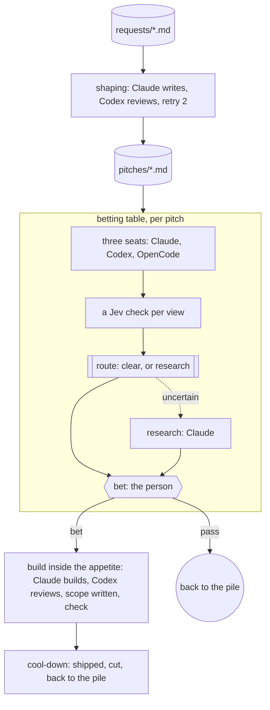

A product team has more ideas than weeks. Requests arrive as a sentence
each, some worth a cycle and some not, and the ones that get built tend
to grow while they are being built until the time is gone and the thing
is half done. What the team wants is to build the right few things inside
a fixed time, with the scope hammered to fit the time rather than the time
stretched to fit the scope, and to see where each build stands.

Basecamp's [Shape Up](https://basecamp.com/shapeup) is one answer, and
this example takes its shape: a request is shaped into a pitch with an
appetite, a betting table decides what gets built, a small team builds
inside the appetite with variable scope, progress is a hill from figuring
out to executing, and a cool-down follows. The method is Basecamp's, and
the book is free to read; this file is one cycle of it, offline.

Obversa makes each part a workflow and the cycle a graph of them. The
pitch is the brief. The appetite is the build stage's time limit. The
betting table is three seats from different model families, each view
checked by a typed Jev assessment, and the bet is the person's. Scope is
written down as it is cut. The record is the hill: every stage says which
side it was on. One graph runs the workflows in order and keeps one
record, and the same shape scales from one cycle to a whole organisation.

## Run it

Set the project up as [Installation](/get-started/installation) describes.
Copy the file with `briefs/`, `requests/`, `tools/`, `policy.json`,
`bets.json` and `checks.json` beside it, sign in to Claude Code and Codex
and install OpenCode, and run it from that directory. Without
`SHAPE_UP_JEV=1`, the check on each seat's view replays the assessment
recorded in `checks.json`; with it, and a TypeSafe endpoint and key in the
environment, the check asks Jev:

```bash Terminal
npx tsx shape-up-cycle.ts
```

The output below is the proof's offline run, with scripted seats standing
in for the models, so the words are the script's and the shape is the
run's. The final summary:

```json Output, from the offline proof
{
  "status": "pass",
  "pitches": [
    "r-1",
    "r-2"
  ],
  "table": {
    "r-1": {
      "views": [
        {
          "seat": "claude",
          "stance": "bet",
          "confidence": 0.86
        },
        {
          "seat": "codex",
          "stance": "bet",
          "confidence": 0.81
        },
        {
          "seat": "opencode",
          "stance": "bet",
          "confidence": 0.78
        }
      ],
      "researched": false,
      "bet": "bet",
      "why": null
    },
    "r-2": {
      "views": [
        {
          "seat": "claude",
          "stance": "pass",
          "confidence": 0.74
        },
        {
          "seat": "codex",
          "stance": "needs-research",
          "confidence": 0.52
        },
        {
          "seat": "opencode",
          "stance": "pass",
          "confidence": 0.69
        }
      ],
      "researched": true,
      "bet": "pass",
      "why": "Not this cycle. No customer has said what the theme lets them do. Back to the pile."
    }
  },
  "built": [
    "r-1"
  ],
  "cooldown": "pass",
  "hill": [
    "Uphill: shaping/shaping/pitch (pass)",
    "Uphill: table/betting-table/view-r-1-claude (pass)",
    "Uphill: table/betting-table/view-r-1-codex (pass)",
    "Uphill: table/betting-table/view-r-1-opencode (pass)",
    "Uphill: table/betting-table/view-r-2-claude (pass)",
    "Uphill: table/betting-table/view-r-2-codex (pass)",
    "Uphill: table/betting-table/view-r-2-opencode (pass)",
    "Uphill: table/betting-table/check-r-1-claude (pass)",
    "Uphill: table/betting-table/check-r-1-codex (pass)",
    "Uphill: table/betting-table/check-r-1-opencode (pass)",
    "Uphill: table/betting-table/check-r-2-claude (pass)",
    "Uphill: table/betting-table/check-r-2-codex (pass)",
    "Uphill: table/betting-table/check-r-2-opencode (pass)",
    "Uphill: table/betting-table/route-r-1 (pass)",
    "Uphill: table/betting-table/route-r-2 (pass)",
    "Uphill: table/betting-table/research-r-2 (pass)",
    "Uphill: table/betting-table/bet-r-1 (pass)",
    "Uphill: table/betting-table/bet-r-2 (fail)",
    "Uphill, then downhill: build-r-1/build-r-1/build (pass)",
    "Downhill: build-r-1/build-r-1/scope (pass)",
    "Downhill: build-r-1/build-r-1/check (pass)",
    "Downhill: cooldown/cooldown/summary (pass)"
  ]
}
```

Two requests, two pitches, one bet, one build. Shaping went round once,
because the first pitch for the CSV export had no no-gos and the reviewer
said so. At the table all three seats bet on the export and their checks
were clear; on the dark theme two seats passed, one said it needed
research and its check was under the policy's floor, so the pitch went to
research before the person saw it. The person bet on the export and passed
on the theme, with the reason on the record. The build went round once,
because the first change added an export by email that the pitch had
listed under no-gos; the second stayed inside, the scope file named two
cuts, and the check passed. The cool-down wrote what shipped, what was cut
and what goes back to the pile.

<Accordion title="Full transcript">

```text Transcript, from the offline proof
▸ run
shape-up-cycle ▸ dag (5 nodes)
shape-up-cycle · node shaping: start
shape-up-cycle › shaping › shaping workflow:start
shape-up-cycle › shaping › shaping ▸ dag (1 nodes)
shape-up-cycle › shaping › shaping · node pitch: start
shape-up-cycle › shaping › shaping › pitch › pitch-review ▸ loop (max 3)
shape-up-cycle › shaping › shaping › pitch › pitch-review · iteration 1
shape-up-cycle › shaping › shaping › pitch › pitch-review • pitch
shape-up-cycle › shaping › shaping › pitch › pitch-review engine:text
shape-up-cycle › shaping › shaping › pitch › pitch-review   stand-in: 3/1 tok
shape-up-cycle › shaping › shaping › pitch › pitch-review • pitch: pass
shape-up-cycle › shaping › shaping › pitch › pitch-review · until met: pitch writes: true
shape-up-cycle › shaping › shaping › pitch › pitch-review › review-panel • pitch
shape-up-cycle › shaping › shaping › pitch › pitch-review › review-panel • pitch-1
shape-up-cycle › shaping › shaping › pitch › pitch-review › review-panel engine:text
shape-up-cycle › shaping › shaping › pitch › pitch-review › review-panel   gpt-5.6-luna: 42/7 tok
shape-up-cycle › shaping › shaping › pitch › pitch-review › review-panel • pitch-1: fail
shape-up-cycle › shaping › shaping › pitch › pitch-review › review-panel • pitch: fail
shape-up-cycle › shaping › shaping › pitch › pitch-review · review: fail
review did not pass (Review panel: 0/1 reviewer(s) cleared. - pitch-1 [block]: pitches/r-1.md has no No-gos heading; the shaping brief needs one); re-entering pitch-review
shape-up-cycle › shaping › shaping › pitch › pitch-review · iteration 2
shape-up-cycle › shaping › shaping › pitch › pitch-review • pitch
shape-up-cycle › shaping › shaping › pitch › pitch-review engine:text
shape-up-cycle › shaping › shaping › pitch › pitch-review   stand-in: 3/1 tok
shape-up-cycle › shaping › shaping › pitch › pitch-review • pitch: pass
shape-up-cycle › shaping › shaping › pitch › pitch-review · until met: pitch writes: true
shape-up-cycle › shaping › shaping › pitch › pitch-review › review-panel • pitch
shape-up-cycle › shaping › shaping › pitch › pitch-review › review-panel • pitch-1
shape-up-cycle › shaping › shaping › pitch › pitch-review › review-panel engine:text
shape-up-cycle › shaping › shaping › pitch › pitch-review › review-panel   gpt-5.6-luna: 42/7 tok
shape-up-cycle › shaping › shaping › pitch › pitch-review › review-panel • pitch-1: pass
shape-up-cycle › shaping › shaping › pitch › pitch-review › review-panel • pitch: pass
shape-up-cycle › shaping › shaping › pitch › pitch-review · review: pass
shape-up-cycle › shaping › shaping › pitch › pitch-review ◂ pass (2 iter)
shape-up-cycle › shaping › shaping · node pitch: done (pass)
shape-up-cycle › shaping › shaping ◂ dag pass
shape-up-cycle · node shaping: done (pass)
shape-up-cycle · node table: start
shape-up-cycle › table › betting-table ▸ dag (18 nodes)
shape-up-cycle › table › betting-table · node view-r-1-claude: start
shape-up-cycle › table › betting-table › view-r-1-claude • view-claude
shape-up-cycle › table › betting-table › view-r-1-claude engine:text
shape-up-cycle › table › betting-table › view-r-1-claude   stand-in: 3/1 tok
shape-up-cycle › table › betting-table › view-r-1-claude • view-claude: pass
shape-up-cycle › table › betting-table · node view-r-1-codex: start
shape-up-cycle › table › betting-table › view-r-1-codex • view-codex
shape-up-cycle › table › betting-table · node view-r-1-claude: done (pass)
shape-up-cycle › table › betting-table › view-r-1-codex engine:text
shape-up-cycle › table › betting-table › view-r-1-codex   gpt-5.6-luna: 42/7 tok
shape-up-cycle › table › betting-table › view-r-1-codex • view-codex: pass
shape-up-cycle › table › betting-table · node view-r-1-opencode: start
shape-up-cycle › table › betting-table › view-r-1-opencode • view-opencode
shape-up-cycle › table › betting-table · node view-r-1-codex: done (pass)
shape-up-cycle › table › betting-table › view-r-1-opencode engine:text
shape-up-cycle › table › betting-table › view-r-1-opencode   opencode/big-pickle: 6/7 tok
shape-up-cycle › table › betting-table › view-r-1-opencode • view-opencode: pass
shape-up-cycle › table › betting-table · node view-r-2-claude: start
shape-up-cycle › table › betting-table › view-r-2-claude • view-claude
shape-up-cycle › table › betting-table · node view-r-1-opencode: done (pass)
shape-up-cycle › table › betting-table › view-r-2-claude engine:text
shape-up-cycle › table › betting-table › view-r-2-claude   stand-in: 3/1 tok
shape-up-cycle › table › betting-table › view-r-2-claude • view-claude: pass
shape-up-cycle › table › betting-table · node view-r-2-codex: start
shape-up-cycle › table › betting-table › view-r-2-codex • view-codex
shape-up-cycle › table › betting-table · node view-r-2-claude: done (pass)
shape-up-cycle › table › betting-table › view-r-2-codex engine:text
shape-up-cycle › table › betting-table › view-r-2-codex   gpt-5.6-luna: 42/7 tok
shape-up-cycle › table › betting-table › view-r-2-codex • view-codex: pass
shape-up-cycle › table › betting-table · node view-r-2-opencode: start
shape-up-cycle › table › betting-table › view-r-2-opencode • view-opencode
shape-up-cycle › table › betting-table · node view-r-2-codex: done (pass)
shape-up-cycle › table › betting-table › view-r-2-opencode engine:text
shape-up-cycle › table › betting-table › view-r-2-opencode   opencode/big-pickle: 6/7 tok
shape-up-cycle › table › betting-table › view-r-2-opencode • view-opencode: pass
shape-up-cycle › table › betting-table · node check-r-1-claude: start
shape-up-cycle › table › betting-table › check-r-1-claude • check-claude
shape-up-cycle › table › betting-table · node view-r-2-opencode: done (pass)
shape-up-cycle › table › betting-table › check-r-1-claude engine:text
shape-up-cycle › table › betting-table › check-r-1-claude   mock: 10/5 tok
shape-up-cycle › table › betting-table › check-r-1-claude • check-claude: pass
shape-up-cycle › table › betting-table · node check-r-1-codex: start
shape-up-cycle › table › betting-table › check-r-1-codex • check-codex
shape-up-cycle › table › betting-table · node check-r-1-claude: done (pass)
shape-up-cycle › table › betting-table › check-r-1-codex engine:text
shape-up-cycle › table › betting-table › check-r-1-codex   mock: 10/5 tok
shape-up-cycle › table › betting-table › check-r-1-codex • check-codex: pass
shape-up-cycle › table › betting-table · node check-r-1-opencode: start
shape-up-cycle › table › betting-table › check-r-1-opencode • check-opencode
shape-up-cycle › table › betting-table · node check-r-1-codex: done (pass)
shape-up-cycle › table › betting-table › check-r-1-opencode engine:text
shape-up-cycle › table › betting-table › check-r-1-opencode   mock: 10/5 tok
shape-up-cycle › table › betting-table › check-r-1-opencode • check-opencode: pass
shape-up-cycle › table › betting-table · node check-r-2-claude: start
shape-up-cycle › table › betting-table › check-r-2-claude • check-claude
shape-up-cycle › table › betting-table · node check-r-1-opencode: done (pass)
shape-up-cycle › table › betting-table › check-r-2-claude engine:text
shape-up-cycle › table › betting-table › check-r-2-claude   mock: 10/5 tok
shape-up-cycle › table › betting-table › check-r-2-claude • check-claude: pass
shape-up-cycle › table › betting-table · node check-r-2-codex: start
shape-up-cycle › table › betting-table › check-r-2-codex • check-codex
shape-up-cycle › table › betting-table · node check-r-2-claude: done (pass)
shape-up-cycle › table › betting-table › check-r-2-codex engine:text
shape-up-cycle › table › betting-table › check-r-2-codex   mock: 10/5 tok
shape-up-cycle › table › betting-table › check-r-2-codex • check-codex: pass
shape-up-cycle › table › betting-table · node check-r-2-opencode: start
shape-up-cycle › table › betting-table › check-r-2-opencode • check-opencode
shape-up-cycle › table › betting-table · node check-r-2-codex: done (pass)
shape-up-cycle › table › betting-table › check-r-2-opencode engine:text
shape-up-cycle › table › betting-table › check-r-2-opencode   mock: 10/5 tok
shape-up-cycle › table › betting-table › check-r-2-opencode • check-opencode: pass
shape-up-cycle › table › betting-table · node route-r-1: start
shape-up-cycle › table › betting-table › route-r-1 • route-r-1
shape-up-cycle › table › betting-table · node check-r-2-opencode: done (pass)
shape-up-cycle › table › betting-table › route-r-1 • route-r-1: pass
shape-up-cycle › table › betting-table · node route-r-2: start
shape-up-cycle › table › betting-table › route-r-2 • route-r-2
shape-up-cycle › table › betting-table · node route-r-1: done (pass)
shape-up-cycle › table › betting-table › route-r-2 • route-r-2: pass
shape-up-cycle › table › betting-table · node route-r-2: done (pass)
shape-up-cycle › table › betting-table › research-r-1 · when not met: a check was uncertain: false
shape-up-cycle › table › betting-table · node research-r-1: skip (pass)
shape-up-cycle › table › betting-table › research-r-2 · when met: a check was uncertain: true
shape-up-cycle › table › betting-table · node research-r-2: start
shape-up-cycle › table › betting-table › research-r-2 • research-r-2
shape-up-cycle › table › betting-table › research-r-2 engine:text
shape-up-cycle › table › betting-table › research-r-2   stand-in: 3/1 tok
shape-up-cycle › table › betting-table › research-r-2 • research-r-2: pass
shape-up-cycle › table › betting-table · node bet-r-1: start
shape-up-cycle › table › betting-table › bet-r-1 • bet-r-1
shape-up-cycle › table › betting-table · node research-r-2: done (pass)
shape-up-cycle › table › betting-table › bet-r-1 • bet-r-1: pass
shape-up-cycle › table › betting-table · node bet-r-2: start
shape-up-cycle › table › betting-table › bet-r-2 • bet-r-2
shape-up-cycle › table › betting-table · node bet-r-1: done (pass)
shape-up-cycle › table › betting-table › bet-r-2 • bet-r-2: fail
shape-up-cycle › table › betting-table · node bet-r-2: done (fail)
shape-up-cycle › table › betting-table ◂ dag pass
shape-up-cycle · node table: done (pass)
shape-up-cycle › build-r-1 · when met: the person bet on r-1: true
shape-up-cycle · node build-r-1: start
shape-up-cycle › build-r-1 › build-r-1 workflow:start
shape-up-cycle › build-r-1 › build-r-1 ▸ dag (3 nodes)
shape-up-cycle › build-r-1 › build-r-1 · node build: start
shape-up-cycle › build-r-1 › build-r-1 › build › build-review ▸ loop (max 3)
shape-up-cycle › build-r-1 › build-r-1 › build › build-review · iteration 1
shape-up-cycle › build-r-1 › build-r-1 › build › build-review • build
shape-up-cycle › build-r-1 › build-r-1 › build › build-review engine:text
shape-up-cycle › build-r-1 › build-r-1 › build › build-review   stand-in: 3/1 tok
shape-up-cycle › build-r-1 › build-r-1 › build › build-review • build: pass
shape-up-cycle › build-r-1 › build-r-1 › build › build-review · until met: build writes: true
shape-up-cycle › build-r-1 › build-r-1 › build › build-review › review-panel • build
shape-up-cycle › build-r-1 › build-r-1 › build › build-review › review-panel • build-1
shape-up-cycle › build-r-1 › build-r-1 › build › build-review › review-panel engine:text
shape-up-cycle › build-r-1 › build-r-1 › build › build-review › review-panel   gpt-5.6-luna: 42/7 tok
shape-up-cycle › build-r-1 › build-r-1 › build › build-review › review-panel • build-1: fail
shape-up-cycle › build-r-1 › build-r-1 › build › build-review › review-panel • build: fail
shape-up-cycle › build-r-1 › build-r-1 › build › build-review · review: fail
review did not pass (Review panel: 0/1 reviewer(s) cleared. - build-1 [block]: build/r-1/change.md adds a scheduled export by email, which the pitch lists under No-gos); re-entering build-review
shape-up-cycle › build-r-1 › build-r-1 › build › build-review · iteration 2
shape-up-cycle › build-r-1 › build-r-1 › build › build-review • build
shape-up-cycle › build-r-1 › build-r-1 › build › build-review engine:text
shape-up-cycle › build-r-1 › build-r-1 › build › build-review   stand-in: 3/1 tok
shape-up-cycle › build-r-1 › build-r-1 › build › build-review • build: pass
shape-up-cycle › build-r-1 › build-r-1 › build › build-review · until met: build writes: true
shape-up-cycle › build-r-1 › build-r-1 › build › build-review › review-panel • build
shape-up-cycle › build-r-1 › build-r-1 › build › build-review › review-panel • build-1
shape-up-cycle › build-r-1 › build-r-1 › build › build-review › review-panel engine:text
shape-up-cycle › build-r-1 › build-r-1 › build › build-review › review-panel   gpt-5.6-luna: 42/7 tok
shape-up-cycle › build-r-1 › build-r-1 › build › build-review › review-panel • build-1: pass
shape-up-cycle › build-r-1 › build-r-1 › build › build-review › review-panel • build: pass
shape-up-cycle › build-r-1 › build-r-1 › build › build-review · review: pass
shape-up-cycle › build-r-1 › build-r-1 › build › build-review ◂ pass (2 iter)
shape-up-cycle › build-r-1 › build-r-1 · node build: done (pass)
shape-up-cycle › build-r-1 › build-r-1 · node scope: start
shape-up-cycle › build-r-1 › build-r-1 › scope • scope
shape-up-cycle › build-r-1 › build-r-1 › scope engine:text
shape-up-cycle › build-r-1 › build-r-1 › scope   stand-in: 3/1 tok
shape-up-cycle › build-r-1 › build-r-1 › scope • scope: pass
shape-up-cycle › build-r-1 › build-r-1 · node scope: done (pass)
shape-up-cycle › build-r-1 › build-r-1 · node check: start
shape-up-cycle › build-r-1 › build-r-1 › check • check
shape-up-cycle › build-r-1 › build-r-1 › check · check met: `/Users/jonny/.nvm/versions/node/v22.13.0/bin/node` exited 0
shape-up-cycle › build-r-1 › build-r-1 › check • check: pass
shape-up-cycle › build-r-1 › build-r-1 · node check: done (pass)
shape-up-cycle › build-r-1 › build-r-1 ◂ dag pass
shape-up-cycle · node build-r-1: done (pass)
shape-up-cycle › build-r-2 · when not met: the person bet on r-2: false
shape-up-cycle · node build-r-2: skip (pass)
shape-up-cycle · node cooldown: start
shape-up-cycle › cooldown › cooldown workflow:start
shape-up-cycle › cooldown › cooldown ▸ dag (1 nodes)
shape-up-cycle › cooldown › cooldown · node summary: start
shape-up-cycle › cooldown › cooldown › summary • summary
shape-up-cycle › cooldown › cooldown › summary engine:text
shape-up-cycle › cooldown › cooldown › summary   stand-in: 3/1 tok
shape-up-cycle › cooldown › cooldown › summary • summary: pass
shape-up-cycle › cooldown › cooldown · node summary: done (pass)
shape-up-cycle › cooldown › cooldown ◂ dag pass
shape-up-cycle · node cooldown: done (pass)
shape-up-cycle ◂ dag pass
◂ run pass (351/95 tok, 186 tok from cache)
```

</Accordion>

## The file

A request is a sentence with an appetite in its front matter. The appetite
is the request's, fixed before shaping, and the pitch copies it:

```md requests/r-1.md
---
id: r-1
appetite: small batch
appetiteTimeout: 10m
---

# Export invoices as CSV

Customers keep asking for their invoices as a spreadsheet at month end.
Today they copy them one at a time. Support gets a ticket about it most
weeks.
```

Shaping is a writer and a reviewer over the requests. The writer turns each
into a pitch with five parts; the reviewer, from another family, checks
the parts and the appetite and the writer goes again:

```ts examples/use-cases/product/shape-up-cycle.ts (excerpt) {4,6-8,11-12}
const shaping = workflow('shaping', {
  brief: briefFromFile('briefs/shaping.md'),
  options: { timeout: '10m' },
  roles: { write: seats.claude!, review: [seats.codex!] },
  stages: [
    stage('pitch', {
      agent: 'write',
      writes: requests.map((request) => `pitches/${request.id}.md`),
      desc: 'Uphill: shape each request into a pitch with its five parts.',
      gate: 'Every pitch has a problem, the request\'s appetite, a solution, rabbit holes and no-gos.',
      reviewedBy: 'review',
      retry: 2,
    }),
  ],
});
```

The betting table is a graph of its own. For each pitch, three seats write
a view, a typed check reads each view, a function reads the checks, and an
uncertain table sends the pitch to research before the person's bet:

```ts examples/use-cases/product/shape-up-cycle.ts (excerpt) {3-4,14,20-21,33-38}
  nodes[`route-${pitch}`] = {
    needs: Object.keys(seats).map((seat) => `check-${pitch}-${seat}`),
    desc: `Uphill: read the checks on ${pitch} and decide whether the table needs research.`,
    job: fnJob(`route-${pitch}`, (ctx): Outcome => {
      const views: View[] = Object.keys(seats).map((seat) => {
        const answers = JSON.parse(String(ctx.needs?.[`check-${pitch}-${seat}`]?.data ?? 'null')) as Check | null;
        const confidence = answers?.stance?.confidence;
        return {
          seat,
          stance: answers?.stance?.choice ?? 'unreadable',
          confidence: typeof confidence === 'number' && Number.isFinite(confidence) ? confidence : null,
        };
      });
      const uncertain = views.some((view) => view.confidence === null || view.confidence < policy.minConfidence || view.stance === 'needs-research');
      return { status: 'pass', summary: uncertain ? 'the table needs research' : 'the table is clear', data: { views, uncertain } };
    }),
  };
  nodes[`research-${pitch}`] = {
    needs: `route-${pitch}`,
    when: predicate((ctx) => (ctx.needs?.[`route-${pitch}`]?.data as { uncertain: boolean }).uncertain, 'a check was uncertain'),
    desc: `Uphill: research what the table should know about ${pitch}.`,
    job: agentJob({
      label: `research-${pitch}`,
      engine: 'claude',
      model: seats.claude!.identity.model,
      prompt: `The table was not sure about pitches/${pitch}.md. Read the pitch and the views in table/${pitch}/ and write table/${pitch}/research.md: what the table should know, from the pitch's own material, in under 120 words.`,
    }),
  };
  const decision = bets[pitch];
  const question = `Bet on ${pitch} this cycle? The views, their checks and any research are in table/${pitch}/.`;
  nodes[`bet-${pitch}`] = {
    needs: [`route-${pitch}`, `research-${pitch}`],
    optional: true,
    desc: `Uphill: the person's bet on ${pitch}.`,
    job: typeof decision === 'object'
      ? approval(`bet-${pitch}`, { question, input: { pitch, views: `table/${pitch}/` }, answer: () => decision })
      : approval(`bet-${pitch}`, { question, input: { pitch, views: `table/${pitch}/` } }),
  };
```

Each check is one Jev call with a `choice` question, `bet`, `pass` or
`needs-research`, whose answer carries a confidence. The routing is the
file's: a stance of `needs-research`, or a confidence under the policy's
floor, sends the pitch to research. Jev decides nothing on its own, the
floor is the author's number, and a confident answer is not assumed
correct; the person sees every view with its check and any research and
makes the bet. `optional: true` on the bet means a pass on one pitch
doesn't stop the cycle.

The build is a workflow per bet: the pitch is the brief, the appetite is
the stage's time limit, `retry` is the rounds, a scope stage writes down
what was cut, and a check fails a change that names a no-go:

```ts examples/use-cases/product/shape-up-cycle.ts (excerpt) {4-5,10-14,17-18,24-27}
function buildFor(request: Request) {
  const pitch = request.id;
  return workflow(`build-${pitch}`, {
    brief: `${buildBrief}\nThe pitch is pitches/${pitch}.md. Its appetite is ${request.appetite}.`,
    options: { timeout: request.appetiteTimeout },
    roles: { build: seats.claude!, review: [seats.codex!] },
    stages: [
      stage('build', {
        agent: 'build',
        writes: `build/${pitch}/change.md`,
        desc: `Uphill, then downhill: build ${pitch} inside its appetite.`,
        gate: 'The change stays inside the pitch\'s no-gos and clear of its rabbit holes.',
        reviewedBy: 'review',
        retry: 2,
      }),
      stage('scope', {
        agent: 'build',
        writes: `build/${pitch}/scope.md`,
        desc: 'Downhill: write down what was cut to fit the appetite.',
        gate: 'Every cut is named with what it costs the user.',
      }),
      stage('check', {
        run: [process.execPath, 'tools/check-build.mjs', pitch],
        desc: 'Downhill: fail a change that names a no-go or a scope file that is empty.',
        gate: 'The check exits 0.',
        sendsBackTo: 'build',
      }),
    ],
  });
}
```

The cycle is a `dag()` whose nodes are the workflows. That is the
composition the runtime supports: `workflow()` returns a job, and a graph
node runs a job, so a graph of workflows needs nothing more. A build runs
only for a pitch the person bet on:

```ts examples/use-cases/product/shape-up-cycle.ts (excerpt) {5,8-16}
const betOn = (pitch: string) => (ctx: JobContext): boolean =>
  ((ctx.needs?.table?.data as Record<string, Outcome | undefined> | undefined)?.[`bet-${pitch}`]?.status === 'pass');
const builds: Record<string, DagNode> = Object.fromEntries(requests.map((request) => [`build-${request.id}`, {
  needs: 'table',
  when: predicate(betOn(request.id), `the person bet on ${request.id}`),
  job: buildFor(request),
}]));
const cycle = dag({
  name: 'shape-up-cycle',
  concurrency: 1,
  nodes: {
    shaping,
    table: { needs: 'shaping', job: table },
    ...builds,
    cooldown: { needs: Object.keys(builds), job: cooldown },
  },
});
```

<Accordion title="The briefs">

```text briefs/shaping.md
---
files: ["pitches/r-1.md", "pitches/r-2.md"]
---

# Shape the requests into pitches

Read each raw request in `requests/` and write it as a pitch to
`pitches/<request id>.md`. A pitch has five parts, each under its own
heading, in this order:

1. **Problem.** The situation someone is in, in their words, and why it
   matters now.
2. **Appetite.** How much of the team's time this is worth, as a fixed
   amount. Copy the `appetite` value from the request's front matter into
   a line `Appetite: <value>`; the value is the request's, not yours.
3. **Solution.** The rough shape of what we would build, in a paragraph,
   with no interface detail.
4. **Rabbit holes.** The parts that could eat the appetite, named so the
   team avoids them.
5. **No-gos.** What this pitch does not include, so nobody builds it.

The reviewer checks that every pitch has all five parts and that the
appetite is the request's. A pitch missing a part goes back to you.
```

```text briefs/build.md
# Build inside the appetite

The pitch is the brief. Build what it describes and no more.

**Build.** Write `build/<pitch id>/change.md`: what was built, how it works, and
how it was checked, in plain terms. Stay inside the pitch's no-gos; a
reviewer reads the change against them and against the rabbit holes.

**Scope.** Write `build/<pitch id>/scope.md`: what was cut or simplified to fit the
appetite, one line each, and what that costs the user. An empty file is
wrong; something is always cut.

A check fails the build if the change names a no-go or the scope file is
empty. The stage's time limit is the appetite.
```

</Accordion>

<Accordion title="Full file">

```ts examples/use-cases/product/shape-up-cycle.ts
import { readdir, readFile } from 'node:fs/promises';
import { join } from 'node:path';

import { resolveCommandExecutable } from '@obversa/core/command';
import { claude } from '@obversa/engine-claude-cli';
import { codex } from '@obversa/engine-codex-cli';
import { JevApiEngine } from '@obversa/engine-jev-api';
import { opencode } from '@obversa/engine-opencode-cli';
import {
  agentJob,
  approval,
  briefFromFile,
  dag,
  fnJob,
  formatEvent,
  predicate,
  run,
  stage,
  workflow,
  type ApprovalAnswer,
  type DagNode,
  type Engine,
  type JobContext,
  type LoopEvent,
  type Outcome,
  type TeamSeat,
} from '@obversa/runtime';
import { MockEngine } from '@obversa/runtime/testing';

/**
 * One Shape Up cycle, composed of workflows. Shaping is a writer and a
 * reviewer over the raw requests. The betting table is three seats from
 * different model families, each view checked by a typed Jev assessment,
 * and a person makes each bet. Every bet is built inside its appetite by a
 * writer, a scope step that writes down what was cut, a reviewer against
 * the pitch's no-gos, and a check. Cool-down writes what shipped, what was
 * cut and what goes back to the pile. One graph runs them in order and
 * keeps one record; the record's stage descriptions say whether the team
 * was uphill or downhill at each step.
 */

interface Request {
  readonly id: string;
  readonly appetite: string;
  readonly appetiteTimeout: string;
}

interface Policy {
  readonly minConfidence: number;
}

interface Check {
  readonly stance: { readonly choice: string; readonly confidence: number };
}

interface View {
  readonly seat: string;
  readonly stance: string;
  readonly confidence: number | null;
}

/** The request's front matter: id, appetite, and the appetite as a stage limit. */
function frontMatter(text: string): Request {
  const block = /^---\n([\s\S]*?)\n---/.exec(text)?.[1] ?? '';
  const fields = Object.fromEntries(block.split('\n').map((line) => line.split(/:\s*/, 2) as [string, string]));
  return { id: fields.id!, appetite: fields.appetite!, appetiteTimeout: fields.appetiteTimeout! };
}

const requests: Request[] = [];
for (const file of (await readdir('requests')).filter((name) => name.endsWith('.md')).sort()) {
  requests.push(frontMatter(await readFile(join('requests', file), 'utf8')));
}
const policy = JSON.parse(await readFile('policy.json', 'utf8')) as Policy;
const bets = JSON.parse(await readFile('bets.json', 'utf8')) as Record<string, ApprovalAnswer | string>;
const buildBrief = await readFile('briefs/build.md', 'utf8');

const seats: Record<string, TeamSeat> = {
  claude: claude('claude-sonnet-4-5'),
  codex: codex('gpt-5.6-luna'),
  opencode: opencode('opencode/big-pickle', { executable: resolveCommandExecutable('opencode') }),
};

// The check on each view is Jev when configured, and otherwise a replay of
// the assessment recorded for that seat's view, so the cycle runs offline.
let jev: Engine;
if (process.env.SHAPE_UP_JEV === '1') {
  const endpoint = process.env.TYPESAFE_ENDPOINT;
  const apiKey = process.env.TYPESAFE_API_KEY;
  if (!endpoint || !apiKey) throw new Error('SHAPE_UP_JEV=1 needs TYPESAFE_ENDPOINT and TYPESAFE_API_KEY');
  jev = new JevApiEngine({ endpoint, apiKey });
} else {
  const recorded = JSON.parse(await readFile('checks.json', 'utf8')) as Record<string, Check>;
  jev = new MockEngine((request) => {
    const { state } = JSON.parse(request.prompt) as { state: { pitch: string; seat: string } };
    return JSON.stringify(recorded[`${state.pitch}/${state.seat}`] ?? null);
  });
}

// 1. Shaping: a writer turns each request into a pitch; a reviewer from
// another family checks the five parts and the writer goes again.
const shaping = workflow('shaping', {
  brief: briefFromFile('briefs/shaping.md'),
  options: { timeout: '10m' },
  roles: { write: seats.claude!, review: [seats.codex!] },
  stages: [
    stage('pitch', {
      agent: 'write',
      writes: requests.map((request) => `pitches/${request.id}.md`),
      desc: 'Uphill: shape each request into a pitch with its five parts.',
      gate: 'Every pitch has a problem, the request\'s appetite, a solution, rabbit holes and no-gos.',
      reviewedBy: 'review',
      retry: 2,
    }),
  ],
});

// 2. The betting table: three seats from different families write a view
// on each pitch, a typed check reads each view, an uncertain table sends
// the pitch to research, and the person makes the bet.
function tableFor(request: Request): Record<string, DagNode> {
  const pitch = request.id;
  const nodes: Record<string, DagNode> = {};
  for (const seat of Object.keys(seats)) {
    const view = `table/${pitch}/${seat}.md`;
    nodes[`view-${pitch}-${seat}`] = {
      desc: `Uphill: the ${seat} seat's view on ${pitch}.`,
      job: agentJob({
        label: `view-${seat}`,
        engine: seat,
        model: seats[seat]!.identity.model,
        prompt: `Read pitches/${pitch}.md and write your view to ${view} as briefs/table.md says.`,
      }),
    };
    nodes[`check-${pitch}-${seat}`] = {
      needs: `view-${pitch}-${seat}`,
      desc: `Uphill: a typed check on the ${seat} seat's view.`,
      job: agentJob({
        label: `check-${seat}`,
        engine: 'jev',
        workspaceMode: 'none',
        tools: [],
        leaf: true,
        prompt: async () => JSON.stringify({
          state: { pitch, seat, view: await readFile(view, 'utf8') },
          questions: {
            stance: {
              type: 'choice',
              instructions: 'Does this view rest on the pitch, and what does it call for?',
              criteria: {
                bet: 'The view rests on the pitch and calls for a bet',
                pass: 'The view rests on the pitch and calls for a pass',
                'needs-research': 'The view rests on something the pitch does not settle',
              },
            },
          },
        }),
      }),
    };
  }
  nodes[`route-${pitch}`] = {
    needs: Object.keys(seats).map((seat) => `check-${pitch}-${seat}`),
    desc: `Uphill: read the checks on ${pitch} and decide whether the table needs research.`,
    job: fnJob(`route-${pitch}`, (ctx): Outcome => {
      const views: View[] = Object.keys(seats).map((seat) => {
        const answers = JSON.parse(String(ctx.needs?.[`check-${pitch}-${seat}`]?.data ?? 'null')) as Check | null;
        const confidence = answers?.stance?.confidence;
        return {
          seat,
          stance: answers?.stance?.choice ?? 'unreadable',
          confidence: typeof confidence === 'number' && Number.isFinite(confidence) ? confidence : null,
        };
      });
      const uncertain = views.some((view) => view.confidence === null || view.confidence < policy.minConfidence || view.stance === 'needs-research');
      return { status: 'pass', summary: uncertain ? 'the table needs research' : 'the table is clear', data: { views, uncertain } };
    }),
  };
  nodes[`research-${pitch}`] = {
    needs: `route-${pitch}`,
    when: predicate((ctx) => (ctx.needs?.[`route-${pitch}`]?.data as { uncertain: boolean }).uncertain, 'a check was uncertain'),
    desc: `Uphill: research what the table should know about ${pitch}.`,
    job: agentJob({
      label: `research-${pitch}`,
      engine: 'claude',
      model: seats.claude!.identity.model,
      prompt: `The table was not sure about pitches/${pitch}.md. Read the pitch and the views in table/${pitch}/ and write table/${pitch}/research.md: what the table should know, from the pitch's own material, in under 120 words.`,
    }),
  };
  const decision = bets[pitch];
  const question = `Bet on ${pitch} this cycle? The views, their checks and any research are in table/${pitch}/.`;
  nodes[`bet-${pitch}`] = {
    needs: [`route-${pitch}`, `research-${pitch}`],
    optional: true,
    desc: `Uphill: the person's bet on ${pitch}.`,
    job: typeof decision === 'object'
      ? approval(`bet-${pitch}`, { question, input: { pitch, views: `table/${pitch}/` }, answer: () => decision })
      : approval(`bet-${pitch}`, { question, input: { pitch, views: `table/${pitch}/` } }),
  };
  return nodes;
}

const table = dag({
  name: 'betting-table',
  concurrency: 1,
  nodes: Object.assign({}, ...requests.map(tableFor)) as Record<string, DagNode>,
});

// 3. The build, inside the appetite: the pitch is the brief, the appetite
// is the stage's time limit, retry is the rounds, scope is written down,
// and a check fails a change that names a no-go.
function buildFor(request: Request) {
  const pitch = request.id;
  return workflow(`build-${pitch}`, {
    brief: `${buildBrief}\nThe pitch is pitches/${pitch}.md. Its appetite is ${request.appetite}.`,
    options: { timeout: request.appetiteTimeout },
    roles: { build: seats.claude!, review: [seats.codex!] },
    stages: [
      stage('build', {
        agent: 'build',
        writes: `build/${pitch}/change.md`,
        desc: `Uphill, then downhill: build ${pitch} inside its appetite.`,
        gate: 'The change stays inside the pitch\'s no-gos and clear of its rabbit holes.',
        reviewedBy: 'review',
        retry: 2,
      }),
      stage('scope', {
        agent: 'build',
        writes: `build/${pitch}/scope.md`,
        desc: 'Downhill: write down what was cut to fit the appetite.',
        gate: 'Every cut is named with what it costs the user.',
      }),
      stage('check', {
        run: [process.execPath, 'tools/check-build.mjs', pitch],
        desc: 'Downhill: fail a change that names a no-go or a scope file that is empty.',
        gate: 'The check exits 0.',
        sendsBackTo: 'build',
      }),
    ],
  });
}

// 4. Cool-down: what shipped, what was cut, what goes back to the pile.
const cooldown = workflow('cooldown', {
  brief: briefFromFile('briefs/cooldown.md'),
  options: { timeout: '10m' },
  roles: { write: seats.claude! },
  stages: [
    stage('summary', {
      agent: 'write',
      writes: 'cooldown/summary.md',
      desc: 'Downhill: write the cool-down summary from the cycle\'s files.',
      gate: 'The summary has what shipped, what was cut, and what goes back to the pile.',
    }),
  ],
});

// The cycle: one graph whose nodes are the workflows, in order, with one
// record. A build runs only for a pitch the person bet on.
const betOn = (pitch: string) => (ctx: JobContext): boolean =>
  ((ctx.needs?.table?.data as Record<string, Outcome | undefined> | undefined)?.[`bet-${pitch}`]?.status === 'pass');
const builds: Record<string, DagNode> = Object.fromEntries(requests.map((request) => [`build-${request.id}`, {
  needs: 'table',
  when: predicate(betOn(request.id), `the person bet on ${request.id}`),
  job: buildFor(request),
}]));
const cycle = dag({
  name: 'shape-up-cycle',
  concurrency: 1,
  nodes: {
    shaping,
    table: { needs: 'shaping', job: table },
    ...builds,
    cooldown: { needs: Object.keys(builds), job: cooldown },
  },
});

// The hill chart, read from the record: each stage's description says
// whether the team was uphill or downhill when it ran.
const hill: string[] = [];
const onEvent = (event: LoopEvent): void => {
  console.log(formatEvent(event));
  if (event.kind === 'dag:node' && event.phase === 'done' && event.desc !== undefined) {
    const side = /^(Uphill, then downhill|Uphill|Downhill)/.exec(event.desc)?.[1] ?? 'unmarked';
    hill.push(`${side}: ${[...event.path.slice(1), event.node].join('/')} (${event.outcome?.status ?? 'unknown'})`);
  }
};

const result = await run(cycle, {
  engines: { ...Object.fromEntries(Object.entries(seats).map(([name, seat]) => [name, seat.engine])), jev },
  recordTo: 'records/shape-up-cycle.jsonl',
  runId: 'shape-up-cycle',
  onEvent,
});

const nodes = (result.outcome.data ?? {}) as Record<string, Outcome | undefined>;
const tableNodes = (nodes.table?.data ?? {}) as Record<string, Outcome | undefined>;
console.log(JSON.stringify({
  status: result.outcome.status,
  pitches: requests.map((request) => request.id),
  table: Object.fromEntries(requests.map((request) => [request.id, {
    views: (tableNodes[`route-${request.id}`]?.data as { views: View[] } | undefined)?.views ?? [],
    researched: tableNodes[`research-${request.id}`]?.status === 'pass' && !(tableNodes[`research-${request.id}`]?.data as { skipped?: boolean } | undefined)?.skipped,
    bet: tableNodes[`bet-${request.id}`]?.status === 'pass' ? 'bet' : tableNodes[`bet-${request.id}`]?.status === 'fail' ? 'pass' : 'waiting',
    why: tableNodes[`bet-${request.id}`]?.status === 'fail' ? tableNodes[`bet-${request.id}`]?.summary ?? null : null,
  }])),
  built: requests.filter((request) => nodes[`build-${request.id}`]?.status === 'pass' && !(nodes[`build-${request.id}`]?.data as { skipped?: boolean } | undefined)?.skipped).map((request) => request.id),
  cooldown: nodes.cooldown?.status ?? null,
  hill,
}, null, 2));
```

</Accordion>

## The team's shape



## The hill

Shape Up draws progress as a hill: uphill is figuring out the approach,
downhill is executing it. Here the hill is read from the record. Every
stage's description begins with the side it is on, and the host collects
the `dag:node` events as they finish:

```ts examples/use-cases/product/shape-up-cycle.ts (excerpt) {6-7}
// The hill chart, read from the record: each stage's description says
// whether the team was uphill or downhill when it ran.
const hill: string[] = [];
const onEvent = (event: LoopEvent): void => {
  console.log(formatEvent(event));
  if (event.kind === 'dag:node' && event.phase === 'done' && event.desc !== undefined) {
    const side = /^(Uphill, then downhill|Uphill|Downhill)/.exec(event.desc)?.[1] ?? 'unmarked';
    hill.push(`${side}: ${[...event.path.slice(1), event.node].join('/')} (${event.outcome?.status ?? 'unknown'})`);
  }
};
```

The summary above lists the result, twenty-two stages in the order they
finished: shaping and the whole table uphill, the build crossing from
uphill to downhill, scope, check and cool-down downhill. A pitch the
person passed on has its research and its bet on the hill and nothing
after them, which is what the hill should show for it.

## What the run did

The proof runs the file against three scripted seats and the recorded
checks, and checks what the page describes: two shaping rounds, three
views and three checks per pitch, the theme researched and the export not,
the person's two decisions with the reason for the pass, one build of two
rounds with the no-go gone from the change and the scope written, the
passed pitch never built, the cool-down with its three headings, and a
hill with both sides. Obversa recorded the cycle as one event log, with
each workflow's stages under it, so the record reads as the cycle: what
was shaped, who said what at the table and what the check made of it,
what the person bet, what was built and cut, and how the cycle closed.

Nothing here says how long software takes. The appetite in the requests is
the example's policy and the build stage's limit, and the numbers in the
recorded checks are a fixture. In a live run, `checks.json` gives way to
Jev, the seats to signed-in Claude Code, Codex and OpenCode, and
`bets.json` to a person answering the question through a page.

## Next steps

- [Feature delivery](/workflows/feature-team): the nine-stage team that
  can take the build's place when the pitch is code.
- [Evals in an agent workflow](/reviewing/evals): what a typed check with a
  confidence does and doesn't decide.
- [A person decides](/patterns/approval): the bet as a step, and how an
  answer reaches a paused run.
- [Jev API Engine](/packages/engine-jev-api): the engine behind the
  table's checks.
