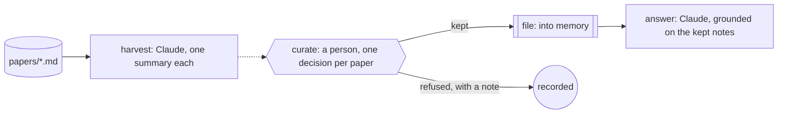

A lab's reading pile grows faster than anyone reads it. Someone has to skim
each new paper, write down what it claims and what it would change for the
lab's own work, and decide whether it belongs in the notes the whole group
draws on. Get that wrong and the group's memory fills with surveys nobody
asked for, or a question gets answered from a paper nobody vetted.

You want the summaries written for you, in the lab's own terms, with the
paper's stated limits kept honest. You want to decide which ones enter the
group's memory, one at a time, with your reasons kept. And when someone
asks a question, you want the answer to draw on what you kept and nothing
else, naming the paper behind every point.

Obversa keeps the person between the harvest and the memory. A Claude seat
summarises every supplied paper. Your decision on each summary is a step:
a yes files it into memory, a no records your reason and files nothing.
Then a question is answered from the kept notes, read into the prompt
through `ground`, so the answer can only cite what you kept. This file is
one run of three parts, harvest, curate and answer, with the person's
decisions in the middle.

## Run it

Set the project up as [Installation](/get-started/installation) describes.
Copy the file with `briefs/`, `papers/`, `curation.json` and
`questions.json` beside it, sign in to Claude Code, and run it from that
directory. `curation.json` carries the person's decisions from the last
pass:

```bash Terminal
npx tsx literature-watch.ts
```

The output below is the proof's offline run, with scripted seats standing
in for the models, so the words are the script's and the shape is the run's.

```text Output, from the offline proof
▸ run
literature-watch ▸ dag (6 nodes)
literature-watch · node harvest: start
literature-watch › harvest • harvest
literature-watch › harvest engine:text
literature-watch › harvest   stand-in: 3/1 tok
literature-watch › harvest • harvest: pass
literature-watch · node harvest: done (pass)
literature-watch · node curate-p-101: start
literature-watch › curate-p-101 • curate-p-101
literature-watch · node curate-p-102: start
literature-watch › curate-p-102 • curate-p-102
literature-watch · node curate-p-103: start
literature-watch › curate-p-103 • curate-p-103
literature-watch › curate-p-101 • curate-p-101: pass
literature-watch › curate-p-102 • curate-p-102: fail
literature-watch › curate-p-103 • curate-p-103: pass
literature-watch · node curate-p-101: done (pass)
literature-watch · node curate-p-102: done (fail)
literature-watch · node curate-p-103: done (pass)
literature-watch · node file: start
literature-watch › file • file
literature-watch › file • file: pass
literature-watch · node file: done (pass)
literature-watch · node answer: start
literature-watch › answer • answer
literature-watch › answer engine:text
literature-watch › answer   stand-in: 3/1 tok
literature-watch › answer • answer: pass
literature-watch · node answer: done (pass)
literature-watch ◂ dag pass
◂ run pass (6/2 tok)
{
  "status": "pass",
  "papers": [
    "p-101",
    "p-102",
    "p-103"
  ],
  "kept": [
    "p-101",
    "p-103"
  ],
  "refused": [
    {
      "paper": "p-102",
      "note": "A survey with synthetic payloads; not for the lab's memory. Keep the link in the reading list."
    }
  ],
  "answered": [
    "q-1"
  ]
}
```

Three papers summarised, two kept, one refused with a note, one question
answered. The survey of message formats was refused because its payloads
were synthetic, so it never entered memory, and the answer to the question
about field life cites the two kept papers and says what they don't settle.
The run's record is `records/literature-watch.jsonl`.

## The file

The brief gives the seat its two jobs and keeps memory out of its hands:

```text briefs/literature.md
---
files: []
---

# Literature watch for one lab

Two jobs.

**Harvest.** For each paper in `papers/`, write `summaries/<paper id>.md`:
the claim in one line, the method in two, what it would change for a lab
working on low-power sensing in one line, and the paper's own stated
limits. Quote nothing that is not in the file. Invent no citation.

**Answer.** When asked a question, answer only from the notes you are given
in the prompt. Name the paper each point comes from. If the notes don't
settle the question, say so rather than guessing.

A person decides which summaries enter the lab's memory. You never write
to memory yourself.
```

Each paper gets its own decision step. A decision the person already made
is the step's answer; a refusal fails the step, and `optional: true` means
a refusal doesn't stop the run:

```ts examples/use-cases/research/literature-watch.ts (excerpt) {5,7-9}
/** One decision per paper. A refusal fails its step without stopping the run. */
const curate: Record<string, DagNode> = Object.fromEntries(papers.map((paper) => {
  const decision = curation[paper];
  const question = `Keep the summary of ${paper} in the lab's memory?`;
  return [`curate-${paper}`, {
    needs: 'harvest',
    optional: true,
    job: typeof decision === 'object'
      ? approval(`curate-${paper}`, { question, answer: () => decision })
      : approval(`curate-${paper}`, { question }),
  }];
}));
```

`file` reads which decision steps passed and creates one memory file per
kept summary. `answer` grounds the question on those files alone:

```ts examples/use-cases/research/literature-watch.ts (excerpt) {8-9,11-12,25-26}
    file: {
      needs: Object.keys(curate),
      job: fnJob('file', async (ctx): Promise<Outcome> => {
        const kept: string[] = [];
        for (const paper of papers) {
          if (ctx.needs?.[`curate-${paper}`]?.status !== 'pass') continue;
          const text = await readFile(`summaries/${paper}.md`, 'utf8');
          const result = await ctx.memory!.execute({ command: 'create', path: memoryPath(paper), text });
          if (!result.ok) throw new Error(`memory refused ${paper}: ${result.error.code}`);
          kept.push(paper);
        }
        return { status: 'pass', summary: `${kept.length} of ${papers.length} summaries kept`, data: { kept } };
      }),
    },
    answer: {
      needs: 'file',
      job: agentJob({
        label: 'answer',
        engine: 'lab',
        prompt: async (ctx) => {
          const { kept } = ctx.needs?.file?.data as { kept: string[] };
          const grounded = await ground(ctx.memory!, { sources: kept.map((paper) => ({ path: memoryPath(paper) })) });
          if (!grounded.ok) throw new Error(grounded.error.message);
          const question = questions[0]!;
          return `${grounded.value.prompt}\n\nAnswer as briefs/literature.md says and write answers/${question.id}.md.\n\nQuestion: ${question.text}`;
        },
      }),
    },
  },
```

`ground` reads the kept notes into one bounded prompt under a warning that
the content is data, not instructions, and the seat answers from that
prompt. The memory here is `createSimpleMemory`, which lives in one process;
swap in `openGitMemory` from [Git Memory](/packages/memory-git) and the
kept notes survive to the next session's questions.

<Accordion title="Full file">

```ts examples/use-cases/research/literature-watch.ts
import { readdir, readFile } from 'node:fs/promises';

import type { MemoryPath } from '@obversa/api';
import { claude } from '@obversa/engine-claude-cli';
import { createSimpleMemory } from '@obversa/memory-simple';
import {
  agentJob,
  approval,
  dag,
  fnJob,
  formatEvent,
  run,
  type ApprovalAnswer,
  type DagNode,
  type Outcome,
} from '@obversa/runtime';
import { ground } from '@obversa/runtime/memory';

/**
 * A literature watch for one lab. A Claude seat summarises each supplied
 * paper. A person decides, paper by paper, which summaries enter the lab's
 * memory; a refused one is recorded with the reason and enters nothing.
 * Then a question is answered from the kept notes alone, read into the
 * prompt through `ground`, so the answer can only cite what the person
 * kept.
 */

interface Question {
  readonly id: string;
  readonly text: string;
}

const papers = (await readdir('papers')).filter((name) => name.endsWith('.md')).map((name) => name.slice(0, -3)).sort();
const curation = JSON.parse(await readFile('curation.json', 'utf8')) as Record<string, ApprovalAnswer | string>;
const questions = JSON.parse(await readFile('questions.json', 'utf8')) as Question[];
const memory = createSimpleMemory({ scope: 'literature-watch' });
const seat = claude('claude-sonnet-4-5');
const memoryPath = (paper: string): MemoryPath => `/memories/papers/${paper}.md` as MemoryPath;

/** One decision per paper. A refusal fails its step without stopping the run. */
const curate: Record<string, DagNode> = Object.fromEntries(papers.map((paper) => {
  const decision = curation[paper];
  const question = `Keep the summary of ${paper} in the lab's memory?`;
  return [`curate-${paper}`, {
    needs: 'harvest',
    optional: true,
    job: typeof decision === 'object'
      ? approval(`curate-${paper}`, { question, answer: () => decision })
      : approval(`curate-${paper}`, { question }),
  }];
}));

const watch = dag({
  name: 'literature-watch',
  nodes: {
    harvest: agentJob({
      label: 'harvest',
      engine: 'lab',
      prompt: `Summarise every paper in papers/ as briefs/literature.md says: ${papers.join(', ')}. Write one file per paper under summaries/.`,
    }),
    ...curate,
    file: {
      needs: Object.keys(curate),
      job: fnJob('file', async (ctx): Promise<Outcome> => {
        const kept: string[] = [];
        for (const paper of papers) {
          if (ctx.needs?.[`curate-${paper}`]?.status !== 'pass') continue;
          const text = await readFile(`summaries/${paper}.md`, 'utf8');
          const result = await ctx.memory!.execute({ command: 'create', path: memoryPath(paper), text });
          if (!result.ok) throw new Error(`memory refused ${paper}: ${result.error.code}`);
          kept.push(paper);
        }
        return { status: 'pass', summary: `${kept.length} of ${papers.length} summaries kept`, data: { kept } };
      }),
    },
    answer: {
      needs: 'file',
      job: agentJob({
        label: 'answer',
        engine: 'lab',
        prompt: async (ctx) => {
          const { kept } = ctx.needs?.file?.data as { kept: string[] };
          const grounded = await ground(ctx.memory!, { sources: kept.map((paper) => ({ path: memoryPath(paper) })) });
          if (!grounded.ok) throw new Error(grounded.error.message);
          const question = questions[0]!;
          return `${grounded.value.prompt}\n\nAnswer as briefs/literature.md says and write answers/${question.id}.md.\n\nQuestion: ${question.text}`;
        },
      }),
    },
  },
});

const result = await run(watch, {
  engines: { lab: seat.engine },
  memory,
  recordTo: 'records/literature-watch.jsonl',
  runId: 'literature-watch',
  onEvent: (event) => console.log(formatEvent(event)),
});

const nodes = (result.outcome.data ?? {}) as Record<string, Outcome | undefined>;
const refused = papers
  .filter((paper) => nodes[`curate-${paper}`]?.status === 'fail')
  .map((paper) => ({ paper, note: nodes[`curate-${paper}`]?.summary ?? null }));
console.log(JSON.stringify({
  status: result.outcome.status,
  papers,
  kept: (nodes.file?.data as { kept: string[] } | undefined)?.kept ?? [],
  refused,
  answered: nodes.answer?.status === 'pass' ? questions.map((question) => question.id) : [],
}, null, 2));
```

</Accordion>

## The team's shape



## What the run did

The proof runs the file against a scripted seat and checks what the page
describes: three summaries on disk, two memory files, one refusal with its
note, and an answer that cites the kept papers and not the refused one.
Obversa recorded the run as one event log, so the record shows the harvest,
the three decisions with their outcomes, the filing, and the answer in
order.

The person's decisions here come from a file, because the run has to
complete offline. In use, a summary with no decision yet stops its step on
the question, and the filing and the answer wait for it, as
[A person decides](/patterns/approval) shows. Either way nothing enters the
lab's memory that a person didn't keep.

## Next steps

- [Memory mechanics](/memory/mechanics): `ground` and `curate`, and the
  limits they read under.
- [Git Memory](/packages/memory-git): the adapter that keeps the notes
  across sessions.
- [A person decides](/patterns/approval): the curation step, and how an
  answer reaches a paused run.
