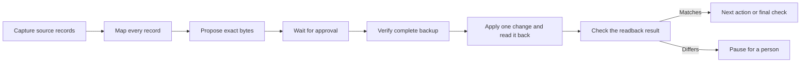

Use this recipe to combine protected source records into destination files.
It captures the sources, checks every mapping, and waits for approval of the
exact proposed output. It saves a complete backup before it writes a target.

The example uses four synthetic source kinds: document, current record,
discussion comment, and historical entry. Each complete source record is one
protected fact. That fact includes its metadata and exact body text.
The fixture uses scripted proposal and review data and calls no model.

## Graph



Each stage uses an ordinary node with a stored attempt record. The apply
node changes one target and reads it back. A separate verification node
checks that result before the next action.
The final node checks that all protected records remain in their destinations.

## Contract

| Item | Value |
| --- | --- |
| Input | Declared source IDs, proposed destination content, expected target revisions, and one mapping per source |
| Output | Completed graph results and stored evidence for each target |
| Permissions | Read the declared sources; write the declared targets, local storage, and temporary files in the owned directory |
| Limits | One writer; 1–8 source records and 1–4 destinations; each record at most 64 KiB |
| Evidence | Source captures, proof packet, stored approval, complete backup, action intent, and before/after artifacts |

A source record holds an ID, a declared kind, metadata, and a body string.
A destination record holds an ID, a revision, an active flag, content, and
the last action's identity. The fixture stores these records as UTF-8 JSON
files with mode `0600`.

The mapping must preserve each complete source record in an active
destination. A change that drops metadata or alters a protected body is
refused. The recipe does not extract semantic facts from prose or decide
which facts can be discarded.

## Approval and writes

The proposal covers destination content, expected revisions, mappings, and
source hashes. Approval binds its exact bytes and the proof packet through
the stored callback APIs. The host posts and answers the callback only while
the executor is stopped.

Before each write, the file adapter checks stored approval, live source
hashes, the target's version and active status, and the verified backup.
Models can propose or review data; the deterministic adapter applies it.
The runnable fixture's `approve()` helper supplies a scripted answer. A real
host must collect its decision through the stored callback client.

The backup retains the original source and target file bytes, including all
record fields needed to restore them. Artifact hashes protect these bytes.
The recipe checks the backup before use. It provides no automatic restore.

Each file merge has one stable action identity taken from its original
stored node attempt. The target's content, revision, and action witness are
saved together through one file replacement. The witness identifies the
write that produced the content.

The recipe appends intent and result events to each target's own stream.
It keeps source event histories separate. It never imports a source's event
history into a target stream or the executor's run stream.

## Failure, pause, and recovery

A readback that succeeds with different bytes records a mismatch and pauses
the graph before the next write. A person must decide what happens next.
Changing the file back and calling resume does not clear that mismatch.

A readback that cannot run fails the graph. An action that fails before an
uncertain outward result also fails it. If a write succeeds but its response
is lost, the recipe reads the target before deciding whether it completed.

After a process crash leaves an action's outcome unknown, the executor
pauses that attempt for reconciliation. On resume, the recipe checks the
saved intent, exact target bytes, and action witness. A matching completed
write returns its evidence without another application. Unknown or
mismatched state stays paused. Resume alone never authorizes a repeated write.

This adapter assumes one writer owns the synthetic record directory.
An external service requires its own conditional-write and action-status
contract. The file example makes no guarantee about an arbitrary remote API.

## Run the workflow


The example writes only to its temporary directory and removes it when done.
The report is:

```json
{"status":"complete","sourceKinds":["document","current-record","discussion-comment","historical-entry"],"sourceCount":4,"actionCount":2,"protectedFacts":4,"lostProtectedFacts":0,"targetResultCount":2,"backupVerified":true,"scriptedProposalAndReview":true}
```

## Source

This one is three files that sit beside each other:
`safe-change-recipe.ts` drives the stored graph,
`safe-change-file-adapter.ts` reads and changes records, and
`safe-change.ts` runs the fixture below. Keep them together. They import
public runtime exports and nothing else.

```ts
import assert from 'node:assert/strict';
import { mkdtemp, rm } from 'node:fs/promises';
import { tmpdir } from 'node:os';
import { join } from 'node:path';
import type { ArtifactReference, JsonObject } from '@obversa/runtime';
import { openSafeChangeRun } from './safe-change-recipe.js';
import { readRecordBytes, readSource, readTarget, seedSafeChangeFixture, sourcePath, targetPath, targetStream } from './safe-change-file-adapter.js';

const directory = await mkdtemp(join(tmpdir(), 'obversa-safe-change-'));
let report;
try {
  const input = await seedSafeChangeFixture(directory);
  const original = {
    sources: await Promise.all(input.sourceIds.map(async (id) => ({ id, bytes: await readRecordBytes(sourcePath(directory, id)) }))),
    targets: await Promise.all(input.destinations.map(async ({ id }) => ({ id, bytes: await readRecordBytes(targetPath(directory, id)) }))),
  };
  const run = await openSafeChangeRun({ directory, runId: 'safe-change-example', input });
  const signal = new AbortController().signal;
  assert.equal((await run.executor.run(signal)).kind, 'pause');
  // This runnable fixture uses scripted approval, not a model or human review.
  await run.approve();
  const result = await run.executor.resume(run.approvalPosition, signal);
  assert.equal(result.kind, 'complete');
  if (result.kind !== 'complete') throw new Error('Safe change did not complete');
  const results: JsonObject[] = [];
  for (const target of input.destinations) {
    for await (const event of run.storage.eventStore.read(targetStream(target.id))) {
      if (event.type === 'safe-change:result') results.push(event.payload as JsonObject);
    }
  }
  const backup = JSON.parse(new TextDecoder().decode(await run.storage.artifactStore.read(
    { namespace: run.storage.record.namespace, runId: 'safe-change-example' }, results[0]!.backup as ArtifactReference,
  )));
  assert.deepEqual(backup, original);
  const targets = await Promise.all(input.destinations.map((target) => readTarget(directory, target.id)));
  const retention = ((result.output as JsonObject).nodes as JsonObject).retention as JsonObject;
  report = {
    status: result.kind,
    sourceKinds: await Promise.all(input.sourceIds.map(async (id) => (await readSource(directory, id)).kind)),
    sourceCount: input.sourceIds.length,
    actionCount: new Set(targets.map((target) => target.lastAction!.actionId)).size,
    protectedFacts: retention.protectedFacts,
    lostProtectedFacts: retention.lostProtectedFacts,
    targetResultCount: results.length,
    backupVerified: true,
    scriptedProposalAndReview: retention.scriptedProposalAndReview,
  };
} finally { await rm(directory, { recursive: true, force: true }); }
export const safeChangeReport = report;
console.log(JSON.stringify(safeChangeReport, null, 2));
```

The clean-consumer check compiles all three files against the packed runtime
with TypeScript 6 and TypeScript 7. It runs the compiled and direct TypeScript
forms and compares their reports with this page.
