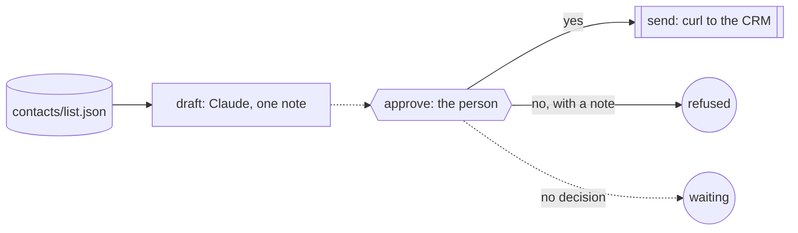

Three people said yes to a conversation last month and nobody has written
to them yet. The notes are in the CRM: who they are, what they asked, what
would make them want to talk again. Each first note has to sound like it
came from the person signing it, and none of them should go out unread.

You want the drafts written for you, one per contact, from the notes you
already have. You want to read each one and tap send or say no, with the
reason kept, so the next drafts are better. And you want to be sure that
nothing reaches a contact without your yes, however many drafts there are.

Obversa makes the send a step that belongs to you. A Claude seat drafts
each note from the brief and the contact's notes. Your decision on each is
a step in the run: a yes sends the note through the CRM's command, a no
records your reason, and a note you haven't decided on stays stopped on its
question. This file is one three-step run per contact, a draft, a decision
and a send, with the record of all three kept beside the drafts.

## Run it

Set the project up as [Installation](/get-started/installation) describes.
Copy the file with `briefs/`, `contacts/` and `decisions.json` beside it,
sign in to Claude Code, and run it from that directory. `decisions.json`
carries what the person decided on the last pass; set `OUTREACH_SEND_URL`
to your CRM's endpoint, or leave the fictional default:

```bash Terminal
npx tsx draft-then-send.ts
```

The output below is the proof's offline run, with scripted seats standing
in for the models, so the words are the script's and the shape is the run's.

```text Output, from the offline proof
▸ run
outreach-brightwater ▸ dag (3 nodes)
outreach-brightwater · node draft: start
outreach-brightwater › draft • draft
outreach-brightwater › draft engine:text
outreach-brightwater › draft   stand-in: 3/1 tok
outreach-brightwater › draft • draft: pass
outreach-brightwater · node draft: done (pass)
outreach-brightwater · node approve: start
outreach-brightwater › approve • approve
outreach-brightwater › approve • approve: pass
outreach-brightwater · node approve: done (pass)
outreach-brightwater · node send: start
outreach-brightwater › send • send
outreach-brightwater › send · send met: `curl` exited 0
outreach-brightwater › send • send: pass
outreach-brightwater · node send: done (pass)
outreach-brightwater ◂ dag pass
◂ run pass (3/1 tok)
▸ run
outreach-carraway ▸ dag (3 nodes)
outreach-carraway · node draft: start
outreach-carraway › draft • draft
outreach-carraway › draft engine:text
outreach-carraway › draft   stand-in: 3/1 tok
outreach-carraway › draft • draft: pass
outreach-carraway · node draft: done (pass)
outreach-carraway · node approve: start
outreach-carraway › approve • approve
outreach-carraway › approve • approve: fail
outreach-carraway · node approve: done (fail)
outreach-carraway · node send: done (aborted)
outreach-carraway ◂ dag fail
◂ run fail (3/1 tok)
▸ run
outreach-dunmore ▸ dag (3 nodes)
outreach-dunmore · node draft: start
outreach-dunmore › draft • draft
outreach-dunmore › draft engine:text
outreach-dunmore › draft   stand-in: 3/1 tok
outreach-dunmore › draft • draft: pass
outreach-dunmore · node draft: done (pass)
outreach-dunmore · node approve: start
outreach-dunmore › approve • approve
outreach-dunmore › approve • approve: paused
outreach-dunmore · node approve: done (paused)
outreach-dunmore · node send: done (aborted)
outreach-dunmore ◂ dag paused
◂ run paused (3/1 tok)
{
  "status": "pass",
  "contacts": [
    {
      "contact": "brightwater",
      "outcome": "pass",
      "sent": true,
      "note": null
    },
    {
      "contact": "carraway",
      "outcome": "fail",
      "sent": false,
      "note": "Too long, and it hints at a date. Cut it to the question about the person step."
    },
    {
      "contact": "dunmore",
      "outcome": "paused",
      "sent": false,
      "note": null
    }
  ],
  "sent": 1,
  "refused": 1,
  "waiting": 1
}
```

Three contacts, three drafts, one send. The first note was approved and
went to the CRM. The second was refused, with the reason on the record.
The third has no decision yet, so its run stopped on the question and
nothing was sent. `history/` holds one line per contact in `sent.jsonl`,
`refused.jsonl` or `waiting.jsonl`, and each contact's run has its own
record under `records/`.

## The file

The brief says what a first note is and what it never does, and a person
reads every draft:

```text briefs/outreach.md
---
files: []
---

# First note to a warm contact

You draft the first note to a contact who has already met us once. One
short email per contact, written to `outbox/<contact id>.md`, plain text,
under 120 words.

- Open with the one thing in the contact's notes that connects us.
- Say what we would like to do next, in one sentence.
- Ask one question they can answer in a line.
- Never quote a price, a discount or a deadline. Never promise a feature.
- Sign off as the sender named in `contacts/list.json`.

A person reads every draft and decides whether it is sent. Nothing you
write is sent by anyone but them.
```

Each contact is one `dag()` run of three steps. The draft seat writes
`outbox/<contact>.md`; the person's decision is an `approval` step; the send
is a command that runs only when the decision was yes:

```ts examples/use-cases/sales/draft-then-send.ts (excerpt) {4-5,18-22,25-26}
  return dag({
    name: `outreach-${contact.id}`,
    nodes: {
      draft: agentJob({
        label: 'draft',
        engine: 'draft',
        prompt: [
          `Draft the first note to ${contact.name} at ${contact.company}.`,
          `Their notes: ${contact.notes}`,
          `Sign off as ${list.sender}.`,
          `Follow briefs/outreach.md and write outbox/${contact.id}.md.`,
        ].join('\n'),
      }),
      approve: {
        needs: 'draft',
        // The person's decision from the last pass, when there is one.
        // Without it the step pauses on the question and nothing is sent.
        job: typeof decision === 'object'
          ? approval('approve', { question, answer: () => decision })
          : approval('approve', { question }),
      },
      send: {
        needs: 'approve',
        job: commandJob('send', ['curl', '-sS', '-X', 'POST', sendUrl, '--data-binary', `@outbox/${contact.id}.md`]),
      },
    },
  });
```

A decision the person has already made is the step's `answer`, so the run
carries on from it. Without one, `approval` has no answer to give: the step
pauses with the question on the record, and the send never runs. A no fails
the step with the person's note as its summary, and the send never runs
either. The host then files each contact by what happened:

```ts examples/use-cases/sales/draft-then-send.ts (excerpt) {8-9,18-19}
for (const contact of list.contacts) {
  const result = await run(outreach(contact), {
    engines: { draft: draft.engine },
    recordTo: `records/${contact.id}.jsonl`,
    runId: `outreach-${contact.id}`,
    onEvent: (event) => console.log(formatEvent(event)),
  });
  const nodes = (result.outcome.data ?? {}) as Record<string, Outcome | undefined>;
  const sent = nodes.send?.status === 'pass';
  const refused = nodes.approve?.status === 'fail';
  const report: Report = {
    contact: contact.id,
    outcome: result.outcome.status,
    sent,
    note: refused ? nodes.approve?.summary ?? null : null,
  };
  reports.push(report);
  const line = `${JSON.stringify({ contact: contact.id, runId: `outreach-${contact.id}`, ...(refused ? { note: report.note } : {}) })}\n`;
  await appendFile(sent ? 'history/sent.jsonl' : refused ? 'history/refused.jsonl' : 'history/waiting.jsonl', line);
}
```

Each run records to `records/<contact>.jsonl` under its own run id, so a
later pass can reopen exactly the run that is waiting when the person
decides, and the sent and refused ones are untouched.

<Accordion title="Full file">

```ts examples/use-cases/sales/draft-then-send.ts
import { appendFile, mkdir, readFile } from 'node:fs/promises';

import { claude } from '@obversa/engine-claude-cli';
import {
  agentJob,
  approval,
  commandJob,
  dag,
  formatEvent,
  run,
  type ApprovalAnswer,
  type Outcome,
} from '@obversa/runtime';

/**
 * Outreach drafted by a model, sent by a person, one message at a time. A
 * Claude seat drafts a first note to each warm contact from the brief and
 * the contact's notes. The person reads the draft and decides: a yes sends
 * it through the CRM's command, a no records the reason, and no decision
 * yet leaves the run stopped on the question. The record keeps what was
 * sent, what was refused and why, and what is still waiting.
 */

interface Contact {
  readonly id: string;
  readonly name: string;
  readonly company: string;
  readonly notes: string;
}

interface ContactList {
  readonly sender: string;
  readonly contacts: readonly Contact[];
}

const list = JSON.parse(await readFile('contacts/list.json', 'utf8')) as ContactList;
const decisions = JSON.parse(await readFile('decisions.json', 'utf8')) as Record<string, ApprovalAnswer | string>;
const sendUrl = process.env.OUTREACH_SEND_URL ?? 'https://crm.example/api/outbox';
const draft = claude('claude-sonnet-4-5');

/** One contact: a draft, the person's decision, and the send. */
function outreach(contact: Contact) {
  const decision = decisions[contact.id];
  const question = `Send this note to ${contact.name} at ${contact.company}?`;
  return dag({
    name: `outreach-${contact.id}`,
    nodes: {
      draft: agentJob({
        label: 'draft',
        engine: 'draft',
        prompt: [
          `Draft the first note to ${contact.name} at ${contact.company}.`,
          `Their notes: ${contact.notes}`,
          `Sign off as ${list.sender}.`,
          `Follow briefs/outreach.md and write outbox/${contact.id}.md.`,
        ].join('\n'),
      }),
      approve: {
        needs: 'draft',
        // The person's decision from the last pass, when there is one.
        // Without it the step pauses on the question and nothing is sent.
        job: typeof decision === 'object'
          ? approval('approve', { question, answer: () => decision })
          : approval('approve', { question }),
      },
      send: {
        needs: 'approve',
        job: commandJob('send', ['curl', '-sS', '-X', 'POST', sendUrl, '--data-binary', `@outbox/${contact.id}.md`]),
      },
    },
  });
}

interface Report {
  readonly contact: string;
  readonly outcome: string;
  readonly sent: boolean;
  readonly note: string | null;
}

const reports: Report[] = [];
await mkdir('history', { recursive: true });
for (const contact of list.contacts) {
  const result = await run(outreach(contact), {
    engines: { draft: draft.engine },
    recordTo: `records/${contact.id}.jsonl`,
    runId: `outreach-${contact.id}`,
    onEvent: (event) => console.log(formatEvent(event)),
  });
  const nodes = (result.outcome.data ?? {}) as Record<string, Outcome | undefined>;
  const sent = nodes.send?.status === 'pass';
  const refused = nodes.approve?.status === 'fail';
  const report: Report = {
    contact: contact.id,
    outcome: result.outcome.status,
    sent,
    note: refused ? nodes.approve?.summary ?? null : null,
  };
  reports.push(report);
  const line = `${JSON.stringify({ contact: contact.id, runId: `outreach-${contact.id}`, ...(refused ? { note: report.note } : {}) })}\n`;
  await appendFile(sent ? 'history/sent.jsonl' : refused ? 'history/refused.jsonl' : 'history/waiting.jsonl', line);
}

console.log(JSON.stringify({
  status: 'pass',
  contacts: reports,
  sent: reports.filter((report) => report.sent).length,
  refused: reports.filter((report) => report.note !== null).length,
  waiting: reports.filter((report) => report.outcome === 'paused').length,
}, null, 2));
```

</Accordion>

## The team's shape



## What the run did

The proof runs the file against a scripted seat and a stand-in for `curl`,
and checks what the page says: three drafts on disk, one call to the CRM
and only for the approved note, the refusal's note on the record, and the
third run stopped on its question. Obversa recorded each contact's run as
its own event log, so the record for the refused note shows the draft, the
question, and the person's reason in order, and the record for the waiting
note ends on the question.

The person's decisions here are read from a file, because the file has to
run offline. In use, the answer comes through the callbacks client from a
[page that asks one question](/concepts/surfaces), and a run started again
with `resume: true` finds it, as [A person decides](/patterns/approval)
shows. Either way the send is a step the person owns, and the drafts that
never got a yes are still on disk to read.

## Next steps

- [A person decides](/patterns/approval): the decision step, and how an
  answer reaches a paused run.
- [A command decides the path](/patterns/command-kickback): the send as a
  command whose exit code is the result.
- [Contract review](/workflows/contract-playbook): a model's drafts and a
  person's decision in another field.
