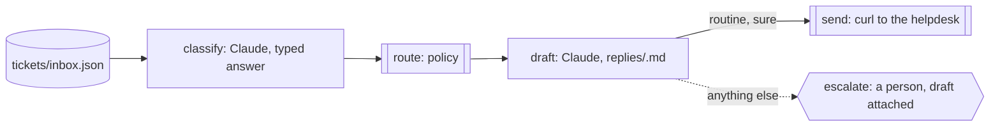

A support inbox fills overnight. Most of it is routine: a password reset, a
question the help pages already answer. Some of it isn't: a double charge,
an angry customer, a question about pricing nobody has written down. The
routine ones should be answered by the time the team sits down, and the
rest should be waiting for a person with a draft already written.

You want a model to sort the inbox and answer what it can, and you want a
firm line: nothing about money, anger or a promise goes out without a
person reading it. You want the line held by the run, not by the model's
own judgement of itself, so a classification the run can't read is never
treated as routine.

Obversa makes the classification a typed answer and the routing a check
you write. A Claude seat classifies each ticket and returns one JSON
object; a check turns it into a route under a policy you set; the same seat
drafts a reply for every ticket; then the run splits. A routine ticket the
seat was sure about is answered through the helpdesk's command. Everything
else stops on a question for a person, with the draft attached. This file
is one five-step run per ticket, and every ticket leaves a record of how it
was routed and why.

## Run it

Set the project up as [Installation](/get-started/installation) describes.
Copy the file with `briefs/`, `help/`, `tickets/` and `policy.json` beside
it, sign in to Claude Code, and run it from that directory. Set
`HELPDESK_URL` to your helpdesk's endpoint, or leave the fictional default:

```bash Terminal
npx tsx triage-with-escalation.ts
```

The output below is the proof's offline run, with scripted seats standing
in for the models, so the words are the script's and the shape is the run's.

```text Output, from the offline proof
▸ run
triage-t-101 ▸ dag (5 nodes)
triage-t-101 · node classify: start
triage-t-101 › classify • classify
triage-t-101 › classify engine:text
triage-t-101 › classify   stand-in: 3/1 tok
triage-t-101 › classify • classify: pass
triage-t-101 · node classify: done (pass)
triage-t-101 · node route: start
triage-t-101 › route • route
triage-t-101 › route • route: pass
triage-t-101 · node route: done (pass)
triage-t-101 · node draft: start
triage-t-101 › draft • draft
triage-t-101 › draft engine:text
triage-t-101 › draft   stand-in: 3/1 tok
triage-t-101 › draft • draft: pass
triage-t-101 · node draft: done (pass)
triage-t-101 › send · when met: the ticket is routine and the seat was sure: true
triage-t-101 · node send: start
triage-t-101 › send • send
triage-t-101 › escalate · when not met: a person needs to read this one: false
triage-t-101 · node escalate: skip (pass)
triage-t-101 › send · send met: `curl` exited 0
triage-t-101 › send • send: pass
triage-t-101 · node send: done (pass)
triage-t-101 ◂ dag pass
◂ run pass (6/2 tok)
▸ run
triage-t-102 ▸ dag (5 nodes)
triage-t-102 · node classify: start
triage-t-102 › classify • classify
triage-t-102 › classify engine:text
triage-t-102 › classify   stand-in: 3/1 tok
triage-t-102 › classify • classify: pass
triage-t-102 · node classify: done (pass)
triage-t-102 · node route: start
triage-t-102 › route • route
triage-t-102 › route • route: pass
triage-t-102 · node route: done (pass)
triage-t-102 · node draft: start
triage-t-102 › draft • draft
triage-t-102 › draft engine:text
triage-t-102 › draft   stand-in: 3/1 tok
triage-t-102 › draft • draft: pass
triage-t-102 · node draft: done (pass)
triage-t-102 › send · when not met: the ticket is routine and the seat was sure: false
triage-t-102 › escalate · when met: a person needs to read this one: true
triage-t-102 · node escalate: start
triage-t-102 › escalate • escalate
triage-t-102 · node send: skip (pass)
triage-t-102 › escalate • escalate: paused
triage-t-102 · node escalate: done (paused)
triage-t-102 ◂ dag paused
◂ run paused (6/2 tok)
▸ run
triage-t-103 ▸ dag (5 nodes)
triage-t-103 · node classify: start
triage-t-103 › classify • classify
triage-t-103 › classify engine:text
triage-t-103 › classify   stand-in: 3/1 tok
triage-t-103 › classify • classify: pass
triage-t-103 · node classify: done (pass)
triage-t-103 · node route: start
triage-t-103 › route • route
triage-t-103 › route • route: pass
triage-t-103 · node route: done (pass)
triage-t-103 · node draft: start
triage-t-103 › draft • draft
triage-t-103 › draft engine:text
triage-t-103 › draft   stand-in: 3/1 tok
triage-t-103 › draft • draft: pass
triage-t-103 · node draft: done (pass)
triage-t-103 › send · when not met: the ticket is routine and the seat was sure: false
triage-t-103 › escalate · when met: a person needs to read this one: true
triage-t-103 · node escalate: start
triage-t-103 › escalate • escalate
triage-t-103 · node send: skip (pass)
triage-t-103 › escalate • escalate: paused
triage-t-103 · node escalate: done (paused)
triage-t-103 ◂ dag paused
◂ run paused (6/2 tok)
▸ run
triage-t-104 ▸ dag (5 nodes)
triage-t-104 · node classify: start
triage-t-104 › classify • classify
triage-t-104 › classify engine:text
triage-t-104 › classify   stand-in: 3/1 tok
triage-t-104 › classify • classify: pass
triage-t-104 · node classify: done (pass)
triage-t-104 · node route: start
triage-t-104 › route • route
triage-t-104 › route • route: pass
triage-t-104 · node route: done (pass)
triage-t-104 · node draft: start
triage-t-104 › draft • draft
triage-t-104 › draft engine:text
triage-t-104 › draft   stand-in: 3/1 tok
triage-t-104 › draft • draft: pass
triage-t-104 · node draft: done (pass)
triage-t-104 › send · when not met: the ticket is routine and the seat was sure: false
triage-t-104 › escalate · when met: a person needs to read this one: true
triage-t-104 · node escalate: start
triage-t-104 › escalate • escalate
triage-t-104 · node send: skip (pass)
triage-t-104 › escalate • escalate: paused
triage-t-104 · node escalate: done (paused)
triage-t-104 ◂ dag paused
◂ run paused (6/2 tok)
{
  "status": "pass",
  "tickets": [
    {
      "ticket": "t-101",
      "kind": "routine",
      "confidence": 0.93,
      "route": "reply",
      "outcome": "pass"
    },
    {
      "ticket": "t-102",
      "kind": "routine",
      "confidence": 0.55,
      "route": "person",
      "outcome": "paused"
    },
    {
      "ticket": "t-103",
      "kind": "needs-a-person",
      "confidence": 0.97,
      "route": "person",
      "outcome": "paused"
    },
    {
      "ticket": "t-104",
      "kind": "unreadable",
      "confidence": null,
      "route": "person",
      "outcome": "paused"
    }
  ],
  "answered": 1,
  "forAPerson": 3
}
```

Four tickets, one answered, three for a person. The password reset was
routine and the seat was sure, so its reply went to the helpdesk. The
export question was routine too, but the seat's confidence was under the
policy, so it stopped for a person. The double charge needed a person. The
seats question came back with a classification that wasn't JSON, which the
check refused to read as routine. All four have a draft in `replies/`, and
`history/` says which were answered and which wait, with the reason.

## The file

The brief gives the seat its two jobs and the line it must not cross:

```text briefs/support.md
---
files: []
---

# Support triage

Two jobs, one ticket at a time.

**Classify.** Read the ticket and answer with one JSON object and nothing
else: `{"kind": "routine" | "needs-a-person", "confidence": 0 to 1,
"reason": "one line"}`. Routine means the reply is in `help/` and nothing
about the ticket needs judgement: a how-to, a password reset, a known
answer. Anything about money, an angry customer, a legal word, or a
request the help pages don't cover needs a person.

**Draft.** Write the reply to `replies/<ticket id>.md`: plain text, under
150 words, answering what was asked from `help/` alone. Never promise a
refund, a credit or a date. Sign off as the support team.

Every draft is written, even for a ticket that needs a person, so the
person reads the ticket with a draft beside it. Nothing is sent to a
customer unless the run's routing says routine, and a person's yes sends
the rest.
```

The routing is a function, not a model. It reads the typed classification,
applies the policy's confidence floor, and sends anything it can't read to
a person:

```ts examples/use-cases/support/triage-with-escalation.ts (excerpt) {7-9,11-12}
/** Read the typed classification. Anything the check can't read goes to a person. */
function routing(text: string, policy: Policy): Routing {
  try {
    const answer = JSON.parse(text) as { kind?: unknown; confidence?: unknown; reason?: unknown };
    const kind = answer.kind === 'routine' || answer.kind === 'needs-a-person' ? answer.kind : null;
    const confidence = typeof answer.confidence === 'number' && Number.isFinite(answer.confidence) ? answer.confidence : null;
    const reason = typeof answer.reason === 'string' ? answer.reason : 'no reason given';
    if (kind === null || confidence === null) {
      return { route: 'person', kind: 'unreadable', confidence, reason: 'the classification could not be read' };
    }
    const routine = kind === 'routine' && confidence >= policy.minConfidenceToReply;
    return { route: routine ? 'reply' : 'person', kind, confidence, reason };
  } catch {
    return { route: 'person', kind: 'unreadable', confidence: null, reason: 'the classification was not JSON' };
  }
}
```

Each ticket is one `dag()` run. `classify` reads the ticket and `help/`
with read-only tools; `route` runs the function above; `draft` writes the
reply whatever the route; then `send` and `escalate` each read the route
and only one of them runs:

```ts examples/use-cases/support/triage-with-escalation.ts (excerpt) {2-3,8-9,12}
      },
      send: {
        needs: ['route', 'draft'],
        when: predicate((ctx) => routeOf(ctx).route === 'reply', 'the ticket is routine and the seat was sure'),
        job: commandJob('send', ['curl', '-sS', '-X', 'POST', `${helpdeskUrl}/${ticket.id}/reply`, '--data-binary', `@${reply}`]),
      },
      escalate: {
        needs: ['route', 'draft'],
        when: predicate((ctx) => routeOf(ctx).route === 'person', 'a person needs to read this one'),
        job: approval('escalate', {
          question: `Ticket ${ticket.id} (${ticket.subject}) needs a person. Send the draft in ${reply}, or answer it yourself?`,
          input: { ticket: ticket.id, draft: reply },
        }),
      },
    },
  });
```

`send` is a command whose exit code is its result, so the helpdesk's
refusal would fail the step on the record. `escalate` is a person's
question with the ticket id and the draft's path as its input; with nobody
answering, the run stops there and the draft waits. Each ticket records to
`records/<ticket>.jsonl` under its own run id.

<Accordion title="Full file">

```ts examples/use-cases/support/triage-with-escalation.ts
import { appendFile, mkdir, readFile } from 'node:fs/promises';

import { claude } from '@obversa/engine-claude-cli';
import {
  agentJob,
  approval,
  commandJob,
  dag,
  fnJob,
  formatEvent,
  predicate,
  run,
  type JobContext,
  type Outcome,
} from '@obversa/runtime';

/**
 * Support triage with a person on everything that isn't routine. For each
 * ticket a Claude seat classifies it with a typed answer, a check turns
 * that answer into a route, the same seat drafts a reply, and then the run
 * splits: a routine ticket the seat was sure about is answered through the
 * helpdesk's command, and everything else stops on a question for a
 * person with the draft beside it. A classification the check can't read
 * is never routine.
 */

interface Ticket {
  readonly id: string;
  readonly from: string;
  readonly subject: string;
  readonly body: string;
}

interface Policy {
  readonly minConfidenceToReply: number;
}

type Route = 'reply' | 'person';

interface Routing {
  readonly route: Route;
  readonly kind: string;
  readonly confidence: number | null;
  readonly reason: string;
}

/** Read the typed classification. Anything the check can't read goes to a person. */
function routing(text: string, policy: Policy): Routing {
  try {
    const answer = JSON.parse(text) as { kind?: unknown; confidence?: unknown; reason?: unknown };
    const kind = answer.kind === 'routine' || answer.kind === 'needs-a-person' ? answer.kind : null;
    const confidence = typeof answer.confidence === 'number' && Number.isFinite(answer.confidence) ? answer.confidence : null;
    const reason = typeof answer.reason === 'string' ? answer.reason : 'no reason given';
    if (kind === null || confidence === null) {
      return { route: 'person', kind: 'unreadable', confidence, reason: 'the classification could not be read' };
    }
    const routine = kind === 'routine' && confidence >= policy.minConfidenceToReply;
    return { route: routine ? 'reply' : 'person', kind, confidence, reason };
  } catch {
    return { route: 'person', kind: 'unreadable', confidence: null, reason: 'the classification was not JSON' };
  }
}

const routeOf = (ctx: JobContext): Routing => ctx.needs?.route?.data as Routing;

/** One ticket: classify, route, draft, then reply or ask a person. */
function triage(ticket: Ticket, policy: Policy, helpdeskUrl: string) {
  const reply = `replies/${ticket.id}.md`;
  const ticketText = `Ticket ${ticket.id} from ${ticket.from}\nSubject: ${ticket.subject}\n\n${ticket.body}`;
  return dag({
    name: `triage-${ticket.id}`,
    nodes: {
      classify: agentJob({
        label: 'classify',
        engine: 'support',
        workspaceMode: 'read',
        tools: ['Read', 'Glob'],
        prompt: `Classify this ticket as briefs/support.md says, reading help/ to see whether the answer is there.\n\n${ticketText}`,
      }),
      route: {
        needs: 'classify',
        job: fnJob('route', (ctx): Outcome => {
          const decided = routing(String(ctx.needs?.classify?.data ?? ''), policy);
          return { status: 'pass', summary: `${decided.route}: ${decided.reason}`, data: decided };
        }),
      },
      draft: {
        needs: 'route',
        job: agentJob({
          label: 'draft',
          engine: 'support',
          prompt: `Draft the reply as briefs/support.md says and write ${reply}.\n\n${ticketText}`,
        }),
      },
      send: {
        needs: ['route', 'draft'],
        when: predicate((ctx) => routeOf(ctx).route === 'reply', 'the ticket is routine and the seat was sure'),
        job: commandJob('send', ['curl', '-sS', '-X', 'POST', `${helpdeskUrl}/${ticket.id}/reply`, '--data-binary', `@${reply}`]),
      },
      escalate: {
        needs: ['route', 'draft'],
        when: predicate((ctx) => routeOf(ctx).route === 'person', 'a person needs to read this one'),
        job: approval('escalate', {
          question: `Ticket ${ticket.id} (${ticket.subject}) needs a person. Send the draft in ${reply}, or answer it yourself?`,
          input: { ticket: ticket.id, draft: reply },
        }),
      },
    },
  });
}

const tickets = JSON.parse(await readFile('tickets/inbox.json', 'utf8')) as Ticket[];
const policy = JSON.parse(await readFile('policy.json', 'utf8')) as Policy;
const helpdeskUrl = process.env.HELPDESK_URL ?? 'https://helpdesk.example/api/tickets';
const support = claude('claude-sonnet-4-5');

interface Report {
  readonly ticket: string;
  readonly kind: string;
  readonly confidence: number | null;
  readonly route: Route;
  readonly outcome: string;
}

const reports: Report[] = [];
await mkdir('history', { recursive: true });
for (const ticket of tickets) {
  const result = await run(triage(ticket, policy, helpdeskUrl), {
    engines: { support: support.engine },
    recordTo: `records/${ticket.id}.jsonl`,
    runId: `triage-${ticket.id}`,
    onEvent: (event) => console.log(formatEvent(event)),
  });
  const nodes = (result.outcome.data ?? {}) as Record<string, Outcome | undefined>;
  const decided = nodes.route?.data as Routing;
  const report: Report = {
    ticket: ticket.id,
    kind: decided.kind,
    confidence: decided.confidence,
    route: decided.route,
    outcome: result.outcome.status,
  };
  reports.push(report);
  await appendFile(
    decided.route === 'reply' ? 'history/answered.jsonl' : 'history/for-a-person.jsonl',
    `${JSON.stringify({ ticket: ticket.id, runId: `triage-${ticket.id}`, reason: decided.reason })}\n`,
  );
}

console.log(JSON.stringify({
  status: 'pass',
  tickets: reports,
  answered: reports.filter((report) => report.route === 'reply').length,
  forAPerson: reports.filter((report) => report.route === 'person').length,
}, null, 2));
```

</Accordion>

## The team's shape



## What the run did

The proof runs the file against a scripted seat and a stand-in for `curl`,
and checks the routing the page describes: one call to the helpdesk and
only for the routine ticket, three runs stopped on their question, four
drafts on disk, and the unreadable classification filed with its reason.
Obversa recorded each ticket's run as its own event log, so the record for
the seats question shows the classification the check couldn't read, the
route it chose, the draft, and the question, in order.

The policy's confidence floor is the author's number, and the fixture
exercises both sides of it. A high confidence clears the floor; it doesn't
prove the reply right, which is why the line about money, anger and
promises is in the brief and the check, not in the seat's judgement alone.

## Next steps

- [A person decides](/patterns/approval): the escalation step, and how an
  answer reaches a paused run.
- [Evals in an agent workflow](/reviewing/evals): a typed classification as
  a check that decides the next step.
- [Draft, then send](/workflows/sales/draft-then-send): the same send step
  with a person deciding every message.
