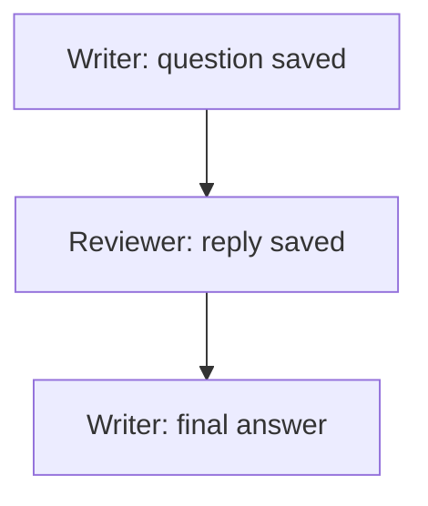

Let a writer ask a reviewer for help, then pick up the reply without you
relaying it.

Give each member a name, a role and a brief. Put the writer and reviewer in
a room. A saved message that mentions a member requests that member's next
turn. The conversation stays in the run record, so a fresh executor can
read the messages and the turns they requested.



## Define the conversation

Use the installed runtime package in your own TypeScript file. The
[complete source](#source) below uses local functions for the writer and
reviewer, so it needs no model account. It writes a temporary record,
reopens it within the program and removes its temporary files before exit.

This page compiles `teamGraphType`, which uses the stored graph executor and
host bindings. That path doesn't create or merge worktrees or run callable
review functions for you. So a team result isn't proof that a merge or
review happened. For a callable job with its own workspace and review
behavior, use `team(config)` as the
[team form contract](/graphs/contract#team-form-contract) describes.

```ts
import {
  compileGraph, createGraphExecutor, loadRunDefinition, persistRunDefinition,
  projectTeamRooms, resolveGraphPlan, teamGraphType,
  type DomainEventEnvelope, type GraphNodeBinding, type JsonValue, type ResultContract, type RunStoragePolicy,
  type TeamDefinition, type TeamGraphResult, type TeamMessage, type TeamTurnResult,
} from '@obversa/runtime';
import { createLocalRunStorage } from '@obversa/runtime/storage/local';
```

The reviewer waits for a question because its `initialTurn` is `false`:

```ts
const definition: TeamDefinition = {
  id: 'release-team', definitionVersion: 1,
  data: {
    task: 'Prepare a release note.', globalConcurrency: 1, maxTurnsPerMember: 2,
    communication: { rooms: [{ id: 'review', members: ['writer', 'reviewer'] }], tailMessages: 3 },
  },
  nodes: [
    { id: 'writer', data: { role: 'writer', brief: 'Draft the release note.' } },
    { id: 'reviewer', data: { role: 'reviewer', brief: 'Check the draft.', initialTurn: false } },
  ],
  edges: [],
};
```

The writer sends its question in its successful turn result. `mentions`
holds member IDs. The runtime doesn't look for names in the text:

```ts
  const nodes = {
    writer: binding('writer', join(temporaryRoot, 'writer'), async ({ input }): Promise<TeamTurnResult> => {
      const turn = input as TurnInput;
      if (turn.result === null) return {
        summary: 'Review requested.',
        posts: [{ roomId: 'review', text: `Please review: ${turn.task}`, mentions: ['reviewer'] }],
      };
      const reply = turn.messages.find((message) => message.sender === 'reviewer');
      assert.ok(reply, 'The writer requires the saved reviewer reply.');
      return { summary: `Finished ${turn.task}: ${reply.text}`, data: { replyId: reply.id, reply: reply.text } };
    }),
    reviewer: binding('reviewer', join(temporaryRoot, 'reviewer'), async ({ input }) => {
      const question = (input as TurnInput).messages.find((message) => message.sender === 'writer');
      assert.ok(question, 'The reviewer requires the saved writer question.');
      return {
        summary: 'Draft checked.',
        posts: [{ roomId: question.roomId, text: `Reviewed ${question.id}: ${question.text}`, mentions: ['writer'] }],
      };
    }),
  };
```

The reviewer receives the saved question. Its reply mentions `writer`,
which gives the writer another turn with that reply. The example checks
that the writer's final answer contains the reply before it prints success.

To ask for an answer, end the turn. A message is saved with its member's
successful result, not while an engine is still speaking. The reply then
queues the member again. A failed or unfinished turn sends nothing.

A mention requests a later turn and never interrupts one already running.
Several pending mentions for the same member share one queued turn and keep
their triggering messages.

## Output

The saved messages, dispatch order and final answers come from the run's
record and result. The fresh executor adds no events when it reads the
completed conversation. The example reopens storage inside one program. It
leaves no record behind and doesn't resume across separate processes.

```json
{
  "messages": [
    {
      "sender": "writer",
      "text": "Please review: Prepare a release note."
    },
    {
      "sender": "reviewer",
      "text": "Reviewed team/writer/1/0: Please review: Prepare a release note."
    }
  ],
  "order": [
    "writer",
    "reviewer",
    "writer"
  ],
  "answers": [
    {
      "name": "writer",
      "summary": "Finished Prepare a release note.: Reviewed team/writer/1/0: Please review: Prepare a release note."
    },
    {
      "name": "reviewer",
      "summary": "Draft checked."
    }
  ],
  "projectionRevision": 10,
  "replayAddedEvents": false,
  "temporaryDirectoryRemoved": true
}
```

## Team fields

`teamGraphType` is the workflow shape passed to `compileGraph`.
`TeamDefinition` contains an `id`, a `definitionVersion`, team `data`,
member `nodes` and an empty `edges` array. Messages request turns. Edges
don't connect members.

### Team data

| `TeamGraphData` field | What it controls |
| --- | --- |
| `task` | Task text supplied to every member. |
| `globalConcurrency` | Maximum member turns dispatched together. The whole active batch settles before another starts. |
| `maxTurnsPerMember` | Maximum dispatched turns for each member. A requested turn beyond this cap fails the run. |
| `communication` | Optional rooms and their message-tail limit. Without it, results must not include `posts`. |

All three limits, including `tailMessages` below, must be positive safe
integers. The member count multiplied by `maxTurnsPerMember` must also be a
safe integer. The host's ordinary input and output byte limits also apply.

### Members

Each node's `id` is the member's address. Its data is a `TeamNodeData` value:

| Member data field | What the member receives or uses |
| --- | --- |
| `role` | Description of the member's job, not a second address. |
| `brief` | Instructions supplied on each turn. |
| `initialTurn` | Optional; defaults to `true`. Set it to `false` to wait for a saved mention. |
| `lane` | Optional engine lane declaration. The host supplies the engine instance separately. Omit it for a data-effect binding such as the example's local functions. |

### Rooms

`TeamCommunication.rooms` is a list of `TeamRoom` values. Each room has a
unique `id` and a `members` list of distinct node IDs. List every member for
a run-wide room, one team's members for a team room, or two members for a
direct message. Membership is part of the saved definition. A member can't
change it during the run.

<Warning>
Keep the run record and the directory for [room files](#room-files) outside
member workspaces, and use the host's access controls. Room membership
controls which posts are accepted and what input each member receives. It
isn't a filesystem sandbox. The operator's full record contains every room.
Processes that share unrestricted filesystem access can read the same files.
</Warning>

`TeamCommunication.tailMessages` sets how many recent messages from each
permitted room enter a member's next input. A pending message that requested
the turn is included even when it falls outside that tail. Messages present
in both groups appear once, in saved order. So the tail limit doesn't cap
every message in an input. The input-byte budget still applies.

### Turn results

Every successful member result is a `TeamTurnResult`:

| Result field | Meaning |
| --- | --- |
| `summary` | Required text describing the member's answer. |
| `data` | Optional JSON data for the member's next turn and final result. |
| `posts` | Optional list of `TeamPost` values to send when the turn is saved successfully. |

A `TeamPost` has `roomId`, `text` and `mentions`. The sender must belong to
the room, and every mentioned member must belong to that same room. Every
post is checked before any post from that turn is accepted.

Invalid result content fails the turn with `RESULT_INVALID` before a completion
is saved. The team returns `TEAM_NODE_FAILED` after active turns settle. If an
invalid completion is already in the record, replay retains that failure and
the earlier valid results and messages. It delivers none of the bad turn's
posts, and room files can still be rebuilt from accepted messages. Malformed
event records and unsupported event versions are rejected. The example also
binds a result contract that reuses the compiled form's membership check.

A saved `TeamMessage` retains those three fields and adds `sender`,
`position` and `id`. The runtime obtains the sender from the completed node.
The message ID combines the dispatch position with the post's zero-based
index.

Each next-turn input contains `task`, `role`, `brief`, `result` and
`messages`. `result` is this member's preceding result, or `null` on its
first turn. It is not the whole team's result. A member receives messages
only from rooms it belongs to.

### Final answers

Successful execution returns a `TeamGraphResult` in the executor outcome's
`output`: the task and an `agents` list in member declaration order. Each
entry contains `name`, `role` and that member's last `result`. A member that
never receives a turn has `result: null`.

After active turns settle, `TEAM_NODE_FAILED` reports any failed member,
even when another member is paused. Without a failed member, a paused member
keeps the run paused until the host calls the executor's `resume`.
`TEAM_TURN_LIMIT` reports a queued member whose turn cap is exhausted.

## Room files

`projectTeamRooms` reads a saved team run and rebuilds its room files.
Supply the run's `storage`, its `runId` and the operator's output
`directory`. The result contains the last read `revision` and a list of
`{ roomId, path }` entries. Use that list to find each file. Don't build its
filename from the room name.

Each file contains one readable line per accepted message: sender, message
ID, mentions, a colon and the text. An empty room has an empty file. A run
without communication returns no files. Newlines and terminal control
characters are printed as escapes. People and tools can tail these files
like an ordinary text chat.

`projectTeamRooms` changes no stored events. A rebuild replaces its own files
and leaves unrelated files alone. Each file replacement is atomic, but the set
of room files isn't replaced as one operation. The returned revision says
what was read, not that the run stopped changing during the write. Deleting
a room file does not delete its messages from the record.

## Source

Copy this complete file into a TypeScript project with
[`@obversa/runtime` installed](/get-started/installation).

<Accordion title="Complete team-conversation.ts">

```ts
import assert from 'node:assert/strict';
import { createHash } from 'node:crypto';
import { access, mkdir, mkdtemp, realpath, rm } from 'node:fs/promises';
import { tmpdir } from 'node:os';
import { join } from 'node:path';

// #region imports
import {
  compileGraph, createGraphExecutor, loadRunDefinition, persistRunDefinition,
  projectTeamRooms, resolveGraphPlan, teamGraphType,
  type DomainEventEnvelope, type GraphNodeBinding, type JsonValue, type ResultContract, type RunStoragePolicy,
  type TeamDefinition, type TeamGraphResult, type TeamMessage, type TeamTurnResult,
} from '@obversa/runtime';
import { createLocalRunStorage } from '@obversa/runtime/storage/local';
// #endregion imports

// #region definition
const definition: TeamDefinition = {
  id: 'release-team', definitionVersion: 1,
  data: {
    task: 'Prepare a release note.', globalConcurrency: 1, maxTurnsPerMember: 2,
    communication: { rooms: [{ id: 'review', members: ['writer', 'reviewer'] }], tailMessages: 3 },
  },
  nodes: [
    { id: 'writer', data: { role: 'writer', brief: 'Draft the release note.' } },
    { id: 'reviewer', data: { role: 'reviewer', brief: 'Check the draft.', initialTurn: false } },
  ],
  edges: [],
};
// #endregion definition

const graph = compileGraph(teamGraphType, definition);
// Keys are sorted so these JSON bytes match the contract's schema digest.
const resultSchema = {
  properties: {
    data: {},
    posts: {
      items: {
        properties: {
          mentions: { items: { type: 'string' }, type: 'array' },
          roomId: { type: 'string' },
          text: { type: 'string' },
        },
        required: ['roomId', 'text', 'mentions'],
        type: 'object',
      },
      type: 'array',
    },
    summary: { type: 'string' },
  },
  required: ['summary'],
  type: 'object',
} as const;
const resultRecord = {
  name: 'team-turn', version: 1,
  schemaDigest: `sha256:${createHash('sha256').update(JSON.stringify(resultSchema)).digest('hex')}` as const,
};

const storagePolicy = {
  schemaVersion: 1, maxEventPayloadBytes: 64_000, maxAppendBatchBytes: 128_000,
  maxArtifactBytes: 1_000_000, maxTotalArtifactBytesPerRun: 4_000_000,
  retention: 'until-run-delete',
  sensitiveContent: { marked: 'reject', exact: 'reject', freeText: 'redact-before-hash' },
} as const satisfies RunStoragePolicy;

function binding(member: string, directory: string, runData: NonNullable<GraphNodeBinding['runData']>): GraphNodeBinding {
  const resultContract: ResultContract = {
    record: resultRecord,
    schema: resultSchema,
    validate(value) {
      const issue = graph.validateNodeResult!(member, value as JsonValue);
      if (issue !== null) throw new Error(`${issue.path}: ${issue.message}`);
      return value as TeamTurnResult;
    },
  };
  return {
    prompt: null, scratchDirectory: directory,
    workspace: { mode: 'none', directory: null, allowedPaths: [] },
    trustedCaller: {}, permissions: [],
    policy: {
      inputBytes: 10_000, outputBytes: 10_000, timeoutMs: 5_000,
      teardownGraceMs: 100, memoryBytes: 10_000_000,
      filesChanged: 0, linesChanged: 0, callTokens: null,
    },
    resultContract, runData, parseResult: null, tokenBudget: null,
    decideAction: async () => ({ kind: 'allow' }),
  };
}

const temporaryRoot = await realpath(await mkdtemp(join(tmpdir(), 'obversa-team-conversation-')));
const runId = 'release-team-run';
const openStorage = () => createLocalRunStorage({
  directory: join(temporaryRoot, 'storage'), namespace: 'team-conversation', policy: storagePolicy,
});
let report;
try {
  const storage = openStorage();
  const packageIdentity = {
    source: 'npm:@example/team-conversation', version: '1.0.0',
    digest: `sha256:${'3'.repeat(64)}` as const,
  };
  await persistRunDefinition(storage, {
    runId, eventId: 'release-team-started', timestamp: '2026-01-01T00:00:00.000Z',
    graphDefinition: graph.definition,
    resolvedPlan: resolveGraphPlan(graph.describe(), {
      package: packageIdentity, admission: { package: packageIdentity, permissions: [] }, executionLanes: [],
    }),
    resolvedInputs: {}, workspaceBinding: null, hostBinding: null,
  });
  for (const member of ['writer', 'reviewer']) await mkdir(join(temporaryRoot, member));
  type TurnInput = { task: string; result: TeamTurnResult | null; messages: TeamMessage[] };
  // #region posts
  const nodes = {
    writer: binding('writer', join(temporaryRoot, 'writer'), async ({ input }): Promise<TeamTurnResult> => {
      const turn = input as TurnInput;
      if (turn.result === null) return {
        summary: 'Review requested.',
        posts: [{ roomId: 'review', text: `Please review: ${turn.task}`, mentions: ['reviewer'] }],
      };
      const reply = turn.messages.find((message) => message.sender === 'reviewer');
      assert.ok(reply, 'The writer requires the saved reviewer reply.');
      return { summary: `Finished ${turn.task}: ${reply.text}`, data: { replyId: reply.id, reply: reply.text } };
    }),
    reviewer: binding('reviewer', join(temporaryRoot, 'reviewer'), async ({ input }) => {
      const question = (input as TurnInput).messages.find((message) => message.sender === 'writer');
      assert.ok(question, 'The reviewer requires the saved writer question.');
      return {
        summary: 'Draft checked.',
        posts: [{ roomId: question.roomId, text: `Reviewed ${question.id}: ${question.text}`, mentions: ['writer'] }],
      };
    }),
  };
  // #endregion posts
  const executor = await createGraphExecutor({ runId, graph, storage, nodes, engines: [] });
  const result = await executor.run(new AbortController().signal);
  assert.equal(result.kind, 'complete');
  if (result.kind !== 'complete') throw new Error('The conversation did not complete.');
  const output = result.output as TeamGraphResult;
  assert.equal(output.agents.find((agent) => agent.name === 'writer')?.result?.summary,
    'Finished Prepare a release note.: Reviewed team/writer/1/0: Please review: Prepare a release note.',
    'The writer must finish after receiving the reply.');

  const saved: DomainEventEnvelope[] = [];
  const stream = { namespace: storage.record.namespace, streamId: runId };
  for await (const event of storage.eventStore.read(stream)) saved.push(event);
  const order = saved.filter((event) => event.type === 'graph:node-dispatched')
    .map((event) => (event.payload as { nodeId: string }).nodeId);
  assert.deepEqual(order, ['writer', 'reviewer', 'writer']);
  const messages = saved.filter((event) => event.type === 'graph:node-completed').flatMap((event) => {
    const completion = event.payload as { nodeId: string; result: TeamTurnResult };
    return (completion.result.posts ?? []).map((post) => ({ sender: completion.nodeId, text: post.text }));
  });

  // #region projection
  const projection = await projectTeamRooms({ storage, runId, directory: join(temporaryRoot, 'operator-rooms') });
  // #endregion projection
  const reopened = openStorage();
  const loaded = await loadRunDefinition(reopened, runId);
  const replay = await createGraphExecutor({
    runId, graph: compileGraph(teamGraphType, loaded.record.payload.definition.graphDefinition.value as TeamDefinition),
    storage: reopened, nodes, engines: [],
  });
  assert.deepEqual(await replay.run(new AbortController().signal), result);
  const after: DomainEventEnvelope[] = [];
  for await (const event of reopened.eventStore.read(stream)) after.push(event);
  assert.deepEqual(after, saved, 'Completed replay must not add events.');
  report = {
    messages, order,
    answers: output.agents.map((agent) => ({ name: agent.name, summary: agent.result?.summary ?? null })),
    projectionRevision: projection.revision, replayAddedEvents: after.length !== saved.length,
  };
} finally {
  await rm(temporaryRoot, { recursive: true, force: true });
}
const temporaryDirectoryRemoved = await access(temporaryRoot).then(() => false, (error: NodeJS.ErrnoException) => {
  if (error.code !== 'ENOENT') throw error;
  return true;
});
assert.equal(temporaryDirectoryRemoved, true);
console.log(JSON.stringify({ ...report, temporaryDirectoryRemoved }, null, 2));
```

</Accordion>
