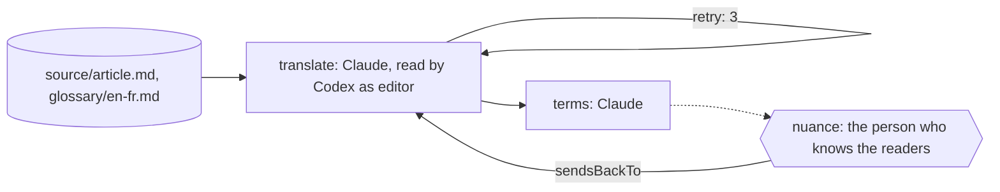

An article has to go out in French next week. There's a glossary the
company has settled on, a tone the readers expect, and one person who knows
those readers. A translation from one model call reads fine to anyone who
isn't one of them.

You want the glossary honoured even where another word reads better, and
you want to know where that cost something. You want an editor's pass by
someone who didn't write it, and the last call on nuance made by the person
who knows the audience, not by a model.

Obversa makes that a refinement loop with a person at the end. One model
translates with the glossary open. A model from another family reads the
translation the way an editor would and fails it with what to change, not a
score. The translator runs again with those findings until the editor
accepts. Then the translator writes down how every glossary term was
rendered and where the glossary and natural French pulled apart, and the
run stops for the person who knows the readers. This file is a three-stage
team: translate, terms, nuance.

## Run it

Set the project up as [Installation](/get-started/installation) describes,
put `briefs/translation.md`, `source/article.md` and `glossary/en-fr.md`
from `examples/use-cases/other/` beside the file, sign in to Claude Code and
Codex, and run it:

```bash Terminal
npx tsx translate-reflect.ts
```

Every event prints as one line as it happens, and the outcome prints last
as JSON. The output below is from one real run, trimmed at both ends:

```text Events
translate-reflect ▸ dag (3 nodes)
translate-reflect · node translate: start
translate-reflect › translate › translate-review ▸ loop (max 4)
translate-reflect › translate › translate-review · iteration 1
translate-reflect › translate › translate-review • translate
translate-reflect › translate › translate-review engine:thinking
translate-reflect › translate › translate-review engine:text
translate-reflect › translate › translate-review   tool Read use
translate-reflect › translate › translate-review   tool tool result
translate-reflect › translate › translate-review   tool Read use
translate-reflect › translate › translate-review   tool tool result
translate-reflect › translate › translate-review engine:thinking
translate-reflect › translate › translate-review engine:text
translate-reflect › translate › translate-review   tool Write use
translate-reflect › translate › translate-review   tool tool result
translate-reflect › translate › translate-review engine:thinking
translate-reflect › translate › translate-review engine:text
translate-reflect › translate › translate-review   tool Bash use
translate-reflect › translate › translate-review   tool tool result
translate-reflect › translate › translate-review engine:thinking
… 43 more event lines …
translate-reflect › terms   tool tool result
translate-reflect › terms engine:thinking
translate-reflect › terms   tool Write use
translate-reflect › terms   tool tool result
translate-reflect › terms engine:thinking
translate-reflect › terms   tool Bash use
translate-reflect › terms   tool tool result
translate-reflect › terms engine:thinking
translate-reflect › terms   tool Bash use
translate-reflect › terms   tool tool result
translate-reflect › terms engine:thinking
translate-reflect › terms engine:text
translate-reflect › terms   claude-sonnet-4-5-20250929: 557355/2860 tok
translate-reflect › terms • terms: pass
translate-reflect · node terms: done (pass)
translate-reflect · node nuance: start
translate-reflect › nuance • nuance
translate-reflect › nuance • nuance: paused
translate-reflect · node nuance: done (paused)
translate-reflect ◂ dag paused
```

```json Output
{
  "status": "paused",
  "summary": "waiting for a person: Publish this translation?",
  "data": {
    "translate": {
      "status": "pass",
      "summary": "Review panel: 1/1 reviewer(s) cleared."
    },
    "terms": {
      "status": "pass",
      "summary": "All 6 glossary terms catalogued across 13 occurrences. Two divergences noted: 'Drafts' capitalised per UI convention vs natural lowercase; 'Envoyer' as infinitive button label vs French imperative preference."
    },
    "nuance": {
      "status": "paused",
      "summary": "waiting for a person: Publish this translation?",
      "data": {
        "requestId": "nuance#1#1173ebffeb1e9c76c8e75c9bbdb9e4e92850c7d08f0b6c3587172eecc2a93732",
        "gateId": "nuance",
        "gateVersion": 1,
        "digest": "1173ebffeb1e9c76c8e75c9bbdb9e4e92850c7d08f0b6c3587172eecc2a93732",
        "decisionText": "Publish this translation?",
        "responseSchema": {
          "type": "object",
          "properties": {
            "approved": {
              "type": "boolean"
            },
            "note": {
              "type": "string"
            }
          },
          "required": [
            "approved"
          ]
        },
        "input": {
          "terms": "All 6 glossary terms catalogued across 13 occurrences. Two divergences noted: 'Drafts' capitalised per UI convention vs natural lowercase; 'Envoyer' as infinitive button label vs French imperative preference."
        },
        "presentation": {}
      }
    }
  }
}
```

The run stopped at `nuance` with the translation in `fr/article.md` and the
terms note in `fr/terms.md`, waiting for the person. A no goes to
`translate` with the editor's note as the finding.

## The file

The brief's front matter names the source and the glossary as workspace
files, so every seat knows they exist and the translating seat can't write
them. The brief holds the translator to the glossary even where another
word reads better, and asks for each such place in the terms note, so the
person decides with the trade-off in front of them.

```ts examples/use-cases/other/translate-reflect.ts (excerpt) {2-4}
    roles: {
      translate: engines.claude('claude-sonnet-4-5'),
      reflect: [engines.codex('gpt-5.6-luna')],
      editor: person('Publish this translation?'),
    },
```

The translation is reviewed by the Codex seat, reading as an editor, with
three attempts to meet. The terms note has no reviewer, so only its own seat
judges whether every glossary term is on the list. Then the run stops:

```ts examples/use-cases/other/translate-reflect.ts (excerpt) {6,11,25}
      stage('translate', {
        agent: 'translate',
        writes: 'fr/article.md',
        desc: 'Translate source/article.md into French for a reader in France, in the tone the brief names, rendering every term in glossary/en-fr.md as the glossary says.',
        gate: 'The translation is complete and a reviewer from another family, reading it as an editor would, has accepted it.',
        reviewedBy: 'reflect',
        // Three attempts, not two: the allowance matches how open-ended the
        // work is. A translation that honours a glossary and still reads
        // naturally has many defensible answers, so reviewer and writer need
        // room to meet.
        retry: 3,
      }),

      stage('terms', {
        agent: 'translate',
        writes: 'fr/terms.md',
        desc: 'List every glossary term, where it appears, and how it was rendered; flag each place where the glossary and natural French pulled apart.',
        gate: 'Every glossary term is on the list.',
      }),

      stage('nuance', {
        input: 'editor',
        desc: 'Put the translation and the terms note in front of the person who knows the readers.',
        gate: 'A person has said publish.',
        sendsBackTo: 'translate',
      }),
```

The "done when" sentences are each stage's `gate`. The package doesn't
check them itself; it checks what each stage declares. A file in `writes`
that's missing or empty fails the stage, a reviewed stage passes only when
its reviewer accepts, and a person stage pauses until the person answers.

<Accordion title="Full file">

```ts examples/use-cases/other/translate-reflect.ts
import { claude } from '@obversa/engine-claude-cli';
import { codex } from '@obversa/engine-codex-cli';
import {
  briefFromFile,
  formatEvent,
  person,
  run,
  stage,
  workflow,
  type TeamSeat,
} from '@obversa/runtime';

interface TranslateEngines {
  readonly claude: (model: string) => TeamSeat;
  readonly codex: (model: string) => TeamSeat;
}

const realEngines: TranslateEngines = { claude, codex };

/**
 * Translate, reflect, glossary, and the last part is you. One model
 * translates the article with the glossary open; a model from another
 * family reads the translation the way an editor would and returns it
 * with what to change, not a score; the translator writes down how every
 * glossary term was rendered and where the glossary and natural French
 * pulled apart. The person who knows the readers decides the nuance and
 * says publish.
 */
function createTranslateReflect(engines: TranslateEngines = realEngines) {
  return workflow('translate-reflect', {
    brief: briefFromFile('briefs/translation.md'),
    options: { timeout: '10m' },

    roles: {
      translate: engines.claude('claude-sonnet-4-5'),
      reflect: [engines.codex('gpt-5.6-luna')],
      editor: person('Publish this translation?'),
    },

    stages: [
      stage('translate', {
        agent: 'translate',
        writes: 'fr/article.md',
        desc: 'Translate source/article.md into French for a reader in France, in the tone the brief names, rendering every term in glossary/en-fr.md as the glossary says.',
        gate: 'The translation is complete and a reviewer from another family, reading it as an editor would, has accepted it.',
        reviewedBy: 'reflect',
        // Three attempts, not two: the allowance matches how open-ended the
        // work is. A translation that honours a glossary and still reads
        // naturally has many defensible answers, so reviewer and writer need
        // room to meet.
        retry: 3,
      }),

      stage('terms', {
        agent: 'translate',
        writes: 'fr/terms.md',
        desc: 'List every glossary term, where it appears, and how it was rendered; flag each place where the glossary and natural French pulled apart.',
        gate: 'Every glossary term is on the list.',
      }),

      stage('nuance', {
        input: 'editor',
        desc: 'Put the translation and the terms note in front of the person who knows the readers.',
        gate: 'A person has said publish.',
        sendsBackTo: 'translate',
      }),
    ],
  });
}

const result = await run(createTranslateReflect(), {
  onEvent: (event) => console.log(formatEvent(event)),
});
console.log(JSON.stringify(result.outcome, null, 2));
```

</Accordion>

## The team's shape



## Next steps

- [A writer and a reviewer](/patterns/writer-and-reviewer): the translator
  and editor pair on its own.
- [A person decides](/patterns/approval): the publish question as a step,
  and how the answer reaches a paused run.
- [Feedback loops](/concepts/feedback-loops): the allowance of three, and
  the other shapes a review can take.
