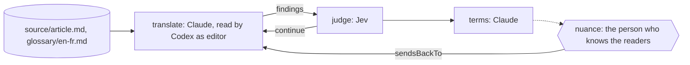

An article has to go out in French next week. There's a glossary the
company has settled on, a tone the readers expect, and one person who knows
those readers. A translation from one model call reads fine to anyone who
isn't one of them.

You want the glossary honoured even where another word reads better, and
you want to know where that cost something. You want an editor's pass by
someone who didn't write it, and the last call on nuance made by the person
who knows the audience, not by a model.

Obversa makes that a refinement loop with a person at the end. One model
translates with the glossary open. A model from another family reads the
translation the way an editor would and fails it with what to change, not a
score. The translator runs again with those findings, and after each round
a judge, Jev, reads the findings and the rounds so far and says whether
another round is worth it. Then the translator writes
down how every glossary term was rendered and where the glossary and
natural French pulled apart, and the run waits for the person who knows the
readers. This file is a three-stage team: translate, terms, nuance.

## Run it

Set the project up as [Installation](/get-started/installation) describes,
put `briefs/translation.md`, `source/article.md`, `glossary/en-fr.md` and
`judge.json` from `examples/use-cases/other/` beside the file, sign in to
Claude Code and Codex, and run it. Without `JUDGE=jev` the judge replays the
answers in `judge.json`; with it, and a TypeSafe endpoint and key in the
environment, the judge is Jev:

```bash Terminal
npx tsx translate-reflect.ts
```

When the run reaches the editor, it waits and prints a page to answer on.
The editor answers there, and the run finishes. Keep the process running
until then: if it stops, the next run starts again from the first stage.

Every event prints as one line as it happens, and the outcome prints last
as JSON. The output below is the proof's offline run, with scripted seats
standing in for the models, a recorded judge, and the proof answering as
the editor on the page, so the words are the script's and the shape is the
run's:

```text Output, from the offline proof
Answer the editor's question on http://127.0.0.1:64008/
▸ run
translate-reflect workflow:start
translate-reflect ▸ dag (3 nodes)
translate-reflect · node translate: start
translate-reflect › translate › translate-review ▸ loop
translate-reflect › translate › translate-review · iteration 1
translate-reflect › translate › translate-review • translate

translate-reflect › translate › translate-review   stand-in: 3/1 tok
translate-reflect › translate › translate-review • translate: pass  translated; three paragraphs kept
translate-reflect › translate › translate-review · until met: translate writes: true
translate-reflect › translate › translate-review › review-panel • translate
translate-reflect › translate › translate-review › review-panel • translate-1

translate-reflect › translate › translate-review › review-panel   gpt-5.6-luna: 42/7 tok
translate-reflect › translate › translate-review › review-panel • translate-1: fail  two glossary terms are rendered with the words the glossary rules out
translate-reflect › translate › translate-review › review-panel • translate: fail  Review panel: 0/1 reviewer(s) cleared. - translate-1 [should-fix]: "s'expédie" and "l'expédie" where the glossary says "envoyer" - translate-1 [should-fix]: "rappels de paiement" where the glossary says "relance de paiement"
translate-reflect › translate › translate-review › refine-judge • refine:judge
translate-reflect › translate › translate-review › refine-judge • refine:judge: pass  {"holds":{"type":"noul","noul":0.2},"worth_doing":{"type":"noul","noul":0.8},"worth_another_round":{"type":"noul","noul":0.72},"stop_reason":{"type":"choice","choice":"continue","confidence":0.6}}
translate-reflect › translate › translate-review ◆ again on stop_reason: continue: the judge chose continue
translate-reflect › translate › translate-review › @judge-review interaction:checkpoint
translate-reflect › translate › translate-review · review: fail
review did not pass (Review panel: 0/1 reviewer(s) cleared. - translate-1 [should-fix]: "s'expédie" and "l'expédie" where the glossary says "envoyer" - translate-1 [should-fix]: "rappels de paiement" where the glossary says "relance de paiement" (the judge chose continue)); re-entering translate-review
translate-reflect › translate › translate-review · iteration 2
translate-reflect › translate › translate-review • translate

translate-reflect › translate › translate-review   stand-in: 3/1 tok
translate-reflect › translate › translate-review • translate: pass  "envoyer" and "relance" now follow the glossary
translate-reflect › translate › translate-review · until met: translate writes: true
translate-reflect › translate › translate-review › review-panel • translate
translate-reflect › translate › translate-review › review-panel • translate-1

translate-reflect › translate › translate-review › review-panel   gpt-5.6-luna: 42/7 tok
translate-reflect › translate › translate-review › review-panel • translate-1: fail  one taste note
translate-reflect › translate › translate-review › review-panel • translate: fail  Review panel: 0/1 reviewer(s) cleared. - translate-1 [should-fix]: "le jour venu" is fine; "le jour dit" sat closer to the source, taste only
translate-reflect › translate › translate-review › refine-judge • refine:judge
translate-reflect › translate › translate-review › refine-judge • refine:judge: pass  {"holds":{"type":"noul","noul":0.9},"worth_doing":{"type":"noul","noul":0.2},"worth_another_round":{"type":"noul","noul":0.1},"stop_reason":{"type":"choice","choice":"holds","confidence":0.8}}
translate-reflect › translate › translate-review ◆ stop as pass on stop_reason: holds: the judge chose holds
translate-reflect › translate › translate-review › @judge-review interaction:checkpoint
translate-reflect › translate › translate-review · review: pass
translate-reflect › translate › translate-review ◂ pass (2 iter)
translate-reflect · node translate: done (pass)
translate-reflect · node terms: start
translate-reflect › terms • terms

translate-reflect › terms   stand-in: 3/1 tok
translate-reflect › terms • terms: pass  six terms listed, two flagged
translate-reflect · node terms: done (pass)
translate-reflect · node nuance: start
translate-reflect › nuance • nuance
translate-reflect · node nuance: done (paused)
translate-reflect › nuance • nuance: pass  approved: Publish this translation?
translate-reflect · node nuance: done (pass)
translate-reflect ◂ dag pass
◂ run pass (93/17 tok, 60 tok from cache)
{
  "status": "pass",
  "summary": "dag \"translate-reflect\": all 3 node(s) green",
  "data": {
    "translate": {
      "status": "pass",
      "summary": "the judge chose holds"
    },
    "terms": {
      "status": "pass",
      "summary": "six terms listed, two flagged"
    },
    "nuance": {
      "status": "pass",
      "summary": "approved: Publish this translation?",
      "data": {
        "approved": true
      }
    }
  }
}
```

Two translations, two reads, two answers from the judge. The first
translation rendered two glossary terms with the words the glossary rules
out; the reviewer named them, and the judge said another round was worth
it. The second followed the glossary and drew one taste note, and the judge
said the translation holds. The run waited at `nuance` with the
translation in `fr/article.md` and the terms note in `fr/terms.md`, and the
editor's yes on the page finished it. A no goes to `translate` with the editor's note as the
finding.

## The file

The brief's front matter names the source and the glossary as workspace
files, so every seat knows they exist and the translating seat can't write
them. The brief holds the translator to the glossary even where another
word reads better, and asks for each such place in the terms note, so the
person decides with the trade-off in front of them.

```ts examples/use-cases/other/translate-reflect.ts (excerpt) {2-4}
    roles: {
      translate: engines.claude('claude-sonnet-4-5'),
      reflect: [engines.codex('gpt-5.6-luna')],
      editor: person('Publish this translation?'),
    },
```

The translation is reviewed by the Codex seat, reading as an editor. When
the reviewer does not accept it, `refine: judge(judgeSeat)` asks the judge
whether another round is worth it. With no cap, the loop ends when the
judge stops it or the reviewer accepts the translation. The terms note has no reviewer, so
only its own seat judges whether every glossary term is on the list. Then
the run waits for the editor:

```ts examples/use-cases/other/translate-reflect.ts (excerpt) {6,11,25}
      stage('translate', {
        agent: 'translate',
        writes: 'fr/article.md',
        desc: 'Translate source/article.md into French for a reader in France, in the tone the brief names, rendering every term in glossary/en-fr.md as the glossary says.',
        gate: 'The translation is complete and a reviewer from another family, reading it as an editor would, has accepted it.',
        reviewedBy: 'reflect',
        // The judge. After a round the reflection did not pass, Jev reads the
        // findings and the rounds so far and says whether another round is
        // worth it; a finding tagged block goes back without asking. With no
        // cap, the rounds end when the judge stops them or the review passes.
        refine: judge(judgeSeat),
      }),

      stage('terms', {
        agent: 'translate',
        writes: 'fr/terms.md',
        desc: 'List every glossary term, where it appears, and how it was rendered; flag each place where the glossary and natural French pulled apart.',
        gate: 'Every glossary term is on the list.',
      }),

      stage('nuance', {
        input: 'editor',
        desc: 'Put the translation and the terms note in front of the person who knows the readers.',
        gate: 'A person has said publish.',
        sendsBackTo: 'translate',
      }),
    ],
  });
```

The "done when" sentences are each stage's `gate`. The package doesn't
check them itself; it checks what each stage declares. A file in `writes`
that's missing or empty fails the stage, a reviewed stage passes only when
its reviewer accepts, and a person stage waits until the person answers.

<Accordion title="Full file">

```ts examples/use-cases/other/translate-reflect.ts
import { claude } from '@obversa/engine-claude-cli';
import { codex } from '@obversa/engine-codex-cli';
import { jev } from '@obversa/engine-jev-api';
import {
  briefFromFile,
  formatEvent,
  judge,
  person,
  run,
  stage,
  workflow,
  type TeamSeat,
} from '@obversa/runtime';
import { recordedJudge } from '@obversa/runtime/testing';

interface TranslateEngines {
  readonly claude: (model: string) => TeamSeat;
  readonly codex: (model: string) => TeamSeat;
}

const realEngines: TranslateEngines = { claude, codex };

/**
 * The judge that decides whether the translation goes round again: Jev over the
 * TypeSafe API when JUDGE=jev, otherwise the answers recorded in judge.json
 * beside the brief, one set per round, so the file runs offline.
 */
const judgeSeat = process.env.JUDGE === 'jev' ? jev() : recordedJudge('judge.json');

/**
 * Translate, reflect, a judge, glossary, and the last part is you. One model
 * translates the article with the glossary open; a model from another
 * family reads the translation the way an editor would and returns it
 * with what to change, not a score; the judge decides when another round
 * is worth it, until it stops them or the review passes; the translator writes down how every
 * glossary term was rendered and where the glossary and natural French
 * pulled apart. The person who knows the readers decides the nuance and
 * says publish.
 */
function createTranslateReflect(judgeSeat: TeamSeat, engines: TranslateEngines = realEngines) {
  return workflow('translate-reflect', {
    brief: briefFromFile('briefs/translation.md'),
    options: { timeout: '10m' },

    roles: {
      translate: engines.claude('claude-sonnet-4-5'),
      reflect: [engines.codex('gpt-5.6-luna')],
      editor: person('Publish this translation?'),
    },

    stages: [
      stage('translate', {
        agent: 'translate',
        writes: 'fr/article.md',
        desc: 'Translate source/article.md into French for a reader in France, in the tone the brief names, rendering every term in glossary/en-fr.md as the glossary says.',
        gate: 'The translation is complete and a reviewer from another family, reading it as an editor would, has accepted it.',
        reviewedBy: 'reflect',
        // The judge. After a round the reflection did not pass, Jev reads the
        // findings and the rounds so far and says whether another round is
        // worth it; a finding tagged block goes back without asking. With no
        // cap, the rounds end when the judge stops them or the review passes.
        refine: judge(judgeSeat),
      }),

      stage('terms', {
        agent: 'translate',
        writes: 'fr/terms.md',
        desc: 'List every glossary term, where it appears, and how it was rendered; flag each place where the glossary and natural French pulled apart.',
        gate: 'Every glossary term is on the list.',
      }),

      stage('nuance', {
        input: 'editor',
        desc: 'Put the translation and the terms note in front of the person who knows the readers.',
        gate: 'A person has said publish.',
        sendsBackTo: 'translate',
      }),
    ],
  });
}

// The run waits for the editor and prints the address of a page to answer
// on. The wait lives in this process: stop it before the editor answers,
// and the next run starts again from the first stage.
const result = await run(createTranslateReflect(judgeSeat), {
  onCallback: 'wait',
  monitor: true,
  onEvent: (event) => console.log(event.kind === 'monitor' ? `Answer the editor's question on ${event.url}` : formatEvent(event)),
  recordTo: 'records/translate-reflect.jsonl',
});
await result.monitor?.close();
console.log(JSON.stringify(result.outcome, null, 2));
```

</Accordion>

## The team's shape


```mermaid
flowchart LR
  source[("source/article.md, glossary/en-fr.md")] --> translate["translate: Claude, read by Codex as editor"]
  translate -->|findings| judge["judge: Jev"]
  judge -->|continue| translate
  judge --> terms["terms: Claude"]
  terms -.-> nuance{{"nuance: the person who knows the readers"}}
  nuance -->|sendsBackTo| translate
```

## When the loop stops

A translation that honours a glossary and still reads naturally has many
defensible answers, so the reviewer and the translator need room to meet,
and no count says how much. After each round the reviewer did not accept,
the judge reads the use case from the brief, the reviewer's findings and
every round so far, and answers whether the translation holds, whether the
findings are worth acting on, and whether another round is worth it. The
loop goes round again on continue and stops when the judge chooses a
reason to stop. A finding tagged block goes back without asking. With no
cap, a run ends when the judge stops it or the review passes. To bound the
rounds as well, pass `judge(judgeSeat, { cap: 3 })`: after the last review
the cap allows, the judge is asked once more, and the run fails unless it
lets the translation stand. The judge's recorded answers
for the offline run are in `judge.json`, one set per round.
[A judge stops the loop](/patterns/judge-stops-the-loop) has the questions
and the rule.

## Next steps

- [A writer and a reviewer](/patterns/writer-and-reviewer): the translator
  and editor pair on its own.
- [A judge stops the loop](/patterns/judge-stops-the-loop): the judge's
  questions, and the same loop as plain graph nodes.
- [A person decides](/patterns/approval): the publish question as a step,
  and how the answer reaches a paused run.
